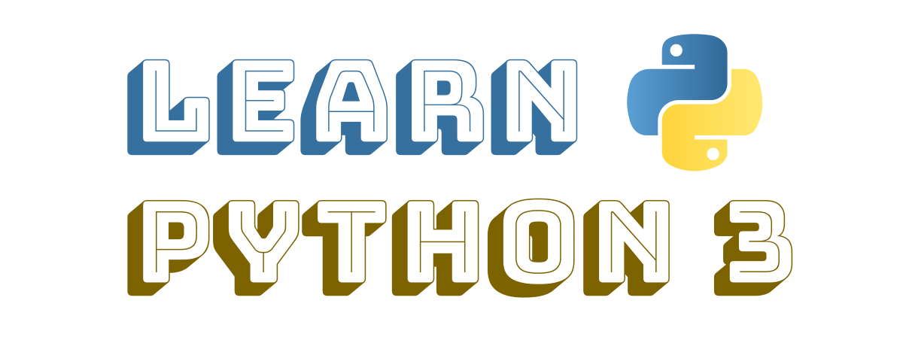

Learn Python 3
=================
by **Ankit Mahato** [[About](https://animator.github.io)]  
*Version 2022.10*

[](https://discord.gg/2s49SCNfyJ)

# How to read this book?

This book can be consumed in 3 ways:

- A nice web interface - [Link](https://animator.github.io/learn-python/)
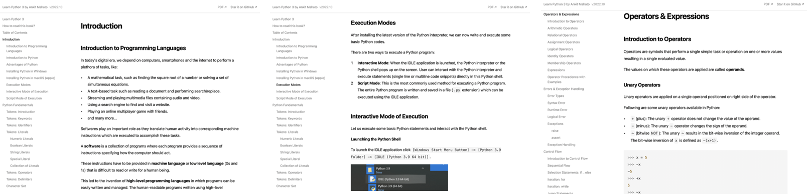
- A Downloadable PDF - [Link](https://github.com/animator/learn-python/raw/main/pdf/learn-python-v2022.10.pdf)
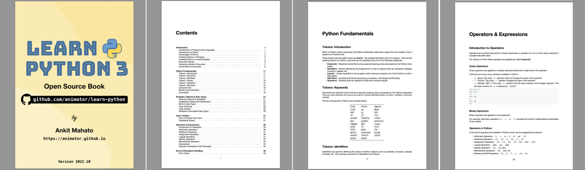
- Directly on GitHub - [Link](https://github.com/animator/learn-python)


Table of Contents
=================

* [Introduction](#introduction)
   * [Introduction to Programming Languages](#introduction-to-programming-languages)
   * [Introduction to Python](#introduction-to-python)
   * [Advantages of Python](#advantages-of-python)
   * [Installing Python in Windows](#installing-python-in-windows)
   * [Installing Python in macOS (Apple)](#installing-python-in-macos-apple)
   * [Execution Modes](#execution-modes)
   * [Interactive Mode of Execution](#interactive-mode-of-execution)
   * [Script Mode of Execution](#script-mode-of-execution)
* [Python Fundamentals](#python-fundamentals)
   * [Tokens: Introduction](#tokens-introduction)
   * [Tokens: Keywords](#tokens-keywords)
   * [Tokens: Identifiers](#tokens-identifiers)
   * [Tokens: Literals](#tokens-literals)
   * [Tokens: Operators](#tokens-operators)
   * [Tokens: Delimiters](#tokens-delimiters)
   * [Character Set](#character-set)
   * [Blocks and Indentation](#blocks-and-indentation)
   * [Comments](#comments)
* [Variables, Objects &amp; Data Types](#variables-objects--data-types)
   * [What are Objects &amp; Variables?](#what-are-objects--variables)
   * [Variables &amp; Assignment Statements](#variables--assignment-statements)
   * [Built-in Data Types](#built-in-data-types)
   * [Type Checking](#type-checking)
   * [Type Casting](#type-casting)
      * [Implicit Type Casting](#implicit-type-casting)
      * [Explicit Type Casting](#explicit-type-casting)
   * [Mutable &amp; Immutable Data Types](#mutable--immutable-data-types)
      * [Immutable Data Types](#immutable-data-types)
      * [Mutable Data Types](#mutable-data-types)
* [Input / Output](#input--output)
   * [How to Accept User Input](#how-to-accept-user-input)
   * [Displaying Output](#displaying-output)
* [Operators &amp; Expressions](#operators--expressions)
   * [Introduction to Operators](#introduction-to-operators)
   * [Arithmetic Operators](#arithmetic-operators)
   * [Relational Operators](#relational-operators)
   * [Assignment Operators](#assignment-operators)
   * [Logical Operators](#logical-operators)
   * [Identity Operators](#identity-operators)
   * [Membership Operators](#membership-operators)
   * [Expressions](#expressions)
   * [Operator Precedence with Examples](#operator-precedence-with-examples)
* [Errors &amp; Exception Handling](#errors--exception-handling)
   * [Error Types](#error-types)
   * [Syntax Error](#syntax-error)
   * [Runtime Error](#runtime-error)
   * [Logical Error](#logical-error)
   * [Exceptions](#exceptions)
   * [Exception Handling](#exception-handling)
* [Control Flow](#control-flow)
   * [Introduction to Control Flow](#introduction-to-control-flow)
   * [Sequential Flow](#sequential-flow)
   * [Selection Statements: if .. else](#selection-statements-if--else)
   * [Iteration: for](#iteration-for)
   * [Iteration: while](#iteration-while)
   * [Jump Statements](#jump-statements)
      * [pass](#pass)
      * [break](#break)
      * [continue](#continue)
   * [Nested Loops](#nested-loops)
* [Strings](#strings)
   * [Strings: Introduction &amp; Creation](#strings-introduction--creation)
   * [Accessing Characters of a String](#accessing-characters-of-a-string)
   * [String Operations](#string-operations)
   * [Introduction to String Methods](#introduction-to-string-methods)
   * [Convert Case of Strings](#convert-case-of-strings)
   * [Check Characters of a String](#check-characters-of-a-string)
   * [Split a String](#split-a-string)
   * [Strip Characters from a String](#strip-characters-from-a-string)
   * [Check Prefix or Suffix in a String](#check-prefix-or-suffix-in-a-string)
   * [Find &amp; Replace Characters in a String](#find--replace-characters-in-a-string)
   * [Traversing a String](#traversing-a-string)
* [List](#list)
   * [What is a Python List? How to Create a List?](#what-is-a-python-list-how-to-create-a-list)
   * [Accessing Items of a List](#accessing-items-of-a-list)
      * [Negative Indexing](#negative-indexing)
   * [Modifying a List](#modifying-a-list)
   * [Removing Item from a List](#removing-item-from-a-list)
   * [List Operations](#list-operations)
   * [Traversing a List](#traversing-a-list)
   * [Built-in Functions that can be used for a List](#built-in-functions-that-can-be-used-for-a-list)
   * [Introduction to List Methods](#introduction-to-list-methods)
   * [Adding Items to a List](#adding-items-to-a-list)
   * [Removing Items from a List](#removing-items-from-a-list)
   * [Counting or Locating Items in a List](#counting-or-locating-items-in-a-list)
   * [Reversing Items](#reversing-items)
   * [Sorting a List](#sorting-a-list)
   * [Copying a List](#copying-a-list)
   * [Nested List](#nested-list)
   * [List Comprehension](#list-comprehension)
      * [Member-wise Operation](#member-wise-operation)
      * [Filtering or Subsequence](#filtering-or-subsequence)
   * [Sample Programs](#sample-programs)
* [Tuple](#tuple)
   * [List vs Tuple](#list-vs-tuple)
   * [How to Create Tuple?](#how-to-create-tuple)
   * [What is a Singleton?](#what-is-a-singleton)
   * [Accessing Items of a Tuple](#accessing-items-of-a-tuple)
   * [Tuples are Immutable](#tuples-are-immutable)
   * [Tuple Operations](#tuple-operations)
   * [Traversing a Tuple](#traversing-a-tuple)
   * [Built-in Functions that can be used for a Tuple](#built-in-functions-that-can-be-used-for-a-tuple)
   * [Locating Items in a Tuple](#locating-items-in-a-tuple)
   * [Counting the Occurrence of an Item](#counting-the-occurrence-of-an-item)
   * [New Tuple with Reversed Items](#new-tuple-with-reversed-items)
   * [New Tuple with Sorted Items](#new-tuple-with-sorted-items)
   * [Nested Tuple](#nested-tuple)
   * [Understanding the Immutable Nature of Tuples](#understanding-the-immutable-nature-of-tuples)
* [Dictionary](#dictionary)
   * [What is a Dictionary?](#what-is-a-dictionary)
   * [How to Create a Dictionary](#how-to-create-a-dictionary)
      * [Key: Value Pairs](#key-value-pairs)
      * [Sequence of (key, value) Tuples](#sequence-of-key-value-tuples)
      * [Keyword/Named Arguments](#keywordnamed-arguments)
      * [Key and Value Lists](#key-and-value-lists)
      * [Keys with Default Value](#keys-with-default-value)
   * [Accessing Items (Key:Value) of a Dictionary](#accessing-items-keyvalue-of-a-dictionary)
   * [Updating a Dictionary](#updating-a-dictionary)
   * [Removing an Item (Key:Value) from a Dictionary](#removing-an-item-keyvalue-from-a-dictionary)
   * [Dictionary Operations](#dictionary-operations)
   * [Traversing a Dictionary](#traversing-a-dictionary)
   * [Built-in Functions for a Dictionary](#built-in-functions-for-a-dictionary)
   * [Creating a Copy of a Dictionary](#creating-a-copy-of-a-dictionary)
   * [Nested Dictionary](#nested-dictionary)
   * [Sample Programs](#sample-programs-1)
* [Python Standard Library](#python-standard-library)
   * [Built-in Functions](#built-in-functions)
   * [Mathematical Functions](#mathematical-functions)
   * [Type Functions](#type-functions)
      * [Type Checking](#type-checking-1)
      * [Built-in Type Functions](#built-in-type-functions)
   * [I/O Functions](#io-functions)
   * [Base/Unicode Conversion Functions](#baseunicode-conversion-functions)
   * [What are Built-in Modules?](#what-are-built-in-modules)
   * [math Module](#math-module)
      * [Constants](#constants)
      * [Functions](#functions)
   * [random Module](#random-module)
   * [statistics Module](#statistics-module)
* [File Handling](#file-handling)
   * [File Handling in Python - Introduction &amp; Overview](#file-handling-in-python---introduction--overview)
   * [Text Files vs Binary Files - Use Case, File Formats, Examples](#text-files-vs-binary-files---use-case-file-formats-examples)
   * [File Opening &amp; Closing](#file-opening--closing)
   * [File Reading](#file-reading)
      * [Sequential Reading](#sequential-reading)
      * [Ad-hoc Reading](#ad-hoc-reading)
   * [Writing a File](#writing-a-file)
   * [Reading &amp; Writing Binary Files using pickle Module](#reading--writing-binary-files-using-pickle-module)
      * [Dumping Data](#dumping-data)
      * [Loading Data](#loading-data)
      * [Example: Traversing a Binary File](#example-traversing-a-binary-file)
   * [Reading &amp; Writing a CSV File using csv Module](#reading--writing-a-csv-file-using-csv-module)
      * [Reading CSV File](#reading-csv-file)
      * [Writing CSV File](#writing-csv-file)
* [User Defined Functions, Modules &amp; Packages](#user-defined-functions-modules--packages)
   * [User Defined Functions](#user-defined-functions)
   * [Function Structure](#function-structure)
      * [Function Header](#function-header)
      * [Function Body](#function-body)
   * [Parameters and Arguments](#parameters-and-arguments)
   * [Scope of Variables](#scope-of-variables)
      * [Local Variables](#local-variables)
      * [Global Variables](#global-variables)
   * [Passing Objects of Mutable Type to a Function](#passing-objects-of-mutable-type-to-a-function)
      * [Passing a List](#passing-a-list)
      * [Passing a Dictionary](#passing-a-dictionary)
   * [What is a Module? How to Create a Module?](#what-is-a-module-how-to-create-a-module)
   * [Executable Scripts / Modules](#executable-scripts--modules)
   * [What is a Package? Introduction to PyPi. How to Create a Python Package?](#what-is-a-package-introduction-to-pypi-how-to-create-a-python-package)

# Introduction

## Introduction to Programming Languages

In today's digital era, we depend on computers, smartphones and the internet to perform a plethora of tasks, like:

- A mathematical task, such as finding the square root of a number or solving a set of simultaneous equations.
- A text-based task such as reading a document and performing search/replace.
- Streaming and playing multimedia files containing audio and video.
- Using a search engine to find and visit a website.
- Playing an online multiplayer game with friends.
- and many more...

Softwares play an important role as they translate human activity into corresponding machine instructions which are executed to accomplish these tasks. 

A **software** is a collection of programs where each program provides a sequence of instructions specifying how the computer should act. 

These instructions have to be provided in **machine language** or **low level language** (0s and 1s) that is difficult to read or write for a human being. 

This led to the invention of **high-level programming languages** in which programs can be easily written and managed. The human-readable programs written using high-level languages are converted into computer-readable machine code or byte-code using **compilers** or **interpreters**.

There are many high-level programming languages that are currently in wide use. 

Some of the popular languages are Java, C, C++, C#, Go, Swift, JavaScript, PHP, Dart, Kotlin and Python.

## Introduction to Python

Guido van Rossum started the development of Python in December 1989. He released the first version (0.9.9) of Python for general public on February 20, 1991. 

The language evolved over the next few decades and so did its definition, the current version of which is stated below:  

> Python is a high-level, interpreted, object-oriented programming language with dynamic semantics.

Let us break down and analyze the above definition to gain a better understanding of Python:

**High-level**

Python is a **high-level programming language** which can be used to write a program in natural language (english) making it readable, writable, shareable and manageable. 

While developing a Python program one is not required to handle the various components of computer architecture like registers, memory addresses and call stacks which have to be handled if an assembly language or a low-level language is used for development. 

Python includes high-level language features like variables, data structures (lists, dictionaries, etc.), objects, expressions, modules, classes, functions, loops, threads, file handling, string handling, error handling and other computer science abstraction concepts.  

**Interpreted**

In traditional programming languages like C or C++, codes are compiled into computer-readable machine code before it can be executed. 

Python is an **interpreted language** where the Python interpreter reads and executes the program line by line. 

The process is more time consuming compared to compiled code execution, but allows faster development as one does not have to go through the entire compilation step during testing and debugging. Also, the code can run on any platform as long as it has a valid Python installation (which includes interpreter) as there is no generation of platform dependent binaries.

**Object-oriented**

Python does not enforce **Object-oriented programming (OOP)**, but completely supports it. 

A programmer can define Classes specifying the data in the form of attributes (or properties) and some programming logic in the form of member functions (or methods). Once a class is defined, the user can create an instance of that class which is known as an object.

In Python, everything (`int`, `list`, `dict`, etc.) is an object. We will cover more about objects in detail in the later sections.

**Dynamic Semantics**

As Python is an interpreted language in which the code is executed line-by-line, a python statement or expression is evaluated during run-time. This allows **dynamic typing** (type of a variable can change over its lifetime) and creation of dynamic objects during run-time, which provides more flexibility, usability and fewer lines of code as compared to statically-typed compiled languages like C/C++.

## Advantages of Python

The key advantages of Python are as follows:  

**1. Easy to Learn**

The Python programming language is easy to learn with low technical and conceptual overhead. This makes it an ideal language for beginners to learn programming.

**2. Clear Syntax & Fewer Lines of Code**

Python's simple and easy to learn syntax increases code readability and leads to fewer lines of code. 

A typical task which requires an average of twenty lines of code in C and seven in Java can often be done with just one line in Python. 

Also, due to fewer lines of code the chances of making any error is significantly reduced.

**3. Open Source**

Python is an open source programming language, so anyone can view and contribute to its source code.

**4. Portable & Platform Independent**

The Python programming language is portable & platform independent as it can work on any Linux, MacOS or Windows device.

**5. Standard Library & Python Packages**

Python has a rich and extensive Standard Library, a collection of predefined functions for various tasks. 

Python programmers also have at their disposal the vast ecosystem of more than 250,000 community contributed libraries in the Python Package Index (PyPI), where one can find a solution to every conceivable task.

**6. Web Application Development**

Some of the most popular web development frameworks (django, flask, etc.) are written in Python. This coupled with the availability of packages to connect to any database makes Python a great choice for web application development.

## Installing Python in Windows

Let's start with the Python 3 installation process on Windows operating system.

**Step 1: Download Installer**

Download the latest Windows installer from the [Python Software Foundation website](https://www.python.org/downloads/).


**Step 2: Install Python 3**

Once the download is complete double-click and run it.


Select the checkbox ✅ `Add Python 3.9 to PATH`. This will enable you to install python packages and run python script via command-line.

Hit 🛡️ `Install Now` and complete the setup.

**Step 3: Verify Installation**

Once the setup is complete, click on the `Start` menu and open `Python 3.9 -> IDLE (Python 3.9 64 bit)` to launch the Python interpreter.

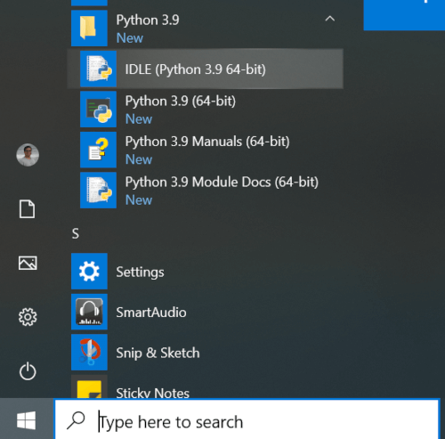

Python 3.9 is now successfully installed on your computer.

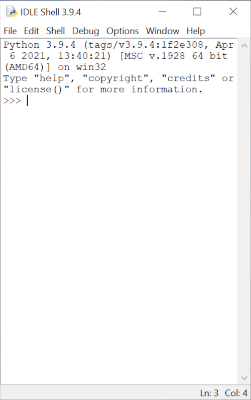

## Installing Python in macOS (Apple)

Let's start with the Python 3 installation process on macOS operating system.

**Step 1: Download Installer**

Download the latest macOS installer from the [Python Software Foundation website](https://www.python.org/downloads/).

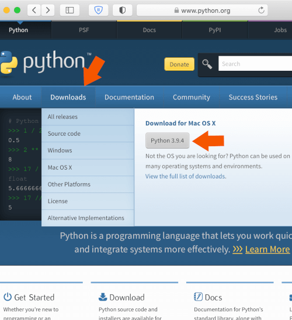

**Step 2: Install Python 3**

Once the download is complete double-click and run it.


Hit `Continue` and complete the setup.

**Step 3: Verify Installation**

Once the setup is complete, click on the `Launchpad -> IDLE` to launch the Python interpreter.

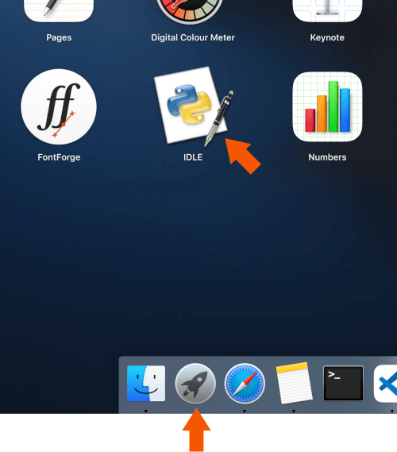

Python 3.9 is now successfully installed on your computer.

## Execution Modes

After installing the latest version of the Python interpreter, we can now write and execute some basic Python codes.

There are two ways to execute a Python program:

1. **Interactive Mode**: When the IDLE application is launched, the Python interpreter or the Python shell pops up on the screen. User can interact with the Python interpreter and execute statements (single line or multiline code snippets) directly in this Python shell.
2. **Script Mode**: This is the most commonly used method for executing a Python program. The entire Python program is written and saved in a file (`.py` extension) which can be executed using the IDLE application.

## Interactive Mode of Execution

Let us execute some basic Python statements and interact with the Python shell.

**Launching the Python Shell**

To launch the IDLE application click `[Windows Start Menu Button] -> [Python 3.9 Folder] -> [IDLE (Python 3.9 64 bit)]`.


The Python interpreter or the Python shell will pop-up on the screen.


The version (`3.9`) of the Python interpreter is displayed at the top of the window followed by the `>>>` symbol which indicates that the interpreter is ready to take instructions.

Python commands or statements can be input on this prompt. The input statements are executed instantaneously and any variable assignments are retained as long as the session is not terminated.

**Basic Arithmetic**

Let us perform some basic arithmetic operations in the interactive mode using an integer number (`2`) and a floating-point number (`3.5`):

``` python
>>> 2 + 2
4
>>> 2 * 3.5
7.0
```

It can be observed that the results of each of the above computations are displayed immediately in the shell.

**Storing Values/Results**

Instead of immediately displaying the results, they can also be stored in variables using the assignment symbol (`=`) as shown below:

``` python
>>> a = 2 + 2
>>> b = 2 * 3.5
```

The values of `a` and `b` can be accessed later for future calculations as shown below:

``` python
>>> a
4
>>> b
7.0
>>> a * 5
20
>>> b / 3
2.3333333333333335
```

**Basic String Operation**

Interactive mode is not just restricted to basic arithmetic or assignments. Let us join two strings - `"Hello, "` and `"world!"`.

``` python
>>> "Hello, " + "world!"
'Hello, world!'
```

The complete functionality of Python is easily accessible to a user via the **Interactive Mode**. 

This makes it convenient for testing and instant execution of small code snippets (single line or few lines of code), a feature not available in compiled languages like C, C++ and Java. 

But, the statements cannot be saved for future use and have to retyped for re-execution. This disadvantage is overcome by the use of Python in **Script Mode** as described in the next section.

## Script Mode of Execution

To write reusable codes, script mode is the most preferred mode of code execution.

**File Creation**

To create a new file using the IDLE application click `[File] -> [New File]`

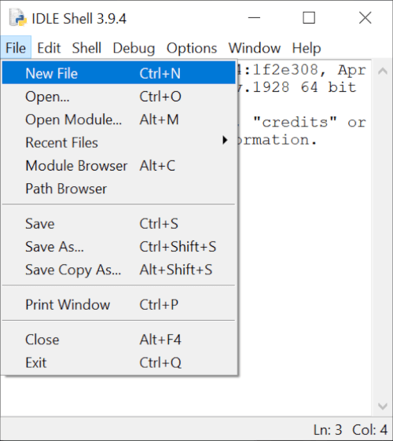

Write a simple Python program as shown below  

``` python
a = 2 + 2
a
```

and save the script as `example.py` (`.py` file extension for all Python scripts) using `[File] -> [Save As...]` 


**Script Execution**

Now run this script using `[Run] -> [Run Module]`.

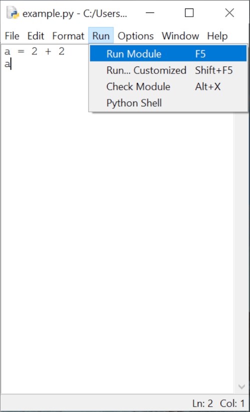

It can be observed that the code has been executed, but no output is displayed on the console (or the standard output) as all outputs have to be explicitly specified when running a code in the script mode. 

This can be done by using the `print()` function which is used in Python scripts to display output on the output stream. Let us quickly add the `print()` function in the above code and execute it.

``` python
a = 2 + 2
print(a)
```

Now, when you run the script you will observe that the value of `a`, that is `4`, is now displayed on the console.

# Python Fundamentals

## Tokens: Introduction

When a Python code is executed, the Python interpreter reads each logical line and breaks it into a sequence of lexical units. 

These lexical units are better known as **tokens** - the smallest individual units of a program. They are the building blocks of a Python code and can be classified into one of the following categories:

- **Keywords** : Reserved words that convey special meaning when processed by the Python interpreter.
- **Identifiers** : Names defined by the programmer to refer to objects that can represent variables, functions, classes, etc.
- **Literals** : Values specified in the program which belong to exactly one of the Python's built-in data types.
- **Delimiters** : Symbols that denote grouping, punctuation, and assignment/binding.
- **Operators** : Symbols that can operate on data and compute results.

## Tokens: Keywords

Keywords are reserved words that have special meaning when processed by the Python interpreter. They are case-sensitive and cannot be used for naming identifiers (class, function, variable or structure names).

The list of keywords in Python are provided below:

| | | |
|---|---|---|
| `True` | `False` | `import` |
| `from` | `as` | `None` |
| `and` | `or` | `not` |
| `in` | `is` | `try` |
| `except` | `finally` | `raise` |
| `del` | `global` | `nonlocal` |
| `lambda` | `def` | `class` |
| `with` | `if` | `elif` |
| `else` | `pass` | `for` |
| `while` | `continue` | `break` |
| `assert` | `return` | `yield` |
| `async` | `await` | |

## Tokens: Identifiers

Identifiers are used for defining the names of Python objects such as variables, functions, classes, modules, etc. The naming convention for identifiers is as follows:

- Must begin with a lowercase character (`a-z`) or an uppercase character (`A-Z`) or underscore sign (`_`).
- Followed by any number of letters (`a-z`, `A-Z`), digits (`0-9`), or underscores (`_`).
- Should not be a keyword.
- No special symbols are allowed like `!`, `@`, `#`, `$`, `%`, etc.

Some points to keep in mind while naming identifiers:

- Identifiers are case-sensitive in nature and any difference in case of any character refers to a different identifier. e.g., `length` and `Length` are different identifiers.
- Identifiers differing by only underscores are different. e.g., `unitlength` and `unit_length` are different identifiers.

It is also a good practice (although not compulsory) to follow the following procedure while naming identifiers:

- Identifiers should be named carefully with an emphasis on clarity and readability. For example, in a program that calculates the area of a rectangle, a good choice for identifier names are - `length`, `breadth` and `area`.
- Class names should start with uppercase character.
- Identifiers starting with an underscore have special meaning in a program.
- Variable, function and method names should be in lowercase characters, with underscores separating multiple words like `area_of_square`, `area_of_triangle`, etc.

## Tokens: Literals

Literals are tokens in the source code which represent fixed or constant values. They are often used in assignment statements for initializing variables or in comparison expressions.

The various types of literals available in Python are as follows:

### Numeric Literals

Numeric literals are used for representing numeric values in the source code. They can be of three types - integers, float point numbers and imaginary numbers.

#### Integer Literals

Integer literals are numbers without any fractional component. 

In Python, integer literals can be written in four positional (base) numeral systems:

**i. Decimal or base-10 Integer**

A decimal integer literal consists of one or more digits (`0-9`) and cannot have any zeros preceding the first non-zero digit, except when the number is `0`.

Example base-10 integers:

``` python
34
3283298
864
0
```

`092` is not a valid decimal integer literal as a zero precedes the first non-zero digit `9`.

**ii. Binary or base-2 Integer**

A binary integer or base-2 integer begins with `0b` or `0B` followed by binary digits `0-1`. 

For example, `27` can be written as a binary integer literal `0b11011`.

**iii. Octal or base-8 Integer**

An octal integer or base-8 integer begins with `0o` or `0O` followed by octal digits `0-7`. 

For example, `27` can be written as an octal integer literal `0o33`.

**iv. Hexadecimal or base-16 Integer**

A hexadecimal integer or base-16 integer begins with `0x` or `0X` followed by digits `0-9` or letters `A-F` (case insensitive). 

For example, `27` can be written as a hexadecimal integer literal `0x1B` or `0x1b`.

Thus, it can be observed that number `27` can be written in the program as `27` (decimal), `0b11011` (binary), `0o33` (octal) or `0x1B` (hexadecimal).

**Underscores in Integer Literals**

An optional character `_` (underscore) is also allowed in an integer literal to group digits for enhanced readability. 

One underscore can occur between digits, and after base specifiers like `0o`. 

They are ignored while determining the actual numerical value of the literal. 

Some valid underscore usages are - `10_00_00_000`, `0b_1110_0101`, `0x23_123`.

#### Floating Point Literals

Floating point literals are real numbers present in the source code. They contain fractional component and/or exponential component.

The fractional component includes the digits after the decimal point (`.`).

Example floating point literals:

```
3.4
.4
8.
3.4E2
3.4e-2
```

In the above example, `.4` is equivalent to `0.4` and `8.` is equivalent to `8.0`.

The exponential component can be identified by the letter `e` or `E` followed by an optional sign (`+` or `-`) and digits (`0-9`). This exponent is equivalent to multiplying the real number with the power of `10`. 

For example, `3.4E2` is equivalent to `3.4 x 10^2` or `340.0`, whereas `3.4e-2` is equivalent to `3.4 x 10^-2` or `.034`.

#### Imaginary Literals

To specify complex numbers and perform complex number mathematics, Python supports imaginary literals which are given by real or integer number followed by the letter `j` or `J` which represents the unit imaginary number.

Example imaginary literals:

```
3.5j   
15.j    
12j     
.005j   
3e100j   
3.5e-10j
```

**Points to Note**

In Python,

- there is no specialized literal such as a complex literal. A complex number is actually represented in the program using an expression comprising a real number (integer/float numeric literal) and an imaginary number (imaginary literal). For example, `1 + 2j` consists of an integer literal (`1`) and a imaginary literal (`2j`).
- numeric literals do not include the minus sign (`-`). `-` is actually a unary operator it combines with a numeric literal to represent negative numbers. For example, in `-3.14` the numeric literal is `3.14` and `-` is an operator.

### Boolean Literals

The reserved words `True` and `False` are also boolean literals which can be used to specify the truth value in a program.

### String Literals

String literals are texts which can be specified in a variety of ways in Python:

- Single quotes: `'python'`
- Double quotes: `"python"`
- Triple quoted: `'''Triple python'''`, `"""Three python"""`. 

Triple quoted strings can also span multiple lines.

Example:

``` python
s = "I am a String"  

s1 = """A
multiline
String"""

s2 = '''Also a
multiline
String'''
```

The backslash (`\`) character can be used in a string literal to escape characters that otherwise have a special meaning, such as newline, linefeed, or the quote character.

| Escape Sequence | Meaning |
|--|--|
| `\\` | Backslash (`\`) |
| `\'` | Single quote (`'`) |
| `\"` | Double quote (`"`) |
| `\a` | ASCII Bell (BEL) |
| `\b` | ASCII Backspace (BS) |
| `\f` | ASCII Form-feed (FF) |
| `\n` | ASCII Linefeed (LF) |
| `\r` | ASCII Carriage Return (CR) |
| `\t` | ASCII Horizontal Tab (TAB) |
| `\v` | ASCII Vertical Tab (VT) |

Although `\'` and `\"` can be used to specify quote characters, Python allows embedding double quotes inside a single-quoted string (`'My name is "Python".'`) and single quotes inside a double-quoted string (`"Python's World"`).

String literals also support unicode characters which can be specified using `\u` escape sequence followed by the 4 letter unicode.

``` python
>>> print("E = mc\u00B2")
E = mc²
```

In the above example, `\u00B2` is the unicode character which represents the 'SUPERSCRIPT TWO'. 

### Special Literal

`None` is a special literal which is used to denote the absence of value. 

It should not be confused with `0` as `0` is an integer literal with a defined finite value, whereas `None` implies nothingness.

``` python
>>> a = None
>>> a
>>>
```

In the above example, the Python shell does not display any value of `a` as it is assigned as `None` which has no value.

### Collection of Literals

Python has the provision for specifying a collection of literals in the source code using a special syntax known as **"displays"**. 

One can create specialized containers like list, set and dictionary using this syntax.

Some example collection of literals (displays) are provided below:

- **List**: `a = ['a', 'b', 'c']`
- **Set**: `a = {'a', 'b', 'c'}`
- **Dictionary**: `a = {'a':1, 'b':2, 'c':3}`

List, set and dictionary will be covered in detail in later chapters.

## Tokens: Operators

Operators are tokens which can be combined with values and variables to create expressions which evaluate to a single value. Python supports a rich set of operators:

``` python
+       -       *       **      
/       //      %      @        
<<      >>      
&       |       ^       ~       
:=      <       >       
<=      >=      ==      !=
```

Each of the above operators are covered in detail in the chapter - Operators.

## Tokens: Delimiters

Delimiters are tokens which are useful for organizing a program and are used in statements, expressions, functions, literal collections, and various other code structures.

They can be classified based on utility as follows:

### Grouping

`()`, `[]` and `{}` are delimiters used for:

- grouping expressions which can be spread across multiple physical lines.
- creating collection of literals like list display, dictionary display, set display.
- creating parenthesized sub-expression having the highest operator precedence (evaluated first) in a complex expression.

**Example**

``` python
days = ['Sunday', 'Monday', 
        'Tuesday', 'Wednesday', 
        'Thursday', 'Friday', 
        'Saturday']

sum_6 = (1 + 2 +
         3 + 4 +
         5 + 6)
```

is equivalent to

``` python
days = ['Sunday', 'Monday', 'Tuesday', 'Wednesday', 'Thursday', 'Friday', 'Saturday']

sum_6 = (1 + 2 + 3 + 4 + 5 + 6)
```

### Punctuation, Decoration and Annotation

Tokens in Python which are used for punctuation, decoration and annotation are:

```
.       ,       :
;       @       ->
```  

### Assignment/Binding

The assignment or binding delimiters are used for binding objects to names via assignment statements. The complete list of tokens are provided below:

```
=       +=      -=      *=
/=      //=     %=      **=
@=      &=      |=      ^=
<<=     >>=
```

Except `=`, the rest of the tokens have an operator followed by `=` character. 

These delimiters are also known as augmented assignment operators as they perform an operation in combination with assignment.

## Character Set

A set of valid characters that a programming language recognizes is known as its **character set**. 

Python is a new age programming language which supports Unicode encoding standard. The default encoding for Python source code is UTF-8 (Unicode Transformation Format – 8-bit) which enables developers to use Unicode characters not only as literals, but also as identifiers. 

This makes Python one of the very few programming languages that support multiple languages as shown in the example below:

**Code**

``` python
message = "हिन्दी में print करे"
print(message)

क = 1  # Devanagari Letter KA
ক = 2  # Bengali Letter KA
க = 3  # Tamil Letter KA
ક = 4  # Gujarati Letter KA
print(क + ক + க + ક)
```

**Output**

```
हिन्दी में print करे
10
```

## Blocks and Indentation

In traditional programming languages like C++ or Java, programs are organised in form of code blocks. 

Each code block contains one or more statements which are enclosed between braces - `{` and `}` and are executed sequentially. 

A sample C++/Java code is provided below which checks for an input `x`.

**C++**

``` c++
if (x < 10) {
    cout << "x is less than 10" << endl;
    if (x <= 5) {
        cout << "x is less than or equal to 5" << endl;
    }
    else {
        cout << "x is more than 5 but less than 10" << endl;
    }
}
else {
    cout << "x is not less than 10" << endl;
}
```

**Java**

``` java
if (x < 10) {
    System.out.println("x is less than 10");
    if (x <= 5) {
        System.out.println("x is less than or equal to 5");
    }
    else {
        System.out.println("x is more than 5 but less than 10");
    }  
}
else {
    System.out.print("x is not less than 10");
}
```

It can be seen how indentations (`tab` at the beginning of line) are added (not required by programming language) to the code to increase readability, which helps in guiding readers through the code.

**Python**

Code blocks in Python are inspired by this idea as it makes it easier to understand a Python code.

A block of code is denoted by line indentation, typically **4 spaces** (preferred) or a **tab**. This indentation is used to determine the logical group of statements, with all statements within a group having the same level of indentation.

The corresponding Python code for the above C++/java examples is provided below. 

Notice how the code blocks are indented according to the logic.

``` python
if x < 10:
    print("x is less than 10")
    if x <= 5:
        print("x is less than or equal to 5")
    else:
        print("x is more than 5 but less than 10")
else:
    print("x is not less than 10")
```

## Comments

Python supports single-line comments and multi-line comments to enhance code readability via adding documentation.

### Single Line Comments

A single line comment begins with `#`. Everything between `#` and the end of line is ignored by the Python interpreter.

``` python
# A single line comment.
a = 1 # assign a
```

### Multiline comments

A multiline comment begins with `'''` or `"""` and ends with the same.

``` python
"""
I am
a multiline
comment.
"""

'''
I am
also a multiline
comment.
'''
```

As compared to single line comments, multiline comments should begin at the same indentation level corresponding to their code block. 

For example,

``` python
"""
Begin program
here
"""
if x < 10:
    """
    Enter code block when x
    is less than 10
    """
    print("x is less than 10")
    if x <= 5:
        """
        Enter code block when x
        is less than or equal to 5
        """
        print("x is less than or equal to 5")
    else:
        """
        Enter code block when x
        is more than 5 but less than 10
        """
        print("x is more than 5 but less than 10")
else:
    """
    Enter code block when x
    is not less than 10
    """
    print("x is not less than 10")
```

# Variables, Objects & Data Types

## What are Objects & Variables?

A program is a sequence of instructions which often acts on information (data) provided by the user. 

The process of creating, storing and manipulating this data helps in the computation of new data or the end result.

**Variables are the fundamental building blocks of a program** which provide a way to store, access and modify values during the life-cycle of a program. 

Each variable has:

- a name (handle), 
- a type or data-type (kind of data), and 
- a value (actual data).

In traditional programming languages like Java or C++, the type of the variable is pre-defined.

For example, if you want to use the value `1` inside the program, you can store it in a variable named `a` of type `int`.

```
int a = 1;
```

This `a` is synonymous to a box of fixed dimensions (fixed type) holding something (value `1`) inside it.


In case we want to change the contents of the box, we can replace it with something similar (same type).

```
a = 2;
```

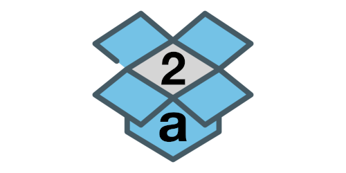

The contents of this box can be replicated and placed in a similar (same type) box:

```
int b = a;
```


Multiple boxes can exist, each containing an item having the same value.

```
int x = 3;
int y = 3;
int z = 3;
```

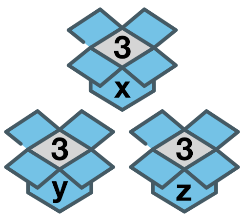

As shown above, the programming languages in which the variables (named boxes) are declared along with their types (size of the boxes) are known as **statically typed** languages. 

The size of these boxes cannot change later in the program until the variable is re-initialized with the same name and different type.

**Python is a dynamically-typed language**, where every value or data item (of any type like numeric, string, etc.) is an object. 

The variable names are just name-tags pointing to the actual object containing data of any type. 

As there is no need of any variable declaration in Python before usage, there is no concept of default value (an empty box or `null`) which exists in other programming languages.

Whenever a new object is created in Python, it is assigned a unique identity (ID) which remains the same throughout the lifetime of that object. This ID is the address of the object in memory and the built-in function `id()` returns the value of this address.

``` python
>>> a = 1
>>> id(a)
140407745943856
>>> a = 2
>>> id(a) 
140407745943888
```

In the above example, the ID of `a` changes as it points to a new object (`2`).

``` python
>>> b = a
>>> id(b)
140407745943888
```

Also, when `a` is assigned to `b`, instead of creating a new copy, `b` points to the same object as `a`.

## Variables & Assignment Statements

A variable is uniquely identified by a name (identifier) and follows the same naming convention:

- Must begin with a lowercase character (`a-z`) or an uppercase character (`A-Z`) or underscore sign (`_`).
- Followed by any number of letters (`a-z`, `A-Z`), digits (`0-9`), or underscores (`_`).
- Should not be a keyword.
- No special symbols are allowed like `!`, `@`, `#`, `$`, `%`, etc.

### Assignment

Variables can be bound to a reference of an object (of any type) using assignment statements. 

You can create an object (data) and bind it's reference to a variable using equal sign (`=`):

``` python
count = 100       # integer
pi    = 3.141     # real number
name  = "Python"  # string
```

Here, L-value refers to the assignable variables (`count`, `pi`, `name`) on the left side of the assignment and R-value refers to the expression on the right side of the assignment operator that has a value (`100`, `3.141`, `"Python"`).

As variables are just references, you can rebind them to another object of same or different type:

``` python
a = 100       # integer 
a = 3.141     # real number
a = "Python"  # string
```

### Deletion

The `del` statement can be used to unbind the reference to an object.

``` python
>>> a = 10
>>> del a
>>> a
Traceback (most recent call last):
  File "<stdin>", line 1, in <module>
NameError: name 'a' is not defined
```

Accessing `a` results in a `NameError` as the reference (variable) to the object holding value `10` is deleted.

The object is also automatically cleaned up from the memory if there is no other variable referencing to it (garbage collection).

### Multiple Assignment

In Python, multiple assignment can be used to condense variables which are set to the same value:

``` python
>>> x = y = z = 'foo'
>>> x
'foo'
>>> y
'foo'
>>> z
'foo'
```

### Tuple Swapping

In Python, a temporary variable is not required to swap values of two variables. Values can be directly swapped (tuple swapping) as shown below:

``` python
>>> a = 'Hello'
>>> b = 'World'
>>> b, a = a, b
>>> a
'World'
>>> b
'Hello'
```

## Built-in Data Types

In Python, the `type` of a data (or value) is not linked to the variable, but to the actual object which contains it. This type is also known as the object's data type and is used for identifying the operations that can be performed on the data.

The following built-in data types are available in Python:

- **Numeric Types** - `int`, `float`, `complex`, `bool`
- **Sequence Types** - `list`, `tuple`, `str`
- **Set Type** - `set`
- **Mapping Type** - `dict`
- **Special Type** - `None`

Often sequence, set and mapping types are also collectively known as **iterables** as they are a collection of items on which a user can traverse (iterate).

### Numeric Types - `int`, `float`, `complex`, `bool`

Numeric data types are used for storing the following types of numbers:

**Integer Numbers**

Objects holding integer numbers like `-1, 0, 200` are of `int` data type.

**Real or Floating-point Numbers**

Objects holding real or floating point numbers like `-1.1, 3e2, 20.0` are of `float` data type.

**Complex Numbers**

Objects storing complex numbers like `2 + 1j, -3j, -1 + 2J` are of type `complex`. 

Each complex number has two parts, the real part which is a numeric integer or floating point literal, and the imaginary part which is an imaginary literal.

**Boolean**

The boolean data type (`bool`) is a subtype of `int`. It stores the evaluated value of expressions represented as keywords - `True` (integer value `1`) and `False` (integer value `0`).

### Sequence Types - `str`, `list`, `tuple`

An ordered collection of items where each item can be accessed using an integer index is known as a sequence. The following three sequence data types are available in Python:

**String**

A string (`str` data type) is a sequence of zero or more unicode characters enclosed within a pair of single (`'`) or double (`"`) quotes.

Some example strings are - `"42", 'hello', "python"`.

**List**

A `list` is sequence of items of same or different data types which are enclosed within brackets - `[ ]`.

Some example lists are - `[1, 2, 3]`, `['abc', 23, 3.14]`, `['edpunk', 'python']`.

**Tuple**

A `tuple` is an immutable sequence of items of same or different data types which are enclosed within parentheses - `( )`. 

Some example tuples are - `(1, 2, 3)`, `('abc', 23, 3.14)`, `('edpunk', 'python')`.

### Set Type - `set`

A `set` is an unordered collection of unique items of same of different data types which are enclosed in curly braces - `{ }`. 

Some example sets are - `{1, 2, 3}`, `{'abc', 23, 3.14}`, `{'edpunk', 'python'}`.

### Mapping Type - `dict`

`dict` is a mapping data type which stores values in the form of key-value pairs. 

It is used for representing data where you can quickly access the value (any data type) corresponding to a key (any data type except `list`, `set` or `dict`), just like a dictionary where you can lookup the meaning of a given word. 

Keys and corresponding values are separated by colon (`:`). 

The key-value pairs are separated by comma (`,`) and enclosed within curly braces - `{ }`. 

Some example dictionaries are - `{1: "a", 2: "b", 3: "c"}`, `{"name": "edpunk", "language": "python"}`.

### Special Type - `None`

`None` is a special data type which is used to denote the absence of value in an object. 

It is neither `0` nor `False` as these are defined finite values, whereas `None` implies nothingness.

## Type Checking

The built-in `type()` function can be used to fetch the data type of an object.

Examples:

``` python
>>> count = 100
>>> type(count)
<class 'int'>

>>> pi = 3.141
>>> type(pi)
<class 'float'>

>>> name = "Python"
>>> type(name)
<class 'str'>
```

This function can be used along with the `is` operator in an expression to test whether the object is of the given type.

``` python
>>> count = 100
>>> type(count) is int
True
```

The `in` operator can be used along with the `type()` function to test if the data type is one of the mentioned types.

``` python
# count is of type int or float
>>> type(count) in (int, float)
True
```

## Type Casting

The process of converting the data type of an object from one type to another is known as **Type Casting** or **Type Conversion**. 

The two kinds of type casting supported in Python are:

### Implicit Type Casting

The Python interpreter automatically converts the data type without the need of user intervention when evaluating expressions to determine the final data type.

In the below example the final type of `c` is automatically determined as `float` by the Python interpreter.

``` python
>>> a = 1   # int
>>> b = 2.0 # float
>>> c = a + b
>>> c
3.0
>>> type(c)
<class 'float'>
```

### Explicit Type Casting

When the type conversion is explicitly specified by the user using the various built-in functions available in Python, it is known as explicit type casting. 

The built-in functions which can be used for explicit type casting are as follows:

**1. `int()`**

Creates an `int` from a `bool`, `float` or `str` containing integer characters (with or without sign).

``` python
>>> int(True)
1
>>> int(2.3)
2
>>> int("2")
2
```

**2. `float()`**

Creates a `float` from a `bool`, `int` or `str` containing floating point literals (with or without sign).

``` python
>>> float(True)
1.0
>>> float(2)
2.0
>>> float("2.3")
2.3
```

`float()` also accepts the following string inputs - 

- `"Infinity"`
- `"inf"`
- `"nan"` (not a number).

``` python
>>> float("Infinity") > 1
True
>>> float("nan")  
nan
```

Floating point literals can also contain the following characters -

- `.`, which denotes the fractional part of a number.
- `e` or `E`, which denotes the exponent part of a number.

``` python
>>> float("3.14")
3.14
>>> float("10.")
10.0
>>> float("1e100") 
1e+100
>>> float("3.14e-10")
3.14e-10
```

**3. `str()`**

Converts any object into a `str`.

``` python
>>> str(2)
'2'
>>> str([1, 2, 3, 4])
'[1, 2, 3, 4]'
```

**4. `tuple()`**

Creates a `tuple` from an iterable of type `str`, `list`, `set` or `range`.

``` python
>>> tuple('hello')
('h', 'e', 'l', 'l', 'o')
>>> tuple([1, 2, 3, 4])
(1, 2, 3, 4)
>>> tuple(range(6))
(0, 1, 2, 3, 4, 5)
```

**5. `list()`**

Creates a `list` from an iterable of type `str`, `tuple`, `set` or `range`.

``` python
>>> list('hello')
['h', 'e', 'l', 'l', 'o']
>>> list({1, 2, 3, 4})
[1, 2, 3, 4]
>>> list(range(6))
[0, 1, 2, 3, 4, 5]
```

**6. `set()`**

Creates a `set` from an iterable of type `str`, `tuple`, `list` or `range`.

``` python
>>> set('hello')
{'o', 'e', 'l', 'h'}
>>> set([1, 2, 3, 4])
{1, 2, 3, 4}
>>> set(range(6))
{0, 1, 2, 3, 4, 5}
```

## Mutable & Immutable Data Types

### Immutable Data Types

A data type is said to be immutable when the value of an object of that type cannot be modified.

The following data types are immutable:

- `int`
- `float`
- `complex`
- `bool`
- `tuple`
- `str`
- `None`

You might be wondering if some of the above types are immutable then how are we able modify the values of variables?

In case of variable re-assignment, the original objects are not modified, but new objects (with new values) are created in a new memory location and are bound to the variables. The object containing the old value is destroyed if no other variable references it.

Let us take an example,

``` python
>>> a = 1
>>> id_a = id(a)
>>> a = 2
>>> id_a2 = id(a)
>>> id_a == id_a2
False
```

You can witness in the above example how the object containing the value `1` is different from the object containing the value `2`, and `a` points to the latest object.

Sequence data types like strings and tuples are also immutable, i.e., no modifications are permitted to any item once it is created and any attempt to do so raises an error.

``` python
>>> s = "Hello"
>>> s[1] = "P"
Traceback (most recent call last):
  File "<stdin>", line 1, in <module>
TypeError: 'str' object does not support item assignment
>>> t = (1, 2, 3)
>>> t[1] = 0
Traceback (most recent call last):
  File "<stdin>", line 1, in <module>
TypeError: 'tuple' object does not support item assignment
```

Although, similar to numeric types the variables can be re-assigned to new sequences.

``` python
>>> s = "Hello"
>>> id_s = id(s)
>>> s = "Help"
>>> id_s2 = id(s)
>>> id_s == id_s2
False

>>> t = (1, 2, 3)
>>> id_t = id(t)
>>> t = (0, 2, 3)
>>> id_t2 = id(t)
>>> id_t == id_t2
False
```

### Mutable Data Types

In Python, the following data types are mutable, i.e., any modification does not create a new object but modifies the existing object:

- `list`
- `set`
- `dict`

Let us take a list and modify its contents.

``` python
>>> l = [1, 2, 3]
>>> id_l = id(l)
>>> l[0] = 0
>>> l
[0, 2, 3]
>>> id_l2 = id(l)
>>> id_l == id_l2
True
```

Let us take an example of a dictionary and add a new `key:value` pair.

``` python
>>> d = {"a": "apple", "b": "boy"}
>>> id_d = id(d)
>>> d["c"] = "cat"
>>> d
{'a': 'apple', 'b': 'boy', 'c': 'cat'}
>>> id_d2 = id(d)
>>> id_d == id_d2
True
```

Let us take an example of a set and add new item.

``` python
>>> s = {"apple", "bat"}
>>> id_s = id(s)
>>> s.add("cat")
>>> s
{'cat', 'apple', 'bat'}
>>> id_s2 = id(s)
>>> id_s == id_s2
True
```

In the above examples, the `id` of the objects (`list`, `dict`, `set`) do not change, which implies that no new objects are created and the original objects are modified.

# Input / Output

## How to Accept User Input

`input()` function is used to accept new input data from the user. 

When this function is encountered in the code, the python interpreter waits for the user to type a response which is read as a string and assigned to a variable. 

``` python
>>> name = input()
edpunk
>>> name
'edpunk'
```

The function also has an optional string argument which is used as a prompt message for the user.

``` python
>>> name2 = input("Enter name: ")
Enter name: EdPunk
>>> name2
'EdPunk'
```

User input can be converted into integer or floating point numbers using the type conversion functions `int()` and `float()`.

``` python
>>> num = int(input("Enter n: "))
Enter n: 10
>>> type(num)
<class 'int'>
>>> num
10

>>> pi = float(input("Enter pi: "))
Enter pi: 3.14
>>> type(pi)
<class 'float'>
>>> pi
3.14
```

## Displaying Output

The built-in `print()` function is used to display an output (value of variables, expressions, etc.) on the standard output.

Let us go through a program which computes the area of a rectangle and displays it:

**Code**

``` python
length = 10
breadth = 5
area = length * breadth
print("Area:", area)
```

**Output**

```
Area: 50
```

`print()` function can also be used to output the value of multiple objects when they are provided as arguments to the function.

**Code**

``` python
a = 2 + 2
b = 2 * 3.5
print(a, b)
```

**Output**

```
4 7.0
```

In the above code, the values of `a` and `b` are separated by a blank space (the default value of `sep`). 

This property can be modified by providing any user defined separator using the `sep` option. 

Let us modify the code and provide `","` as the separator.

**Code**

``` python
a = 2 + 2
b = 2 * 3.5
print(a, b, sep=",")
```

**Output**

```
4,7.0
```

When expressions are provided as arguments to the `print()` function, output is the evaluated value of those expressions. 

For example,

**Code**

``` python
print(2 + 2)
print(2 * 3.5)
print("Hello, " + "world!")
```

**Output**

```
4
7.0
Hello, world!
```

In the above code snippet, each `print()` function invocation creates a new line of output. This is because `end` parameter has the newline character (`'\n'`) as the default value in the `print()` function.

This can be modified by the user as shown below:

**Code**

``` python
print(2 + 2, end=",")
print(2 * 3.5, end=";")
print("Hello, " + "world!")
```

**Output**

```
4,7.0;Hello, world!
```

***Note***

All non-keyword arguments or expressions are converted to strings and written to the output stream by the `print()` function. They are separated by `sep` and followed by `end`. An empty `print()` invocation writes `end` parameter (an empty line as `end` defaults to the newline character `'\n'`).

# Operators & Expressions

## Introduction to Operators

Operators are symbols that perform a single simple task or operation on one or more values resulting in a single evaluated value. 

The values on which these operators are applied are called **operands**.

### Unary Operators

Unary operators are applied on a single operand positioned on right side of the operator. 

Following are some unary operators available in Python:

- `+` (plus): The unary `+` operator does not change the value of the operand.
- `-` (minus): The unary `-` operator changes the sign of the operand.
- `~` (bitwise `NOT`): The unary `~` results in the bit-wise inversion of the integer operand. The bit-wise inversion of `x` is defined as `-(x+1)`.

``` python
>>> x = 5
>>> -x
-5
>>> +x
5
>>> ~x
-6
```

### Binary Operators

Binary operators are applied on two operands. 

For example, arithmetic operators (`+`, `–`, `*`, `/`) evaluate the result of mathematical computation of two values.

### Operators in Python

A rich set of operators are available in Python which can be categorized as follows:

- Arithmetic Operators - `+`, `–`, `*`, `/`, `%`, `**`, `//`
- Relational Operators - `==`, `!=`, `>`, `>=`, `<`, `<=`
- Assignment Operators - `+=`, `-=`, `*=`, `/=`, `%=`, `**=`, `//=`
- Logical Operators - `not`, `or`, `and`
- Identity Operators - `is`, `is not`
- Membership Operators - `in`, `not in`
- Bitwise and Shift Operators - `&`, `|`, `^`, `~`, `<<`, `>>`

## Arithmetic Operators

Arithmetic operations can be performed in Python using the following arithmetic operators:

**Addition**

The `+` operator adds the values of numeric operands.

``` python
>>> 2 + 3 
5
>>> 2 + 3.0
5.0 
```

In case the operands are of type `str`, `list` or `tuple`, the `+` operator concatenates these two sequences or strings.

``` python
>>> 'edpunk' + 'python' 
'edpunkpython'
>>> ["ed", "punk"] + ["python", ]
['ed', 'punk', 'python'] 
```

**Subtraction**

The `-` operator subtracts the value of operand on right from the value of operand on left.

``` python
>>> 2 - 3 
-1
```

**Multiplication**

The `*` operator multiplies the values of numeric operands.

``` python
>>> 2 * 3 
6
```

In case the operands are of type `str`, `list` or `tuple`, the `*` operator returns a sequence or string self-concatenated the specified number of times.

``` python
>>> "python" * 3 
'pythonpythonpython'
>>> ['ed', 'py'] * 3
['ed', 'py', 'ed', 'py', 'ed', 'py']
```

**Division**

The `/` operator divides the value of operand on left by the value of operand on right and returns the real number quotient.

``` python
>>> 6 / 2
3.0
>>> 5 / 2
2.5  
```

**Floor Division**

The `//` operator divides the value of operand on left by the value of operand on right and returns the integer quotient.

``` python
>>> 5 // 2 
2
```

**Modulus**

The `%` operator divides the value of operand on left by the value of operand on right and returns the remainder.

``` python
>>> 5 % 2
1
```

**Exponent**

The `**` operator raises the left operand to the power of the right operand.

``` python
>>> 5 ** 2
25  
```

## Relational Operators

Relational operators are useful for comparing the values of the operands to determine their relationship. Following relational operators are available in Python:

**Equals to**

The `==` operator returns `True` if the value of operand on left is same as the value of operand on right.

``` python
>>> 2 == 2
True
>>> 2 == 3
False
```

In case of sequence operands like `str`, `list` or `tuple`, the result is `True` if both the sequences are exactly the same.

``` python
>>> "python" == "python"
True
>>> "pypi" == "python"
False
>>> [1, 2, 3] == [1, 2, 3]
True
```

As a sequence is an ordered collection of items, so the order in which the items are positioned is very important.

``` python
>>> [2, 1, 3] == [1, 2, 3]
False
```

**Not equal to**

The `!=` operator returns `True` if the value of operand on left is not equal to the value of operand on right.

``` python
>>> 2 != 2
False
>>> 2 != 3
True
>>> 'py' != 'oy'
True
>>> [2, 1, 3] != [1, 2, 3]
True
>>> [1, 2, 3] != [1, 2, 3]
False
```

**Greater than**

The `>` operator returns `True` if the value of operand on left is greater than the value of operand on right.

``` python
>>> 3 > 2
True
>>> 2 > 2
False
```

In case of strings operands, `>` operator perform comparison according to the Unicode code point (integer) of each character one-by-one. 

The Unicode code point of a character can be obtained using the `ord()` function in Python. 

The code point of first character of both operands are compared. In case they are equal, the code point of next character of both operands are compared and the process continues. 

For example,

``` python
>>> "python" > "Python"
True
```

The code point of `"p"` (`112`) is greater than the code point of `"P"` (`80`). As `112` is greater than `80` the expression evaluates to `True`.

Let us take another example:

``` python
>>> "pYthon" > "python"
False
```

The code point of first character is same (`112`), so the next set of characters are compared. The code point of `"Y"` (`89`) is not greater than the code point of `"y"` (`121`) so the expression evaluates to `False`.

If two string operands `p` and `q` are of unequal lengths (`len(p) < len(q)`) and `p` is a substring of `q` such that `q = pt` where t is any string of length greater than `0`, then `q > p` returns `True`.

``` python
>>> "python" > "py"
True
```

In case of sequence operands like `list` or `tuple`, the items are compared one-by-one starting from index `0`.

``` python
>>> ["p","py","PY"] > ["p","Py","PY"]
True
>>> [1, 3] > [1, 2]
True
>>> [1, 3, 4] > [1, 2]
True
```

In the above examples, `"py"` is greater than `"Py"` and `3` is greater than `2` respectively.

If two sequences are of unequal lengths and the smaller sequence is the starting subsequence of the larger one, then the larger sequence is considered greater than the smaller one.

``` python
>>> [1, 2, 4] > [1, 2]
True
```

**Greater than or equal to**

The `>=` operator returns `True` if the value of operand on left is greater than or equal to the value of operand on right.

``` python
>>> 3 >= 3
True
>>> 2 >= 3
False
```

In case of sequence operands (`str`, `list`, `tuple`), the comparison operation performed is along the same lines as the `>` operator discussed above.

``` python
>>> "python" >= "Python"
True
>>> "python" >= "python"
True
>>> ["py", "py", "PY"] >= ["py", "Py", "PY"]
True
>>> [1, 2] >= [1, 2]
True
>>> [1, 2, 4] >= [1, 2]
True
```

**Less than**

The `<` operator returns `True` if the value of operand on left is less than the value of operand on right.

``` python
>>> 2 < 3
True
>>> 3 < 3
False
```

In case of sequence operands (`str`, `list`, `tuple`), the comparison operation performed is along the same lines as the `>` operator discussed above.

``` python
>>> "file" < "Pile"
False
# f(102) is > P(80)
>>> "py" < "python"
True
>>> ["Py", "PY"] < ["py", "PY"]
True
>>> ['a', 2] < ['a', 3]
True
>>> [1, 2] < [1, 2, 4]
True
```

**Less than or equal to**

The `<=` operator returns `True` if the value of operand on left is lesser than or equal to the value of operand on right.

``` python
>>> 2 <= 3
True
>>> 3 <= 3
True
```

In case of sequence operands (`str`, `list`, `tuple`), the comparison operation performed is along the same lines as the `>` operator discussed above.

``` python
>>> "file" <= "Pile"
False
# f(102) is > P(80)
>>> "py" <= "python"
True
>>> ["Py", "PY"] <= ["py", "PY"]
True
>>> ['a', 3] <= ['b', 2]
True
>>> [1, 2] <= [1, 2, 4]
True
```

## Assignment Operators

The assignment symbol (`=`) serves as a delimiter between the name and value in an assignment statement. 

It binds (or rebinds) a value (data, variable, expression) on the right to the target variable on the left.

``` python
>>> x = 1
>>> x
1
>>> y = x
>>> y
1
>>> y = "python"
>>> y
'python'
```

Binary operators can be combined with the assignment symbol to create **Augmented Assignment Operators**. 

These operators perform the binary operation on the two operands and assign the result to the original target (left operand). 

If `<op>` is a binary operator, then the expression `a <op>= b` containing the augmented assignment operator is equivalent to `a = a <op> b`.

**`+=`**

The `+=` operator adds a value (right operand) to the variable (left operand) and assigns the result to that variable.

``` python
>>> a = 2
>>> a += 3
>>> a
5
>>> x = "hello"
>>> y = "world"
>>> x += y
>>> x
'helloworld'
```

**`-=`**

The `-=` operator subtracts a value (right operand) from the variable (left operand) and assigns the result to that variable.

``` python
>>> a = 3
>>> a -= 2
>>> a
1
```

**`*=`**

The `*=` operator multiplies a value (right operand) to the variable (left operand) and assigns the result to that variable.

``` python
>>> a = 3
>>> a *= 2
>>> a
6
>>> x = "hi"
>>> x *= 3
>>> x
'hihihi'
```

**`/=`**

The `/=` operator divides the variable (left operand) by a value (right operand) and assigns the result to that variable.

``` python
>>> a = 4
>>> a /= 2
>>> a
2.0
```

**`//=`**

The `//=` operator floor divides the variable (left operand) by a value (right operand) and assigns the result to that variable.

``` python
>>> a = 5
>>> a //= 2
>>> a
2
```

**`**=`**

The `**=` operator raises the variable (left operand) to a power (right operand) and assigns the result to that variable.

``` python
>>> a = 4
>>> a **= 2
>>> a
16
```

**`%=`**

The `%=` operator computes modulus of the variable (left operand) and a value (right operand) and assigns the result to that variable.

``` python
>>> a = 4
>>> a %= 3
>>> a
1
```

## Logical Operators

Expressions using logical operators evaluate to a boolean value (`True` or `False`) based on the logical state of the operands. 

### Logical State of Operands

In Python, all values except `0`, `None`, `False`, `""`, `''`, `()`, `[]`, `{}` have their logical state as `True`.

`bool()` built-in function can be used to determine the logical state of literals, variables or expressions.

The logical state of the following literals is `False`.

``` python
>>> bool(False)
False
>>> bool(0)
False
>>> bool([])
False
>>> bool(None)
False
>>> bool("")
False
>>> bool([])
False
>>> bool(())
False
>>> bool({})
False
```

Some example literals having boolean state as `True` are provided below.

``` python
>>> bool(True)
True
>>> bool(1)
True
>>> bool(2.0)
True
>>> bool(100)
True
>>> bool("python")
True
>>> bool(["py", "thon"])
True
```

**`not`**

The logical state of an operand can be reversed (`False` to `True`, and vice versa) using the logical `not` operator.

``` python
>>> n = 5
>>> bool(n)
True
>>> bool(not n)
False
```

**`or`**

The logical `or` operator returns `True` if the logical state of any of the two operands is `True`.

``` python
>>> True or False
True
>>> bool(1 or 0)
True
>>> False or False
False
```

**`and`**

The logical `and` operator returns `True` if the logical state of both the operands is `True`.

``` python
>>> True and True
True
>>> True and False
False
>>> bool(10 and 20)
True
>>> bool(1 and 0)
False
```

## Identity Operators

We have already witnessed how Python treats every value or data item as an object. 

The relational operator `==` can be used to test whether the operands contain the same value. 

``` python
>>> n = 1
>>> n2 = 1
>>> n == n2
True
```

This operator however does not check if both the operands are referring to the same object or different objects. 

The identity operators `is` and `is not` are used to test whether two objects have the same or different identity (pointing to the same location in memory) respectively.  

`a is b` is equivalent to `id(a) == id(b)`, where `id()` is the built-in function which returns the identity of an object.

``` python
>>> n = 1
>>> n2 = 1
>>> n is n2
True
```

In the above example, both variables `n` and `n2` point to that same memory location (same object).

``` python
>>> l = [1, 2, 3]
>>> l2 = [1, 2, 3]
>>> l == l2
True
>>> l is l2
False
```

In the above example, both lists `l` and `l2` although contain items with same values, are actually two different objects occupying different memory locations.

## Membership Operators

The operators `in` and `not in` test whether a value is present or not present in an iterable (string, list, tuple, set, dictionary).

``` python
>>> 1 in [1, 2, 3]
True
>>> "ed" in ["ed", "py", "hi"]
True
>>> "ed" in ("ed", "py", "hi")
True
>>> 'ed' in {'ed': 1, 'py': 2}
True

>>> "pen" not in ["pencil", "ink"]
True
>>> "pen" not in ["pen", "ink"]
False
```

## Expressions

Literals (constants), identifiers (variables) and operators can be combined to form an expression which always evaluates to a single value. 

For example, `40 + marks` is an expression containing a literal (`40`), a variable (`marks`) and an operator (`+`).

Some valid expressions are provided below:

- `10`
- `a`
- `-a`
- `a - 10`
- `a + b`
- `4.0 * 3.5`
- `a == b`
- `c in d`  
- `a is T`
- `"Hello" + "World"`
- `15 - a*4`
- `3*num + 9/4 - 10%count**2`

As shown above, standalone literals (like `10`) and variables (like `a`) are considered as expressions, but standalone operators are not expressions.

### Chained Expression

Comparison operators can be chained together in Python. 

For example, `lower <= age <= upper` is a valid chained expression which is equivalent to the expression - 

`lower <= age and age <= upper`. 

If `a`, `b`, `c`, …, `y`, `z` are expressions and `op1`, `op2`, …, `opN` are comparison operators, then the chained expression `a op1 b op2 c ... y opN z` is equivalent to `a op1 b and b op2 c and ... y opN z`.

### Conditional Expression

Python does not have ternary operators (`?:`) like other programming languages. Hence, the keywords `if` and `else` are used to create conditional expressions which evaluates to a value based on the given condition.

For example,

``` python
var = t_val if cond else f_val
```

If the above condition `cond` evaluates to `True`, then the variable `var` is assigned `t_val`, else it is assigned `f_val`.

``` python
>>> value = 1 if 2 > 3 else -1
>>> value
-1
```

## Operator Precedence with Examples

While studying mathematics in middle school, we came across the **BODMAS** (Bracket, Of, Division, Multiplication, Addition, and Subtraction) rule which helps us in understanding how mathematical expressions are computed in the presence of multiple operators (`of`, `x`, `/`, `+`, `-`).

In Python, we have a large number of operators and a similar rule to determine the order of evaluation of an expression. This is known as **operator precedence** where the operator with higher precedence is evaluated before the operator with lower precedence in an expression.

The table below presents the precedence of operators in Python from highest to lowest. Operators in the same row have the same precedence, so in such cases the expression is evaluated from left to right.

| Operator | Description |
|--|--|
| `(expressions...)` | Parenthesized expression (Group) |
| `**` | Exponentiation |
| `+x`, `-x`, `~x` | Unary positive, Unary negative, Bitwise `NOT` |
| `*`, `@`, `/`, `//`, `%` | Multiplication, Matrix multiplication, Division, Floor division, Remainder |
| `+`, `-` | Addition, Subtraction |
| `<<`, `>>` | Shifts |
| `&` | Bitwise `AND` |
| `^` | Bitwise `XOR` |
| `\|` | Bitwise `OR` |
| `in`, `not in`, `is`, `is not`, `<`, `<=`, `>`, `>=`, `!=`, `==` | Membership, Identity & Comparisons |
| `not x` | Boolean `NOT` |
| `and` | Boolean `AND` |
| `or` | Boolean `OR` |
| `:=` | Assignment expression |

### Exercises

**Example 1**

Evaluate the expression 

`15 - 2 * 4`

**Solution**

Step: `*` has higher precedence over `-`  
`15 - 2 * 4`  
= `15 - 8`  
= `7`

**Example 2**

Evaluate the expression 

`15 - 2 + 4`  

**Solution**

Step: `-` and `+` have the same order of precedence so the expression is evaluated left to right  
`15 - 2 + 4`  
= `13 + 4`  
= `17`

**Example 3**

Evaluate the expression 

`15 - (2 + 4)`

**Solution**

Parenthesized expression `(...)` has the highest precedence so `+` is evaluated first  
`15 - (2 + 4)`  
= `15 - 6`  
= `9`

**Example 4**

Evaluate the expression 

`3 * 2 + 9 / 4 - 10 % 2 ** 2`

**Step 1**

`**` takes precedence  
`3 * 2 + 9 / 4 - 10 % 2 ** 2`  
= `3 * 2 + 9 / 4 - 10 % 4`

**Step 2**

`*`, `/` and `%` have the same precedence so they are evaluated left to right.  
`3 * 2 + 9 / 4 - 10 % 4`  
= `6 + 2.25 - 2`

**Step 3**

`+` and `-` evaluation  
`6 + 2.25 - 2`  
= `6.25`

**Example 5**

Evaluate the expression 

`20 / 4 // 2 * 2 - 4 + 20`

**Step 1**

`*`, `/`, `//` and `%` have the same precedence so they are evaluated left to right.  
`20 / 4 // 2 * 2 - 4 + 20`  
= `5 // 2 * 2 - 4 + 20`  
= `2 * 2 - 4 + 20`  
= `4 - 4 + 20`

**Step 2**

`+` and `-` evaluation  
`4 - 4 + 20`  
= `20`

**Example 6**

Evaluate the expression 

`not 6 <= 4 and 3 ** 3 > 12 / 3`

**Step 1**

`**` takes precedence  
`not 6 <= 4 and 3 ** 3 > 12 / 3`  
= `not 6 <= 4 and 27 > 12 / 3`

**Step 2**

`/` is next in line of precedence  
`not 6 <= 4 and 27 > 12 / 3`  
= `not 6 <= 4 and 27 > 4`

**Step 3**

Comparison operators are next in line of precedence  
`not 6 <= 4 and 27 > 4`  
= `not False and True`

**Step 4**

Boolean `NOT` is evaluated  
`not False and True`  
= `True and True`

**Step 5**

Boolean `AND` is evaluated  
`True and True`  
= `True`

# Errors & Exception Handling

## Error Types

A program contains **"bug(s)"** when it is unable to execute or produces an output which is different from what is expected. These bugs are generally introduced by a programmer unknowingly. 

The process of identifying and eliminating these bugs or errors is known as **debugging**.

The three major types of errors are:

- Syntax Error
- Runtime Error
- Logical Error

## Syntax Error

Syntax error occurs when the program contains any statement that does not follow the prescribed Python rules or syntax which makes it difficult for the Python interpreter to parse (understand) and execute it.

Some common syntax errors are:

- Missing/Misspelled keyword
- Missing colon or brackets
- Empty block
- Incorrect position of keyword
- Incorrect block indentation

### Script Mode

When a code containing syntactically incorrect statement is executed using script mode via IDLE, an error dialog box is displayed.


On closing the dialog box, the incorrect part of the code, the potential cause of error, is highlighted in red.


This error has to be rectified to execute the program correctly.

### Interactive Mode

When a syntactically incorrect statement is executed in the Python console (interactive mode), the Python interpreter displays it and also adds a little arrow (`^`) pointing at the entry point or token where the error was detected.

**Example**

``` python
>>> while True print('Hi!')
  File "<stdin>", line 1
    while True print('Hi!')
               ^
SyntaxError: invalid syntax
```

In the above example there is a syntax error with `^` pointing to `print` function which the parser is unable to understand as there is a missing `:` (colon) after `True`.

## Runtime Error

A runtime error occurs when the program is terminated prematurely by the Python interpreter as it is unable to execute a statement although it is correct syntactically.

Some runtime error examples are:

- **ImportError**: Raised when the `import` statement has trouble loading a module or any definition from a module.
- **IOError**: Raised when the interpreter is not able to open the file specified in the program.
- **ZeroDivisionError**: Raised when a number is divided or mod by zero.
- **NameError**: Raised when an identifier is encountered which has not been defined.
- **ValueError**: Raised when an argument or operand is of required data type, but has undesired value.
- **IndexError**: Raised when the provided index in a sequence (string, list, tuple, etc.) is out of range.
- **KeyError**: Raised when a dictionary key is not found in the set of existing keys.
- **TypeError**: Raised while performing an operation on incompatible types.
- **IndentationError**: Raised when the indentation of a statement or code block is incorrect.

### Runtime Error Examples

**ZeroDivisionError**

``` python
n = 100
d = 0
print(n/d)
```

``` python
Traceback (most recent call last):
  File "/Users/name/Desktop/test.py", line 3, in <module>
    print(n/d)
ZeroDivisionError: division by zero
```

**NameError**

``` python
n = 100
print(d)
```

``` python
Traceback (most recent call last):
  File "/Users/name/Desktop/test.py", line 2, in <module>
    print(d)
NameError: name 'd' is not defined
```

**KeyError**

``` python
d = {1: "1st", 2: "2nd"}
print(d[3])
```

``` python
Traceback (most recent call last):
  File "/Users/name/Desktop/test.py", line 2, in <module>
    print(d[3])
KeyError: 3
```

**TypeError**

``` python
n =1
s = "a"
tot = n + s
```

``` python
Traceback (most recent call last):
  File "/Users/name/Desktop/test.py", line 3, in <module>
    tot = n + s
TypeError: unsupported operand type(s) for +: 'int' and 'str'
```

## Logical Error

Logical error or Semantic error is caused when the issue lies in the underlying meaning of the code which leads to an incorrect output. 

As compared to syntax or runtime error there is no termination of the program. 

Debugging a logical error requires inspection of the entire code as no guiding error message is displayed.

### Example

Let us write a program to calculate the average of two numbers

``` python
n = 10
m = 20
avg = n + m / 2
print("Average:", avg)
```

On executing the script the result is 

```
Average: 20.0
```

This is incorrect as there is a logical error in the code. 

Since `/` has a higher precedence over `+`, `m / 2` is being computed first. 

We can modify the code to get rid of the logical error.

``` python
n = 10
m = 20
avg = (n + m) / 2
print("Average:", avg)
```

On executing the script, we now obtain the correct result 

```
Average: 15.0
```

## Exceptions

We have witnessed that even if a program is syntactically correct, its execution may lead to a run-time error. 

This error detected during execution is known as an **exception** which is an object created by the Python interpreter containing information regarding the error like type of error, file name and the location of the error (line number, token) in the program.

Some of the built-in exceptions that are raised by the Python interpreter are - `ImportError`, `ZeroDivisionError`, `NameError`, `ValueError`, `IndexError`, `KeyError`, `TypeError` and `IndentationError`.

Apart from the Python interpreter, a programmer can also trigger and raise an exception (along with a custom message) in the code using `raise` or `assert` statement.

### raise

The `raise` statement can be used to throw an exception in a program. The exception may or may not contain the custom error message (recommended).

Let us consider a program which accepts two numbers (`a` and `b`) from the user and prints the result `a/b`.

**Code**

``` python
a = int(input("Enter a: "))
b = int(input("Enter b: "))
print("a/b =", a/b)
```

**Output**

```
Enter a: 10
Enter b: 0
Traceback (most recent call last):
  File "/Users/name/test.py",
   line 3, in <module>
    print("a/b =", a/b)
ZeroDivisionError: division by zero
```

It can be observed that the Python interpreter raises a `ZeroDivisionError` when the value of `b` is entered as `0`.

Now we can modify the above code to raise an exception for such scenarios.

**Code**

``` python
a = int(input("Enter a: "))
b = int(input("Enter b: "))
if b==0:
    raise Exception()
print("a/b =", a/b)
```

**Output**

```
Enter a: 10
Enter b: 0
Traceback (most recent call last):
  File "/Users/name/test.py",
   line 4, in <module>
    raise Exception()
Exception
```

An exception is raised, but it is not helpful. 

Let us add some custom error message.

**Code**

``` python
a = int(input("Enter a: "))
b = int(input("Enter b: "))
if b==0:
    raise Exception("b is zero")
print("a/b =", a/b)
```

**Output**

```
Enter a: 10
Enter b: 0
Traceback (most recent call last):
  File "/Users/name/test.py",
   line 4, in <module>
    raise Exception("b is zero")
Exception: b is zero
```

We can also raise any specific type of error as per the program logic as shown below:

**Code**

``` python
a = int(input("Enter a: "))
b = int(input("Enter b: "))
if b==0:
    raise ValueError("The value of b cannot be zero")
print("a/b =", a/b)
```

**Output**

```
Enter a: 10
Enter b: 0
Traceback (most recent call last):
  File "/Users/name/test.py",
   line 4, in <module>
    raise ValueError("The value of b cannot be zero")
ValueError: The value of b cannot be zero
```

### assert

An `assert` statement is often used during code development to act like a safety valve which notifies the programmer in case the test expression is evaluated as `False`. 

If the test expression’s value is `True`, the code execution continues normally. 

An `AssertionError` is raised if the value is `False`.

**Code**

``` python
a = 3
b = 4
assert a == b
c = 5
```

**Output**

```
Traceback (most recent call last):
  File "/Users/name/test.py",
   line 3, in <module>
    assert a == b
AssertionError
```

The statement also allows for a message to be attached to the `AssertionError`.

**Code**

``` python
a = 3
b = 4
assert a == b, "a is not equal to b"
c = 5
```

Output:

```
Traceback (most recent call last):
  File "/Users/name/test.py",
   line 3, in <module>
    assert a == b, "a is not equal to b"
AssertionError: a is not equal to b
```

## Exception Handling

Exception handling is the process of properly handling an exception which can potentially crash a program during execution.

When an error occurs, the program throws an exception. 

The runtime system attempts to find an **exception handler**, a block of code that can handle a particular type of error. Once located, the suitable exception handler **catches the exception** and executes the code block which can attempt to recover from the error. In case the error is unrecoverable, the handler provides a way to gently exit the program.

The `try` statement in Python specifies the exception handlers and/or cleanup code for a code block. 

The various parts of a try statement are:

- `try` block: The block of statements within which an exception might be thrown.
- `except` clause(s): One or more exception handlers. Each `except` clause handles a particular type of exception. In case an exception of a particular type occurs in the `try` block, the corresponding `except` clause code block is executed.
- `else` clause: An optional `else` clause can also be included after the last `except` block. In case no exception is raised, none of the `except` blocks are executed. In this case, the `else` code block is executed.
- `finally` clause: An optional `finally` clause can be added at the end of the try statement which includes a block of statements that are executed regardless of whether or not any error occurred inside the try block. This block is usually setup for code cleanup and closing all open file objects.

Here's the general form of these statements:

``` python
try:
    [code block]
except [exception1 [as identifier1]]:
    [exception code block 1]
except [exception2 [as identifier2]]:
    [exception code block 2]
...
...
else:
    [code block executes if no error]
finally:
    [code block always executed]
```

# Control Flow

## Introduction to Control Flow

A simple Python program can be treated as a block of code where each statement is executed by the Python interpreter in a sequential order from top to bottom. 

But, in real world we would like to have some control over the execution of code such as:

- skip or execute a block (set of statements) based on certain conditions
- execute a block repeatedly
- redirect execution to another set of statements  
- breaking up the execution

This control over the flow of execution is provided by **Control Flow Statements**. 

They can be categorized as:

- Sequential
- Selection
- Iteration/Repetition
- Jump
- Procedural Abstraction - A sequence of statements are referenced as a single function or method call
- Recursion - Calling a method/function in the same method/function
- Exception Handling

## Sequential Flow

By default the code statements in Python are executed in Sequential order.

The below flow chart demonstrates how 3 statements are executed in a sequential order.


For example, 

``` python
a = 2
b = 3
c = a*b
print(c)
```

The above code will be executed in the following sequential order:


## Selection Statements: if .. else

Selection statements, also known as Decision making statements, control the flow of a program based on the outcome of one or many test expression(s). If the condition is satisfied (`True`) then the code block is executed. There is also a provision to execute another code block if the condition is not satisfied.

This process can be demonstrated using the below flowchart:


Python supports `if` compound statement which provides this control. The `if` statement comprises:

- `if` keyword followed by the test expression, a colon `:` and an indented block of code which gets executed if the condition is satisfied
- (optional) one or many `elif` clause followed by their test conditions and their corresponding code blocks
- (optional) `else` clause and the corresponding code block which gets executed if none of the above conditions (`if`, `elif`) are satisfied

An example `if` statement is provided below:

``` python
'''
age - age of loan applicant
emp - is employed (bool)
cscore - credit scrore of applicant
'''
result = None
if age < 26 and not emp:
    result = "Loan rejected"
elif age > 35 and cscore < 600:
    result = "Loan rejected"
else:
    result = "Loan approved"
print(result)
```

The control flow view of the above code is:

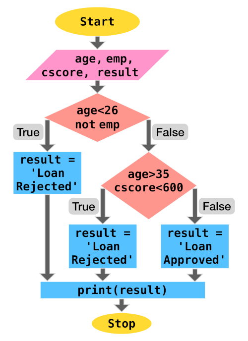

### Examples

Let us go through some programming problems which utilize selection statements.

**1. Absolute Value**

Write a program to output the magnitude of difference between two numbers using conditional statement.

**Code**

``` python
n1 = int(input("Enter 1st number: "))
n2 = int(input("Enter 2nd number: "))

if n1 > n2:
    diff = n1 - n2
else:
    diff = n2 - n1

print("The difference of", n1, "and", n2, "is", diff)
```

**Output**

```
Enter 1st number: 12
Enter 2nd number: 15
The difference of 12 and 15 is 3
```

**2. Sorting 3 Numbers**

Write a program to accept 3 numbers from the user and print them in ascending order of value.

**Code**

``` python
a = int(input("Enter 1st number: "))
b = int(input("Enter 2nd number: "))
c = int(input("Enter 3rd number: "))

if b < a: 
    # Swapping the values of a and b
    a, b = b, a 
          
if c < b: 
    b, c = c, b 
    if b < a: 
        a, b = b, a

print("The numbers in sorted order:", a, ",", b, ",", c)
```

**Output**

```
Enter 1st number: 9
Enter 2nd number: 2
Enter 3rd number: 6
The numbers in sorted order: 2 , 6 , 9
```

**3. Divisibility**

Write a program to accept two numbers and test if the first number is divisible by the second number.

**Code**

``` python
a = int(input("Enter 1st number: "))
b = int(input("Enter 2nd number: "))

if a % b == 0: 
    print(a, "is divisible by", b)
else:
    print(a, "is not divisible by", b)
```

**Output**

```
Enter 1st number: 9
Enter 2nd number: 2
9 is not divisible by 2

Enter 1st number: 9
Enter 2nd number: 3
9 is divisible by 3
```

## Iteration: for

Iteration statements, also known as Looping statements, allow repeated execution of a code block. 

Python provides `for` and `while` statements to perform iteration.

The `for` statement can be used to iterate over the items of a sequence (`list`, `string`, `tuple`, `range`). It can also be used to iterate over unordered sequences like `set` and `dict`.

This process can be demonstrated using the below flowchart:


Let us go through some code examples to demonstrate how `for` statement can be used to iterate over sequences.

### List Iteration

**Code**

``` python
cars = ["Hyundai", "Honda", 
        "Ford", "Toyota", 
        "BMW", "Volkswagen"]
for make in cars:
    print(make)
```

**Output**

```
Hyundai
Honda
Ford
Toyota
BMW
Volkswagen
```

### Tuple Iteration

**Code**

``` python
cars = ("Hyundai", "Honda", 
        "Ford", "Toyota", 
        "BMW", "Volkswagen")
for make in cars:
    print(make)
```

**Output**

```
Hyundai
Honda
Ford
Toyota
BMW
Volkswagen
```

### String Iteration

**Code**

``` python
name = "python"
for char in name:
    print(char)
```

**Output**

```
p
y
t
h
o
n
```

### Range Iteration

The `range` type represents an immutable sequence of numbers that is usually used in for loops for looping a certain number of times. `range` object always take the same (small) amount of memory, no matter the size of the range it represents, which is an advantage over a regular `list` or `tuple`.

**Syntax**: `range(stop)` or  
`range(start, stop[, step])`

``` python
>>> range(10)
range(0, 10)
>>> list(range(10))
[0, 1, 2, 3, 4, 5, 6, 7, 8, 9]
>>> list(range(1, 10, 2))
[1, 3, 5, 7, 9]
```

`range()` function is widely used in a `for` statement to control the number of iterations and provide the index value (`i`) of each iteration.

**Example #1**

Print multiples of 5 starting from 0 to 20.

**Code**

``` python
for i in range(5):
    print(i*5)
```

**Output**

```
0
5
10
15
20
```

**Example #2**

Print all integers from 2 to 5 including the boundary values.

**Code**

``` python
for i in range(2, 6):
    print(i)
```

**Output**

```
2
3
4
5
```

**Example #3**

Print all odd numbers between 2 and 10.

**Code**

``` python
for i in range(3, 10, 2):
    print(i)
```

or

``` python
for i in range(2, 10):
    if i % 2 != 0:
        print(i)
```

**Output**

```
3
5
7
9
```

**Example #4**

Print the index of all occurrences of `o` in `python programming`.

**Code**

``` python
s = "python programming"
for i in range(len(s)):
    if s[i] == "o":
        print(i)
```

**Output**

```
4
9
```

### Exercises

Let us go through some programming problems which utilize the `for` iteration statement.

**1. Compound Interest**

Write a program to calculate the total compound interest payable for given principal, interest rate (compounded annually) and total time (in years).

**Code**

``` python
prin = float(input("Enter the principal amount: "))
rate = float(input("Enter the annual interest rate: "))
time = int(input("Enter the loan duration (in years): "))

amt = prin
for n in range(time):
    amt += rate*amt/100

print("Total interest payable:", amt - prin)
```

**Output**

```
Enter the principal amount: 500000
Enter the annual interest rate: 5
Enter the loan duration (in years): 3
Total interest payable: 78812.5
```

**2. Factorial**

The factorial of a positive integer `n`, denoted by `n!`, is the product of all positive integers less than or equal to `n`.  
`n! = n×(n-1)×(n-2)...3×2×1`  
Write a program to calculate `n!` for a given `n` (assume `n` is greater than `0`).

**Code**

``` python
n = int(input("Enter n: "))

factorial = 1
for i in range(1, n+1):
    factorial *= i

print("n! :", factorial)
```

**Output**

```
Enter n: 6
n! : 720
```

## Iteration: while

`while` statement repeatedly executes a code block as long as the test condition is satisfied. 

Usually there is a statement at the end of the code block which updates the value of the variable being used in the test expression, so the the loop does not execute infinitely. 

A flowchart of the process is provided below:


For example, let us traverse a list and print the position(index) and value of each element until we reach the end of the list.

**Code**

``` python
cars = ["Hyundai", "Honda", 
        "Ford", "Toyota", 
        "BMW", "Volkswagen"]
i = 0  
while i<len(cars):    
    print(i, cars[i])
    i+=1
```

**Output**

```
0 Hyundai
1 Honda
2 Ford
3 Toyota
4 BMW
5 Volkswagen
```

In the above example, the test condition is `i<len(cars)` and the update statement is `i+=1`.

### Exercises

Let us go through some programming problems which utilize the `while` iteration statement.

**1. Compound Interest**

Write a program to calculate the total compound interest payable for given principal, interest rate (compounded annually) and total time (in years).

**Code**

``` python
prin = float(input("Enter the principal amount: "))
rate = float(input("Enter the annual interest rate: "))
time = int(input("Enter the loan duration (in years): "))

amt = prin
while time > 0:
    amt += rate*amt/100
    time = time - 1

print("Total interest payable:", amt - prin)
```

**Output**

```
Enter the principal amount: 500000
Enter the annual interest rate: 5
Enter the loan duration (in years): 3
Total interest payable: 78812.5
```

**2. Factorial**

The factorial of a positive integer `n`, denoted by `n!`, is the product of all positive integers less than or equal to `n`.  
`n! = n×(n-1)×(n-2)...3×2×1`   
Write a program to calculate `n!` for a given `n` (assume `n` is greater than `0`).

**Code**

``` python
n = int(input("Enter n: "))

factorial = 1
while n > 0:
    factorial *= n
    n = n - 1

print("n! :", factorial)
```

**Output**

```
Enter n: 6
n! : 720
```

## Jump Statements

Jump statements are used to (abruptly) alter the flow of execution. 

Some of the jump statements available in Python are:

### pass

A `pass` statement acts as a placeholder and performs null (no) operation.

Various reasons for using the keyword `pass` are provided below:

**1. Syntactical Requirement**

Using `pass` becomes a syntactical requirement for cases where the Python interpreter can raise a `SyntaxError` due to missing statements.  

The below code will execute successfully without any operation in the loop

``` python
for i in range(6):
    pass  
```

whereas without `pass`

``` python
for i in range(6):
```

will throw the following `SyntaxError`

```
File "<ipython-input-18-f2ba5099d499>", line 1
    for i in range(6):
                    ^
SyntaxError: unexpected EOF while parsing
```

Similarly, inside an `if`

``` python
if 2 < 3:
    pass  
```

whereas without `pass`

``` python
if 2 < 3:
```

will throw the following `SyntaxError`

```
File "<ipython-input-20-068861cce0a8>", line 1
    if 2 < 3:
            ^
SyntaxError: unexpected EOF while parsing
```

**2. Skipping Code Execution**

`pass` can be used to skip code execution for certain cases. 

For example,

**Code**

``` python
l = [2, 3, 4, 5, 6]
for i in l:
    if i%3 == 0:
        pass
    else:
        print(i, "is not divisible by 3")
```

**Output**

```
2 is not divisible by 3
4 is not divisible by 3
5 is not divisible by 3
```

**3. Placeholders**

`pass` can be used to create valid empty functions and classes as placeholders which can be modified in the future versions of code.

``` python
def emptyFunction():
    pass

class EmptyClass:
    pass
```

### break

The `break` statement is used to terminate the execution of immediately enclosing `for` or `while` statement.

The below code will terminate the `for` loop when `i` is equal to `4`

``` python
for i in range(10):
    print(i)
    if i == 4:
        break
```

```
0
1
2
3
4
```

In a while statement,

``` python
i =0
while i <10:
    print(i)
    if i == 4:
        break
    i+=1
```

`break` will terminate the `while` loop when `i` is equal to `4`

```
0
1
2
3
4
```

### continue

`continue` statement is used to skip the execution of successive statements and start the next iteration.

The below code will skip all candidates for an interview who have less than 4 years of work experience.

``` python
people =  [{"name": "ABC", "experience": 6},
           {"name": "EFG", "experience": 2},
           {"name": "JKL", "experience": 5},
           {"name": "XYZ", "experience": 3},]
for candidate in people:
    if candidate["experience"]<4:
        continue  
    print(candidate["name"], "is selected for interview")
```

Output:

```
ABC is selected for interview
JKL is selected for interview
```

## Nested Loops

When a loop is present inside another loop, it is known as a nested loop. 

For each iteration of the outer loop, the inner loop undergoes complete iteration. Thus, if the outer loop has to undergo `n` iterations and the inner loop has to undergo `m` iterations, the code block inside the inner loop executes `n x m` times.  

Let us go through a nested loop example:

### Factorial

Write a program to print the factorial of all numbers in the range `1` to `10` (inclusive).

**Code**

``` python
for n in range(1, 11):
    factorial = 1
    for i in range(1, n+1):
        factorial *= i
    print(n,"! =", factorial)
```

**Output**

```
1 ! = 1
2 ! = 2
3 ! = 6
4 ! = 24
5 ! = 120
6 ! = 720
7 ! = 5040
8 ! = 40320
9 ! = 362880
10 ! = 3628800
```

### Nested Loop - break

A `break` statement inside the inner loop terminates only the inner loop whereas the outer loop is not affected.

To develop a better understanding, let us write a program to find all prime numbers between 2 and 40.

**Code**

``` python
for n in range(2, 40):
    i = 2
    while i < n/2:
        if n%i == 0:
            break
        i+=1
    if i>n/2:
        print(n,"is prime")
```

**Output**

```
2 is prime
3 is prime
5 is prime
7 is prime
11 is prime
13 is prime
17 is prime
19 is prime
23 is prime
29 is prime
31 is prime
37 is prime
```

# Strings

## Strings: Introduction & Creation

A String (`str`) is an **immutable** sequence of Unicode characters which is used to handle textual data in Python.

They can be specified by enclosing within:

- Single quotes: `'embedded "double" quotes are allowed'`
- Double quotes: `"embedded 'single' quotes are allowed"`
- Triple quotes: `'''Three single quotes'''`, `"""Three double quotes"""`. 

Triple quoted strings can also span multiple lines.

Some examples are provided below:

``` python
s = "I am a String"  

s1 = """A
multiline
String"""

s2 = '''Also a
multiline
String'''
```

### Escape Characters

The backslash (`\`) character can be used in a string to escape characters that otherwise have a special meaning, such as newline, linefeed, or the quote character.

| Escape Sequence | Meaning |
|--|--|
| `\\` | Backslash (`\`) |
| `\'` | Single quote (`'`) |
| `\"` | Double quote (`"`) |
| `\a` | ASCII Bell (BEL) |
| `\b` | ASCII Backspace (BS) |
| `\f` | ASCII Form-feed (FF) |
| `\n` | ASCII Linefeed (LF) |
| `\r` | ASCII Carriage Return (CR) |
| `\t` | ASCII Horizontal Tab (TAB) |
| `\v` | ASCII Vertical Tab (VT) |

Although `\'` and `\"` can be used to specify quote characters, Python allows embedding double quotes inside a single-quoted string (`'My name is "Python".'`) and single quotes inside a double-quoted string (`"Python's World"`).

### Unicode Support

Python string objects support Unicode characters. 

A unicode character can be specified as `\u` followed by the 4 letter unicode (`\uXXXX`).

``` python
>>> print("E = mc\u00B2")
E = mc²
```

In the above example, `\u00B2` is the unicode character which represents the 'SUPERSCRIPT TWO'. 

### Other Types to String

In case you want to create a string object from other data types, just use the built-in `str()` function as follows:

``` python
>>> str(9)
'9'

>>> str(10.0)
'10.0'
```

## Accessing Characters of a String

Python strings are "immutable", i.e., the state (value) of the objects cannot be modified after they are created. 

Using the standard `[ ]` syntax and zero-based indexing, characters can be accessed in a string.

If `s = "hello"`,

- `s[0]` will result in `h`
- `s[2]` will result in `l`
- `s[5]` will result in `IndexError: string index out of range` as the length of string is `5` (index `0` to `4`)
- `s[2] = 'p'` will result in `TypeError: 'str' object does not support item assignment` as `s` is immutable

Python also supports negative indexing, i.e., you can access the values of a string from right to left. 

Index of `-1` denotes the last character of the string, `-2` is the second last character and so forth.

If `s = "hello"`,

- `s[-1]` will result in `o`
- `s[-4]` will result in `e`
- `s[-6]` will result in `IndexError: string index out of range` as the length of string is `5` (negative index `-1` to `-5`)

### Length of String

The built-in function `len()` returns the length of a string which is useful during string traversal or other string operations.

``` python
>>> len("hello")
5

>>> s = "sample text"
>>> len(s)
11

>>> p = "python"
>>> l = len(p)
>>> p[l-1]
'n'
```

## String Operations

We can perform various operations on a string (sequence of characters) such as slicing, membership, concatenation and repetition.

### Slicing

In Python, a character in a string can be easily accessed using its index.

``` python
>>> s = "Hello"
>>> s[1]
'e' 
```

Python also provides a way to access a substring from a string. This substring is known as a **slice** and it can be obtained using the slice operator `[n:m]` which returns the part of the string from the start index (`n`) to the end index (`m`), including the first but excluding the last.

``` python
>>> s = "Hello"
>>> s[1:3]
'el' 
```

If the start index (`n`) is omitted, the default value of `n` is set as `0` which denotes the beginning of the string. If the end index (`m`) is omitted, the substring ends at the last character of the string.

``` python
>>> s = "Hello"
>>> s[:3]
'Hel'
>>> s[3:]
'lo'
>>> s[:]
'Hello'
```

Negative indexing is also supported in the slice operator.

``` python
>>> s = "Hello"
>>> s[-4:-2]
'el'
```

In the above example, `-4` is equivalent to `len(s) - 4 = 5 - 4 = 1` and `-2` is equivalent to `5 - 2 = 3`. Thus, `s[-4:-2]` is same as `s[1:3]`.

The slice operator also allows the usage of a third index which is known as step as it allows a user to step over (skip) characters.

``` python
>>> s = "Hello"
>>> s[0:5:2]
'Hlo'
```

In the above example, the substring begins at the start of the string, takes a step size of `2` skipping `e` and ends at the last character again skipping the 4th character `l`.

### Membership

`in` and `not in` operators can be used to determine whether a substring is present/not present in a string.

``` python
>>> s = "Hello"
>>> "lo" in s
True
>>> "lp" not in s
True
```

### Concatenation

The `+` operator can be used to join two strings.

``` python
>>> s1 = "Hello"
>>> s2 = "Python" 
>>> s1 + s2
'HelloPython'
>>> s1 + "World"
'HelloWorld'
```

### Repetition

The `*` operator repeats a string the number of times as specified by the integer operand.

``` python
>>> s = "Hello"
>>> s*3
'HelloHelloHello'
```

## Introduction to String Methods

Apart from the built-in function `len()` which returns the length of the string, String objects have access to several specialized functions (methods) that can:

1. Convert Case of Strings
2. Check Characters of a String
3. Split a String
4. Strip Characters from a String
5. Checking for Prefix or Suffix in a String
6. Find & Replace Characters in a String

Let us discuss these methods in detail in the coming sections.

## Convert Case of Strings

The following methods are useful in converting the case of the characters in a string:

### lower()

All cased characters are converted into lowercase.

``` python
>>> "PYthon".lower()
'python'
```

### upper()

All cased characters are converted into uppercase.

``` python
>>> "PYthon".upper()
'PYTHON'
```

### swapcase()

Uppercase characters are converted into lowercase and lowercase characters are converted into uppercase.

``` python
>>> "PYthon".swapcase()
'pyTHON'
```

### capitalize()

First character is capitalized and rest all characters are lowercased.

``` python
>>> "hello py".capitalize()
'Hello py'
```

### title()

For each word present in the string, the first character is uppercased and the remaining characters are lowercased.

``` python
>>> "hello python".title()
'Hello Python'
```

## Check Characters of a String

The following methods are used to check the type of characters in a string.

### isalpha()

Returns `True` if all characters in the string are letters (`A-Z a-z`).

``` python
>>> "HelloPython".isalpha()
True

>>> "Hello Python".isalpha()
False  # contains whitespace

>>> "HelloPython2".isalpha()
False  # contains digit
```

### isdigit()

Returns `True` if all characters in the string are digits.

``` python
>>> "Hello24".isdigit()
False  # contains alphabets
>>> "24".isdigit()
True
```

### isalnum()

Returns `True` if all characters in the string are alphanumeric (Alphabets or Numeric).

``` python
>>> "02".isalnum()
True
>>> "HelloPython".isalnum()
True
>>> "Hello Python v2".isalnum()
False  # contains whitespace
>>> "HelloPythonv2".isalnum()
True
```

### isascii()

Returns `True` if the string is empty or all characters in the string are ASCII.

``` python
>>> "".isascii()
True
>>> "HelloPython".isascii()
True
>>> "Hello Py \u00B2".isascii()
False
>>> "पा से python".isascii()
False
```

### islower()

Returns `True` if all characters are lowercase.

``` python
>>> "hello".islower()
True
>>> "Hello".islower()
False
```

### isupper()

Returns `True` if all characters are uppercase.

``` python
>>> "HELLO".isupper()
True
>>> "Hello".isupper()
False
```

### isspace()

Returns `True` if there are only whitespace characters in the string. Some popular whitespace characters are ` ` (space), `\t` (tab), `\n` (newline), `\r` (carriage return), `\f` (form feed) and `\v` (vertical tab).

``` python
>>> "        ".isspace()
True
```

### istitle()

Returns `True` if the string is title-cased, i.e., the first character of every word in the string is uppercased and the remaining characters are lowercased.

``` python
>>> "Hello World".istitle()
True
>>> "Hello world".istitle()
False
>>> "hello world".istitle()
False
```

## Split a String

Split methods help in splitting/partitioning a string.

### partition()

`partition(sep)` method splits the string when the separator (`sep`) is encountered for the first time, and returns a tuple with three items `(string before separator, separator, string after separator)`.

``` python
>>> "Hi|Ed|Punk".partition('|')
('Hi', '|', 'Ed|Punk')
```

### split()

`split(sep=None, maxsplit=-1)` method splits a string into a list based on a string separator (`sep`). 

If `sep` is not specified, it defaults to `None`, where whitespace is regarded as separator, and the string is stripped of all leading and trailing whitespaces after which it is split into words contained in the string.

``` python
>>> "Hi|Ed|Punk".split('|')
['Hi', 'Ed', 'Punk']
>>> "Hi Ed Punk".split()
['Hi', 'Ed', 'Punk']
>>> "    Hi Ed Punk   ".split()
['Hi', 'Ed', 'Punk']
```

If `maxsplit` is provided, at most `maxsplit` number of splits are performed and the list will contain a maximum of `maxsplit+1` elements. 

`maxsplit` when not specified defaults to `-1`, which implies that there is no limit on the number of splits.

``` python
>>> "Hi|Ed|Punk|v2".split('|', 2)
['Hi', 'Ed', 'Punk|v2']
```

## Strip Characters from a String

Strip methods are useful in removing leading and/or trailing characters in a string. 

They accept an optional argument `chars` which specifies the set of characters which have to be removed. 

If no arguments are provided then `chars` defaults to ASCII whitespace and the method removes all leading and/or trailing spaces from the string.

### lstrip()

All leading (on the left) characters are removed from the string.

``` python
>>> "   Hello|World   ".lstrip()
'Hello|World   '
>>> "www.edpunk.cc".lstrip('w.')
'edpunk.cc'
```

### rstrip()

All trailing (on the right) characters are removed from the string.

``` python
>>> "   Hello|World   ".rstrip()
'   Hello|World'
>>> "www.edpunk.cc".rstrip('.c')
'www.edpunk'
```

### strip()

All leading and trailing characters are removed from the string.

``` python
>>> "   Hello|World   ".strip()
'Hello|World'
>>> "www.edpunk.cc".strip('cw.')
'edpunk'
```

## Check Prefix or Suffix in a String

`startswith()` and `endswith()` methods are used check whether a string starts or ends with the provided substring (or a tuple of substrings).

``` python
>>> "Hello Py".startswith("He")
True
>>> "Hello Py".startswith(("He","P"))
True
>>> "Py Hello".startswith(("He","P"))
True
>>> "Hello Py".endswith("y")
True
>>> "Hello Py".endswith(("p","y"))
True
>>> "Py Hello".endswith(("o","n"))
True
```

## Find & Replace Characters in a String

The following string methods are useful for locating substring in a string.

### count()

`count(sub[, start[, end]])` returns the number of non-overlapping occurrences of a substring `sub` in the range `[start, end]`. 

`start` and `end` are optional parameters and they default to `0` and `len(string)` respectively.

``` python
>>> s = "she sells sea shells"
>>> s.count("she")
2
>>> s.count("she", 5)
1
>>> s.count("she", 5, 10)
0
>>> s.count("she", 5, 17)
1
```

It has to be noted that the method counts non-overlapping occurrences, so it does not start a new matching process until the current substring matching is complete.

``` python
>>> s = "valhala alala"
>>> s.count("al")
4
>>> s.count("ala")
2
```

In the above example, `ala` is counted twice as the first occurrence is in `valh"ala"` and the next occurrence is in `"ala"la`. Although `ala` can be located again in `al"ala"`, it overlaps with the occurrence `"ala"la`, hence it is not counted.  

### find()

`find(sub[, start[, end]])` returns the lowest index in the string where substring `sub` is located in the range `[start, end]`. 

`start` and `end` are optional parameters and they default to `0` and `len(string)` respectively.

The method returns `-1` in case the substring is not present.

``` python
>>> s = "she sells sea shells"
>>> s.find("she")
0
>>> s.find("she", 5)
14
>>> s.find("see")
-1
>>> s.find("she", 5, 10)
-1
>>> s.find("she", 5, 17)
14
```

### rfind()

`rfind(sub[, start[, end]])` returns the highest index in the string where substring `sub` is located in the range `[start, end]`. 

`start` and `end` are optional parameters and they default to `0` and `len(string)` respectively.

The method returns `-1` in case the substring is not present.

``` python
>>> s = "she sells sea shells"
>>> s.rfind("she")
14
>>> s.rfind("she", 0, 12)
0
>>> s.rfind("see")
-1
>>> s.rfind("she", 5)
14
```

### index()

`index(sub[, start[, end]])` is similar to `find(sub[, start[, end]])`, but instead of returning `-1` it raises `ValueError` when the substring is not found.

``` python
>>> s = "she sells sea shells"
>>> s.index("she")
0
>>> s.index("she", 5)
14
>>> s.index("see")
Traceback (most recent call last):
  File "<stdin>", line 1,
   in <module>
ValueError: substring not found
>>> s.index("she", 5, 10)
Traceback (most recent call last):
  File "<stdin>", line 1,
   in <module>
ValueError: substring not found
>>> s.index("she", 5, 17)
14
```

### rindex()

`s.rindex(sub[, start[, end]])` is similar to `rfind(sub[, start[, end]])`, but instead of returning `-1` it raises `ValueError` when the substring is not found.

``` python
>>> s = "she sells sea shells"
>>> s.rindex("she")
14
>>> s.rindex("she", 0, 12)
0
>>> s.rindex("see")
Traceback (most recent call last):
  File "<stdin>", line 1,
   in <module>
ValueError: substring not found
>>> s.rindex("she", 5)
14
```

### replace()

`replace(oldsub, newsub[, count])` returns a copy of the string with all occurrences of `oldsub` substring replaced by `newsub`. 

`count` is an optional parameter which when provided, only replaces the first `count` occurrences from the string.

``` python
>>> s = "Oh Python! Oh"
>>> s.replace("Oh", "Hi")
'Hi Python! Hi'
>>> s.replace("Oh", "Hi", 1)
'Hi Python! Oh'
```

## Traversing a String

`for` and `while` statements are useful for traversing a string.

### Using `for`

As a string is a sequence of characters, the `for` statement can be used to iterate over a string as shown below.

**Code**

``` python
name = "python"
for char in name:
    print(char)
```

**Output**

```
p
y
t
h
o
n
```

### Using `while`

A `while` statement can be used to traverse a string by iterating on the value of index till the last character index.

**Code**

``` python
name = "python"
i = 0
while i < len(name):
    print(name[i])
    i += 1
```

**Output**

```
p
y
t
h
o
n
```

# List

## What is a Python List? How to Create a List?

The most common and widely used collections in Python are **lists** which store an ordered group of objects (of any datatype) which might have some logical relation. This marks a considerable difference from arrays (in traditional languages) and makes Python an ideal language for handling real-life data which is not type-bound.  

Let us create a list of attributes of a particular vehicle available for sale in a car dealership:

``` python
>>> l = ["BMW", "Z4", 2019, 
...       4, "Red", True]
```

In this list:

- `"BMW"` is the make of the vehicle,
- `"Z4"` is the model of the vehicle,
- `2019` is the year when the vehicle was manufactured,
- `4` represents the number of wheels,
- `"Red"` is the color of the vehicle, and
- `True` tells us that the vehicle up for sale is brand new.

This method of creating a list from a collection of literals is known as **list display**.

Notice, how this list contains items of multiple data types - `str`, `int` and `bool`.

Apart from the list display shown above, the built-in `list()` function can also be used to create new lists.

If no arguments are provided to the `list()` function, an empty list is created.

``` python
>>> l = list()
>>> l
[]
```

If a string, tuple or set is passed as an argument, `list()` functions converts them into a list.

``` python
>>> l = list("abcd")
>>> l
['a', 'b', 'c', 'd']
>>> l = list({1, 2, 3})
>>> l
[1, 2, 3]
>>> l = list((1, 2, 3, 4))
>>> l
[1, 2, 3, 4]
```

## Accessing Items of a List

Lists use zero-based indexing, where 0 is the index of the first element and `len(list) - 1` is the index of the last element.

For example,

``` python
>>> l = ["BMW", "Z4", 2019, 
...       4, "Red", True]
>>> l[0]
'BMW'
>>> l[2]
2019
```

### Length of List

The built-in `len()` function can be used to return the length of the list.

``` python
>>> l = ["BMW", "Z4", 2019, 
...       4, "Red", True]
>>> len(l)
6
```

### Negative Indexing

Just like `str`, sequence types like `list` support negative indexing, i.e., you can access the values of list from the end. 

Index of `-1` denotes the last item in the list, `-2` the second last item and so forth.

``` python
>>> l = ["BMW", "Z4", 2019, 
...       4, "Red", True]
>>> l[-1]
True
>>> l[-3]
4
```

## Modifying a List

As lists are mutable, the assignment operator can be used to modify or replace a single item in the list at a given index.

``` python
>>> l = ["BMW", "Z4", "Red"]
>>> l[2] = "Black"
>>> l
['BMW', 'Z4', 'Black']
```

## Removing Item from a List

`del` statement can be used to delete an item at a given index of a list.

``` python
>>> l = ["BMW", "Z4", "Red"]
>>> del l[1]
>>> l
['BMW', 'Red']
```

## List Operations

We can perform various operations on a list (collection of items) such as membership, concatenation, repetition and slicing.

### Membership

`in` and `not in` can be used to detect the membership of an item in a list.

``` python
>>> l = ["BMW", "Z4", "Red"]
>>> "Red" in l
True
>>> "Gold" in l
False
>>> "Gold" not in l
True    
```

### Concatenation

`+` operator can be used to join two lists to create a new list.

``` python
>>> l = ["BMW", "Z4"]
>>> k = [2019, "Red"]
>>> l + k
['BMW', 'Z4', 2019, 'Red']
```

`+=` operator joins two lists and assigns it to the target list.

``` python
>>> l = ["BMW", "Z4"]
>>> l += [2019, "Red"]
>>> l
['BMW', 'Z4', 2019, 'Red']  
```

### Repetition

The `*` operator repeats the items of a list the number of times as specified by the integer operand.

``` python
>>> l = [1, 2]
>>> l*3
[1, 2, 1, 2, 1, 2]
```

### Slicing

A subset of list `l` can be obtained using the list slice notation given as `l[i:j]`, where the item at start index `i` is included, but the item at end index `j` is excluded. 

For example, the slice notation `[1:4]` refers to items from index `1` to index `3` (i.e. `4-1`).

``` python
>>> l = ["BMW", "Z4", 2019, 
...       4, "Red", True]
>>> l[1:4]
['Z4', 2019, 4]
```

The slice notation `l[i:j:k]` can also include a third number known as the stepper. Here, a list is sliced from start index `i` to end index (`j`) - 1 with a step of `k` items.

``` python
>>> l = ["BMW", "Z4", 2019, 
...       4, "Red", True]
>>> l[1:4:2]
['Z4', 4]
```

Slice notations also have some useful defaults. 0 is the default for the first number and size of the list is the default for the second number.

``` python
>>> l = ["BMW", "Z4", 2019, 
...       4, "Red", True]
>>> l[2:]
[2019, 4, 'Red', True]
>>> l[:4]
['BMW', 'Z4', 2019, 4]
```

Slice notation also supports negative indexing.

``` python
>>> l = ["BMW", "Z4", 2019, 
...       4, "Red", True]
>>> l[-4:]
[2019, 4, 'Red', True]
>>> l[:-2]
['BMW', 'Z4', 2019, 4]
>>> l[-4:-1]
[2019, 4, 'Red']   
```

Slice notation can be used to replace multiple items in a list.

``` python
>>> l = ["BMW", "Z4", 2019, 
...       4, "Red", True]
>>> l[:2] = ["Kia", "Sonet"]
>>> l
['Kia', 'Sonet', 2019, 4, 'Red', True]

>>> l = ["BMW", "Z4", 2019, 
...       4, "Red", True]
>>> l[1:5:2] = ["Sonet", 2]
>>> l
['BMW', 'Sonet', 2019, 2, 'Red', True]
```

Slice notation can also be used to delete multiple items in a list.

``` python 
>>> l = ["BMW", "Z4", 2019, 
...       4, "Red", True]
>>> del l[:2]
>>> l
[2019, 4, 'Red', True]

>>> l = ["BMW", "Z4", 2019, 
...       4, "Red", True]
>>> del l[:5:2]
>>> l
['Z4', 4, True]
```

## Traversing a List

List Traversal is the process of visiting every item in a list, usually from the first item to the last item, and executing some instruction on the accessed item. 

Python provides 2 ways to traverse a list: 

### Direct Traversal

As a list is an ordered collection of items, the `for` statement can be used to directly and sequentially access each item.

**Code**

``` python
l = ["BMW", "Z4", 2019, 
     4, "Red", True]
for item in l:
    print(item)
```

**Output**

```
BMW
Z4
2019
4
Red
True
```

### Location or Index Based Traversal

In location based or index based traversal the value of index starts at `0` and increments as long as it is lesser than the length of the list. 

This index value can be used to access the item at that index in a list using the index operator `[]`.

`for` statement can be used to iterate over the index of the list using the `range()` and `len()` functions. 

**Code**

``` python
l = ["BMW", "Z4", 2019, 
     4, "Red", True]
for i in range(len(l)):
    print(i, l[i])
```

**Output**

```
0 BMW
1 Z4
2 2019
3 4
4 Red
5 True
```

This method is also useful when you need to modify the items of a list (without altering the length of list) during traversal.

For example, let us convert each item of the list into a string.

**Code**

``` python
l = ["BMW", "Z4", 2019, 
     4, "Red", True]
for i in range(len(l)):
    # modifying item value
    l[i] = str(l[i])
print(l)
```

**Output**

```
['BMW', 'Z4', '2019', '4', 'Red', 'True']
```

A `while` statement can be used to traverse a list by iterating on the value of index till the last item index.

**Code**

``` python
l = ["BMW", "Z4", 2019, 
     4, "Red", True]
i = 0
while i < len(l):
    print(l[i])
    i += 1
```

**Output**

```
BMW
Z4
2019
4
Red
True
```

## Built-in Functions that can be used for a List

Built-in functions `max()`, `min()` and `sum()` are used to calculate the maximum, minimum and sum of items in a list, respectively.  

``` python
>>> l = [4, 8, 2, 1, 3]
>>> min(l)
1
>>> max(l)
8
>>> sum(l)
18
```

## Introduction to List Methods

List objects have access to several specialized functions (methods) that can be used to:

1. Add Items to a List
2. Remove Items from a List
3. Count or Locate Items in a List
4. Sort a List 
5. Reverse a List
6. Copy the Contents of a List

Let us discuss these methods in detail in the coming sections.

## Adding Items to a List

`append()` method adds an item (passed as an argument) to the end of a list.

``` python
>>> l = ["T", "C", 2, 4]
>>> l.append(2.5)
>>> l
['T', 'C', 2, 4, 2.5]
```

If the item has to be added at a particular index, `insert()` method can be used.

``` python
>>> l = ["T", "C", 2, 4]
>>> l.insert(3, 2.5)
>>> l
['T', 'C', 2, 2.5, 4]
```

`extend()` method appends each item of the argument list at the end of the target list.

``` python
>>> l = ["T", "C", 2, 4]
>>> l.extend([2.5, "SE"])
>>> l
['T', 'C', 2, 4, 2.5, 'SE']  
```

## Removing Items from a List

`clear()` method removes all items from the list.

``` python
>>> l = ["T", "C", 2, 4, "S"]
>>> l.clear()
>>> l
[]
```

`remove()` method removes the first occurrence of an item from the list.

``` python
>>> l = ["Hi", "Ed", "Py", "Hi"]
>>> l.remove("Hi")
>>> l
['Ed', 'Py', 'Hi']
```

If an index is provided, `pop()` method removes the item at that index, else the last item is removed from the list.

``` python
>>> l = ["T", "C", 2, 4, "S"]
>>> item = l.pop()
>>> item
'S'
>>> l
['T', 'C', 2, 4]

>>> l = ["T", "C", 2, 4, "S"]
>>> item = l.pop(2)
>>> item
2
>>> l
['T', 'C', 4, 'S']
```

## Counting or Locating Items in a List

An item `x` can be located in a list using the `index(x[, i[, j]])` method which returns the first occurrence of the item at or after index `i` and before index `j`. 

In case `i` and `j` are not specified they default to `i=0` and `j=len(l)`.

``` python
>>> l = [34, 4, 6, 23, 4]
>>> l.index(4)
1
>>> l.index(4, 3)
4
>>> l.index(6, 1, 4)
2
```

`count()` method can be used to count the occurrence(s) of an item in a list.

``` python
>>> l = [34, 4, 6, 23]
>>> l.count(4)
1
>>> l = ["it", "is", "it", "I"]
>>> l.count("it")
2
```

## Reversing Items

`reverse()` method can be used to reverse a list in-place.

``` python
>>> l = ["T", "C", 2, 4, "S"]
>>> l.reverse()
>>> l
['S', 4, 2, 'C', 'T']
```

If you do not wish to modify the existing list and create a new list with items in reverse order, use the built-in function `reversed()` nested in the built-in `list()`.

``` python
>>> l = ["T", "C", 2, 4, "S"]
>>> new_l = list(reversed(l))
>>> new_l
['S', 4, 2, 'C', 'T']
>>> l
['T', 'C', 2, 4, 'S']
```

## Sorting a List

Python lists have a built-in `sort()` method which sorts the items in-place using `<` comparisons between items. 

The method also accepts 2 key-worded arguments:  
- `key` is used to specify a function which is called on each list element prior to making the comparisons. 
- `reverse` is a boolean which specifies whether the list is to be sorted in descending order.

``` python
>>> l = [34, 4, 6, 23]
>>> l.sort()
>>> l
[4, 6, 23, 34]

>>> l = [34, 4, 6, 23]
>>> l.sort(reverse=True)
>>> l
[34, 23, 6, 4]

>>> l = ["Oh", "Hi", "Py", "ed"]
>>> l.sort()
>>> l
['Hi', 'Oh', 'Py', 'ed']

>>> l = ["Oh", "Hi", "Py", "ed"]  
# lowercase the words before sorting
>>> l.sort(key=str.lower)  
>>> l
['ed', 'Hi', 'Oh', 'Py']
```

If you do not wish to modify the existing list and create a new list with sorted items in, use the built-in `sorted()` function which returns a new sorted list.

``` python
>>> l = [34, 4, 6, 23]
>>> new_l = sorted(l)
>>> new_l
[4, 6, 23, 34]
```

## Copying a List

In Python, we can create an object (data) and bind its reference to a variable using the assignment operator (`=`). 

As multiple collections or items in collections can point to the same mutable object, a copy is required so one can change one copy without changing the other. 

Let us take an example:

``` python
>>> old_l = [1, 2, 3]

# Copying old list into a new list
>>> new_l = old_l

# Checking if both lists are 
# pointing to the same object
>>> id(new_l)==id(old_l)
True

# Adding element to new list
>>> new_l.append(4)
>>> new_l
[1, 2, 3, 4]
>>> old_l
[1, 2, 3, 4]
```

It can be seen how the assignment operator **does not create a new copy** of the list.

The `copy()` method can be used to create a new `list` containing the items of the original list.

``` python
>>> old_l = [1, 2, 3]

# Copying old list into a new list
>>> new_l = old_l.copy()

# Checking if both lists are 
# pointing to the same object
>>> id(new_l)==id(old_l)
False

# Adding element to new list
>>> new_l.append(4)
>>> new_l
[1, 2, 3, 4]
>>> old_l
[1, 2, 3]
```

Assigning a slice of the entire list (`[:]`) is also equivalent to creating a new copy.

``` python
>>> old_l = [1, 2, 3]

# Copying old list into a new list
# using slice notation
>>> new_l = old_l[:]

# Checking if both lists are 
# pointing to the same object
>>> id(new_l)==id(old_l)
False

# Adding element to new list
>>> new_l.append(4)
>>> new_l
[1, 2, 3, 4]
>>> old_l
[1, 2, 3]
```

## Nested List

A list of lists is also known as a nested list.

Previously, we learnt how to create a list of attributes of a particular vehicle available for sale in a dealership.

Let us now create a nested list containing some details of vehicles available for sale.

``` python
# Make Model Year No_of_wheels
l = [["Kia", "Sonnet", 2019, 4],
  ["Toyota", "Camry", 2018, 4],
  ["BMW", "Z4", 2015, 4],
  ["BMW", "S1000", 2016, 2],
  ["KTM", "390", 2019, 2],
  ]
```

Thus, nested list is useful in representing a dataset where each item is a list (datum) containing the attributes of an observation.

`l[i][j]` is the syntax to fetch the `j+1th` item of the list at index `i` of the nested list `l`.

``` python
>>> l[2][1]
'Z4'
```

## List Comprehension

A short and succinct way of creating a new list by transforming an existing list is via list comprehension.

Also, due to the optimizations present in the Python interpreter, there are performance benefits of using list comprehension.

### Member-wise Operation

List comprehension can be used to make a new list where each element is the result of some operations applied to each member of another sequence or iterable.

For example, to create a new list where each item is squared.

``` python
>>> l = [2, 3, 4, 5, 6, 8]
>>> l2 = [i**2 for i in l]
>>> l2
[4, 9, 16, 25, 36, 64]
```

### Filtering or Subsequence

List comprehension can also be used to create a subsequence of those elements that satisfy a certain condition.

For example, to create a new list where each item is divisible by 2.

``` python
>>> l = [2, 3, 4, 5, 6, 8]
>>> l2 = [i for i in l if i%2==0]
>>> l2
[2, 4, 6, 8]
```

## Sample Programs

### 1. Min, Max and Mean

Write a program to find the minimum, maximum and mean of values stored in a list input by user.

**a) Without Using Built-in Functions**

**Code**

``` python
#create an empty list
l = []

n = int(input("Enter length of list: "))
for i in range(n):
    val = float(input("Enter item: "))
    #append marks in the list 
    l.append(val)

# Set first item as the default min value
minval = l[0]
# Set first item as the default max value
maxval = l[0]
# Store sum of items
s = 0
for val in l:
    # check if item value is smaller than current min val
    if val < minval:
        minval = val
    # check if item value is greater than current max val
    if val > maxval:
        maxval = val
    s += val

print("Minimum :", minval)
print("Maximum :", maxval)
print("Mean :", s/n)
```

**Output**

```
Enter length of list: 5
Enter item: 3
Enter item: 2
Enter item: 6
Enter item: 9
Enter item: 1
Minimum : 1.0
Maximum : 9.0
Mean : 4.2
```

**b) Using Built-in Functions**

**Code**

``` python
#create an empty list
l = []

n = int(input("Enter length of list: "))
for i in range(n):
    val = float(input("Enter item: "))
    #append marks in the list 
    l.append(val)

print("Minimum :", min(l))
print("Maximum :", max(l))
print("Mean :", sum(l)/n)
```

**Output**

```
Enter length of list: 5
Enter item: 3
Enter item: 2
Enter item: 6
Enter item: 9
Enter item: 1
Minimum : 1.0
Maximum : 9.0
Mean : 4.2
```

### 2. Linear Search

Write a program to enter a list and then check if the number entered by a user is present in that list.

**Code**

``` python
#create an empty list
l = []

n = int(input("Enter length of list: "))
for i in range(n):
    val = input("Enter item: ")
    #append marks in the list 
    l.append(val)

search = input("Enter search value: ")

found = False
for i in range(n):
    if l[i] == search:
        found = True
        break
if found:
    print("Search value located at index", i)
else:
    print("Search value not found")
```

**Output**

```
Enter length of list: 4
Enter item: 2
Enter item: 6
Enter item: 3
Enter item: 7
Enter search value: 3
Search value located at index 2

Enter length of list: 4
Enter item: 2
Enter item: 6
Enter item: 3
Enter item: 7
Enter search value: 1
Search value not found
```

### 3. Frequency of Elements

Write a program to enter a list and then print the frequency of elements present in that list.

**a) Without Using Built-in Functions**

**Code**

``` python
#create an empty list
l = []

n = int(input("Enter length of list: "))
for i in range(n):
    val = input("Enter item: ")
    #append marks in the list 
    l.append(val)

# Let us create two lists 
# 1. to store unique items 
items = []
# 2. to store the count of unique items
counts = []

for val in l:
    if val not in items:
        items.append(val)
        counts.append(1)
    else:
        for idx in range(len(items)):
            if items[idx] == val:
                counts[idx] += 1

print("Frequency of Elements")
for idx in range(len(items)):
    print(items[idx], "-", counts[idx])
```

**Output**

```
Enter length of list: 8
Enter item: 2
Enter item: 3
Enter item: 3
Enter item: 4
Enter item: 2
Enter item: 5
Enter item: 6
Enter item: 6
Frequency of Elements
2 - 2
3 - 2
4 - 1
5 - 1
6 - 2
```

**b) Using Built-in Functions**

**Code**

``` python
l = []

n = int(input("Enter length of list: "))
for i in range(n):
    val = input("Enter item: ")
    #append marks in the list 
    l.append(val)

# List to store unique items 
items = []

print("Frequency of Elements")
for val in l:
    if val not in items:
        items.append(val)
        print(val, "-", l.count(val))
```

**Output**

```
Enter length of list: 8
Enter item: 2
Enter item: 3
Enter item: 3
Enter item: 4
Enter item: 2
Enter item: 5
Enter item: 6
Enter item: 6
Frequency of Elements
2 - 2
3 - 2
4 - 1
5 - 1
6 - 2
```

# Tuple

## List vs Tuple

Tuples are like lists, with a difference - they are immutable. This means that once initialized a user cannot modify its value, which makes it a useful feature to ensure the sanctity of data and guarantee that it is not being modified by the program.

## How to Create Tuple?

Tuples are declared using parentheses `( )`, with successive items separated by a comma `,`.

``` python
>>> l = ("Hi", "Ed", "Punk")
>>> type(l)
<class 'tuple'>
```

### tuple()

Apart from the method shown above, the built-in `tuple()` function can also be used to create new tuples.

If no arguments are provided to the `tuple()` function, an empty tuple is created.

``` python
>>> t = tuple()
>>> t
()
```

If a string, tuple or set is passed as an argument, `tuple()` functions converts them into a tuple.

``` python
>>> t = tuple("abcd")
>>> t
('a', 'b', 'c', 'd')
>>> t = tuple({1, 2, 3})
>>> t
(1, 2, 3)
>>> t = tuple([1, 2, 3, 4])
>>> t
(1, 2, 3, 4)
```

## What is a Singleton?

In case a tuple has only 1 item, it is known as a singleton. 

It is a good practice to include a trailing comma to avoid the Python interpreter from treating it as a value inside regular parentheses as shown in the examples below.

``` python
>>> regular_string = ("Hi")
>>> regular_string
'Hi'
>>> type(regular_string)
<class 'str'> 

>>> regular_int = (1)
>>> regular_int
1
>>> type(regular_int)
<class 'int'>     

>>> str_tuple = ("Hi", ) 
>>> type(str_tuple)
<class 'tuple'>

>>> int_tuple = (1, ) 
>>> type(int_tuple)
<class 'tuple'>
```

## Accessing Items of a Tuple

Tuples use zero-based indexing, where 0 is the index of the first element and `len(tuple) - 1` is the index of the last element.

``` python
>>> t = ("BMW", "Z4", 2019, 
...       4, "Red", True)
>>> t[0]
'BMW'
>>> t[2]
2019
```

### Length of Tuple

The built-in `len()` function can be used to return the length of the tuple.

``` python
>>> t = ("BMW", "Z4", 2019, 
...       4, "Red", True)
>>> len(t)
6
```

### Negative Indexing

Just like `list`, `tuple` supports negative indexing, i.e., you can access the values of tuple from the end. Index of -1 denotes the last item in the tuple, -2 is the second last item and so forth.

``` python
>>> t = ("BMW", "Z4", 2019, 
...       4, "Red", True)
>>> t[-1]
True
>>> t[-3]
4
```

## Tuples are Immutable

Tuples are immutable, i.e., no modifications are permitted once it is created and any attempt to do so raises an error.

``` python
>>> t = ("BMW", "Z4", 2019)
>>> t[1] = "Charger"
Traceback (most recent call last):
  File "<stdin>", line 1, in <module>
TypeError: 'tuple' object does not support item assignment
```

## Tuple Operations

We can perform various operations on a tuple such as membership, concatenation, repetition and slicing.

### Membership

`in` and `not in` can be used to detect the membership of an item in a tuple.

``` python
>>> t = ("BMW", "Z4", 2019, 
...       4, "Red", True)
>>> "Red" in t
True
>>> "Gold" in t
False
>>> "Gold" not in t
True    
```

### Concatenation

`+` operator can be used to join two tuples to create a new tuple.

``` python
>>> t = ("BMW", "Z4")
>>> u = (2019, "Red")
>>> t+u
('BMW', 'Z4', 2019, 'Red')
```

### Repetition

The `*` operator creates a new tuple with items of a tuple repeated the number of times as specified by the integer operand.

``` python
>>> t = (1, 2)
>>> t*3
(1, 2, 1, 2, 1, 2)
```

### Tuple Slicing

A subset of tuple `t` can be obtained using the tuple slice notation given as `t[i:j]`, where the item at index `i` is included, but the item at index `j` is excluded. 

For example, the slice notation `[1:4]` refers to items from index `1` to index `3` (i.e. `4-1`).

``` python
>>> t = ("BMW", "Z4", 2019, 
...       4, "Red", True)
>>> t[1:4]
('Z4', 2019, 4)
```

The slice notation `t[i:j:k]` can also include a third number known as the step. Here, a tuple is sliced from start index `i` to end index (`j`) - 1 with a step of `k` items.

``` python
>>> t = ("BMW", "Z4", 2019, 
...       4, "Red", True)
>>> t[1:4:2]
('Z4', 4)
```

Slice notations also have some useful defaults. 

`0` is the default for the first number and size of the tuple is the default for the second number.

``` python
>>> t = ("BMW", "Z4", 2019, 
...       4, "Red", True)
>>> t[2:]
(2019, 4, 'Red', True)
>>> t[:4]
('BMW', 'Z4', 2019, 4)
```

Slice notation also supports negative indexing.

``` python
>>> t = ("BMW", "Z4", 2019, 
...       4, "Red", True)
>>> t[-4:]
(2019, 4, 'Red', True)
>>> t[:-2]
('BMW', 'Z4', 2019, 4)
>>> t[-4:-1]
(2019, 4, 'Red')
```

## Traversing a Tuple

Tuple Traversal is the process of visiting every item in a tuple, usually from the first item to the last item, and executing some instruction on the accessed item. 

Python provides 2 ways to traverse a tuple: 

### Direct Traversal

As a tuple is an ordered collection of items, the `for` statement can be used to directly and sequentially access each item.

**Code**

``` python
t = ("BMW", "Z4", 2019, 
     4, "Red", True)
for item in t:
    print(item)
```

**Output**

```
BMW
Z4
2019
4
Red
True
```

### Location or Index Based Traversal

In location based or index based traversal the value of index starts at `0` and increments as long as it is lesser than the length of the tuple. 

This index value can be used to access the item at that index in a tuple using the index operator `[]`.

`for` statement can be used to iterate over the index of the tuple using the `range()` and `len()` functions. 

**Code**

``` python
t = ("BMW", "Z4", 2019, 
     4, "Red", True)
for i in range(len(t)):
    print(t[i])
```

**Output**

```
BMW
Z4
2019
4
Red
True
```

A `while` statement can be used to traverse a tuple by iterating on the value of index.

**Code**

``` python
t = ("BMW", "Z4", 2019, 
     4, "Red", True)
index = 0
while index < len(t):
    print(t[index])
    index += 1
```

**Output**

```
BMW
Z4
2019
4
Red
True
```

## Built-in Functions that can be used for a Tuple

Built-in functions `max()`, `min()` and `sum()` can be used to calculate the maximum, minimum and sum of items in a tuple, respectively.

``` python
>>> t = (4, 8, 2, 1, 3)
>>> min(t)
1
>>> max(t)
8
>>> sum(t)
18
```

## Locating Items in a Tuple 

As compared to a `list`, `tuple` supports only methods that do not try to modify it.

An item `x` can be located in a tuple using the `index(x[, i[, j]])` method which returns the first occurrence of the item at or after index `i` and before index `j`. In case `i` and `j` are not specified they default to `i=0` and `j=len(t)`.

``` python
>>> t = (34, 4, 6, 23, 4)
>>> t.index(4)
1
>>> t.index(4, 3)
4
>>> t.index(6, 1, 4)
2
```

## Counting the Occurrence of an Item

`count()` method can be used to count the occurrence(s) of an item in a tuple.

``` python
>>> t = (34, 4, 6, 23, 4)
>>> t.count(4)
2
>>> t = ("it", "is", "it", "I")
>>> t.count("it")
2
```

## New Tuple with Reversed Items

To create a new tuple with items in reverse order, use the built-in function `reversed()` nested in the built-in `tuple()`.

``` python
>>> t = ("T", "C", 2, 4, "S")
>>> new_t = tuple(reversed(t))
>>> new_t
('S', 4, 2, 'C', 'T')
>>> t
('T', 'C', 2, 4, 'S')
```

## New Tuple with Sorted Items

To create a new tuple with sorted items, use the built-in `sorted(x,[key, reverse])` function which returns a new sorted tuple. 

The method optionally accepts 2 keyword (named) arguments:
- `key` which is used to specify a function which is called on each tuple element prior to making the comparisons, and
- `reverse` is a boolean which specifies whether the tuple is to be sorted in descending order.

``` python
>>> t = (34, 4, 6, 23, 9)
>>> tuple(sorted(t))
(4, 6, 9, 23, 34)
>>> tuple(sorted(t, reverse=True))
(34, 23, 9, 6, 4)

>>> t = ("Oh", "Hi", "Py", "it")
>>> tuple(sorted(t))
('Hi', 'Oh', 'Py', 'it')
# lowercase the words before sorting
>>> tuple(sorted(t, key=str.lower))
('Hi', 'it', 'Oh', 'Py')
```

## Nested Tuple

A tuple of tuples is also known as a nested tuple.

Let us create a nested tuple containing the details of all vehicles available for sale.

``` python
# Make Model Year No_of_wheels
t = (
    ("Kia", "Sonnet", 2019, 4),
    ("Toyota", "Camry", 2018, 4),
    ("BMW", "Z4", 2015, 4),
    ("BMW", "S1000", 2016, 2),
    ("KTM", "390", 2019, 2),
)
```

`t[i][j]` is the syntax to fetch the `j+1 th` item of the tuple at index `i` of the nested tuple `t`.

``` python
>>> t[2][1]
'Z4'
```

As compared to a nested list, a nested tuple is useful in representing a dataset (such as a table fetched from a database) where it is important to ensure the sanctity of data as the code cannot modify it because tuples are immutable.

## Understanding the Immutable Nature of Tuples

Just like lists, the `+=` operation works for a tuple and adds new item(s) to it.  

``` python
>>> t = ("Hi", "Ed", "Punk")
>>> t += (1, 2)
>>> t
('Hi', 'Ed', 'Punk', 1, 2)
```

But tuples are immutable right?  
Then how are we able to modify it.

To understand it better, let us revisit what happens when we apply `+=` operator on a list.

``` python
>>> l = ["Hi", "Ed", "Punk"]
>>> id_l = id(l)
>>> l += [1, 2]
>>> l
['Hi', 'Ed', 'Punk', 1, 2]
>>> id(l) == id_l
True
```

In case of a list, the modified list `l` still points at the same object.

Now, let us add items to a tuple.

``` python
>>> t = ("Hi", "Ed", "Punk")
>>> id_t = id(t)
>>> t += (1, 2)
>>> t
('Hi', 'Ed', 'Punk', 1, 2)
>>> id(t) == id_t
False
```

In case of a tuple, the modified tuple is actually a completely new tuple with contents of the original tuple and the extension. 

The original tuple is not modified as it is immutable. But, as `t` is no longer pointing to the original tuple, it is freed from memory.

Thus, it is recommended that instead of `+=`, `append()` and `extend()` methods should be employed to add new items programmatically as it will raise an error in case the code is trying to modify a tuple.

``` python
>>> l = ["Hi", "Ed", "Punk"]
>>> l.extend([1, 2])
>>> l
['Hi', 'Ed', 'Punk', 1, 2]

>>> t = ("Hi", "Ed", "Punk")
>>> t.extend((1, 2))
Traceback (most recent call last):
    File "<stdin>", line 1, in <module>
AttributeError: 'tuple' object has no attribute 'extend'
```

# Dictionary

## What is a Dictionary?

Python provides a mapping type collection which contains keys, and values corresponding to those keys. 

This collection is known as a `dictionary` (type `dict`) , where each key is unique and can be used to easily store or retrieve values (any data-type including `string`, `int`, `float`, `list`). 

Dictionaries are indexed by keys (any immutable type - numbers, string, tuple) as compared to lists which are indexed by a range of numbers.

## How to Create a Dictionary

An empty dictionary can be created using a pair of braces - `{}` or using the built-in function `dict()` which is also a constructor.

``` python
>>> d = {}
>>> type(d)
<class 'dict'>

>>> d = dict()
>>> d
{}
>>> type(d)
<class 'dict'>
```

To create a new dictionary with some initial values, one can use:

### Key: Value Pairs

A sequence of `key: value` pairs separated by commas in braces - `{}`.

``` python
>>> d = {"yr": 20, "name": "Ed", 
...       18: True}
>>> d
{'yr': 20, 'name': 'Ed', 18: True}
```

### Sequence of (key, value) Tuples

A sequence of (key, value) tuples can be passed as an argument to the `dict()` function.

``` python
>>> l = [("yr",20), ("name","Ed"), 
...      (18,True)]
>>> d = dict(l)
>>> d
{'yr': 20, 'name': 'Ed', 18: True}
```

### Keyword/Named Arguments

Keys and values can be passed as keyword arguments to the `dict()` function.

``` python
>>> d = dict(yr=20, name="Ed", 
...          is18=True)
>>> d
{'yr': 20, 'name': 'Ed', 'is18': True}
```

One of the limitations of this method is that the keys of the dictionary are only of type string and their names must be within the namespace of an identifier.

### Key and Value Lists

There might cases when there is a need to combine two lists where keys are in one list and the corresponding values are available in another list.

The built-in `zip()` function is useful for combining two lists into tuple pairs. 

The zipped iterator can be passed as an argument to the `dict()` to create a new mapping collection.

``` python
>>> m = ["yr", "name", 18]
>>> n = [20, "Ed", True]
>>> list(zip(m, n))
[('yr', 20), ('name', 'Ed'), (18, True)]
>>> dict(zip(m, n))
{'yr': 20, 'name': 'Ed', 18: True}
```

### Keys with Default Value

`dict.fromkeys(iterable[, value])` can be used to create new dictionary with items of an `iterable` as keys with an optional value (default - `None`) corresponding to the keys.

``` python
>>> l = ["yr", "name", 18]
>>> dict.fromkeys(l)
{'yr': None, 'name': None, 18: None}
>>> dict.fromkeys(l, 0)
{'yr': 0, 'name': 0, 18: 0}
```

## Accessing Items (Key:Value) of a Dictionary

### Index Operator []

`d[x]` can be used to access the value corresponding to a key `x` in a dictionary `d`.

``` python
>>> d = {"yr": 20, "name": "Ed", 
...       18: True}
>>> d["yr"]
20
```

### get()

`get(key[, default])` method can also be used to fetch the value for a key if key is in the dictionary, else a `default` value is returned. 

If `default` is not provided, `None` is the default value returned. 

``` python
>>> d = {"yr": 20, "name": "Ed", 
...       18: True}
>>> d.get("name") 
'Ed'
>>> d.get("version") is None
True
>>> d.get("version", "1.0")
'1.0'
```

This is an elegant method of fetching a value from a dictionary and it should be used in real life software codes as it never raises a `KeyError`.

## Updating a Dictionary

### Index Operator []

`d[x] = y` can be used to add the value `y` corresponding to a key `x` in a dictionary `d`. 

In case key `x` already exists, assignment updates or overwrites the value corresponding to it.  

``` python
>>> d = {"yr": 20, 18: True}
>>> d["name"] = 'Ed'
>>> d
{'yr': 20, 18: True, 'name': 'Ed'}

>>> d["name"] = 'Py'
>>> d
{'yr': 20, 18: True, 'name': 'Py'}
```

### update()

`update()` method can be used to add new items or update existing items in a `dict`. 

This method accepts the following:

**1. Dictionary**

``` python
>>> d = {"yr": 20, 18: True}
>>> d.update({"name": 'Ed'})
>>> d
{'yr': 20, 18: True, 'name': 'Ed'}

>>> d.update({"yr": 15, 18: False})
>>> d
{'yr': 15, 18: False, 'name': 'Ed'}
```

**2. Sequence of (key, value) pairs**

``` python
>>> d = {"yr": 20, 18: True}
>>> d.update([("name", 'Ed'), 
...            ('yr', 15)])
>>> d 
{'yr': 15, 18: True, 'name': 'Ed'}
```

**3. Key-worded arguments**

``` python
>>> d = {"yr": 20, 18: True}
>>> d.update(name="Ed", yr=15)
>>> d
{'yr': 15, 18: True, 'name': 'Ed'}
```

### setdefault()

`setdefault(key[, default])` method returns a value corresponding to a key. 

If the key is not present in the dictionary, it is inserted with the provided `default` value. 

If no default value is provided, the value is set as `None`.

``` python
>>> d = {"yr": 20, 18: True}
>>> d.setdefault("name")
>>> d
{'yr': 20, 18: True, 'name': None}

>>> d = {"yr": 20, 18: True}
>>> d.setdefault("name", "Ed")
'Ed'
>>> d
{'yr': 20, 18: True, 'name': 'Ed'}
```

## Removing an Item (Key:Value) from a Dictionary

### del

`del` keyword can be used to remove a `key: value` pair.

``` python
>>> d = {"yr": 20, "name": "Ed", 
...       18: True}
>>> del d["name"]
>>> d
{'yr': 20, 18: True}
```

### clear()

`clear()` method can be used to clear all values of a dictionary.

``` python
>>> d = {"yr": 20, "name": "Ed", 
...       18: True}
>>> d.clear()
>>> d
{}
```

### pop()

`pop(key[, default])` method can be used to remove a `key: value` pair. 

In case the key is not present in the dictionary, the method returns the value of argument `default` provided by the user.

``` python
>>> d = {"yr": 20, "name": "Ed", 
...       18: True}
>>> d.pop("name")
'Ed'
>>> d
{'yr': 20, 18: True}

>>> d.pop("name")
Traceback (most recent call last):
  File "<stdin>", line 1, in <module>
KeyError: 'name'

>>> d.pop("name", "Punk")
'Punk'
```

### popitem()

`popitem()` can be used to destructively iterate over a dictionary removing and returning a `(key, value)` pair in LIFO (Last Item First Out) order.

``` python
>>> d = {"yr": 20, "name": "Ed", 
...       18: True}
>>> d.popitem()
(18, True)
>>> d.popitem()
('name', 'Ed')
>>> d.update({"name": "py"})
>>> d
{'yr': 20, 'name': 'py'}
>>> d.popitem()
('name', 'py')
>>> d.popitem()
('yr', 20)
>>> d
{}
```

## Dictionary Operations

### Membership

`in` keyword can be used to test the presence of a `key` in a dictionary.

``` python
>>> d = {"yr": 20, 18: True}
>>> "yr" in d
True
```

Similarly, `not in` can be used to determine the absence of a `key`.

``` python
>>> "name" not in d
True
```

### Union

The `|` (union) operator can be used to merge two dictionaries.

``` python
>>> d = {"yr": 20, 18: True}
>>> n = {"name": "Ed"}
>>> d | n
{'yr': 20, 18: True, 'name': 'Ed'}
```

In case of common keys between the two operands (dictionaries), the values of the operand on the right takes priority.

``` python
>>> d = {"yr": 20, 18: True}
>>> n = {"yr": 15, "name": "Ed"}
>>> d | n
{'yr': 15, 18: True, 'name': 'Ed'}
```

In the above example, both `d` and `n` shared a common key `yr`. The value corresponding to `yr` in `n` gets priority.

The `|=` (union) augmented assignment operator can be used to update the dictionary with keys and values from another dictionary or an iterable of (key, value) pairs.

``` python
>>> d = {"book": "Python", "year": 1990}
>>> dnew = {"author": "Guido"}
>>> d |= dnew
>>> d
{'book': 'Python', 'year': 1990, 'author': 'Guido'}
```

If both the dictionaries share a common key, then the value corresponding to the key in the right operand is the updated value.

``` python
>>> d = {"book": "Python", "year": 1990}
>>> dnew = {"author": "Guido", "year": 2000}
>>> d |= dnew
>>> d
{'book': 'Python', 'year': 2000, 'author': 'Guido'}
```

In the above example, both `d` and `dnew` shared a common key `year`. The value (`1990`) corresponding to `year` in `d` is updated with the new value.

The `|=` operator also works in case the right operand is an iterable instead of a dictionary as shown in the example below.

``` python
>>> d = {"book": "Python", "year": 1990}
>>> inew = [("author", "Guido"), ("year", 2000)]
>>> d |= inew
>>> d
{'book': 'Python', 'year': 2000, 'author': 'Guido'}
```

## Traversing a Dictionary

Compared to position based indexing of `list` or `tuple`, dictionaries are indexed based on the key.

### Direct Traversal

`for` loop can be used to directly iterate over the keys of a `dict`.

``` python
d = {"yr": 20, "name": "Ed", 
     18: True}
for key in d:
    print(key,":", d[key])
```

**Output**

```
yr : 20
name : Ed
18 : True
```

### Traversing Using Dictionary Methods

Dictionary methods `items()`, `keys()` and `values()` can be used to fetch the items, keys and values in a dictionary, respectively.

``` python
>>> d = {"yr": 20, "name": "Ed", 
...       18: True}
>>> d.keys()
dict_keys(['yr', 'name', 18])
>>> d.values()
dict_values([20, 'Ed', True])
>>> d.items()
dict_items([('yr', 20), ('name', 'Ed'), (18, True)])
```

`dict_keys`, `dict_values` and `dict_items` are iterables that can be used in a `for` statement to traverse the dictionary.

**Code**

``` python
d = {"yr": 20, "name": "Ed", 
     18: True}
for key in d.keys():
    print(key)
```

**Output**

```
yr
name
18
```

**Code**

``` python
d = {"yr": 20, "name": "Ed", 
     18: True}
for value in d.values():
    print(value)
```

**Output**

```
20
Ed
True
```

**Code**

``` python
d = {"yr": 20, "name": "Ed", 
     18: True}
for key, value in d.items():
    print(key,":", value)
```

**Output**

```
yr : 20
name : Ed
18 : True
```

## Built-in Functions for a Dictionary

### Number of Items

`len()` can be used to fetch the number of items in the dictionary.

``` python
>>> d = {"yr": 20, "name": "Ed", 
...       18: True}
>>> len(d)
3
```

### Min and Max

The `min()` and `max()` built-in functions return the minimum and maximum value among the keys of a dictionary. 

In case of string keys, they return the first and last occurring strings alphabetically.

``` python
>>> d = {"yr": 20, "name": "Ed", 
...       "is18": True}
>>> min(d)
'is18'
>>> max(d)
'yr'

>>> d = {2: "b", 3: "c", 1: "a"}
>>> min(d)
1
>>> max(d)
3
```

## Creating a Copy of a Dictionary

A new copy of a dictionary can be made using `copy()` method:

``` python
>>> old_d = {"a": 1, "b": 2}
>>> new_d = old_d.copy()

# Checking if both dicts are 
# pointing to the same object
>>> new_d is old_d
False

>>> new_d["c"] = 3
>>> new_d["b"] = 4
>>> new_d
{'a': 1, 'b': 4, 'c': 3}
>>> old_d
{'a': 1, 'b': 2}
```

## Nested Dictionary

When the value in a `key:value` pair of a dictionary is of type `dict`, it is known as a nested dictionary. 

In simple terms, it is a dictionary inside a dictionary.

Records of a table can be represented as a nested dict with primary key as the outer dict keys.  

``` python
d = { 1: {"name": "Amar", "age": 19},
      2: {"name": "Ria", "age": 20},
      3: {"name": "Rao", "age": 18}}

print(d[1])
print(d[2]["name"])
```

**Output**

``` python
{'name': 'Amar', 'age': 19}
Ria
```

## Sample Programs

### Frequency of Characters

Write a program to count the number of times a character appears in a given string.

**Code**

``` python
d = {}
s = input("Enter string: ")
for c in s:
    if c in d:
        d[c] += 1
    else:
        d[c] = 1

print("Frequency of characters")
for key in d:
    print(key, "-", d[key])
```

**Output**

```
Enter string: pythondata
Frequency of characters
p - 1
y - 1
t - 2
h - 1
o - 1
n - 1
d - 1
a - 2
```

### Salary Book

Write a program to enter employee names and their salaries as input and store them in a dictionary.

**Code**

``` python
n = int(input("Enter number of employees: "))
emp = dict()  
for cnt in range(n):
    name = input("Enter employee name: ") 
    salary = int(input("Enter salary: ")) 
    emp[name] = salary

print("Employee Name & Salary") 
for key in emp:
    print(key, '-', emp[key])
```

**Output**

```
Enter number of employees: 3
Enter employee name: Anil Raj
Enter salary: 12000
Enter employee name: Dinesh Kumar
Enter salary: 15000
Enter employee name: Sam Singh
Enter salary: 10000
Employee Name & Salary
Anil Raj - 12000
Dinesh Kumar - 15000
Sam Singh - 10000
```

# Python Standard Library

## Built-in Functions

Python has a rich and extensive **Standard Library** which gives it an edge over traditional programming languages.

**Python Standard Library** contains 69 built-in functions that are commonly used by programmers which saves a lot of time as they can be directly used in a program.  

We have already used some functions in the previous sections like `input()`, `output()`, `len()`, `sum()`, `min()`, `max()`, `list()`, `dict()`, etc.

Some of the widely used functions can be categorized as follows:

- Mathematical Functions
- Type Functions
- Input/Output Functions
- Base/Unicode Functions

## Mathematical Functions

### abs()

`abs(x)` returns the absolute value or magnitude of `x` of type `int`, `float` or `complex` number.

``` python
>>> abs(-2.3)
2.3
>>> abs(-10)
10
>>> abs(2 + 2j)
2.8284271247461903
```

### round()

`round(x [,ndigits])` rounds off `x` (`float`) to `ndigits` precision after the decimal point. 

In case `ndigits` is not provided, it rounds off to the nearest integer.

``` python
>>> round(2.33462398)
2
>>> round(2.33462398, 3)
2.335
```

### sum()

`sum(sequence [,start])` returns the sum of items in a `sequence` of type `list`, `tuple`, `range` or `set`. 

If a second argument `start` is provided, it is added to the sum.

``` python
>>> sum([1, 2, -1])
2
>>> sum((1, 2, -1))
2
>>> sum([1, 2, -1], 10)
12
```

### min()

`min(sequence)` returns the minimum value of items in a `sequence` of type `list`, `tuple`, `range`, `str` or `set`. 

Apart from iterables, `min(arg1, arg2, ..)` also accepts multiple arguments `arg1`, `arg2` .. of numeric type and returns the smallest among these arguments.

``` python
>>> min([1, 2, -1])
-1
>>> min(1, 2, -1)
-1

# character with minimum
# ASCII value in a String
>>> min("hello")
'e'
```

### max()

`max(sequence)` returns the maximum value of items in a `sequence` of type `list`, `tuple`, `range`, `str` or `set`. 

Apart from iterables, `max(arg1, arg2, ..)` also accepts multiple arguments `arg1`, `arg2` .. of numeric type and returns the largest among these arguments.

``` python
>>> max([1, 2, -1])
2
>>> max(1, 2, -1)
2

# character with maximum
# ASCII value in a String
>>> max("hello")
'o'
```

### pow()

`pow(base, exp [,mod])` raises a `base` (`int`, `float`) to the power `exp` (`int`, `float`), i.e. `base**exp`. 

If `mod` (`int`) is provided `(base**exp) % mod` is returned.

``` python
>>> pow(3, 2, 7)
2
>>> pow(1.4141, 2)
1.9996788099999998
```

### divmod()

`divmod(a, b)` returns a tuple `(a // b, a % b)` consisting of the quotient and remainder when `a` (`int`, `float`) is divided by `b` (`int`, `float`).

``` python
>>> divmod(23, 3.5)
(6.0, 2.0)
>>> divmod(-10, 7)
(-2, 4)
```

## Type Functions

Python has built-in functions to handle various aspects of datatypes such as checking and conversion.

### Type Checking

`type()` and `isinstance()` builtin functions are used for checking the data type of objects.  

Check out [Type Checking](#type-checking) section in the chapter [Variable, Objects & Data Types](#variables-objects--data-types) to learn more about it in detail.

### Built-in Type Functions

We have previously discussed the various built-in data types available in Python. 

The following functions are often used to assign a default value or create an empty collection when no arguments are provided:

| Function | Default Value |
|--|--|
| `bool()` | `False` |
| `int()` | `0` |
| `float()` | `0.0` |
| `complex()` | `0j` |
| `str()` | `''` |
| `list()` | `[]` |
| `tuple()` | `()` |
| `set()` | `set()` |
| `frozenset()` | `frozenset()` |
| `dict()` | `{}` |

The [Type Casting](#type-casting) section of the chapter [Variable, Objects & Data Types](#variables-objects--data-types) covers these functions in detail in case any argument is passed.

## I/O Functions

Python provides the following built-in functions to handle user input and result output:

### input()

`input()` function can be used to accept a user input and assign it to a variable. 

When this function is encountered in the code, the python interpreter waits for the user to type a response which is read as a string.

**Code**

``` python
name = input("Enter name: ")
print("Hello,", name)
```

**Output**

```
Enter name: Python
Hello, Python
```

### print()
  
The built-in `print()` function can be used to display an output (value of variables, expressions, etc.) on the standard output.

For example, the below code computes the area of a rectangle and displays it:

**Code**

``` python
length = 10
breadth = 5
area = length * breadth
print("Area:", area)
```

**Output**

```
Area: 50
```

Both, `input()` and `print()` functions are covered in detail in the chapter **Input & Output**.

### open()

`open()` function is used to open a file and return the corresponding file object. 

This function supports various modes useful for reading from a file and writing to a file. 

An example usage of `open()` function is shown below:

``` python
f = open('data.txt', 'r+')
# f is the file object which 
# can perform read and write
# operations on the file
```

This function is covered in detail in the chapter **File Handling**.

## Base/Unicode Conversion Functions

### bin()

Converts an `int` to a binary (base-2) string prefixed with `'0b'`.

``` python
>>> bin(9)
'0b1001'
```

### oct()

Converts an `int` to an octal (base-8) string prefixed with `'0o'`.

``` python
>>> oct(9)
'0o11'
```

### hex()

Converts an `int` to a lowercase hexadecimal (base-16) string prefixed with `"0x"`.

``` python
>>> hex(29)
'0x1d'
```

### ord()

Returns the integer Unicode code point for the given Unicode character `str`.

``` python
>>> ord("a")
97
>>> ord("β")
946
```

### chr()

Converts the integer Unicode code point into the corresponding Unicode string.

``` python
>>> chr(97)
'a'
>>> chr(946)
'β'
```

## What are Built-in Modules?

Apart from built-in functions, the **Python Standard Library** also contains a wide range of built-in modules which are a group of functions organized based on functionality. 

Some of the commonly used modules are mentioned below:

- `math` - Mathematical functions
- `random` - Generate pseudo-random numbers
- `statistics` - Statistical functions

**Accessing Modules**

A module can be accessed in a program using the `import` statement.

``` python
>>> import math
```

The above `import` statement loads all the functions available in the `math` module. To access any function in the module, simply type the module name followed by a period (`.`), followed by the function name.

``` python
>>> import math
>>> math.pow(3, 2)
9.0
```

Instead of loading all the functions in a module, the `from` statement can be used to access only specified functions.

``` python
>>> from math import pow
>>> pow(3, 2)
9.0
```

## math Module

`math` module provides mathematical functions and constants as defined by the C standard.

### Constants

The following frequently used mathematical constants are available in `math` module:

- `pi` : `π = 3.141592…` (to available precision)
- `e` : `e = 2.718281…` (to available precision)
- `tau` : `τ = 2π = 6.283185…` (to available precision)

``` python
>>> import math
>>> math.pi
3.141592653589793
>>> math.e
2.718281828459045
>>> math.tau
6.283185307179586
```

### Functions

Following useful mathematical functions are available in the `math` module:

**fabs()**

`fabs(x)` returns the absolute value of `x`.

``` python
>>> import math
>>> math.fabs(-3.24)
3.24
```

**gcd()**

`gcd(a, b)` returns the greatest common divisor of integers `a` and `b`.

``` python
>>> import math
>>> math.gcd(54, 24)
6
```

**ceil()**

`ceil(x)` returns the smallest integer greater than or equal to `x`.

``` python
>>> import math
>>> math.ceil(2.13) 
3
```

**floor()**

`floor(x)` returns the largest integer less than or equal to `x`.

``` python
>>> import math
>>> math.floor(2.13) 
2
```

**fmod()**

`fmod(x, y)` returns the value of the expression `x - n*y` such that the result has the same sign as `x` and magnitude less than `|y|` for some integer `n`.

This function should be preferred when working with floating point numbers as compared to `x % y` that should be used when working with integers.

``` python
>>> import math
>>> math.fmod(2.14, 0.5)
0.14000000000000012
>>> math.fmod(-2.14, 0.5)
-0.14000000000000012
```

**pow()**

`pow(x, y)` raises `x` to the power of `y`.

``` python
>>> import math
>>> math.pow(5, 2)
25.0
```

**sqrt()**

`sqrt(x)` returns the square root of `x`.

``` python
>>> import math
>>> math.sqrt(25)
5.0
```

**sin(), cos() & tan()**

`sin(x)`, `cos(x)` and `tan(x)` return the sine, cosine and tangent of `x` (radians) respectively.

``` python
>>> import math
>>> math.cos(math.pi/3)
0.5000000000000001
>>> math.sin(math.pi/2)
1.0
>>> math.tan(math.pi/4)
0.9999999999999999
```

**factorial()**

`factorial(n)` computes the factorial of a positive integer `n` which is the product of all positive integers less than or equal to `n`.  
`n! = n×(n-1)×(n-2)...3×2×1`,  
where `0! = 1`

``` python
>>> import math
>>> math.factorial(5) 
120
```

## random Module

`random` module provides access to functions which can generate random numbers.

### random()

`random()` function draws a random float in the half open interval `[0.0, 1.0)` with a uniform probability.

``` python
>>> import random
>>> random.random()
0.6857133962949904
```

### Random Integer from Range

`randrange(stop)` is used to randomly select an integer from a range `0` to `stop` (excluding).

``` python
>>> import random
>>> random.randrange(10)
5
```

`randrange(start, stop)` is used to randomly select an integer from a range `start` to `stop` (excluding).

``` python
>>> import random
>>> random.randrange(5, 10)
8
```

`randint(a, b)` is an alias for `randrange(a, b+1)`, provides an interface to generate a random integer `N` such that `a <= N <= b` (includes boundaries).

``` python
>>> import random
>>> random.randint(10, 20)
12
```

## statistics Module

`statistics` module provides functions that are useful for calculating mathematical statistics of numeric (Real-valued) data.

### Mean

`mean(data)` returns the arithmetic mean or average value of `data` (`list` or `tuple` of `int` or `float`).

``` python
>>> from statistics import mean
>>> mean([1, 2, 3, 6])
3
```

### Median

`median(data)` returns the median or middle value of `data` (`list` or `tuple` of `int` or `float`) using the common "mean of middle two" method.

``` python
>>> from statistics import median
>>> median([1, 2, 3, 6])
2.5
```

### Mode

`mode(data)` returns the most commonly occurring value in the `data` (`list` or `tuple` of `int`, `str` or `float`). 

If there are multiple modes with the same count, the first occurrence in the sequence is returned.

``` python
>>> from statistics import mode
>>> mode([1, 2, 3, 6])
1
>>> mode([1, 2, 2, 3, 6])
2
>>> mode(["a", "b", "a", "c"])
'a'
```

# File Handling

## File Handling in Python - Introduction & Overview

So far we have written programs which accept input from the user via keyboard and display the generated output on the standard output (console).

This activity has the following disadvantages:

- Feasible for small inputs, but cumbersome in case of large inputs.
- The entire input has to be entered every time the program is executed.
- The output generated is not saved for sharing or later use.

Just like words can be written on a piece of paper, information can be stored on a computer disk as a named location or a file. 

Python comes with the in-built ability to interact with files. Through file handling, Python programs can read a file to provide input data and output the results into a file for later use.

## Text Files vs Binary Files - Use Case, File Formats, Examples

Primarily, there are two types of files:

**Text File**

A text file is the simplest way to store information in a human readable text format (sequence of ASCII or Unicode characters), which includes numeric values. 

It is easy to view and modify the contents of a text file using any text editor like notepad or even IDLE.

Even the python script is stored as a text file given by the extension `.py`. `.txt` is the most popular extension used for a generic text file.

Although text files do not have any structure, there are international standards defining some rules for creating specialized text files like:

- `.csv`, where each row is a set of comma separated values. This is the most popular data exchange format.
- `.tsv`, similar to CSV but the values are separated by tabs instead of commas.
- `.xml` and `.json` are popular web data exchange formats.
- `.html` files are text files with contents written in the Hypertext Markup Language designed to display contents in a web browser.

**Binary File**

Although the contents of a text file is human readable, in reality this information is stored on the disk in form of machine readable bytes (1s and 0s) one character at a time. This makes the format simple to be operated by any application, but it is less efficient and consumes more memory (greater file size).

In a binary file, the contents are also stored in form of bytes, but these bytes do not directly translate into ASCII or Unicode characters. 

Rather these bytes can represent anything like:

- Complex Data Structures
- Image
- Audio
- Video

and more.

As there is no simple rule to determine the basic unit of information, so opening a binary file in a text editor will display garbage values and even a single bit of change can corrupt the entire file and make it unreadable. Hence, specialized softwares are required to read and write binary files.

Python has a built-in `pickle` module which has implemented protocols to read and write binary files having `.dat` or `.pickle` file extension. `pickle` is a Python specific binary file format which can serialize any Python data structure (lists, dictionaries, etc) or code object into a binary file. This byte-content of this file can then be de-serialized and used later in any computer running Python.

## File Opening & Closing

A text or binary file can be opened using the built-in `open(file_name, mode='r')` function. 

The parameters of the function are explained below:

**`file_name`**

`file_name` is a required string parameter specifying the path of the file to be opened.

It can either be an absolute path or a relative path as shown below:

- `'fname.txt'` is the relative path of a text file residing in the current working directory from where the python script is being executed.
- `'../fname.txt'` is the relative path of a text file outside the current directory where the python script is being executed.
- `'/Users/edpunk/Documents/fname.txt'` is the absolute path of a text file which can be opened by the python script from any location as long as it is in the same system.

**`mode`**

`mode` is an optional string parameter which specifies the mode in which the file has to be opened. It defaults to `'r'` which means open for reading in text mode.

The available modes are:

| `mode` | purpose |
| -- | -- | 
| `'r'` | Opens the file for reading (default). |
| `'t'` | Opens the file in text mode (default). |
| `'w'` | Opens the file for writing, truncating (emptying) the file if it already exists. |
| `'x'` | Same as `'w'`, but it fails if the file already exists. |
| `'a'` | Opens the file for writing, where any new data is added at the end. It creates a new file if the file does not exists. |
| `'b'` | Opens the file in binary mode. |
| `'rb'` | Opens the file in binary and read-only mode. |
| `'wb'` | Opens the file for writing in binary mode, truncating (emptying) the file if it already exists. |
| `'+'` | Allows both read and write operations on a file. |
| `'r+'` | Opens the file in read and write mode. It throws an error in case the file does not exists. If the file already exists, new data is overwritten on top of the existing data if the position of stream is not moved to the end of the file. |
| `'r+b'` | Opens the file in binary read and write mode. It does not truncate the file if it already exists. |
| `'w+'` | Opens the file in read and write mode. It creates a new file or truncates the contents of the file if it already exists. |
| `'w+b'` | Opens the file in binary read and write mode. It creates a new file or truncates the contents of the file if it already exists. |
| `'a+'` | Opens the file in read and append mode. It creates a new file if it does not exist. If the file already exists, new data is automatically added at the end of the file after existing data. |
| `'a+b'` | Opens the file in binary read and append mode. |

After opening a file and performing some file operations, it can be safely closed using the `close()` method.

For example, let us write a program to open a file `data.txt` in read and append mode and close the file object in the successive statement.

``` python
f = open('data.txt', 'a+')
f.close()
```

## File Reading

Opening a file using the `open()` function creates and returns a file object on which the following activities can be performed:

### Sequential Reading

The following three methods can be used on a file object to sequentially read the contents of a file:

#### read()

`read(size = -1)` method is used to read `size` numbers of bytes of data from a file at a time. 

In case `size` is not specified, it reads and returns the entire content of the file.

**Example**

Let us consider a file named `info.txt` containing the below text:

```
Hello World
Thank You
```

**Code**

``` python
>>> f = open('info.txt', 'r')
>>> print(f.read(3))
Hel
>>> print(f.read(4))
lo W
>>> f.close()

>>> f = open('info.txt', 'r')
>>> print(f.read())
Hello World
Thank You
>>> f.close()
```

#### readline()

`readline(size = -1)` method without any arguments is used to read and return one line at a time from the given file. 

If `size` is specified, it returns at most `size` bytes of data or the data until it encounters the newline character.

**Example**

Let us consider a file named `info.txt` containing the below text:

```
Hello World
Thank You
```

**Code**

``` python
>>> f = open('info.txt', 'r')
>>> f.readline(3)
'Hel'

# Remaining data (byte size < 20) 
# until it encounters newline
>>> f.readline(20)
'lo World\n'
>>> f.close()

>>> f = open('info.txt', 'r')
>>> f.readline()
'Hello World\n'
>>> f.close()
```

Since `readline()` returns one row at a time, it can be used in a `while` statement to iterate over the data row-wise. Once it reaches the end of file it returns an empty string.

**Code**

``` python
f = open('info.txt', 'r')
line = f.readline()
while line:
    # Removes newline
    # character from the 
    # end of the line
    line = line.strip()
    
    print(line)
    
    # read the next line
    line = f.readline()
f.close()
```

**Output**

```
Hello World
Thank You
```

`for` statement can also be used to traverse the file row-wise without any requirement of the `readline()` method. Simply iterating over the file object returns the data one row at a time.

**Code**

``` python
f = open('info.txt', 'r')
for line in f:
    # Removes newline
    # character from the 
    # end of the line
    line = line.strip()
    print(line)
f.close()
```

**Output**

```
Hello World
Thank You
```

#### readlines()

`readlines()` method returns a list of strings representing the lines (along with the newline character) of text file content.

**Example**

Let us consider a file named `info.txt` containing the below text:

```
Hello World
Thank You
```

**Code**

``` python
>>> f = open('info.txt', 'r')
>>> f.readlines()
['Hello World\n', 'Thank You']
```

### Ad-hoc Reading

The following two methods can be used on a file object to randomly access contents of a file:

#### tell()

`tell()` returns the current byte position (integer) of the file object in the file.

Let us consider the same file `info.txt` for the below example:

``` python
>>> f = open('info.txt', 'r')
>>> f.read(4)
'Hell'
>>> f.tell()
4
```

#### seek()

`seek(offset, reference=0)` can be used to seek a location in the file object which is `offset` bytes from the provided `reference`. 

The default value for `reference` is `0` which stands for the beginning of the file. For this default `reference`, the `offset` has to be a whole number (`>=0`).

Other allowed values of `reference` are:

- `1`, which denotes that the offset will be calculated from the current position of the file object (`offset` can be positive or negative)
- `2`, which denotes that the offset is calculated from the end of the file (`offset` is negative)

**Note**: In text files (those opened without a `b` in the mode string), only seek relative to the beginning of the file (`reference = 0`) is allowed. `reference = 1 or 2` is only valid when the file is opened in binary mode.

Let us consider the same file `info.txt` for the below example:

``` python
>>> f.seek(6)
6

# Hello World\nThank You
#       ^
# Position of file pointer
# after seek.

>>> f.read()
'World\nThank You'
>>> f.tell()
21

>>> f.seek(12)
12

# Hello World\nThank You
#              ^
# Position of file pointer
# after seek.

>>> f.read()
'Thank You'
```

## Writing a File

The following modes support file writing:

- Writing from the beginning of a file : `r+`, `r+b`, `w`, `x`, `wb`, `w+`, `w+b`.
- Appending at the end of an existing file : `a`, `ab`, `a+`, `a+b`.

The following methods can be used to write data in a file:

#### write()

`write(s)` method is useful for writing a string `s` into a file.

``` python
>>> s = "Hi World\nThank You"
>>> f = open("info.txt", "w")
>>> f.write(s)
21   
# Number of characters written

>>> f.close()
```

Now, on opening `info.txt` using a text editor, the following content is displayed.

```
Hi World
Thank You
```

#### writelines()

`writelines(lines)` method writes a list of strings into a file. 

This method does not add the line separator (newline character `\n`), so they should be present at the end of each string.

``` python
>>> lines = ["Hi World\n", 
...          "Thank You\n"]
>>> f = open("info.txt", "w")
>>> f.writelines(lines)
>>> f.close()
```

Now, on opening `info.txt` using a text editor, the following content is displayed. 

```
Hi World
Thank You

```

Note the empty line at the end which is added due to the `\n` at the end of the last string.

## Reading & Writing Binary Files using `pickle` Module

In Python, the protocols to read and write binary files (`.dat` or `.pickle` file extension) have been implemented in the built-in `pickle` module.

`pickle` is a Python specific binary file format which can not only be used to store binary data, but also store any Python object. 

This process of translating data structures (lists, dictionaries, etc.) and code objects (classes, functions, etc.) into bytes that can be stored in a binary file is known as **Serialization**. This binary file can be stored on disk or shared and it can be de-serialized and used later via Python.

### Dumping Data

The `dump()` function can be used to write the pickled representation of any data or object into a file.

**Syntax**: `pickle.dump(obj,file)` 

where:

- `obj` is the object to be written
- `file` is an open file object (opened in binary write `wb` or append `ab` mode).

``` python
>>> import pickle
>>> l = [["Anita","Maths",83], 
...      ["Amar","Maths",95],
...      ["Ani","Maths",90]]
>>> f = open("marks.dat", "wb")
>>> pickle.dump(l, f)
>>> f.close()
```

### Loading Data

The `load()` function can be used to read the pickled representation of an object or data from a file.

**Syntax**: `pickle.load(file)` 

where `file` is an open file object (opened in binary read mode `rb`).

``` python
>>> import pickle
>>> f = open("marks.dat", "rb")
>>> l = pickle.load(f)
>>> f.close()
>>> l
[['Anita', 'Maths', 83], ['Amar', 'Maths', 95], ['Ani', 'Maths', 90]]
```

### Example: Traversing a Binary File

Write a program which performs the following Record Keeping activities:

- Accept some student marks as input and write the data in a binary file
- read all data from the file
- add some more data to the file
- show the entire contents of the file

**Code**

``` python
import pickle

# Open file in binary write mode
f = open("marks.dat", "wb")

# Enter student marks data
flag = 1
while flag != 0:
    name = input("Enter student name: ")
    subject = input("Enter subject: ")
    marks = float(input("Enter marks: "))
    rec = [name, subject, marks]
    pickle.dump(rec, f)
    flag = int(input("Enter 1 to add more or 0 to terminate: "))
f.close()

# read contents of file and display
f = open("marks.dat", "rb")

print("File contents:")

# Iteratively read all pickle objects written 
# in the file until the end of fie is reached
try:
    while True:
        rec = pickle.load(f)
        print(rec)
except EOFError:
    print("End of file reached")
    f.close()

# Add more data
f = open("marks.dat", "ab")
flag = 1
while flag != 0:
    name = input("Enter student name: ")
    subject = input("Enter subject: ")
    marks = float(input("Enter marks: "))
    rec = [name, subject, marks]
    pickle.dump(rec, f)
    flag = int(input("Enter 1 to add more or 0 to terminate: "))
f.close()

# show all contents
f = open("marks.dat", "rb")

print("File contents after appending:")
try:
    while True:
        rec = pickle.load(f)
        print(rec)
except EOFError:
    print("End of file reached")
    f.close()
```

**Input/Output**

```
Enter student name: Anita
Enter subject: Maths
Enter marks: 83
Enter 1 to add more or 0 to terminate: 1
Enter student name: Amar
Enter subject: Maths
Enter marks: 95
Enter 1 to add more or 0 to terminate: 0
File contents:
['Anita', 'Maths', 83.0]
['Amar', 'Maths', 95.0]
End of file reached
Enter student name: Akash
Enter subject: Science
Enter marks: 92
Enter 1 to add more or 0 to terminate: 1
Enter student name: Ira
Enter subject: Science
Enter marks: 99
Enter 1 to add more or 0 to terminate: 0
File contents after appending:
['Anita', 'Maths', 83.0]
['Amar', 'Maths', 95.0]
['Akash', 'Science', 92.0]
['Ira', 'Science', 99.0]
End of file reached
```

## Reading & Writing a CSV File using `csv` Module

Comma-separated value (CSV) file format is one of the most common data serialization and exchange format where each row is a set of values separated by a delimiter.

The main rules for creating a CSV file are:

- Each field is separated by a delimiter. Comma (`,`) is the default delimiter used in CSV files, but other delimiters (`;`, `\t`, `|`, etc.) can also be used.
- If any field value contains a delimiter, it must be surrounded by a pair of quote characters (usually double-quotes character `"` ).
- There is an optional single header line which contains the names of the fields.

An example CSV file containing the marks data is given below:

```
Name,Subject,Marks
Anita,Maths,83.0
Amar,Maths,95.0
Akash,Science,92.0
Ira,Science,99.0
```

To demonstrate why quote characters are required, let us have a look at the below contents of a CSV file which contains the average marks of some subjects (separated by comma) for each student.

```
Name,Average Of,Marks
Anita,"Accounting,Maths",83.0
Amar,"Accounting,Maths",95.0
Akash,"Physics,Chemistry,Biology",92.0
Ira,"Physics,Chemistry,Biology",99.0
```

Python has built-in `csv` module which provides utilities to read and write CSV files.

### Reading CSV File

`csv.reader(csvfile, delimiter=',', quotechar='"')` function is used to return the reader object which iterates over CSV file line-by-line and returns it as a list of strings. 

The `csvfile` file object should be opened with `newline=''` argument as the `csv` module has its own newline handling which correctly interprets the newlines depending on platform or in case they are embedded inside quoted fields.

**Example #1**

Let us write a program to read the contents of `marks.csv`.

**marks.csv**

```
Name,Subject,Marks
Anita,Maths,83.0
Amar,Maths,95.0
Akash,Science,92.0
Ira,Science,99.0
```

**Code**

``` python
import csv
with open('marks.csv', 
           newline='') as f:
    reader = csv.reader(f)
    for row in reader:
        print(row)
```

**Output**

```
['Name', 'Subject', 'Marks']
['Anita', 'Maths', '83.0']
['Amar', 'Maths', '95.0']
['Akash', 'Science', '92.0']
['Ira', 'Science', '99.0']
```

**Example #2**

Let us write a program to read the contents of `marks2.csv`. 

Note the change in delimiter & quote character.

**marks2.csv**

```
Name|Average Of|Marks
Anita|^Accounting|Maths^|83.0
Amar|^Accounting|Maths^|95.0
Akash|^Physics|Chemistry|Biology^|92.0
Ira|^Physics|Chemistry|Biology^|99.0
```

**Code**

``` python
import csv
with open('marks2.csv', 
           newline='') as f:
    reader = csv.reader(f, 
                delimiter='|', 
                quotechar='^')
    for row in reader:
        print(row)
```

**Output**

```
['Name', 'Average Of', 'Marks']
['Anita', 'Accounting|Maths', '83.0']
['Amar', 'Accounting|Maths', '95.0']
['Akash', 'Physics|Chemistry|Biology', '92.0']
['Ira', 'Physics|Chemistry|Biology', '99.0']
```

### Writing CSV File

`csv.writer(csvfile, delimiter=',', quotechar='"')` function returns a writer object which converts data in form of a list into delimited strings which is passed down to the file object for writing. 

All non-string data in the list are automatically converted into string before it is written.

The methods `writerow(row)` or `writerows(rows)` can be used to write a row (list of strings) or list of rows to a CSV file.

**Example #3**

Write a program to create a CSV file containing subject-wise marks of students delimited by semi-colon (`;`).

**Solution #1: Using writerow()**

``` python
import csv

h = ["Name","Subject","Marks"]

marks = [["Anita","Maths",83.0],
       ["Amar","Maths",95.0],
       ["Akash","Science",92.0],
       ["Ira","Science",99.0]]

with open('marks.csv', 'w', 
           newline='') as f:
    writer = csv.writer(f, 
                 delimiter=';')

    # Writing header
    writer.writerow(h)

    #Writing Data
    for row in marks:
        writer.writerow(row)
```

**Solution #2: Using writerows()**

``` python
import csv

h = ["Name","Subject","Marks"]

marks = [["Anita","Maths",83.0],
       ["Amar","Maths",95.0],
       ["Akash","Science",92.0],
       ["Ira","Science",99.0]]

with open('marks.csv', 'w', 
          newline='') as f:
    writer = csv.writer(f, 
                 delimiter=';')

    # Writing header
    writer.writerow(h)

    #Writing Data
    writer.writerows(marks)
```

**Output** - marks.csv

```
Name;Subject;Marks
Anita;Maths;83.0
Amar;Maths;95.0
Akash;Science;92.0
Ira;Science;99.0
```

# User Defined Functions, Modules & Packages

## User Defined Functions

The built-in functions and modules of the Python Standard Library add tremendous value by performing generic operations and can be utilised by developers for any task. 

But, at times a programmer needs to perform a set of operations for a specific task multiple times. In such cases instead of rewriting the statements again and again, the block of code can be wrapped into a function which can be called anytime in the scope of the program.

**User-defined functions** make the program more:

- **Organized**, as a block of code is now replaced by a single function call which performs a specific task.
- **Manageable**, due to reduction of code length.
- **Reusable**, as the user defined function can be used anywhere in the current program or it can also be imported in another program.

## Function Structure

Let us take a deep dive into a user defined function (provided below) and understand its various components:

``` python
def adder(f, s, t = None):
    """
    Returns the sum of f, s and t.
    If t is not provided, 
    return the sum of f and s. 
    """
    s = f + s
    if t:
        s += t
    return s
```

### Function Header

``` python
def adder(f, s, t = None):
```

The function header begins with the keyword `def`.

The function name follows the `def` keyword. As it is an identifier, the same nomenclature is followed while naming it. `adder` is the name of the function in the above example.

The function name is followed by a pair of parenthesis `( )`. 

In case any parameters are required by the function, they are enclosed inside the parentheses. `f, s, t = None` are the three parameters of the function.

Finally, the function header ends with a colon.

### Function Body

The body of the function consists of one or more Python statements which have the same amount of indentation (4 spaces) from the function header.

It is a good practice to include the documentation string at the beginning of the function body that briefly explains how it works. This docstring can either be a single-line or a multiline string literal. In the above example the docstring is:

``` python
    """
    Returns the sum of f, s and t.
    If t is not provided, 
    return the sum of f and s. 
    """
```

This docstring is followed by a series of statements which represent the set of instructions to be executed. The set of instructions in the above example are

``` python
    s = f + s
    if t:
        s += t
```

The code block finally ends with a `return` statement which returns one or more values.

``` python
    return s
```

In the above example the value of `s` is returned which is the sum.

A missing `return` statement or a `return` statement returning no value implies that the function returns `None`. These functions are known as void functions which display the result of statements via `print()` function. 

## Parameters and Arguments

``` python
def adder(f, s, t = None):
    """
    Returns the sum of f, s and t.
    If t is not provided, 
    return the sum of f and s. 
    """
    s = f + s
    if t:
        s += t
    return s
```

After defining the above function, let us now invoke or call the function:

``` python
fst = 20
snd = 10
trd = 10
sm1 = adder(fst, snd, trd)
sm2 = adder(fst, snd)
```

`f`, `s` and `t` are known as positional parameters as they have a defined position in the function definition. 

Also there is a provision to assign a default value to a parameter using `=`. 

In the above example `t` has a default value of `None`.

Arguments are the values passed to a function (or method) when it is called. In the above example `fst`, `snd` and `trd` are the arguments. Since `t` has a default value, the function can be invoked with or without the `trd` argument as shown for `sm2`.

Argument values are assigned to the corresponding function parameters that are available as local variables inside the function. 

Thus, value of `fst` is assigned to `f` and `snd` is assigned to `s`. In case there is no third argument, `t` has the default value `None`.

The values of `sm1` and `sm2` after executing the script are:

``` python
>>> sm1
40
>>> sm2
30
```

## Scope of Variables

In Python, every variable has a well defined scope, i.e., it is accessible by a part of the program and it cannot be accessed from outside its scope. 

Based on their scope, there are two types of variables:

### Local Variables

Local variables are defined inside a function or a code block and can only be accessed where they are defined. 

They exist only during the execution of the function or the code block.

**Code**

``` python
def triple(a):
    result = 3*a
    # variable result 
    # is accessible locally
    print("local:", result)

# Outputs value of result
# inside the function 
triple(3)

# Throws an error as result is 
# not accessible outside the scope 
# of function triple()
print("outside:", result)
```

**Output**

```
local: 9
Traceback (most recent call last):
  File "<stdin>", line 1, in <module>
NameError: name 'result' is not defined
```

### Global Variables

Variables defined outside any function or code block are known as global variables. 

They are often used to specify mathematical constants, file path or other such values and can be accessed anywhere in the source code (by functions or code blocks).

Below example demonstrates how the global variable `n` can be accessed by all the functions.

**Code**

``` python
n = 10

def uno():
  print(n)

def tres():
  print(n*3)

uno()
tres()
```

**Output**

```
10
30
```

In case a variable is defined inside a function with the same name as that of a global variable, then the variable is considered as a local variable and all references made to the variable point to this local variable. 

**Code**

``` python
n = 10

# local n inside the
# function
def uno():
  n = 5
  print(n)

# global n inside the
# function
def tres():
  print(n*3)

uno()
tres()
```

**Output**

```
5
30
```

Any changes made to a global variable inside a code block or a function can modify it for that session. This can have an impact on all the code blocks/functions that access and use it.

To modify the value of a global variable one can use the `global` keyword as shown in the example below.

**Code**

``` python
n = 10

# function modifies the 
# value of global n
def uno():
  global n
  n = 5
  print(n)

def tres():
  print(n*3)

uno()
tres()
```

**Output**

```
5
15
```

## Passing Objects of Mutable Type to a Function

When mutable objects (`list`, `dict`) are provided as an argument to a function, any modification made to the corresponding parameters in the body of the function leads to the modification of the original object. 

Hence, care should be taken while passing mutable objects.

### Passing a List

**Code**

``` python
def repeat(l):
    for i in range(len(l)):
        l[i] = l[i]*2

l = [1, 2, 3]
print(l)
repeat(l)
# l is modified
print(l)
```

**Output**

```
[1, 2, 3]
[2, 4, 6]
```

### Passing a Dictionary

**Code**

``` python
def repeat(d):
    for i in d.keys():
        d[i] = d[i]*2

d = {'a':1, 'b':2, 'c':3}
print(d)
repeat(d)
# d is modified
print(d)
```

**Output**

```
{'a': 1, 'b': 2, 'c': 3}
{'a': 2, 'b': 4, 'c': 6}
```

## What is a Module? How to Create a Module?

Once a function is defined in the Python interpreter, it can be called any number of times. But, these function definitions are lost upon exiting the interpreter. 

To solve this problem we can create a python script with the function definitions at the beginning of the file, followed by the rest of the code which includes statements invoking the defined functions.

But, this process is tedious and not manageable as what makes user-defined functions powerful is that the programmer can - **Write once, and use many times**.

Instead of repeating the function definition again and again for each new program, one can put all the function definitions in a file from which the required function can be imported and invoked either in script mode or interactive mode. 

This file (`.py` extension) is known as a `module` and it is the most basic form of reusable code accessible by other programs. 

Let us create a new file `basics.py` containing the following functions:

``` python
def adder(f, s, t = None):
    """
    Returns the sum of f, s and t.
    If t is not provided, 
    return the sum of f and s. 
    """
    s = f + s
    if t:
        s += t
    return s

def tripler(a):
    """
    Multiplies a by 3 and 
    returns it
    """
    result = 3*a
    return result
```

After saving the `basics.py` file, reopen IDLE and create a new file `test.py` in the same directory as basics.py.

The name of the file is the module name which is also available as the value of the global variable `__name__` in the module.

Import the functions of the basics module in `test.py` by executing the following statement.

``` python
import basics
```

The above `import` statement loads all the functions available in the `basics` module. To access any function in the module, simply type the module name followed by a period (`.`), followed by the function name.

**Code**

``` python
import basics
sa = basics.adder(20, 10, 10)
st = basics.tripler(20)
print(sa)
print(st)
```

**Output**

```
40
60
```

The `as` keyword can also be used to create an alias which makes it easier and more manageable to use in the program.

**Code**

``` python
import basics as ba
sa = ba.adder(20, 10, 10)
st = ba.tripler(20)
print(sa)
print(st)
```

**Output**

```
40
60
```

Instead of loading all the functions in a module, the `from` statement can be used to access only specified functions.

**Code**

``` python
from basics import adder
sa = adder(20, 10, 10)
print(sa)
```

**Output**

```
40
```

To import all functions and global variables in the module the `*` wildcard character can be used.

**Code**

``` python
from basics import *
sa = adder(20, 10, 10)
st = tripler(20)
```

**Output**

```
40
60
```

The above method of using `*` to import the contents of a module is not recommended as it can clutter the namespace and cause issues if there are conflicts between the identifiers defined by the programmer and those defined in the module/package.

## Executable Scripts / Modules

Apart from containing definitions, a module can also contain block of code which is executed whenever the stand-alone script is run in script mode. The block has to be enclosed in an `if` statement as shown below:

``` python
if __name__ == '__main__':
    ...code to be executed...
```

Using the above pattern, a file can be imported or executed directly.

Let us undertake an example module (save it as `multi.py`) which multiplies two numbers:

``` python
def multiply(a, b):
    return a * b

f = int(input("Enter a: "))
s = int(input("Enter b: "))
print(multiply(f, s))
```

Now when we try to load all functions from the module it automatically executes the input assignment statements and prints the output.

``` python
>>> from test import *
Enter a: 4
Enter b: 5
20
>>> 
```

Let us modify the code:

``` python
def multiply(a, b):
    return a * b

if __name__ == '__main__':
    f = int(input("Enter a: "))
    s = int(input("Enter b: "))
    print(multiply(f, s))
```

Now, the block will execute only if the script is executed directly and not when the file is imported as a module.

``` python
>>> from test import *
>>> multiply(4, 5)
20
```

## What is a Package? Introduction to PyPi. How to Create a Python Package?

A collection of modules which can work together to provide a common functionality is known as a **package**. 

These modules are present in a folder along with the `__init__.py` file which tells Python that this folder is a package. 

A package can also contain subfolders (sub-packages), each containing their respective `__init__.py` files.

Let us take the example of a package called `restaurant` which consists of various modules to perform activities such as order booking, reservation, staff attendance, etc. 

Here is a possible structure for the package:

```
restaurant/
    __init__.py
    orders.py
    reservation.py
    employee.py
    inventory.py
```

A package is simply the directory containing sub-packages and modules, but when this package or a collection of packages are made available for others to use (eg. via PyPI) it is known as a **library**. 

For example, `restaurant` can be called a library if it provides reusable codes to manage a restaurant and is built using multiple packages which handle the various aspects of a restaurant like human resource management, inventory management, order fulfillment and billing, etc.

One should note that the above definition is not strict and often the terms package and library are used interchangeably.
