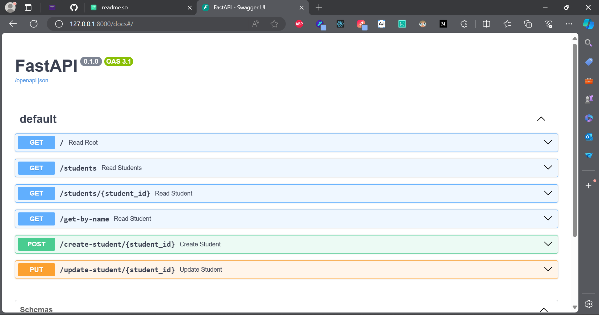
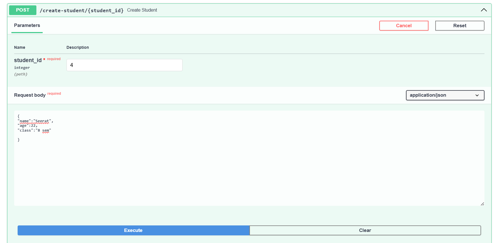

# FastAPI


## Table of Contents

- [Introduction](#introduction)
- [Features](#features)
- [Installation](#installation)
- [Making First API](#making-first-api)
    - [GET Method](#get-method)
    - [Running Server and calling API](#running-server-and-calling-api)
- [Path Parameters](#pata-parameters)
- [Query Parameters](#query-parameters)
- [POST Method](#post-method)
- [PUT Method](#put-method)
- [Additional Content](#additional-content)
    - [Swagger UI](#swagger-ui)

## Introduction
FastAPI is a modern, web-framework for building APIs with Python.
It uses python 3.7+
## Features

1. **Speed ⚡:** FastAPI is built on top of Starlette,  a lightweight ASGI framework. It's designed for high performance and handles thousands of requests per second .
2. **Easy to use 😃:** FastAPI is designed to be intuitive and easy to use, especially for developers familiar with Python. It uses standard Python type hints for request and response validation, making it easy to understand and write code. 
3. **Automatic Interactive API Documentation generation 🤩:**  FastAPI automatically generates interactive API documentation (Swagger UI or ReDoc) based on your code and type annotations. Swagger UI also allows you to test API endpoints.
4. **Asynchronous Support 🔁:** FastAPI fully supports asynchronous programming, allowing you to write asynchronous code with async/await syntax. This enables handling high-concurrency scenarios and improves overall performance.    

Now, lets get hands-on with FastAPI.


## Installation

Make sure that you have python version 3.7 or greater. 

Then, simply open your command shell and give the following command.

```bash
  pip install fastapi
```
After this, you need to install uvicorn. uvicorn is an ASGI server on which we will be running our API.

```bash
  pip install uvicorn
```


    
## Making First API

After successful installation we will be moving towards making an API and seeing how to use it. 

Firstly, the first thing in an API is its root/index page which is sent as response when API is called.

Follow the given steps to make your first FastAPI🫨

First, lets import FastAPI to get things started. 

```python
from fastapi import FastAPI
app = FastAPI()
```
Now, we will write the ``GET`` method for the root of the API. As you have already seen, the GET method is  ``HTTP request`` method used to fetch data from a source. In web development, it is primarily used to *retrieve data* from server.

The root of the app is ``"/"`` When the API will be called, response will be generated by on this url: ```localhost:8000```

### GET method
Following is the code to write GET method which will be calling API.

When the API is called, the ``read_root()`` function will be hit and the JSON response will be returned which will be shown on your web browser.

```python
@app.get("/")
def read_root():
    return {"Hello": "World"}

```

Tadaaa! you have made your first FastAPI! Now lets run it!

### Running Server and calling API

Open your terminal and give following command:
```bash
uvicorn myapi:app --reload
```
Here, ``myapi`` is the name of your API which is name of your python file. ``app`` is the name you have given to your API in assignment ``app = FastAPI()``

After running this command, uvicorn server will be live and you can access your API.

As right now we have only written root ``GET`` method, only its corresponding response will be displayed.

On running this API, we get the response in JSON form:

```json
{
    "Hello": "World"
}
```
## Path Parameters
Path parameters are a way to send variables to an API endpoint so that an operation may be perfomed on it. 

This feature is particularly useful for defining routes that need to operate on resources identified by unique identifiers, such as user IDs, product IDs, or any other unique value.

### Example
Lets take an example to make it understandable.


Assume that we have some Students 🧑‍🎓 in our class and we have saved their data in form of dictionary in our API (in practical scenarios they will be saved in a database and API will query database). 
So we have a student dictionary that looks something like this:

```python
students = {
    1: {
        "name": "John",
        "age": 17,
        "class": "year 12"
        },
    2: {
        "name": "Jane",
        "age": 16,
        "class": "year 11"
        },
    3: {
        "name": "Alice",
        "age": 17,
        "class": "year 12"
        }
}
```
Here, keys are ``student_id``.

Let's say user wants the data of the student whose ID is 2. Here, we will take ID as **path parameter** from the user and return the data of that ID.


Lets see how it will be done!

```python
@app.get("/students/{student_id}")
def read_student(student_id: int):
    return students[student_id]
```
Here is the explanatory breakdown of the method:

- ``/students`` is the URL of students endpoint in API.
- ``{student_id}`` is the path parameter, which is a dynamic variable the user will give to fetch the record of a particular student.
- ``def read_student(student_id: int)`` is the signature of function which takes the student_id we got from path parameter. Its type is defined as ``int`` as our ID will be an integer.
**Note that there will be automatic type checking of the parameter. If it is not same as type defined in method, an Error response ⛔ will be generated.** 

- ``return students[student_id]`` will return the data of required student from dictionary.

When the user passes the URL ``http://127.0.0.1:8000/students/1`` the data of student with student_id=1 is fetched and displayed.
In this case following output will be displayed:

```json
{
    "name": "John",
    "age": 17,
    "class": "year 12"
}
```

## Query Parameters
Query parameters in FastAPI allow you to pass data to your API endpoints via the URL's query string. This is useful for filtering, searching, and other operations that do not fit well with the path parameters.

Query parameters are specified after the ``?`` symbol in the URL and are typically used for optional parameters.

### Example
Lets continue the example of students to understand the query parameters.

Assume that we want to search students by name. In this case, we will be sending datat in query parameter which will be read by our method and respective  result will be returned.

Lets see the method:

```python
@app.get("/get-by-name")
def read_student(name: str):
    for student_id in students:
        if students[student_id]["name"] == name:
            return students[student_id]
    return {"Error": "Student not found"}
```
Here is the explanatory breakdown of this process:
 
- ``/get-by-name`` is the URL of the endpoint. After this URL, client will enter the query parameter(s).
- ``http://127.0.0.1:8000/get-by-name?name=Jane`` In this URL, ``name=Jane`` is the query parameter. It means that user needs to search the student whose name is Jane. When you hit this URL, ``read_student(name:str)`` method is called and  respective response is returned.

In this case, the output will be:
```json
{
    "name": "Jane",
    "age": 16,
    "class": "year 11"
}
```
If we pass a name that doesn't exist in dictionary, Error response will be returned.

## POST Method
The ``POST`` method in FastAPI is used to **create resources** or submit data to an API endpoint. This method typically involves sending data in the request body, which the server processes to create or modify resources.

**⛔ In case of ``GET`` method, sent data is part of URL, but in case of ``POST`` metohod, sent data is part of request body.** 

### Example
Again continuing with the example of student. Now, lets assume we need to add student. Following is the ``POST`` method to do this:

```python 
@app.post("/create-student/{student_id}")
def create_student(student_id: int, student: dict):
    if student_id in students:
        return {"Error": "Student exists"}
    students[student_id] = student
    return students 
```
Here is the explanation of process:

-  ``/create-student/{student_id}`` shows that only student_id will be part of URL, rest of the data will be sent in request body.
- Data in the request body will be in JSON format and will be received in ``student: dict``
- Data sent in JSON format is given as:
```json
{
"name":"Seerat", 
"age":22, 
"class":"8 sem"

}
```
*Note:* I have used Swagger UI to send data in request body to test my ``POST`` method but you may use any other API tesing tool like Postman etc.

- This new student will be added in the dictionary, and if operation is  successful, new dictionary will be returned as response. 

Following is the output of this ``POST`` method call:

```json
{
  "1": {
    "name": "John",
    "age": 17,
    "class": "year 12"
  },
  "2": {
    "name": "Jane",
    "age": 16,
    "class": "year 11"
  },
  "3": {
    "name": "Alice",
    "age": 17,
    "class": "year 12"
  },
  "4": {
    "name": "Seerat",
    "age": 22,
    "class": "8 sem"
  }
}
```

## PUT Method
The ``PUT`` method in FastAPI is used to **update** existing resources or create resources if they do not already exist. It is one of the standard HTTP methods and is idempotent, meaning that multiple identical requests should have the same effect as a single request.

### Example
Let's update the record of a student.

```python
@app.put("/update-student/{student_id}")
def update_student(student_id: int, student: dict):
    if student_id not in students:
        return {"Error": "Student does not exist"}
    students[student_id] = student
    return students
```
``PUT`` method is nearly same as ``POST`` method but ``PUT`` is indempotent while ``POST`` is not.

The given method will update an existing student record and if student doesnt exist, it'll send error response.

## Additional Content

### Swagger UI

Swagger UI automatically generates UI for API tesing. Just write ``/docs`` with the URL and UI mode of Swagger UI will be launched.

Following Screenshot shows the Swagger UI


Here is how I tested ``POST`` method in UI:


That's all for FastAPI for now.... Happy Learning! 
