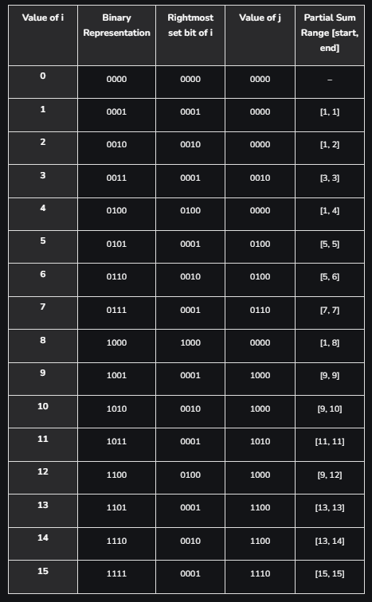

# Fenwick Tree

Fenwick Tree is one of the advanced data structure which is used in competitive programming. It is also known as `Binary Indexed Tree`. It is used to calculate range queries along with updating the elements of the array, such that each query or update take logarithmic time complexity.

>Range Queries: 
Given an array of numbers, the array range query problem is to build a data structure that can efficiently answer queries of a particular type mentioned in terms of an interval of the indices.
The specific query can be of type – maximum element in the given range, most frequent element in the given range or queries like these.

## Importance of Fenwick tree:

Let's see the importance of Fenwick trees with a problem. Consider an array of size N and Q queries. There are two types of queries:

- **Type-1**: We are given two integers L and R, we need to calculate the sum of elements in range L to R.
- **Type-2**: We are given two integers I and X, we need to update the element at index I to X.

Now, if we try this problem using brute force methodology, then we do the following tasks:

- **For Type-1**: We iterate through the indices from L to R and compute the sum of elements in the range.
- **For Type-2**: We assign the value X to the index I.

Suppose there are large numbers of Type-1 queries. Then the Time Complexity is huge. The worst case Time Complexity is `O(Q*N)`.

To overcome this issue, we use Fenwick trees. We can guarantee a log(N) time for both the type of queries. The Time Complexity will be `O(Q*log(N))`.

## Fenwick Tree Implementation:

Consider Fenwick tree as an array F[] with 1-based indexing, such that every index of array stores Partial Sum of range. For simplicity, assume the size of F[] to be 16. Now, if we have queries to calculate the range sum in an array. So, for any index i, F[i] will store the sum of values from index j+1 to i, such that j = i – (rightmost set bit of i). Refer to the below table to understand the range of values:



So, from the above table we can see that each index of Fenwick tree F[] stores the sum of range. Now, if we need to calculate the prefix sum till 7th element, then instead of iterating from 1 to 7 and calculating the sum, we can take the sum of F[7] + F[6] + F[4]. Similarly, to calculate the prefix sum till 13th element, we can take the sum of F[13] + F[12] + F[8] to get the prefix sum. So, in other words if we want to calculate the prefix sum till ith element, we can add elements of array F[] present at indices which are obtained by removing the last set bit of i, one by one.

>For Example:
Prefix Sum till 7th element = F[7] + F[6] + F[4]

7 –remove right most set bit –> 6 –remove right most set bit –> 4 –remove right most set bit –> 0

Since, we are storing Partial Sums of range in the Fenwick Tree F[], then updating an element at index i in the original array should reflect in all those indices of F[] which have index i in their partial sum range. For eg: if we want to update the element at index 5 in the original array, then it should reflect in F[5], F[6] and F[8] because F[5] stores the partial sum of range [5, 5], F[6] stores the partial sum of range [5, 6] and F[8] stores the partial sum of range [1, 8] and 5 lies in the range of all of them.

>For Example:
Add X to 5th index, means adding X to F[5], F[6] and F[8]

5 –add right most set bit –> 6 –add right most set bit –> 8 — add right most set bit –> 16 (out of range)

In both of the above operations, we need to add or subtract the right most set bit. We can use the following formula to find the right most set bit.


## Code Implementation of Fenwick Tree: 
```Python

def sum(idx, F):
    running_sum = 0
    while idx > 0:
        running_sum += F[idx]
        right_most_set_bit = (idx & -idx)
        idx -= right_most_set_bit
    return running_sum

def add(idx, X, F):
    while idx < len(F):
        F[idx] += X
        right_most_set_bit = (idx & -idx)
        idx += right_most_set_bit

def range_query(l, r, F):
    return sum(r, F) - sum(l - 1, F)

def main():
    n = 5

    # 1-based indexing
    arr = [-1e9, 1, 2, 3, 4, 5]
    # Initially, all the values of Fenwick tree are 0
    F = [0] * (n + 1)

    # Build the Fenwick tree
    for i in range(1, n + 1):
        add(i, arr[i], F)

    # Query the sum from index 1 to 3
    print(range_query(1, 3, F))
    # Query the sum from index 2 to 5
    print(range_query(2, 5, F))

    # Update element at index i to X
    i = 3
    X = 7
    # We have passed X - arr[i] to the add method because
    # the add method simply adds a number at a particular index.
    # If we need to update the element, we need to pass
    # the difference between the ith element and X to the add
    # method.
    add(i, X - arr[i], F)

    # Query the sum from index 1 to 3
    print(range_query(1, 3, F))
    # Query the sum from 2 to 5
    print(range_query(2, 5, F))

if __name__ == "__main__":
    main()

```

# Segment Tree:

Segment Tree, similar to Fenwick Tree,  is a data structure that stores data about range of elements in nodes as a tree. It is mostly used to handle range queries with updates in an efficient manner. For example, we can perform a range summation of an array between the range L to R while also modifying the array from range L to R all in log(N) time complexity.

## Structure of the Tree
The segment tree works on the principle of divide and conquer. 

At each level, we divide the array segments into two parts. If the given array had [0, . . ., N-1] elements in it then the two parts of the array will be [0, . . ., N/2-1] and [N/2, . . ., N-1]. 
We will then recursively go on until the lower and upper bounds of the range become equal. 
The structure of the segment tree looks like a binary tree.
The segment tree is generally represented using an array where the first value stores the value for the total array range and the child of the node at the ith index are at (2*i + 1) and (2*i + 2).

## Constructing the segment tree:
There are two important points to be noted while constructing the segment tree:

- Choosing what value to be stored in the nodes according to the problem definition
- What should the merge operation do

If the problem definition states that we need to calculate the sum over ranges, then the value at nodes should store the sum of values over the ranges.

- The child node values are merged back into the parent node to hold the value for that particular range, [i.e., the range covered by all the nodes of its subtree]. 
- In the end, leaf nodes store information about a single element. All the leaf nodes store the array based on which the segment tree is built. 

Following are the steps for constructing a segment tree:

1. Start from the leaves of the tree
2. Recursively build the parents from the merge operation

The merge operation will take constant time if the operator takes constant time. SO building the whole tree takes O(N) time.

## Range Query
Let us understand this with the help of the following problem

Given two integers L and R return the sum of the segment [L, R]

The first step is constructing the segment tree with the addition operator and 0 as the neutral element. 

- If the range is one of the node’s range values then simply return the answer.
- Otherwise, we will need to traverse the left and right children of the nodes and recursively continue the process till we find a node that covers a range that totally covers a part or whole of the range [L, R]
- While returning from each call, we need to merge the answers received from each of its child.

As the height of the segment tree is logN the query time will be O(logN) per query.

## Point Updates
Given an index,  idx, update the value of the array at index idx with value V

The element’s contribution is only in the path from its leaf to its parent. Thus only logN elements will get affected due to the update.

For updating, traverse till the leaf that stores the value of index idx and update the value. Then while tracing back in the path, modify the ranges accordingly. 

The time complexity will be O(logN).

## Code Implementation of Segment Tree:

```python
# python3 code for segment tree with sum
# range and update query
A = []
ST = []


def build(node, L, R):
	global A, ST

	# Leaf node where L == R
	if (L == R):
		ST[node] = A[L]

	else:

		# Find the middle element to
		# split the array into two halves
		mid = (L + R) // 2

		# Recursively travel the
		# left half
		build(2 * node, L, mid)

		# Recursively travel the
		# right half
		build(2 * node + 1, mid + 1, R)

		# Storing the sum of both the
		# children into the parent
		ST[node] = ST[2 * node] + ST[2 * node + 1]


def update(node, L, R, idx, val):
	global A, ST

	# Find the lead node and
	# update its value
	if (L == R):
		A[idx] += val
		ST[node] += val

	else:

		# Find the mid
		mid = (L + R) // 2

		# If node value idx is at the
		# left part then update
		# the left part
		if (L <= idx and idx <= mid):
			update(2 * node, L, mid, idx, val)
		else:
			update(2 * node + 1, mid + 1, R, idx, val)

		# Store the information in parents
		ST[node] = ST[2 * node] + ST[2 * node + 1]


def query(node, tl, tr, l, r):
	global A, ST

	# If it lies out of range then
	# return 0
	if (r < tl or tr < l):
		return 0

	# If the node contains the range then
	# return the node value
	if (l <= tl and tr <= r):
		return ST[node]
	tm = (tl + tr) // 2

	# Recursively traverse left and right
	# and find the node
	return query(2 * node, tl, tm, l, r) + query(2 * node + 1, tm + 1, tr, l, r)


# Driver code
if __name__ == "__main__":

	n = 6
	A = [0, 1, 3, 5, -2, 3]

	# Create a segment tree of size 4*n
	ST = [0 for _ in range(4 * n)]

	# Build a segment tree
	build(1, 0, n - 1)
	print(f"Sum of values in range 0-4 are: {query(1, 0, n - 1, 0, 4)}")

	# Update the value at idx = 1 by
	# 100 ths becoming 101
	update(1, 0, n - 1, 1, 100)
	print("Value at index 1 increased by 100")
	print(f"sum of value in range 1-3 are: {query(1, 0, n - 1, 1, 3)}")


```