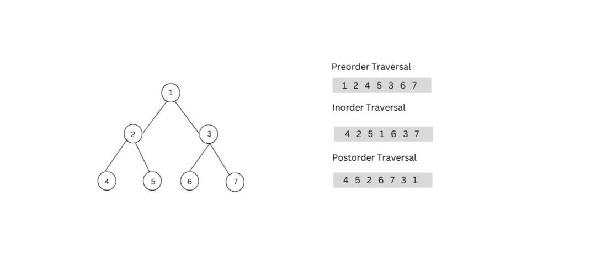
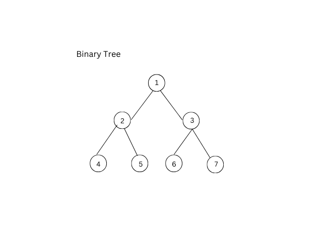
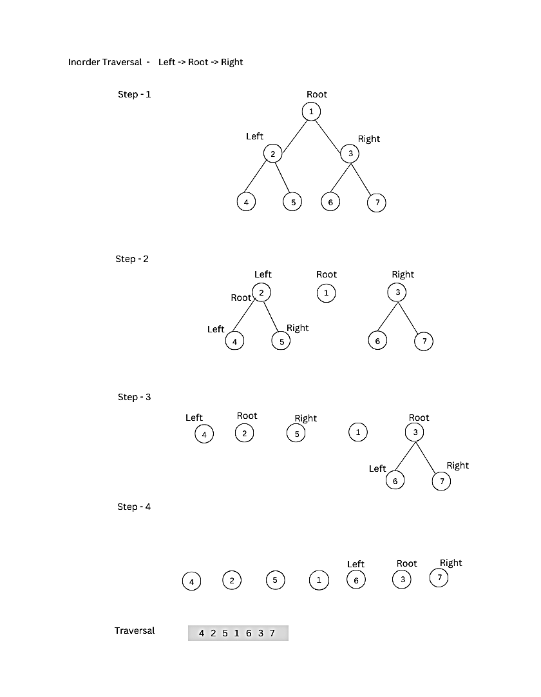
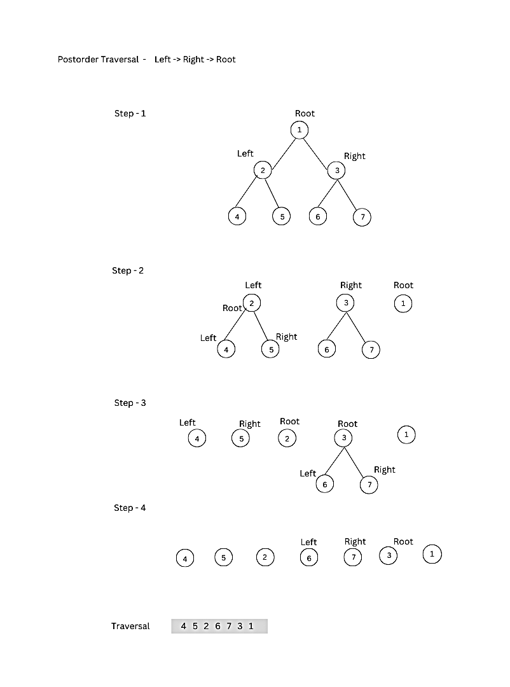

# Tree Traversal Algorithms

Tree Traversal refers to the process of visiting or accessing each node of the tree exactly once in a certain order. Tree traversal algorithms help us to visit and process all the nodes of the tree. Since tree is not a linear data structure, there are multiple nodes which we can visit after visiting a certain node. There are multiple tree traversal techniques which decide the order in which the nodes of the tree are to be visited.


A Tree Data Structure can be traversed in following ways:
 - **Level Order Traversal or Breadth First Search or BFS**
 - **Depth First Search or DFS**
     - Inorder Traversal
     - Preorder Traversal
     - Postorder Traversal
       
  

 
  
## Binary Tree Structure
  Before diving into traversal techniques, let's define a simple binary tree node structure:

)
  
  ```python
class Node:
   def __init__(self, key):
      self.leftChild = None
      self.rightChild = None
      self.data = key

# Main class
if __name__ == "__main__":
   root = Node(1)
   root.leftChild = Node(2)
   root.rightChild = Node(3)
   root.leftChild.leftChild = Node(4)
   root.leftChild.rightChild = Node(5)
   root.rightChild.leftChild = Node(6)
   root.rightChild.rightChild = Node(6)
```

## Level Order Traversal
When the nodes of the tree are wrapped in a level-wise mode from left to right, then it represents the level order traversal. We can use a queue data structure to execute a level order traversal.

### Algorithm
  - Create an empty queue Q
  - Enqueue the root node of the tree to Q
  - Loop while Q is not empty
      - Dequeue a node from Q and visit it
      - Enqueue the left child of the dequeued node if it exists
      - Enqueue the right child of the dequeued node if it exists
   
### code for level order traversal in python
```python
def printLevelOrder(root):
    if root is None:
        return

    # Create an empty queue
    queue = []

    # Enqueue Root and initialize height
    queue.append(root)

    while(len(queue) > 0):

        # Print front of queue and
        # remove it from queue
        print(queue[0].data, end=" ")
        node = queue.pop(0)

        # Enqueue left child
        if node.left is not None:
            queue.append(node.left)

        # Enqueue right child
        if node.right is not None:
            queue.append(node.right)
```

**output**

` Inorder traversal of binary tree is  : 
1 2 3 4 5 6 7 `


## Depth First Search
When we do a depth-first traversal, we travel in one direction up to the bottom first, then turn around and go the other way. There are three kinds of depth-first traversals.

## 1. Inorder Traversal

In this traversal method, the left subtree is visited first, then the root and later the right sub-tree. We should always remember that every node may represent a subtree itself.

`Note :` If a binary search tree is traversed in-order, the output will produce sorted key values in an ascending order.



**The order:**  Left -> Root -> Right

### Algorithm
  - Traverse the left subtree.
  - Visit the root node.
  - Traverse the right subtree.

### code for inorder traversal in python
```python
def printInorder(root):
    if root:
        # First recur on left child
        printInorder(root.left)

        # Then print the data of node
        print(root.val, end=" "),

        # Now recur on right child
        printInorder(root.right)
```

**output**

` Inorder traversal of binary tree is  : 
4 2 5 1 6 3 7 `


## 2. Preorder Traversal

In this traversal method, the root node is visited first, then the left subtree and finally the right subtree.

)

**The order:**  Root -> Left -> Right

### Algorithm
  - Visit the root node.
  - Traverse the left subtree.
  - Traverse the right subtree.

### code for preorder traversal in python
```python
def printPreorder(root):
    if root:
        # First print the data of node
        print(root.val, end=" "),

        # Then recur on left child
        printPreorder(root.left)

        # Finally recur on right child
        printPreorder(root.right)
```

**output**

` Inorder traversal of binary tree is  : 
1 2 4 5 3 6 7 `

## 3. Postorder Traversal

In this traversal method, the root node is visited last, hence the name. First we traverse the left subtree, then the right subtree and finally the root node.



**The order:**  Left -> Right -> Root

### Algorithm
  - Traverse the left subtree.
  - Traverse the right subtree.
  - Visit the root node.

### code for postorder traversal in python
```python
def printPostorder(root):
    if root:
        # First recur on left child
        printPostorder(root.left)

        # The recur on right child
        printPostorder(root.right)

        # Now print the data of node
        print(root.val, end=" ")
```

**output**

` Inorder traversal of binary tree is  : 
4 5 2 6 7 3 1 `


## Complexity Analysis
 - **Time Complexity:** All three tree traversal methods (Inorder, Preorder, and Postorder) have a time complexity of `𝑂(𝑛)`, where 𝑛 is the number of nodes in the tree.
 - **Space Complexity:** The space complexity is influenced by the recursion stack. In the worst case, the depth of the recursion stack can go up to `𝑂(ℎ)`, where ℎ is the height of the tree.


 
