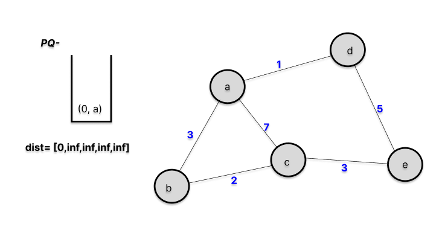
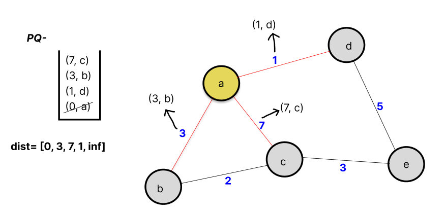
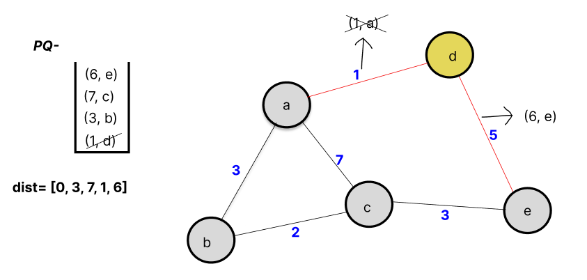
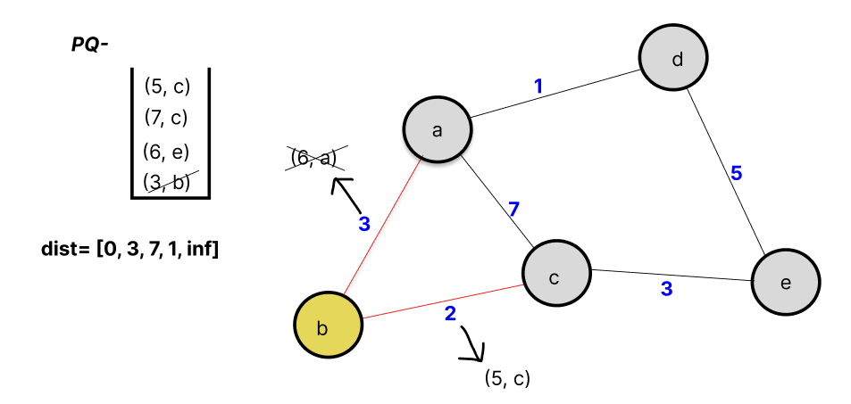
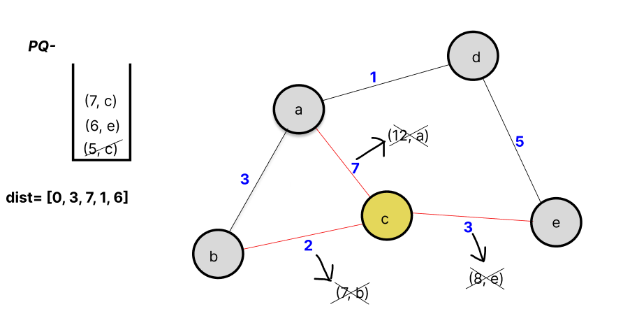
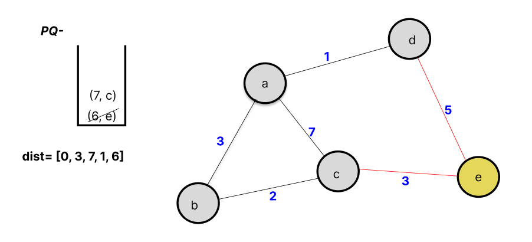
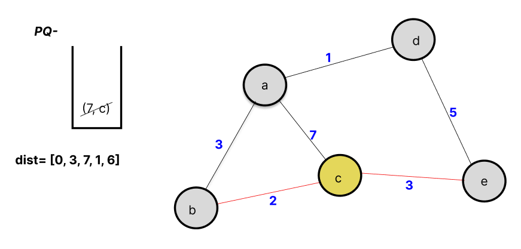

# Dijkstra's Algorithm
Dijkstra's algorithm is a graph algorithm that gives the shortest distance of each node from the given node in a weighted, undirected graph. It operates by continually choosing the closest unvisited node and determining the distance to all its unvisited neighboring nodes. This algorithm is similar to BFS in graphs, with the difference being it gives priority to nodes with shorter distances by using a priority queue(min-heap) instead of a FIFO queue. The data structures required would be a distance list (to store the minimum distance of each node), a priority queue or a set, and we assume the adjacency list will be provided.

## Working
- We will store the minimum distance of each node in the distance list, which has a length equal to the number of nodes in the graph. Thus, the minimum distance of the 2nd node will be stored in the 2nd index of the distance list. We initialize the list with the maximum number possible, say infinity.
 
- We now start the traversal from the starting node given and mark its distance as 0. We push this node to the priority queue along with its minimum distance, which is 0, so the structure pushed will be (0, node), a tuple.
  
- Now, with the help of the adjacency list, we will add the neighboring nodes to the priority queue with the distance equal to (edge weight + current node distance), and this should be less than the distance list value. We will also update the distance list in the process.

- When all the nodes are added, we will select the node with the shortest distance and repeat the process.

## Dry Run
We will now do a manual simulation using an example graph given. First, (0, a) is pushed to the priority queue (pq).


- **Step1:** The lowest element is popped from the pq, which is (0, a), and all its neighboring nodes are added to the pq while simultaneously checking the distance list. Thus (3, b), (7, c), (1, d) are added to the pq.


- **Step2:** Again, the lowest element is popped from the pq, which is (1, d). It has two neighboring nodes, a and e, from which  
  (0 + 1, a) will not be added to the pq as dist[a] = 0 is less than 1.


- **Step3:** Now, the lowest element is popped from the pq, which is (3, b). It has two neighboring nodes, a and c, from which  
  (0 + 1, a) will not be added to the pq. But the new distance to reach c is 5 (3 + 2), which is less than dist[c] = 7. So (5, c) is added to the pq.


- **Step4:** The next smallest element is (5, c). It has neighbors a and e. The new distance to reach a will be 5 + 7 = 12, which is more than dist[a], so it will not be considered. Similarly, the new distance for e is 5 + 3 = 8, which again will not be considered. So, no new tuple has been added to the pq.


-  **Step5:** Similarly, both the elements of the pq will be popped one by one without any new addition.



- The distance list we get at the end will be our answer.
- `Output` `dist=[1, 3, 7, 1, 6]`

## Python Code
```python
import heapq

def dijkstra(graph, start):
    # Create a priority queue
    pq = []
    heapq.heappush(pq, (0, start))
    
    # Create a dictionary to store distances to each node
    dist = {node: float('inf') for node in graph}
    dist[start] = 0
    
    while pq:
        # Get the node with the smallest distance
        current_distance, current_node = heapq.heappop(pq)
        
        # If the current distance is greater than the recorded distance, skip it
        if current_distance > dist[current_node]:
            continue
        
        # Update the distances to the neighboring nodes
        for neighbor, weight in graph[current_node].items():
            distance = current_distance + weight
            # Only consider this new path if it's better
            if distance < dist[neighbor]:
                dist[neighbor] = distance
                heapq.heappush(pq, (distance, neighbor))
    
    return dist

# Example usage:
graph = {
    'A': {'B': 1, 'C': 4},
    'B': {'A': 1, 'C': 2, 'D': 5},
    'C': {'A': 4, 'B': 2, 'D': 1},
    'D': {'B': 5, 'C': 1}
}

start_node = 'A'
dist = dijkstra(graph, start_node)
print(dist)
```

## Complexity Analysis

- **Time Complexity**: \(O((V + E) log V)\)
- **Space Complexity**: \(O(V + E)\)


  
