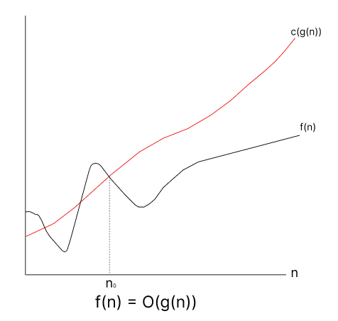
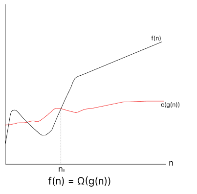
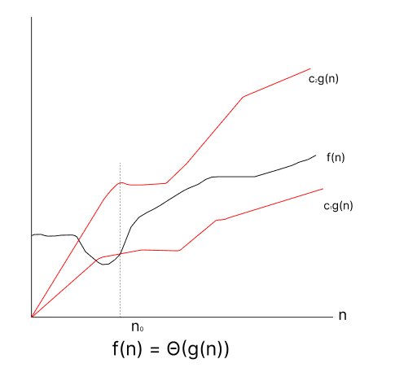

# Time and Space Complexity

We can solve a problem using one or more algorithms. It's essential to learn how to compare the performance of different algorithms and select the best one for a specific task.

Therefore, it is highly required to use a method to compare the solutions in order to judge which one is more optimal.

The method must be:

- Regardless of the system or its settings on which the algorithm is executing.
- Demonstrate a direct relationship with the quantity of inputs.
- Able to discriminate between two methods with clarity and precision.

Two such methods use to analyze algorithms are `time complexity` and `space complexity`.

## What is Time Complexity?

The _number of operations an algorithm performs in proportion to the quantity of the input_ is measured by time complexity. It facilitates our investigation of how the performance of the algorithm scales with increasing input size. But in real life, **_time complexity does not refer to the time taken by the machine to execute a particular code_**.

## Order of Growth and Asymptotic Notations

The Order of Growth explains how an algorithm's space or running time expands as the amount of the input does. This increase is described via asymptotic language, such Big O notation, which concentrates on the dominating term as the input size approaches infinity and is independent of lower-order terms and machine-specific constants.

### Common Asymptotic Notation

1. `Big Oh (O)`: Provides the worst-case scenario for describing the upper bound of an algorithm's execution time.
2. `Big Omega (Ω)`: Provides the best-case scenario and describes the lower bound.
3. `Big Theta (Θ)`: Gives a tight constraint on the running time by describing both the upper and lower bounds.

### 1. Big Oh (O) Notation

Big O notation describes how an algorithm behaves as the input size gets closer to infinity and provides an upper bound on the time or space complexity of the method. It helps developers and computer scientists to evaluate the effectiveness of various algorithms without regard to the software or hardware environment.

To denote asymptotic upper bound, we use O-notation. For a given function `g(n)`, we denote by `O(g(n))` (pronounced "big-oh of g of n") the set of functions:

$$
O(g(n)) = \{ f(n) : \exists \text{ positive constants } c \text{ and } n_0 \text{ such that } 0 \leq f(n) \leq c \cdot g(n) \text{ for all } n \geq n_0 \}
$$

Graphical representation of Big Oh:



### 2. Big Omega (Ω) Notation

Big Omega (Ω) notation is used to describe the lower bound of an algorithm's running time. It provides a way to express the minimum time complexity that an algorithm will take to complete. In other words, Big Omega gives us a guarantee that the algorithm will take at least a certain amount of time to run, regardless of other factors.

To denote asymptotic lower bound, we use Omega-notation. For a given function `g(n)`, we denote by `Ω(g(n))` (pronounced "big-omega of g of n") the set of functions:

$$
\Omega(g(n)) = \{ f(n) : \exists \text{ positive constants } c \text{ and } n_0 \text{ such that } 0 \leq c \cdot g(n) \leq f(n) \text{ for all } n \geq n_0 \}
$$

Graphical representation of Big Omega:



### 3. Big Theta (Θ) Notation

Big Theta (Θ) notation provides a way to describe the asymptotic tight bound of an algorithm's running time. It offers a precise measure of the time complexity by establishing both an upper and lower bound, indicating that the running time of an algorithm grows at the same rate as a given function, up to constant factors.

To denote asymptotic tight bound, we use Theta-notation. For a given function `g(n)`, we denote by `Θ(g(n))` (pronounced "big-theta of g of n") the set of functions:

$$
\Theta(g(n)) = \{ f(n) : \exists \text{ positive constants } c_1, c_2, \text{ and } n_0 \text{ such that } 0 \leq c_1 \cdot g(n) \leq f(n) \leq c_2 \cdot g(n) \text{ for all } n \geq n_0 \}
$$

Graphical representation of Big Theta:



## Best Case, Worst Case and Average Case

### 1. Best-Case Scenario:

The best-case scenario refers to the situation where an algorithm performs optimally, achieving the lowest possible time or space complexity. It represents the most favorable conditions under which an algorithm operates.

#### Characteristics:

- Represents the minimum time or space required by an algorithm to solve a problem.
- Occurs when the input data is structured in such a way that the algorithm can exploit its strengths fully.
- Often used to analyze the lower bound of an algorithm's performance.

#### Example:

Consider the `linear search algorithm` where we're searching for a `target element` in an array. The best-case scenario occurs when the target element is found `at the very beginning of the array`. In this case, the algorithm would only need to make one comparison, resulting in a time complexity of `O(1)`.

### 2. Worst-Case Scenario:

The worst-case scenario refers to the situation where an algorithm performs at its poorest, achieving the highest possible time or space complexity. It represents the most unfavorable conditions under which an algorithm operates.

#### Characteristics:

- Represents the maximum time or space required by an algorithm to solve a problem.
- Occurs when the input data is structured in such a way that the algorithm encounters the most challenging conditions.
- Often used to analyze the upper bound of an algorithm's performance.

#### Example:

Continuing with the `linear search algorithm`, the worst-case scenario occurs when the `target element` is either not present in the array or located `at the very end`. In this case, the algorithm would need to iterate through the entire array, resulting in a time complexity of `O(n)`, where `n` is the size of the array.

### 3. Average-Case Scenario:

The average-case scenario refers to the expected performance of an algorithm over all possible inputs, typically calculated as the arithmetic mean of the time or space complexity.

#### Characteristics:

- Represents the typical performance of an algorithm across a range of input data.
- Takes into account the distribution of inputs and their likelihood of occurrence.
- Provides a more realistic measure of an algorithm's performance compared to the best-case or worst-case scenarios.

#### Example:

For the `linear search algorithm`, the average-case scenario considers the probability distribution of the target element's position within the array. If the `target element is equally likely to be found at any position in the array`, the average-case time complexity would be `O(n/2)`, as the algorithm would, on average, need to search halfway through the array.

## Space Complexity

The memory space that a code utilizes as it is being run is often referred to as space complexity. Additionally, space complexity depends on the machine, therefore rather than using the typical memory units like MB, GB, etc., we will express space complexity using the Big O notation. 

#### Examples of Space Complexity

1. `Constant Space Complexity (O(1))`: Algorithms that operate on a fixed-size array or use a constant number of variables have O(1) space complexity.
2. `Linear Space Complexity (O(n))`: Algorithms that store each element of the input array in a separate variable or data structure have O(n) space complexity.
3. `Quadratic Space Complexity (O(n^2))`: Algorithms that create a two-dimensional array or matrix with dimensions based on the input size have O(n^2) space complexity.

#### Analyzing Space Complexity

To analyze space complexity:

- Identify the variables, data structures, and recursive calls used by the algorithm.
- Determine how the space requirements scale with the input size.
- Express the space complexity using Big O notation, considering the dominant terms that contribute most to the overall space usage.

## Examples to calculate time and space complexity

#### 1. Print all elements of given array

Consider each line takes one unit of time to run. So, to simply iterate over an array to print all elements it will take `O(n)` time, where n is the size of array.

Code:

```python
arr = [1,2,3,4] #1
for x in arr:   #2
    print(x)    #3
```

Here, the 1st statement executes only once. So, it takes one unit of time to run. The for loop consisting of 2nd and 3rd statements executes 4 times.  
Also, as the code dosen't take any additional space except the input arr its Space Complexity is O(1) constant.

#### 2. Linear Search

Linear search is a simple algorithm for finding an element in an array by sequentially checking each element until a match is found or the end of the array is reached. Here's an example of calculating the time and space complexity of linear search:

```python
def linear_search(arr, target):
    for x in arr:     # n iterations in worst case
        if x == target:    # 1
            return True    # 1
    return False    # If element not found

# Example usage
arr = [1, 3, 5, 7, 9]
target = 5
print(linear_search(arr, target))
```

**Time Complexity Analysis**

The for loop iterates through the entire array, which takes O(n) time in the worst case, where n is the size of the array.  
Inside the loop, each operation takes constant time (O(1)).  
Therefore, the time complexity of linear search is `O(n)`.

**Space Complexity Analysis**

The space complexity of linear search is `O(1)` since it only uses a constant amount of additional space for variables regardless of the input size.


#### 3. Binary Search

Binary search is an efficient algorithm for finding an element in a sorted array by repeatedly dividing the search interval in half. Here's an example of calculating the time and space complexity of binary search:

```python
def binary_search(arr, target):
    left = 0                 # 1
    right = len(arr) - 1     # 1
    
    while left <= right:     # log(n) iterations in worst case
        mid = (left + right) // 2     # log(n)
        
        if arr[mid] == target:     # 1
            return mid             # 1
        elif arr[mid] < target:    # 1
            left = mid + 1         # 1
        else:
            right = mid - 1        # 1
    
    return -1  # If element not found

# Example usage
arr = [1, 3, 5, 7, 9]
target = 5
print(binary_search(arr, target))
```

**Time Complexity Analysis**

The initialization of left and right takes constant time (O(1)).  
The while loop runs for log(n) iterations in the worst case, where n is the size of the array.  
Inside the loop, each operation takes constant time (O(1)).  
Therefore, the time complexity of binary search is `O(log n)`.

**Space Complexity Analysis**

The space complexity of binary search is `O(1)` since it only uses a constant amount of additional space for variables regardless of the input size.

#### 4. Fibbonaci Sequence

Let's consider an example of a function that generates Fibonacci numbers up to a given index and stores them in a list. In this case, the space complexity will not be constant because the size of the list grows with the Fibonacci sequence.

```python
def fibonacci_sequence(n):
    fib_list = [0, 1]  # Initial Fibonacci sequence with first two numbers
    
    while len(fib_list) < n:  # O(n) iterations in worst case
        next_fib = fib_list[-1] + fib_list[-2]  # Calculating next Fibonacci number
        fib_list.append(next_fib)  # Appending next Fibonacci number to list
    
    return fib_list

# Example usage
n = 10
fib_sequence = fibonacci_sequence(n)
print(fib_sequence)
```

**Time Complexity Analysis**

The while loop iterates until the length of the Fibonacci sequence list reaches n, so it takes `O(n)` iterations in the `worst case`.Inside the loop, each operation takes constant time (O(1)).

**Space Complexity Analysis**

The space complexity of this function is not constant because it creates and stores a list of Fibonacci numbers.  
As n grows, the size of the list also grows, so the space complexity is O(n), where n is the index of the last Fibonacci number generated.
