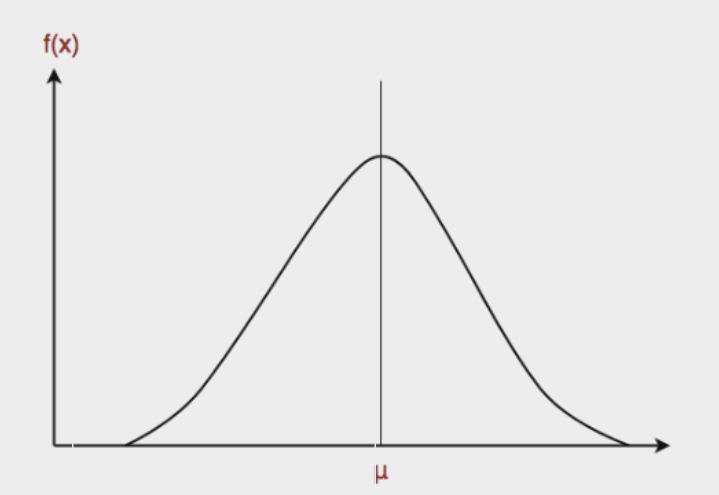
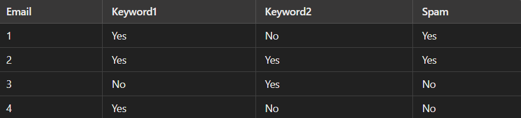
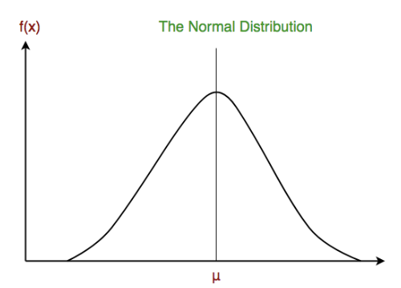
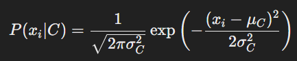
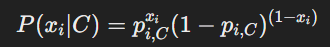

# Naive Bayes classifier

A Naive Bayes classifier is a probabilistic machine learning model used for classification tasks. It is based on Bayes' Theorem and assumes that the features (or predictors) are independent of each other given the class. This assumption of independence is called the "naive" assumption, which rarely holds true in real-world data but simplifies the computations involved and often works well in practice.
It is not a single algorithm but a family of algorithms where all of them share a common principle, i.e. every pair of features being classified is independent of each other.

## Bayes’ Theorem:
Bayes’ Theorem finds the probability of an event occurring given the probability of another event that has already occurred. Bayes’ theorem is stated mathematically as the following equation:

P(C|X) = \frac{P(X|C) \cdot P(C)}{P(X)}




where A and B are events and P(B) ≠ 0

* We are trying to find probability of event A, given the event B is true.
* Event B is also termed as evidence.
* P(A) is the priori of A (the prior probability)
* P(B) is Marginal Probability: Probability of Evidence.
* P(A|B) is a posteriori probability of B, i.e. probability of event after evidence is seen.
* P(B|A) is Likelihood probability i.e the likelihood that a hypothesis will come true based on the evidence.

## Steps in Naive Bayes Classification
In the context of a Naive Bayes classifier, we are interested in finding the most probable class for a given instance X with features 
𝑥1, 𝑥2, 𝑥3, ..., 𝑥n.

* Calculate Priors: Calculate the prior probabilities P(C) for each class 𝐶.
* Calculate Likelihoods: Calculate the likelihoods P(𝑥𝑖∣C) for each feature 𝑥𝑖 given each class C.
* Apply Bayes' Theorem: Use Bayes' Theorem to compute the posterior probability for each class given the feature vector.
* Class Prediction: Predict the class with the highest posterior probability.

## Example on Naive Bayes Classifier

Consider a simple example where we want to classify emails as "spam" or "not spam" based on features like the presence of certain keywords.

#### Training Data



##### Calculating Priors:

1. P(Spam)= 2/4=0.5 
2. P(Not Spam)= 2/4=0.5

##### Calculating Likelihoods

1. For Spam:
* 𝑃(Keyword1=Yes ∣ Spam) = 2/2 = 1
* 𝑃(Keyword2=Yes ∣ Spam) = 1/2 = 0.5
2. For Not Spam:
* 𝑃(Keyword1=Yes ∣ Not Spam) = 2/2 = 1
* 𝑃(Keyword2=Yes ∣ Not Spam) = 1/2 = 0.5

##### Applying Bayes' Theorem

For a new email with Keyword1 = Yes and Keyword2 = Yes:

1. Calculate the posterior for Spam:

* P(Spam|Keywords)∝ P(Keywords|Spam) * P(Spam)
* P(Spam|Keywords) ∝ 1.0 * 0.5 * 0.5 = 0.25

2. Calculate the posterior for Not Spam:

* P(Not Spam|Keywords)∝P(Keywords|Not Spam) * P(Not Spam)
* P(Not Spam|Keywords) ∝ 0.5 * 0.5 * 0.5=0.125

P(Spam|Keywords) > P(Not Spam|Keywords), we classify the new email as "Spam".


## Types of Naive Bayes Classifiers:

#### 1. Gaussian Naive Bayes: 
In Gaussian Naive Bayes, continuous values associated with each feature are assumed to be distributed according to a Gaussian distribution. A Gaussian distribution is also called Normal distribution When plotted, it gives a bell shaped curve which is symmetric about the mean of the feature values as shown below:



* Assumption: Each feature follows a Gaussian distribution.
* Formula: The likelihood of the features given the class is computed using the Gaussian (normal) distribution formula:



where 𝜇𝐶 and 𝜎𝐶 are the mean and standard deviation of the feature 𝑥𝑖 for class C.


* Python implementation of Gaussian Naive Bayes classifier using scikit-learn:
```python
from sklearn.datasets import load_iris
iris = load_iris()  # load the iris dataset

X = iris.data #feature matrix
y = iris.target #response matrix

# splitting X and y into training and testing sets
from sklearn.model_selection import train_test_split
X_train, X_test, y_train, y_test = train_test_split(X, y, test_size=0.4, random_state=1)

# training the model on training set
from sklearn.naive_bayes import GaussianNB
gnb = GaussianNB()
gnb.fit(X_train, y_train)

# making predictions on the testing set
y_pred = gnb.predict(X_test)

# comparing actual response values (y_test) with predicted response values (y_pred)
from sklearn import metrics
print("Gaussian Naive Bayes model accuracy(in %):", metrics.accuracy_score(y_test, y_pred)*100)
```
#### 2. Multinomial Naive Bayes: 
Feature vectors represent the frequencies with which certain events have been generated by a multinomial distribution.
Typically used for discrete features, especially for text (or document) classification problems like spam detection, where features represent word counts.
* Assumption: Features represent the number of times events (e.g., words) occur.
* Formula: The likelihood of the features given the class is computed using the multinomial distribution formula:


where n(c,xi) is the count of feature 𝑥𝑖 in class 𝐶, N(C) is the total count of all features in class C, n is the number of features, and 𝛼 is a smoothing parameter.

#### 3. Bernoulli Naive Bayes: 
In the multivariate Bernoulli event model, features are independent booleans (binary variables) describing inputs. Like the multinomial model, this model is popular for document classification tasks, where binary term occurrence(i.e. a word occurs in a document or not) features are used rather than term frequencies(i.e. frequency of a word in the document).
Used for binary/boolean features, where features represent binary occurrences (e.g., word presence/absence in text).
* Assumption: Features are binary (e.g., word presence/absence).
* Formula: The likelihood of the features given the class is computed using the Bernoulli distribution formula:



where 𝑝(𝑖,𝐶) is the probability of feature 𝑥𝑖 being 1 in class C.
## Advantages of Naive Bayes Classifier
* Easy to implement and computationally efficient.
* Effective in cases with a large number of features.
* Performs well even with limited training data.
* It performs well in the presence of categorical features.
* For numerical features data is assumed to come from normal distributions

## Disadvantages of Naive Bayes Classifier
* Assumes that features are independent, which may not always hold in real-world data.
* Can be influenced by irrelevant attributes.
* May assign zero probability to unseen events, leading to poor generalization.

## Applications of Naive Bayes Classifier
* Spam Email Filtering: Classifies emails as spam or non-spam based on features.
* Text Classification: Used in sentiment analysis, document categorization, and topic classification.
* Medical Diagnosis: Helps in predicting the likelihood of a disease based on symptoms.
* Credit Scoring: Evaluates creditworthiness of individuals for loan approval.
* Weather Prediction: Classifies weather conditions based on various factors.

## Conclusion

In conclusion, Naive Bayes classifiers, despite their simplified assumptions, prove effective in various applications, showcasing notable performance in document classification and spam filtering. Their efficiency, speed, and ability to work with limited data make them valuable in real-world scenarios, compensating for their naive independence assumption.

