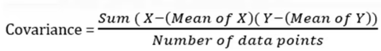
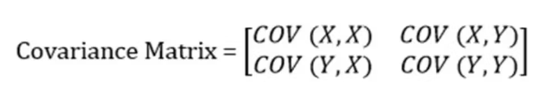
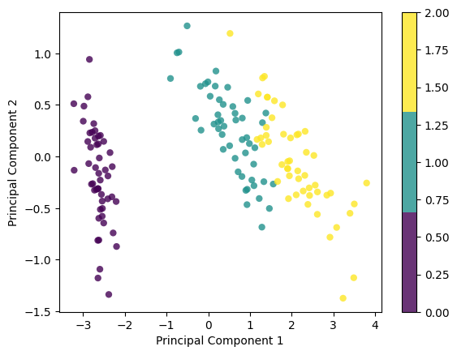

# Principal Component Analysis (PCA)

Principal component analysis (PCA) is a dimensionality reduction and machine learning method used to simplify a large data set into a smaller set while still maintaining significant patterns and trends.
## Feature Extraction
- The basic objective of feature extraction is to extract new features from the existing set of features such that the higher-dimensional dataset with many features can be reduced into a lower-dimensional dataset of these newly created features.

- Popular technique of linear data transformation from higher to lower dimensions is Principal Component Analysis, also known as PCA.

## Dimensionality Reduction
- A very popular technique of linear data transformation from higher to lower dimensions is Principal Component Analysis, also known as PCA.

- Principal component analysis, is a statistical method that uses the process of linear, orthogonal transformation to transform a higher-dimensional set of features that could be possibly correlated into a lower-dimensional set of linearly uncorrelated features.

## PCA
- In any PCA transformation, the total number of PCs is always less than or equal to the initial number of features.

- The first principal component tries to capture the maximum variance of the original set of features.

- Each of the succeeding components tries to capture more of the variance such that they are orthogonal to the preceding components.
- Set of initial features, D has to be reduced to a subset of extracted principal components of a lower dimension LD.

- The matrix decomposition process of Singular Value Decomposition is extremely useful in obtaining the principal components.
## Step-By-Step Explanation of PCA (Principal Component Analysis)

**STEP 1:  STANDARDIZATION**

Calculate the Mean and Standard Deviation for each feature and then, tabulate the same.

**STEP 2: COVARIANCE MATRIX COMPUTATION**

Covariance(X, X) is Variance of (X)

(COV(X, Y)=COV(Y, X)).

If the value of the Covariance Matrix is positive, then it indicates that the variables are correlated. ( If X increases, Y also increases and vice versa)

If the value of the Covariance Matrix is negative, then it indicates that the variables are inversely correlated. ( If X increases, Y also decreases and vice versa).

 **Step 3: FEATURE VECTOR**
 
 To determine the principal components of variables, you have to define eigen value and eigen vectors for the same.  
Let A be any square matrix. A non-zero vector v is an eigenvector of A if

Av = λv

for some number λ, called the corresponding eigenvalue.
Then, substitute each eigen value in (A-λI)ν=0 equation and solve the same for different eigen vectors.

Now, calculate the sum of each Eigen column, arrange them in descending order and pick up the topmost Eigen values. These are the Principal components.

**STEP 5: RECAST THE DATA ALONG THE PRINCIPAL COMPONENTS AXES**

Finally select the eigen vector based on MAX constraint(now it is known as feature vector) and use it (multiply it with the Cov matrix) in identifying the new vector.

Final Data Set= Standardized Original Data Set * (Feature Vector)

## Code
This code implements Principal Component Analysis (PCA) from scratch and visualizes it on the Iris dataset:

	import numpy as np
	import matplotlib.pyplot as plt
	from sklearn import datasets

	class PCA:
	    def __init__(self, n_components):
	        self.n_components = n_components  # Number of principal components
	        self.components = None
	        self.mean = None

	    def fit(self, X):
	        self.mean = np.mean(X, axis=0)  # Center data by subtracting mean
	        X = X - self.mean
	        cov = np.cov(X.T)  # Calculate covariance matrix
	        eigenvalues, eigenvectors = np.linalg.eig(cov)  # Find eigenvalues, eigenvectors
	        indices = np.argsort(eigenvalues)[::-1]  # Sort by decreasing eigenvalues
	        eigenvalues, eigenvectors = eigenvalues[indices], eigenvectors[indices]
	        self.components = eigenvectors[:self.n_components]  # Select top n eigenvectors

	    def transform(self, X):
	        X = X - self.mean
	        return np.dot(X, self.components.T)  # Project data onto principal components

	data = datasets.load_iris()
	X = data.data
	y = data.target

	pca = PCA(2)  # Reduce to 2 dimensions
	pca.fit(X)
	X_projected = pca.transform(X)

	print(X.shape, X_projected.shape)  # Print original and transformed data shapes

	x1, x2 = X_projected[:, 0], X_projected[:, 1]  # Extract principal components

	plt.scatter(x1, x2, c=y, edgecolor="none", alpha=0.8, cmap=plt.cm.get_cmap("viridis", 3))
	plt.xlabel("Principal Component 1")
	plt.ylabel("Principal Component 2")
	plt.colorbar()
	plt.show()
### Output

## Conclusion
PCA is a valuable tool for dimensionality reduction in various domains. It simplifies complex data, improves visualization, and potentially enhances the performance of machine learning algorithms. By understanding the principles and considerations behind PCA, you can effectively leverage it for your data analysis tasks.

 
