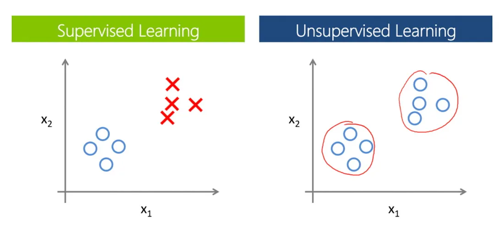

# Unsupervised Learning
Unsupervised learning is a machine learning paradigm where models are trained on unlabeled data to uncover patterns and structures inherent in the data without explicit guidance or supervision. Unlike supervised learning, which relies on labeled examples to learn from, unsupervised learning algorithms explore the data on their own, seeking to extract meaningful insights and representations.

Three of the most popular unsupervised learning tasks are:

-   **Dimensionality Reduction**— the task of reducing the number of input features in a dataset,
-   **Anomaly Detection**— the task of detecting instances that are very different from the norm, and
-   **Clustering**  — the task of grouping similar instances into clusters.
## Dimensionality Reduction
Dimensionality reduction techniques aim to reduce the number of input variables (features) in a dataset while preserving the essential information. This is particularly useful for high-dimensional data, where reducing dimensionality can improve computational efficiency and alleviate the curse of dimensionality.

   **Algorithms:**
   -   **Principal Component Analysis (PCA):** Linear technique that transforms the data into a lower-dimensional space while retaining the maximum variance.
   -   **Manifold Learning:** Techniques like Locally Linear Embedding (LLE), Isomap, and t-Distributed Stochastic Neighbor Embedding (t-SNE) aim to capture the intrinsic manifold structure of the data in lower-dimensional space, preserving local relationships.
## Anomaly Detection

Anomaly detection, also known as outlier detection, involves identifying instances in a dataset that deviate significantly from the norm or expected behavior. Anomalies may indicate errors, fraud, or interesting phenomena worth further investigation.

**Algorithms:**
   -   **Isolation Forest:** Randomized algorithm that isolates anomalies by randomly selecting features and partitioning instances into isolation trees.
   -   **Local Outlier Factor (LOF):** Density-based algorithm that measures the local deviation of an instance compared to its neighbors.
   -   **Minimum Covariance Determinant:** Robust estimator of multivariate location and scatter, useful for detecting outliers in high-dimensional data.
## Clustering 

Clustering algorithms partition a dataset into groups or clusters such that instances within the same cluster are more similar to each other than to instances in other clusters. Clustering is widely used in various domains, including customer segmentation, image segmentation, and anomaly detection.

-   **Algorithms:**
    -   **K-Means:** The n data points in the dataset are clustered into k clusters based on the shortest distance from the cluster prototypes. The cluster prototype is taken as the average data point in the cluster.

         **Implementation:**
		  
            from sklearn.cluster import KMeans
            
			# Sample data
			X = [[1, 2], [1, 4], [1, 0], [10, 2], [10, 4], [10, 0]]

			# Creating KMeans object
			kmeans = KMeans(n_clusters=2)

			# Fitting the model
			kmeans.fit(X)

			# Getting the cluster centroids
			centroids = kmeans.cluster_centers_

			# Getting the cluster labels
			labels = kmeans.labels_

    -  **Hierarchical Clustering:** Builds a hierarchy of clusters by either collecting the most similar (agglomerative approach) or separating the most dissimilar (divisive approach) data points and clusters, according to a selected distance measure. The result is a dendrogram clustering the data together bottom-up (agglomerative) or separating the data in different clusters top-down (divisive).
         
         **Implementation:**
 
			
	   
            from sklearn.cluster import AgglomerativeClustering
            
			# Sample data
			X = [[1, 2], [1, 4], [1, 0], [10, 2], [10, 4], [10, 0]]

			# Creating AgglomerativeClustering object
			hierarchical = AgglomerativeClustering(n_clusters=2)

			# Fitting the model
			hierarchical.fit(X)

			# Getting the cluster labels
			labels = hierarchical.labels_

    - **DBSCAN:** A density-based non-parametric clustering algorithm. Data points are classified as core, density-reachable, and outlier points. Core and density-reachable points in high density regions are clustered together, while points with no close neighbors in low-density regions are labeled as outliers.
         
         **Implementation:**
			    
            from sklearn.cluster import DBSCAN
            
			# Sample data
			X = [[1, 2], [1, 4], [1, 0], [10, 2], [10, 4], [10, 0]]

			# Creating DBSCAN object
			dbscan = DBSCAN(eps=1, min_samples=2)

			# Fitting the model
			dbscan.fit(X)

			# Getting the cluster labels
			labels = dbscan.labels_

    -  **Spectral Clustering:** Graph-based technique that leverages the eigenvalues and eigenvectors of a similarity matrix to perform clustering in a lower-dimensional space.
    -   **Affinity Propagation:** Clustering algorithm that models data points as exemplars and propagates messages between data points to identify clusters.
	-   **Mean Shift:** Mode-seeking algorithm that iteratively shifts data points towards the local mode of the underlying density distribution, identifying clusters as regions of high density.
	-   **BIRCH:** Balanced Iterative Reducing and Clustering using Hierarchies, designed for clustering large datasets by incrementally constructing a tree-based data structure.
	-   **Gaussian Mixture Models (GMM):** Probabilistic model that represents clusters as Gaussian distributions with unknown parameters, estimated using the Expectation-Maximization algorithm.
	
	**Note:** The above code snippets are basic implementations using scikit-learn. You might need to adjust parameters and data according to your specific use case.
## Other Unsupervised Learning Tasks
In addition to dimensionality reduction, anomaly detection, and clustering, unsupervised learning encompasses various other tasks, including density estimation and association rule learning.

-   **Density Estimation:** Estimating the probability density function of the data distribution, often used in conjunction with anomaly detection to identify regions of low density.
-   **Association Rule Learning:** Discovering relationships or associations between variables in a dataset, commonly used in market basket analysis and recommendation systems.
## Choosing a Clustering Algorithm
Selecting an appropriate clustering algorithm depends on various factors, including the nature of the data, the desired number of clusters, computational constraints, and the shape and size of the clusters. Evaluating clustering algorithms often involves assessing clustering quality metrics such as silhouette score, Davies–Bouldin index, or visual inspection of cluster assignments.
