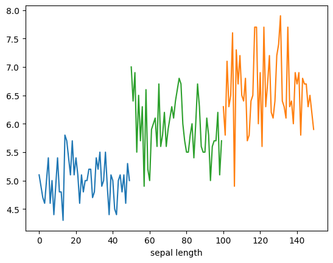
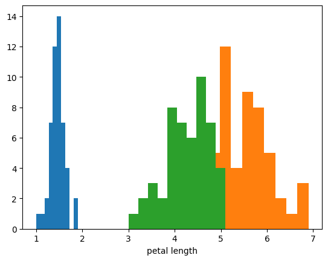
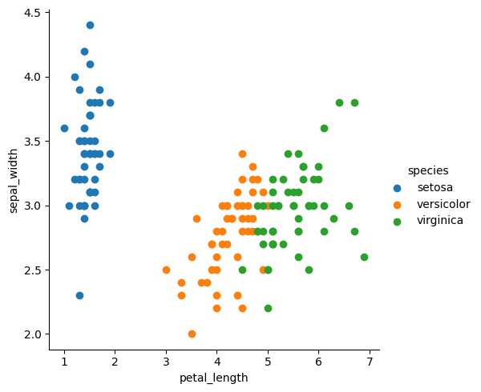
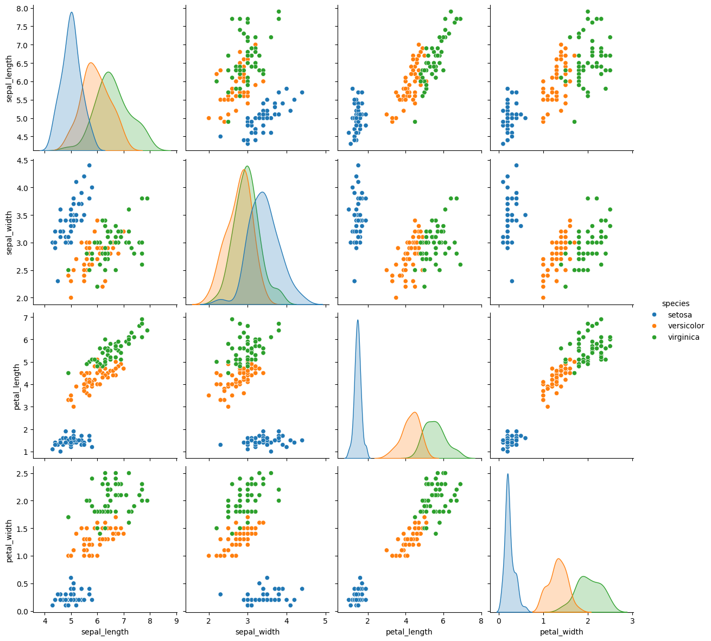
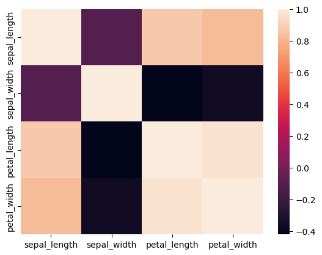

# Exploratory Data Analysis

Exploratory Data Analysis (EDA) is an approach to analyzing data sets to summarize their main characteristics, often with visual methods. EDA is used to understand the data, get a sense of the data, and to identify relationships between variables. EDA is a crucial step in the data analysis process and should be done before building a model.

## Why is EDA important?

1. **Understand the data**: EDA helps to understand the data, its structure, and its characteristics.

2. **Identify patterns and relationships**: EDA helps to identify patterns and relationships between variables.

3. **Detect outliers and anomalies**: EDA helps to detect outliers and anomalies in the data.

4. **Prepare data for modeling**: EDA helps to prepare the data for modeling by identifying missing values, handling missing values, and transforming variables.

## Steps in EDA

1. **Data Collection**: Collect the data from various sources.

2. **Data Cleaning**: Clean the data by handling missing values, removing duplicates, and transforming variables.

3. **Data Exploration**: Explore the data by visualizing the data, summarizing the data, and identifying patterns and relationships.

4. **Data Analysis**: Analyze the data by performing statistical analysis, hypothesis testing, and building models.

5. **Data Visualization**: Visualize the data using various plots and charts to understand the data better.

## Tools for EDA

1. **Python**: Python is a popular programming language for data analysis and has many libraries for EDA, such as Pandas, NumPy, Matplotlib, Seaborn, and Plotly.

2. **Jupiter Notebook**: Jupyter Notebook is an open-source web application that allows you to create and share documents that contain live code, equations, visualizations, and narrative text.

## Techniques for EDA

1. **Descriptive Statistics**: Descriptive statistics summarize the main characteristics of a data set, such as mean, median, mode, standard deviation, and variance.

2. **Data Visualization**: Data visualization is the graphical representation of data to understand the data better, such as histograms, scatter plots, box plots, and heat maps.

3. **Correlation Analysis**: Correlation analysis is used to measure the strength and direction of the relationship between two variables.

4. **Hypothesis Testing**: Hypothesis testing is used to test a hypothesis about a population parameter based on sample data.

5. **Dimensionality Reduction**: Dimensionality reduction is the process of reducing the number of variables in a data set while retaining as much information as possible.

6. **Clustering Analysis**: Clustering analysis is used to group similar data points together based on their characteristics.

## Commonly Used Techniques in EDA

1. **Uni-variate Analysis**: Uni-variate analysis is the simplest form of data analysis that involves analyzing a single variable at a time.

2. **Bi-variate Analysis**: Bi-variate analysis involves analyzing two variables at a time to understand the relationship between them.

3. **Multi-variate Analysis**: Multi-variate analysis involves analyzing more than two variables at a time to understand the relationship between them.

## Understand with an Example

Let's understand EDA with an example. Here we use a famous dataset called Iris dataset. 

The dataset consists of 150 samples of iris flowers, where each sample represents measurements of four features (variables) for three species of iris flowers.

The four features measured are :
Sepal length (in cm) Sepal width (in cm) Petal length (in cm) Petal width (in cm). 

The three species of iris flowers included in the dataset are :
**Setosa**, **Versicolor**, **Virginica**

```python
# Import libraries
import pandas as pd
import numpy as np
import matplotlib.pyplot as plt
import seaborn as sns
from sklearn import datasets

# Load the Iris dataset
iris = datasets.load_iris()
df = pd.DataFrame(iris.data, columns=iris.feature_names)
df.head()
```

| Sepal Length (cm) | Sepal Width (cm) | Petal Length (cm) | Petal Width (cm) |
|-------------------|------------------|-------------------|------------------|
| 5.1               | 3.5              | 1.4               | 0.2              |
| 4.9               | 3.0              | 1.4               | 0.2              |
| 4.7               | 3.2              | 1.3               | 0.2              |
| 4.6               | 3.1              | 1.5               | 0.2              |
| 5.0               | 3.6              | 1.4               | 0.2              |


### Uni-variate Analysis

```python
# Uni-variate Analysis
df_setosa=df.loc[df['species']=='setosa']
df_virginica=df.loc[df['species']=='virginica']
df_versicolor=df.loc[df['species']=='versicolor']

plt.plot(df_setosa['sepal_length'])
plt.plot(df_virginica['sepal_length'])
plt.plot(df_versicolor['sepal_length'])
plt.xlabel('sepal length')
plt.show()
```


```python
plt.hist(df_setosa['petal_length'])
plt.hist(df_virginica['petal_length'])
plt.hist(df_versicolor['petal_length'])
plt.xlabel('petal length')
plt.show()
```


### Bi-variate Analysis

```python
# Bi-variate Analysis
sns.FacetGrid(df,hue="species",height=5).map(plt.scatter,"petal_length","sepal_width").add_legen()
plt.show()
```


### Multi-variate Analysis

```python
# Multi-variate Analysis
sns.pairplot(df,hue="species",height=3)
```


### Correlation Analysis

```python
# Correlation Analysis
corr_matrix = df.corr()
sns.heatmap(corr_matrix)
```
|             | sepal_length | sepal_width | petal_length | petal_width |
|-------------|--------------|-------------|--------------|-------------|
| sepal_length| 1.000000     | -0.109369   | 0.871754     | 0.817954    |
| sepal_width | -0.109369    | 1.000000    | -0.420516    | -0.356544   |
| petal_length| 0.871754     | -0.420516   | 1.000000     | 0.962757    |
| petal_width | 0.817954     | -0.356544   | 0.962757     | 1.000000    |



## Exploratory Data Analysis (EDA) Report on Iris Dataset

### Introduction
The Iris dataset consists of 150 samples of iris flowers, each characterized by four features: Sepal Length, Sepal Width, Petal Length, and Petal Width. These samples belong to three species of iris flowers: Setosa, Versicolor, and Virginica. In this EDA report, we explore the dataset to gain insights into the characteristics and relationships among the features and species.

### Uni-variate Analysis
Uni-variate analysis examines each variable individually. 
- Sepal Length: The distribution of Sepal Length varies among the different species, with Setosa generally having shorter sepals compared to Versicolor and Virginica.
- Petal Length: Setosa tends to have shorter petal lengths, while Versicolor and Virginica have relatively longer petal lengths.

### Bi-variate Analysis
Bi-variate analysis explores the relationship between two variables.
- Petal Length vs. Sepal Width: There is a noticeable separation between species, especially Setosa, which typically has shorter and wider sepals compared to Versicolor and Virginica.
- This analysis suggests potential patterns distinguishing the species based on these two features.

### Multi-variate Analysis
Multi-variate analysis considers interactions among multiple variables simultaneously.
- Pairplot: The pairplot reveals distinctive clusters for each species, particularly in the combinations of Petal Length and Petal Width, indicating clear separation among species based on these features.

### Correlation Analysis
Correlation analysis examines the relationship between variables.
- Correlation Heatmap: There are strong positive correlations between Petal Length and Petal Width, as well as between Petal Length and Sepal Length. Sepal Width shows a weaker negative correlation with Petal Length and Petal Width.

### Insights
1. Petal dimensions (length and width) exhibit strong correlations, suggesting that they may collectively contribute more significantly to distinguishing between iris species.
2. Setosa tends to have shorter and wider sepals compared to Versicolor and Virginica.
3. The combination of Petal Length and Petal Width appears to be a more effective discriminator among iris species, as indicated by the distinct clusters observed in multi-variate analysis.

### Conclusion
Through comprehensive exploratory data analysis, we have gained valuable insights into the Iris dataset, highlighting key characteristics and relationships among features and species. Further analysis and modeling could leverage these insights to develop robust classification models for predicting iris species based on their measurements.

## Conclusion

Exploratory Data Analysis (EDA) is a critical step in the data analysis process that helps to understand the data, identify patterns and relationships, detect outliers, and prepare the data for modeling. By using various techniques and tools, such as descriptive statistics, data visualization, correlation analysis, and hypothesis testing, EDA provides valuable insights into the data, enabling data scientists to make informed decisions and build accurate models.


