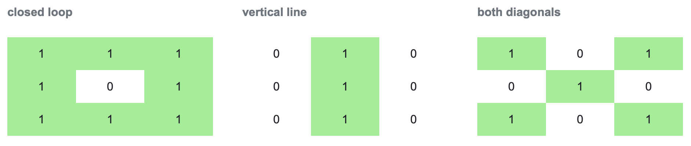

# Understanding Convolutional Neural Networks (CNN)

## Introduction
Convolutional Neural Networks (CNNs) are a specialized type of artificial neural network designed primarily for processing structured grid data like images. CNNs are particularly powerful for tasks involving image recognition, classification, and computer vision. They have revolutionized these fields, outperforming traditional neural networks by leveraging their unique architecture to capture spatial hierarchies in images.

### Why CNNs are Superior to Traditional Neural Networks
1. **Localized Receptive Fields**: CNNs use convolutional layers that apply filters to local regions of the input image. This localized connectivity ensures that the network learns spatial hierarchies and patterns, such as edges and textures, which are essential for image recognition tasks.
2. **Parameter Sharing**: In CNNs, the same filter (set of weights) is used across different parts of the input, significantly reducing the number of parameters compared to fully connected layers in traditional neural networks. This not only lowers the computational cost but also mitigates the risk of overfitting.
3. **Translation Invariance**: Due to the shared weights and pooling operations, CNNs are inherently invariant to translations of the input image. This means that they can recognize objects even when they appear in different locations within the image.
4. **Hierarchical Feature Learning**: CNNs automatically learn a hierarchy of features from low-level features like edges to high-level features like shapes and objects. Traditional neural networks, on the other hand, require manual feature extraction which is less effective and more time-consuming.

### Use Cases of CNNs
- **Image Classification**: Identifying objects within an image (e.g., classifying a picture as containing a cat or a dog).
- **Object Detection**: Detecting and locating objects within an image (e.g., finding faces in a photo).
- **Image Segmentation**: Partitioning an image into segments or regions (e.g., dividing an image into different objects and background).
- **Medical Imaging**: Analyzing medical scans like MRI, CT, and X-rays for diagnosis.

> This guide will walk you through the fundamentals of CNNs and their implementation in Python. We'll build a simple CNN from scratch, explaining each component to help you understand how CNNs process images and extract features.

### Let's start by understanding the basic architecture of CNNs.

## CNN Architecture
Convolution layers, pooling layers, and fully connected layers are just a few of the many building blocks that CNNs use to automatically and adaptively learn spatial hierarchies of information through backpropagation.

### Convolutional Layer
The convolutional layer is the core building block of a CNN. The layer's parameters consist of a set of learnable filters (or kernels), which have a small receptive field but extend through the full depth of the input volume. 

#### Input Shape
The dimensions of the input image, including the number of channels (e.g., 3 for RGB images & 1 for Grayscale images).


- The input matrix is a binary image of handwritten digits, 
where '1' marks the pixels containing the digit (ink/grayscale area) and '0' marks the background pixels (empty space).
- The first matrix shows the represnetation of 1 and 0, which can be depicted as a vertical line and a closed loop.
- The second matrix represents 9, combining the loop and line.

#### Strides
The step size with which the filter moves across the input image.


- This visualization will help you understand how the filter (kernel) moves acroos the input matrix with stride values of (3,3) and (2,2).
- A stride of 1 means the filter moves one step at a time, ensuring it covers the entire input matrix. 
- However, with larger strides (like 3 or 2 in this example), the filter may not cover all elements, potentially missing some information.
- While this might seem like a drawback, higher strides are often used to reduce computational cost and decrease the output size, which can be beneficial in speeding up the training process and preventing overfitting.

#### Padding
Determines whether the output size is the same as the input size ('same') or reduced ('valid').


- `Same` padding is preferred in earlier layers to preserve spatial and edge information, as it can help the network learn more detailed features.
- Choose `valid` padding when focusing on the central input region or requiring specific output dimensions.
- Padding value can be determined by $ ( f - 1 ) \over 2 $, where f isfilter size

#### Filters
Small matrices that slide over the input data to extract features.


- The first filter aims to detect closed loops within the input image, being highly relevant for recognizing digits with circular or oval shapes, such as '0', '6', '8', or '9'.
- The next filter helps in detecting vertical lines, crucial for identifying digits like '1', '4', '7', and parts of other digits that contain vertical strokes.
- The last filter shows how to detect diagonal lines in the input image, useful for identifying the slashes present in digits like '1', '7', or parts of '4' and '9'.

#### Output
A set of feature maps that represent the presence of different features in the input.


- With no padding and a stride of 1, the 3x3 filter moves one step at a time across the 7x5 input matrix. The filter can only move within the original boundaries of the input, resulting in a smaller 5x3 output matrix. This configuration is useful when you want to reduce the spatial dimensions of the feature map while preserving the exact spatial relationships between features.
- By adding zero padding to the input matrix, it is expanded to 9x7, allowing the 3x3 filter to "fit" fully on the edges and corners. With a stride of 1, the filter still moves one step at a time, but now the output matrix is the same size (7x5) as the original input. Same padding is often preferred in early layers of a CNN to preserve spatial information and avoid rapid feature map shrinkage.
- Without padding, the 3x3 filter operates within the original input matrix boundaries, but now it moves two steps at a time (stride 2). This significantly reduces the output matrix size to 3x2. Larger strides are employed to decrease computational cost and the output size, which can be beneficial in speeding up the training process and preventing overfitting. However, they might miss some finer details due to the larger jumps.
- The output dimension of a CNN model is given by, $$ n_{out} = { n_{in} + (2 \cdot p) - k \over s } $$
where,  
    n<sub>in</sub> = number of input features   
    p = padding  
    k = kernel size  
    s = stride

- Also, the number of trainable parameters for each layer is given by, $ (n_c \cdot [k \cdot k] \cdot f) + f $  
where,  
    n<sub>c</sub> = number of input channels  
    k x k = kernel size  
    f = number of filters   
    an additional f is added for bias

### Pooling Layer
Pooling layers reduce the dimensionality of each feature map while retaining the most critical information. The most common form of pooling is max pooling.
- **Input Shape:** The dimensions of the feature map from the convolutional layer.
- **Pooling Size:** The size of the pooling window (e.g., 2x2).
- **Strides:** The step size for the pooling operation.
- **Output:** A reduced feature map highlighting the most important features.
<div align='center'>
    </img>
</div>

- The high values (8) indicate that the "closed loop" filter found a strong match in those regions.
- First matrix of size 6x4 represents a downsampled version of the input.
- While the second matrix with 3x2, resulting in more aggressive downsampling.

### Flatten Layer
The flatten layer converts the 2D matrix data to a 1D vector, which can be fed into a fully connected (dense) layer.
- **Input Shape:** The 2D feature maps from the previous layer.
- **Output:** A 1D vector that represents the same data in a flattened format.


### Dropout Layer
Dropout is a regularization technique to prevent overfitting in neural networks by randomly setting a fraction of input units to zero at each update during training time.
- **Input Shape:** The data from the previous layer.
- **Dropout Rate:** The fraction of units to drop (e.g., 0.5 for 50% dropout).
- **Output:** The same shape as the input, with some units set to zero.


- The updated 0 values represents the dropped units.

## Implementation

Below is the implementation of a simple CNN in Python. Each function within the `CNN` class corresponds to a layer in the network.

```python
import numpy as np

class CNN:
    def __init__(self):
        pass

    def convLayer(self, input_shape, channels, strides, padding, filter_size):
        height, width = input_shape
        input_shape_with_channels = (height, width, channels)
        print("Input Shape (with channels):", input_shape_with_channels)
        
        # Generate random input and filter matrices
        input_matrix = np.random.randint(0, 10, size=input_shape_with_channels)
        filter_matrix = np.random.randint(0, 5, size=(filter_size[0], filter_size[1], channels))
        
        print("\nInput Matrix:\n", input_matrix[:, :, 0])
        print("\nFilter Matrix:\n", filter_matrix[:, :, 0])
        
        padding = padding.lower()
        
        if padding == 'same':
            # Calculate padding needed for each dimension
            pad_height = filter_size[0] // 2
            pad_width = filter_size[1] // 2
            
            # Apply padding to the input matrix
            input_matrix = np.pad(input_matrix, ((pad_height, pad_height), (pad_width, pad_width), (0, 0)), mode='constant')
            
            # Adjust height and width to consider the padding
            height += 2 * pad_height
            width += 2 * pad_width

        elif padding == 'valid':
            pass

        else:
            return "Invalid Padding!!"

        # Output dimensions
        conv_height = (height - filter_size[0]) // strides[0] + 1
        conv_width = (width - filter_size[1]) // strides[1] + 1
        output_matrix = np.zeros((conv_height, conv_width, channels))

        # Convolution Operation
        for i in range(0, height - filter_size[0] + 1, strides[0]):
            for j in range(0, width - filter_size[1] + 1, strides[1]):
                receptive_field = input_matrix[i:i + filter_size[0], j:j + filter_size[1], :]
                output_matrix[i // strides[0], j // strides[1], :] = np.sum(receptive_field * filter_matrix, axis=(0, 1, 2))
        
        return output_matrix

    def maxPooling(self, input_matrix, pool_size=(2, 2), strides_pooling=(2, 2)):
        input_height, input_width, input_channels = input_matrix.shape
        pool_height, pool_width = pool_size
        stride_height, stride_width = strides_pooling
        
        # Calculate output dimensions
        pooled_height = (input_height - pool_height) // stride_height + 1
        pooled_width = (input_width - pool_width) // stride_width + 1
        
        # Initialize output
        pooled_matrix = np.zeros((pooled_height, pooled_width, input_channels))
        
        # Perform max pooling
        for c in range(input_channels):
            for i in range(0, input_height - pool_height + 1, stride_height):
                for j in range(0, input_width - pool_width + 1, stride_width):
                    patch = input_matrix[i:i + pool_height, j:j + pool_width, c]
                    pooled_matrix[i // stride_height, j // stride_width, c] = np.max(patch)
        
        return pooled_matrix

    def flatten(self, input_matrix):
        return input_matrix.flatten()
    
    def dropout(self, input_matrix, dropout_rate=0.5):
        assert 0 <= dropout_rate < 1, "Dropout rate must be in [0, 1)."
        dropout_mask = np.random.binomial(1, 1 - dropout_rate, size=input_matrix.shape)
        return input_matrix * dropout_mask
```

Run the below command to generate output with random input and filter matrices, depending on the given size.

```python
input_shape = (5, 5)
channels = 1
strides = (1, 1)
padding = 'valid'
filter_size = (3, 3)

cnn_model = CNN()

conv_output = cnn_model.convLayer(input_shape, channels, strides, padding, filter_size)
print("\nConvolution Output:\n", conv_output[:, :, 0])

pool_size = (2, 2)
strides_pooling = (1, 1)

maxPool_output = cnn_model.maxPooling(conv_output, pool_size, strides_pooling)
print("\nMax Pooling Output:\n", maxPool_output[:, :, 0])

flattened_output = cnn_model.flatten(maxPool_output)
print("\nFlattened Output:\n", flattened_output)

dropout_output = cnn_model.dropout(flattened_output, dropout_rate=0.3)
print("\nDropout Output:\n", dropout_output)
```

Feel free to play around with the parameters!
