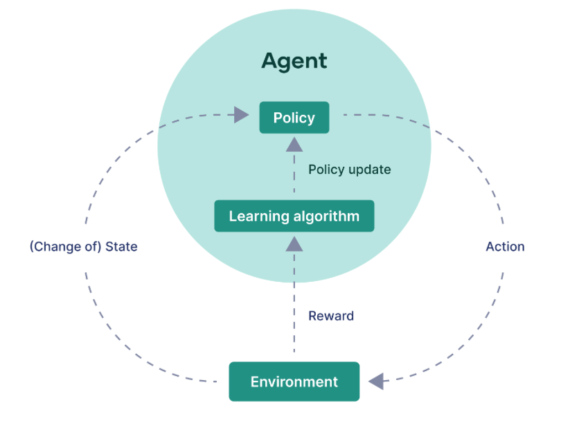

# Reinforcement Learning: A Comprehensive Guide

Reinforcement Learning (RL) is a field of Machine Learing which focuses on goal-directed learning from interaction with the environment. In RL, an agent learns to make decisions by performing actions in an environment to maximize cumulative numerical reward signal. This README aims to provide a thorough understanding of RL, covering key concepts, algorithms, applications, and resources.

## Table of Contents

<details>
<summary>Click to expand</summary>

1. [What is Reinforcement Learning?](#what-is-reinforcement-learning)
2. [Key Concepts and Terminology](#key-concepts-and-terminology)
   - [Agent](#agent)
   - [Environment](#environment)
   - [State](#state)
   - [Action](#action)
   - [Reward](#reward)
   - [Policy](#policy)
   - [Value Function](#value-function)
   - [Model](#model)
   - [Exploration vs. Exploitation](#exploration-vs-exploitation)
3. [Types of Reinforcement Learning](#types-of-reinforcement-learning)
   - [Model-Based vs Model-Free](#model-based-vs-model-free)
   - [Value-Based Methods](#value-based-methods)
   - [Policy-Based Methods](#policy-based-methods)
   - [Actor-Critic Methods](#actor-critic-methods)
4. [Important Algorithms](#important-algorithms)
   - [Q-Learning](#q-learning) 
   - [Deep Q-Networks](#deep-q-networks-dqn)
   - [SARSA](#sarsa)
   - [REINFORCE Algorithm](#reinforce-algorithm)
   - [Proximal Policy Optimization (PPO)](#proximal-policy-optimization-ppo)
   - [A2C/A3C](#a2ca3c)
5. [Mathematical Background](#mathematical-background)
   - [Markov Decision Processes (MDP)](#markov-decision-processes-mdps)
   - [Bellman Equations](#bellman-equations)
6. [Applications of Reinforcement Learning](#applications-of-reinforcement-learning)
   - [Gaming](#gaming)
   - [Robotics](#robotics)
   - [Finance](#finance)
   - [Healthcare](#healthcare)
7. [Tools and Libraries](#tools-and-libraries)
8. [Resources for Further Learning](#resources-for-further-learning)
   - [Books](#books)
   - [Online Courses](#online-courses)
   - [Research Papers](#research-papers)
   - [Blogs and Websites](#blogs-and-websites)
9. [How to Start with Reinforcement Learning](#how-to-start-with-reinforcement-learning)
   - [Prerequisites](#prerequisites)
   - [Beginner Project](#beginner-project)
10. [Conclusion](#conclusion)

</details>

## What is Reinforcement Learning?

Reinforcement learning involves determining the best actions to take in various situations to maximize a numerical reward signal. Instead of being instructed on which actions to take, the learner must explore and identify the actions that lead to the highest rewards through trial and error. After each action performed in its environment, a trainer may give feedback in the form of rewards or penalties to indicate the desirability of the resulting state. Unlike supervised learning, reinforcement learning does not depend on labeled data but instead learns from the outcomes of its actions.

## Key Concepts and Terminology



### Agent
Agent is a system or entity that learns to make decisions by interacting with an environment. The agent improves its performance by trial and error, receiving feedback from the environment in the form of rewards or punishments. 

### Environment
Environment is the setting or world in which the agent operates and interacts with. It provides the agent with states and feedback based on the agent's actions.

### State
State represents the current situation of the environment, encapsulating all the relevant information needed for decision-making.

### Action
Action represents a move that can be taken by the agent, which would affect the state of the environment. The set of all possible actions is called the action space.

### Reward
Reward is the feedback from the environment in response to the agent’s action, thereby defining what are good and bad actions. Agent aims to maximize the total reward over time.

### Policy
Policy is a strategy used by the agent to determine its actions based on the current state. In some cases the policy may be a simple function or lookup table, whereas in others it may involve extensive computation such as a search process. 

### Value Function
The value function of a state is the expected total amount of reward an agent can expect to accumulate over the future, starting from that state. There are two main types of value functions:
    - **State Value Function (V)**: The expected reward starting from a state and following a certain policy thereafter.
    - **Action Value Function (Q)**: The expected reward starting from a state, taking a specific action, and following a certain policy thereafter.

### Model
Model mimics the behavior of the environment, or more generally, that allows inferences to be made about how the environment will behave.

### Exploration vs. Exploitation
To accumulate substantial rewards, a reinforcement learning agent needs to favor actions that have previously yielded high rewards. However, to identify these effective actions, the agent must also attempt actions it hasn't tried before. This means the agent must *exploit* its past experiences to gain rewards, while also *exploring* new actions to improve its future decision-making.

## Types of Reinforcement Learning

### Model-Based vs Model-Free

**Model-Based Reinforcement Learning:** Model-based methods involve creating a model of the environment to predict future states and rewards, allowing the agent to plan its actions by simulating various scenarios. These methods often involve two main components:

**Model-Free Reinforcement Learning:** Model-free methods do not explicitly learn a model of the environment. Instead, they learn a policy or value function directly from the interactions with the environment. These methods can be further divided into two categories: value-based and policy-based methods.

### Value-Based Methods: 
Value-based methods focus on estimating the value function, and the policy is indirectly derived from the value function.

### Policy-Based Methods:
Policy-based methods directly optimize the policy by maximizing the expected cumulative rewardto find the optimal parameters.

### Actor-Critic Methods:
Actor-Critic methods combine the strengths of both value-based and policy-based methods. Actor learns the policy that maps states to actions and Critic learns the value function that evaluates the action chosen by the actor.

## Important Algorithms

### Q-Learning
Q-Learning is a model-free algorithm used in reinforcement learning to learn the value of an action in a particular state. It aims to find the optimal policy by iteratively updating the Q-values, which represent the expected cumulative reward of taking a particular action in a given state and following the optimal policy thereafter.

#### Algorithm:
1. Initialize Q-values arbitrarily for all state-action pairs.
2. Repeat for each episode:
   - Choose an action using an exploration strategy (e.g., epsilon-greedy).
   - Take the action, observe the reward and the next state.
   - Update the Q-value of the current state-action pair using the Bellman equation:
     
     where:
     - \( Q(s, a) \) is the Q-value of state \( s \) and action \( a \).
     - \( r \) is the observed reward.
     - \( s' \) is the next state.
     - \( \alpha \) is the learning rate.
     - \( \gamma \) is the discount factor.
3. Until convergence or a maximum number of episodes.

### Deep Q-Networks (DQN)
Deep Q-Networks (DQN) extend Q-learning to high-dimensional state spaces using deep neural networks to approximate the Q-function. It uses experience replay and target networks to improve stability and convergence.

#### Algorithm:
1. Initialize the Q-network with random weights.
2. Initialize a target network with the same weights as the Q-network.
3. Repeat for each episode:
   - Initialize the environment state \( s \).
   - Repeat for each timestep:
     - With probability \( \epsilon \), choose a random action. Otherwise, select the action with the highest Q-value according to the Q-network.
     - Take the chosen action, observe the reward \( r \) and the next state \( s' \).
     - Store the transition \( (s, a, r, s') \) in the replay memory.
     - Sample a minibatch of transitions from the replay memory.
     - Compute the target Q-value for each transition:
       
     where:
     - \( \theta^- \) represents the parameters of the target network.
     - \( y_j \) is the target Q-value for the \( j \)th transition.
   - Update the Q-network parameters by minimizing the temporal difference loss:
     
4. Until convergence or a maximum number of episodes.

### SARSA
SARSA (State-Action-Reward-State-Action) is an on-policy temporal difference algorithm used for learning the Q-function. Unlike Q-learning, SARSA directly updates the Q-values based on the current policy.

#### Algorithm:
1. Initialize Q-values arbitrarily for all state-action pairs.
2. Repeat for each episode:
   - Initialize the environment state \( s \).
   - Choose an action \( a \) using the current policy (e.g., epsilon-greedy).
   - Repeat for each timestep:
     - Take action \( a \), observe the reward \( r \) and the next state \( s' \).
     - Choose the next action \( a' \) using the current policy.
     - Update the Q-value of the current state-action pair using the SARSA update rule:
       
3. Until convergence or a maximum number of episodes.

### REINFORCE Algorithm:
REINFORCE (Monte Carlo policy gradient) is a simple policy gradient method that updates the policy parameters in the direction of the gradient of expected rewards.

### Proximal Policy Optimization (PPO):
PPO is an advanced policy gradient method that improves stability by limiting the policy updates within a certain trust region.

### A2C/A3C:
Advantage Actor-Critic (A2C) and Asynchronous Advantage Actor-Critic (A3C) are variants of actor-critic methods that utilize multiple parallel agents to improve sample efficiency.

## Mathematical Background

### Markov Decision Processes (MDPs)
A Markov Decision Process (MDP) is a mathematical framework used to model decision-making problems. It consists of states, actions, rewards and transition probabilities.

### Bellman Equations
Bellman equations are fundamental recursive equations in dynamic programming and reinforcement learning. They express the value of a decision at one point in time in terms of the expected value of the subsequent decisions.

## Applications of Reinforcement Learning

### Gaming
Reinforcement learning is extensively used in gaming for developing AI agents capable of playing complex games like AlphaGo, Chess, and video games. RL algorithms enable these agents to learn optimal strategies by interacting with the game environment and receiving feedback in the form of rewards.

### Robotics
In robotics, reinforcement learning is employed to teach robots various tasks such as navigation, manipulation, and control. RL algorithms allow robots to learn from their interactions with the environment, enabling them to adapt and improve their behavior over time without explicit programming.

### Finance
Reinforcement learning plays a crucial role in finance, particularly in algorithmic trading and portfolio management. RL algorithms are utilized to optimize trading strategies, automate decision-making processes, and manage investment portfolios dynamically based on changing market conditions and objectives.

### Healthcare
In healthcare, reinforcement learning is utilized for various applications such as personalized treatment, drug discovery, and optimizing healthcare operations. RL algorithms can assist in developing personalized treatment plans for patients, identifying effective drug candidates, and optimizing resource allocation in hospitals to improve patient care and outcomes.

## Tools and Libraries
- **OpenAI Gym:** A toolkit for developing and comparing RL algorithms.
- **TensorFlow/TF-Agents:** A library for RL in TensorFlow.
- **PyTorch:** Popular machine learning library with RL capabilities.
- **Stable Baselines3:** A set of reliable implementations of RL algorithms in PyTorch.

## Resources for Further Learning
### Books
- "Reinforcement Learning: An Introduction" by Sutton and Barto
- "Deep Reinforcement Learning Hands-On" by Maxim Lapan

### Online Courses
- "Reinforcement Learning" by Udacity
- "Fundamentals of Reinforcement Learning" by Coursera
- "Master Reinforcement Learning and Deep RL with Python" by Udemy

### Research Papers
- [Reinforcement learning model, algorithms and its application](https://ieeexplore.ieee.org/abstract/document/6025669)
- [A Concise Introduction to Reinforcement Learning](https://www.researchgate.net/publication/323178749_A_Concise_Introduction_to_Reinforcement_Learning)

### Blogs and Websites
- [OpenAI Blog](https://spinningup.openai.com/en/latest/)
- [Geeks for Geeks](https://www.geeksforgeeks.org/what-is-reinforcement-learning/)
- [Medium Blog](https://gordicaleksa.medium.com/how-to-get-started-with-reinforcement-learning-rl-4922fafeaf8c)

## How to Start with Reinforcement Learning

### Prerequisites
- Basic knowledge of machine learning and neural networks.
- Proficiency in Python.

### Beginner Project
The provided Python code implements the Q-learning algorithm for a basic grid world environment. It defines the grid world, actions, and parameters such as discount factor and learning rate. The algorithm iteratively learns the optimal action-value function (Q-values) by updating them based on rewards obtained from actions taken in each state. Finally, the learned Q-values are printed for each state-action pair.

```python
import numpy as np

# Define the grid world environment
# 'S' represents the start state
# 'G' represents the goal state
# 'H' represents the hole (negative reward)
# '.' represents empty cells (neutral reward)
# 'W' represents walls (impassable)
grid_world = np.array([
    ['S', '.', '.', '.', '.'],
    ['.', 'W', '.', 'H', '.'],
    ['.', '.', '.', 'W', '.'],
    ['.', 'W', '.', '.', 'G']
])

# Define the actions (up, down, left, right)
actions = ['UP', 'DOWN', 'LEFT', 'RIGHT']

# Define parameters
gamma = 0.9  # discount factor
alpha = 0.1  # learning rate
epsilon = 0.1  # exploration rate

# Initialize Q-values
num_rows, num_cols = grid_world.shape
num_actions = len(actions)
Q = np.zeros((num_rows, num_cols, num_actions))

# Define helper function to get possible actions in a state
def possible_actions(state):
    row, col = state
    possible_actions = []
    for i, action in enumerate(actions):
        if action == 'UP' and row > 0 and grid_world[row - 1, col] != 'W':
            possible_actions.append(i)
        elif action == 'DOWN' and row < num_rows - 1 and grid_world[row + 1, col] != 'W':
            possible_actions.append(i)
        elif action == 'LEFT' and col > 0 and grid_world[row, col - 1] != 'W':
            possible_actions.append(i)
        elif action == 'RIGHT' and col < num_cols - 1 and grid_world[row, col + 1] != 'W':
            possible_actions.append(i)
    return possible_actions

# Q-learning algorithm
num_episodes = 1000
for episode in range(num_episodes):
    # Initialize the starting state
    state = (0, 0)  # start state
    while True:
        # Choose an action using epsilon-greedy policy
        if np.random.uniform(0, 1) < epsilon:
            action = np.random.choice(possible_actions(state))
        else:
            action = np.argmax(Q[state[0], state[1]])

        # Perform the action and observe the next state and reward
        if actions[action] == 'UP':
            next_state = (state[0] - 1, state[1])
        elif actions[action] == 'DOWN':
            next_state = (state[0] + 1, state[1])
        elif actions[action] == 'LEFT':
            next_state = (state[0], state[1] - 1)
        elif actions[action] == 'RIGHT':
            next_state = (state[0], state[1] + 1)

        # Get the reward
        if grid_world[next_state] == 'G':
            reward = 1  # goal state
        elif grid_world[next_state] == 'H':
            reward = -1  # hole
        else:
            reward = 0

        # Update Q-value using the Bellman equation
        best_next_action = np.argmax(Q[next_state[0], next_state[1]])
        Q[state[0], state[1], action] += alpha * (
                reward + gamma * Q[next_state[0], next_state[1], best_next_action] - Q[state[0], state[1], action])

        # Move to the next state
        state = next_state

        # Check if the episode is terminated
        if grid_world[state] in ['G', 'H']:
            break

# Print the learned Q-values
print("Learned Q-values:")
for i in range(num_rows):
    for j in range(num_cols):
        print(f"State ({i}, {j}):", Q[i, j])
```

## Conclusion
Congratulations on completing your journey through this comprehensive guide to reinforcement learning! Armed with this knowledge, you are well-equipped to dive deeper into the exciting world of RL, whether it's for gaming, robotics, finance, healthcare, or any other domain. Keep exploring, experimenting, and learning, and remember, the only limit to what you can achieve with reinforcement learning is your imagination.

*Happy coding, and may your RL adventures be rewarding!*