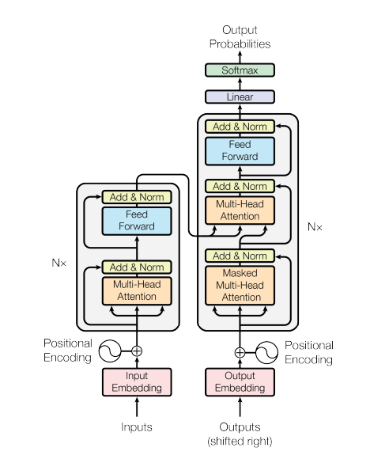

# Transformers
## Introduction
A transformer is a deep learning architecture developed by Google and based on the multi-head attention mechanism. It is based on the softmax-based attention 
mechanism. Before transformers, predecessors of attention mechanism were added to gated recurrent neural networks, such as LSTMs and gated recurrent units (GRUs), which processed datasets sequentially. Dependency on previous token computations prevented them from being able to parallelize the attention mechanism.

Transformers are a revolutionary approach to natural language processing (NLP). Unlike older models, they excel at understanding long-range connections between words. This "attention" mechanism lets them grasp the context of a sentence, making them powerful for tasks like machine translation, text summarization, and question answering. Introduced in 2017, transformers are now the backbone of many large language models, including tools you might use every day. Their ability to handle complex relationships in language is fueling advancements in AI across various fields.

## Model Architecture



Source: [Attention Is All You Need](https://arxiv.org/pdf/1706.03762)


### Encoder
The encoder is composed of a stack of identical layers. Each layer has two sub-layers. The first is a multi-head self-attention mechanism, and the second is a simple, positionwise fully connected feed-forward network. Each encoder consists of two major components: a self-attention mechanism and a feed-forward neural network. The self-attention mechanism accepts input encodings from the previous encoder and weights their relevance to each other to generate output encodings. The feed-forward neural network further processes each output encoding individually. These output encodings are then passed to the next encoder as its input, as well as to the decoders.

### Decoder
The decoder is also composed of a stack of identical layers. In addition to the two sub-layers in each encoder layer, the decoder inserts a third sub-layer, which performs multi-head attention over the output of the encoder stack. The decoder functions in a similar fashion to the encoder, but an additional attention mechanism is inserted which instead draws relevant information from the encodings generated by the encoders. This mechanism can also be called the encoder-decoder attention.

### Attention
#### Scaled Dot-Product Attention
The input consists of queries and keys of dimension $d_k$ , and values of dimension $d_v$. We compute the dot products of the query with all keys, divide each by $\sqrt {d_k}$ , and apply a softmax function to obtain the weights on the values.

$$Attention(Q, K, V) = softmax(\dfrac{QK^T}{\sqrt{d_k}}) \times V$$

#### Multi-Head Attention
Instead of performing a single attention function with $d_{model}$-dimensional keys, values and queries, it is beneficial to linearly project the queries, keys and values h times with different, learned linear projections to $d_k$ , $d_k$ and $d_v$ dimensions, respectively. 

Multi-head attention allows the model to jointly attend to information from different representation
subspaces at different positions. With a single attention head, averaging inhibits this.

$$MultiHead(Q, K, V) = Concat(head_1, _{...}, head_h) \times W^O$$

where,

$$head_i = Attention(QW_i^Q, KW_i^K, VW_i^V)$$

where the projections are parameter matrices.

#### Masked Attention
It may be necessary to cut out attention links between some word-pairs. For example, the decoder for token position 
$t$ should not have access to token position $t+1$.

$$MaskedAttention(Q, K, V) = softmax(M + \dfrac{QK^T}{\sqrt{d_k}}) \times V$$

### Feed-Forward Network
Each of the layers in the encoder and decoder contains a fully connected feed-forward network, which is applied to each position separately and identically. This
consists of two linear transformations with a ReLU activation in between.

$$FFN(x) = max(0, xW_1 + b_1)W_2 + b_2$$

### Positional Encoding
A positional encoding is a fixed-size vector representation that encapsulates the relative positions of tokens within a target sequence: it provides the transformer model with information about where the words are in the input sequence.

The sine and cosine functions of different frequencies:

$$PE<sub>(pos,2i)</sub> = \sin({\dfrac{pos}{10000^{\dfrac{2i}{d_{model}}}}})$$

$$PE<sub>(pos,2i)</sub> = \cos({\dfrac{pos}{10000^{\dfrac{2i}{d_{model}}}}})$$

## Implementation
### Theory
Text is converted to numerical representations called tokens, and each token is converted into a vector via looking up from a word embedding table. 
At each layer, each token is then contextualized within the scope of the context window with other tokens via a parallel multi-head attention mechanism 
allowing the signal for key tokens to be amplified and less important tokens to be diminished. 

The transformer uses an encoder-decoder architecture. The encoder extracts features from an input sentence, and the decoder uses the features to produce an output sentence. Some architectures use full encoders and decoders, autoregressive encoders and decoders, or combination of both. This depends on the usage and context of the input.

### Tensorflow
TensorFlow is a free and open-source software library for machine learning and artificial intelligence. It can be used across a range of tasks but has a particular focus on training and inference of deep neural networks. It was developed by the Google Brain team for Google's internal use in research and production.

Tensorflow provides the transformer encoder and decoder block that can be implemented by the specification of the user. Although, the transformer is not provided as a standalone to be imported and executed, the user has to create the model first. They also have a tutorial on how to implement the transformer from scratch for machine translation and can be found [here](https://www.tensorflow.org/text/tutorials/transformer).

More information on [encoder](https://www.tensorflow.org/api_docs/python/tfm/nlp/layers/TransformerEncoderBlock) and [decoder](https://www.tensorflow.org/api_docs/python/tfm/nlp/layers/TransformerDecoderBlock) block mentioned in the code.

Imports:
```python
import tensorflow as tf
import tensorflow_models as tfm
```

Adding word embeddings and positional encoding:
```python
class PositionalEmbedding(tf.keras.layers.Layer):
    def __init__(self, vocab_size, d_model):
        super().__init__()
        self.d_model = d_model
        self.embedding = tf.keras.layers.Embedding(vocab_size, d_model, mask_zero=True) 
        self.pos_encoding = tfm.nlp.layers.RelativePositionEmbedding(hidden_size=d_model)
  
    def compute_mask(self, *args, **kwargs):
        return self.embedding.compute_mask(*args, **kwargs)
  
    def call(self, x):
        length = tf.shape(x)[1]
        x = self.embedding(x)
        x = x + self.pos_encoding[tf.newaxis, :length, :]
        return x
```

Creating the encoder for the transformer:
```python
class Encoder(tf.keras.layers.Layer):
    def __init__(self, num_layers, d_model, num_heads,
                 dff, vocab_size, dropout_rate=0.1):
        super().__init__()
    
        self.d_model = d_model
        self.num_layers = num_layers
    
        self.pos_embedding = PositionalEmbedding(
            vocab_size=vocab_size, d_model=d_model)
    
        self.enc_layers = [
            tfm.nlp.layers.TransformerEncoderBlock(output_last_dim=d_model,
                         num_attention_heads=num_heads,
                         inner_dim=dff,
                         inner_activation="relu",
                         inner_dropout=dropout_rate)
            for _ in range(num_layers)]
        self.dropout = tf.keras.layers.Dropout(dropout_rate)

    def call(self, x):
        x = self.pos_embedding(x, length=2048)
        x = self.dropout(x)
    
        for i in range(self.num_layers):
          x = self.enc_layers[i](x)
    
        return x
```

Creating the decoder for the transformer:
```python
class Decoder(tf.keras.layers.Layer):
    def __init__(self, num_layers, d_model, num_heads, dff, vocab_size,
                 dropout_rate=0.1):
        super(Decoder, self).__init__()
    
        self.d_model = d_model
        self.num_layers = num_layers
    
        self.pos_embedding = PositionalEmbedding(vocab_size=vocab_size,
                                                 d_model=d_model)
        self.dropout = tf.keras.layers.Dropout(dropout_rate)
        self.dec_layers = [
            tfm.nlp.layers.TransformerDecoderBlock(num_attention_heads=num_heads,
                         intermediate_size=dff,
                         intermediate_activation="relu",
                         dropout_rate=dropout_rate)
            for _ in range(num_layers)]
  
    def call(self, x, context):
        x = self.pos_embedding(x)
        x = self.dropout(x)
    
        for i in range(self.num_layers):
            x  = self.dec_layers[i](x, context)
  
        return x
```

Combining the encoder and decoder to create the transformer:
```python
class Transformer(tf.keras.Model):
    def __init__(self, num_layers, d_model, num_heads, dff,
                 input_vocab_size, target_vocab_size, dropout_rate=0.1):
        super().__init__()
        self.encoder = Encoder(num_layers=num_layers, d_model=d_model,
                               num_heads=num_heads, dff=dff,
                               vocab_size=input_vocab_size,
                               dropout_rate=dropout_rate)
      
        self.decoder = Decoder(num_layers=num_layers, d_model=d_model,
                               num_heads=num_heads, dff=dff,
                               vocab_size=target_vocab_size,
                               dropout_rate=dropout_rate)
      
        self.final_layer = tf.keras.layers.Dense(target_vocab_size)

    def call(self, inputs):
        context, x  = inputs
    
        context = self.encoder(context)
        x = self.decoder(x, context)
        logits = self.final_layer(x)
    
        return logits
```

Model initialization that be used for training and inference:
```python
transformer = Transformer(
      num_layers=num_layers,
      d_model=d_model,
      num_heads=num_heads,
      dff=dff,
      input_vocab_size=64,
      target_vocab_size=64,
      dropout_rate=dropout_rate
)
```

Sample:
```python
src = tf.random.uniform((64, 40))
tgt = tf.random.uniform((64, 50))

output = transformer((src, tgt))
```

O/P:
```
<tf.Tensor: shape=(64, 50, 64), dtype=float32, numpy=
array([[[ 0.78274703, -1.2312567 ,  0.7272992 , ...,  2.1805947 ,
          1.3511044 , -1.275499  ],
        [ 0.82658154, -1.2863302 ,  0.76494133, ...,  2.39311   ,
          1.0973787 , -1.3414565 ],
        [ 0.57013685, -1.3958443 ,  1.0213287 , ...,  2.3791933 ,
          0.58439416, -0.93464035],
        ...,
        [ 0.82214123, -0.51090807,  0.25897795, ...,  2.1979148 ,
          1.4126635 , -0.5771998 ],
        [ 0.6371507 , -0.36584622,  0.40954843, ...,  2.0241373 ,
          1.6503414 , -0.74359566],
        [ 0.6739802 , -0.39973688,  0.3338765 , ...,  1.6819229 ,
          1.7505672 , -1.0763712 ]],

       [[ 0.78274703, -1.2312567 ,  0.7272992 , ...,  2.1805947 ,
          1.3511044 , -1.275499  ],
        [ 0.82658154, -1.2863302 ,  0.76494133, ...,  2.39311   ,
          1.0973787 , -1.3414565 ],
        [ 0.57013685, -1.3958443 ,  1.0213287 , ...,  2.3791933 ,
          0.58439416, -0.93464035],
        ...,
        [ 0.82214123, -0.51090807,  0.25897795, ...,  2.1979148 ,
          1.4126635 , -0.5771998 ],
        [ 0.6371507 , -0.36584622,  0.40954843, ...,  2.0241373 ,
          1.6503414 , -0.74359566],
        [ 0.6739802 , -0.39973688,  0.3338765 , ...,  1.6819229 ,
          1.7505672 , -1.0763712 ]],

       [[ 0.78274703, -1.2312567 ,  0.7272992 , ...,  2.1805947 ,
          1.3511044 , -1.275499  ],
        [ 0.82658154, -1.2863302 ,  0.76494133, ...,  2.39311   ,
          1.0973787 , -1.3414565 ],
        [ 0.57013685, -1.3958443 ,  1.0213287 , ...,  2.3791933 ,
          0.58439416, -0.93464035],
        ...,
        [ 0.82214123, -0.51090807,  0.25897795, ...,  2.1979148 ,
          1.4126635 , -0.5771998 ],
        [ 0.6371507 , -0.36584622,  0.40954843, ...,  2.0241373 ,
          1.6503414 , -0.74359566],
        [ 0.6739802 , -0.39973688,  0.3338765 , ...,  1.6819229 ,
          1.7505672 , -1.0763712 ]],

       ...,

       [[ 0.78274703, -1.2312567 ,  0.7272992 , ...,  2.1805947 ,
          1.3511044 , -1.275499  ],
        [ 0.82658154, -1.2863302 ,  0.76494133, ...,  2.39311   ,
          1.0973787 , -1.3414565 ],
        [ 0.57013685, -1.3958443 ,  1.0213287 , ...,  2.3791933 ,
          0.58439416, -0.93464035],
        ...,
        [ 0.82214123, -0.51090807,  0.25897795, ...,  2.1979148 ,
          1.4126635 , -0.5771998 ],
        [ 0.6371507 , -0.36584622,  0.40954843, ...,  2.0241373 ,
          1.6503414 , -0.74359566],
        [ 0.6739802 , -0.39973688,  0.3338765 , ...,  1.6819229 ,
          1.7505672 , -1.0763712 ]],

       [[ 0.78274703, -1.2312567 ,  0.7272992 , ...,  2.1805947 ,
          1.3511044 , -1.275499  ],
        [ 0.82658154, -1.2863302 ,  0.76494133, ...,  2.39311   ,
          1.0973787 , -1.3414565 ],
        [ 0.57013685, -1.3958443 ,  1.0213287 , ...,  2.3791933 ,
          0.58439416, -0.93464035],
        ...,
        [ 0.82214123, -0.51090807,  0.25897795, ...,  2.1979148 ,
          1.4126635 , -0.5771998 ],
        [ 0.6371507 , -0.36584622,  0.40954843, ...,  2.0241373 ,
          1.6503414 , -0.74359566],
        [ 0.6739802 , -0.39973688,  0.3338765 , ...,  1.6819229 ,
          1.7505672 , -1.0763712 ]],

       [[ 0.78274703, -1.2312567 ,  0.7272992 , ...,  2.1805947 ,
          1.3511044 , -1.275499  ],
        [ 0.82658154, -1.2863302 ,  0.76494133, ...,  2.39311   ,
          1.0973787 , -1.3414565 ],
        [ 0.57013685, -1.3958443 ,  1.0213287 , ...,  2.3791933 ,
          0.58439416, -0.93464035],
        ...,
        [ 0.82214123, -0.51090807,  0.25897795, ...,  2.1979148 ,
          1.4126635 , -0.5771998 ],
        [ 0.6371507 , -0.36584622,  0.40954843, ...,  2.0241373 ,
          1.6503414 , -0.74359566],
        [ 0.6739802 , -0.39973688,  0.3338765 , ...,  1.6819229 ,
          1.7505672 , -1.0763712 ]]], dtype=float32)>
```
```
>>> output.shape
TensorShape([64, 50, 64])
```

### PyTorch
PyTorch is a machine learning library based on the Torch library, used for applications such as computer vision and natural language processing, originally developed by Meta AI and now part of the Linux Foundation umbrella. 

Unlike Tensorflow, PyTorch provides the full implementation of the transformer model that can be executed on the go. More information can be found [here](https://pytorch.org/docs/stable/_modules/torch/nn/modules/transformer.html#Transformer). A full implementation of the model can be found [here](https://github.com/pytorch/examples/tree/master/word_language_model).

Imports:
```python
import torch
import torch.nn as nn
```

Initializing the model:
```python
transformer = nn.Transformer(nhead=16, num_encoder_layers=8)
```

Sample:
```python
src = torch.rand((10, 32, 512))
tgt = torch.rand((20, 32, 512))

output = transformer(src, tgt)
```

O/P:
```
tensor([[[ 0.2938, -0.4824, -0.7816,  ...,  0.0742,  0.5162,  0.3632],
         [-0.0786, -0.5241,  0.6384,  ...,  0.3462, -0.0618,  0.9943],
         [ 0.7827,  0.1067, -0.1637,  ..., -1.7730, -0.3322, -0.0029],
         ...,
         [-0.3202,  0.2341, -0.0896,  ..., -0.9714, -0.1251, -0.0711],
         [-0.1663, -0.5047, -0.0404,  ..., -0.9339,  0.3963,  0.1018],
         [ 1.2834, -0.4400,  0.0486,  ..., -0.6876, -0.4752,  0.0180]],

        [[ 0.9869, -0.7384, -1.0704,  ..., -0.9417,  1.3279, -0.1665],
         [ 0.3445, -0.2454, -0.3644,  ..., -0.4856, -1.1004, -0.6819],
         [ 0.7568, -0.3151, -0.5034,  ..., -1.2081, -0.7119,  0.3775],
         ...,
         [-0.0451, -0.7596,  0.0168,  ..., -0.8267, -0.3272,  1.0457],
         [ 0.3150, -0.6588, -0.1840,  ...,  0.1822, -0.0653,  0.9053],
         [ 0.8692, -0.3519,  0.3128,  ..., -1.8446, -0.2325, -0.8662]],

        [[ 0.9719, -0.3113,  0.4637,  ..., -0.4422,  1.2348,  0.8274],
         [ 0.3876, -0.9529, -0.7810,  ..., -0.5843, -1.1439, -0.3366],
         [-0.5774,  0.3789, -0.2819,  ..., -1.4057,  0.4352,  0.1474],
         ...,
         [ 0.6899, -0.1146, -0.3297,  ..., -1.7059, -0.1750,  0.4203],
         [ 0.3689, -0.5174, -0.1253,  ...,  0.1417,  0.4159,  0.7560],
         [ 0.5024, -0.7996,  0.1592,  ..., -0.8344, -1.1125,  0.4736]],

        ...,

        [[ 0.0704, -0.3971, -0.2768,  ..., -1.9929,  0.8608,  1.2264],
         [ 0.4013, -0.0962, -0.0965,  ..., -0.4452, -0.8682, -0.4593],
         [ 0.1656,  0.5224, -0.1723,  ..., -1.5785,  0.3219,  1.1507],
         ...,
         [-0.9443,  0.4653,  0.2936,  ..., -0.9840, -0.0142, -0.1595],
         [-0.6544, -0.3294, -0.0803,  ...,  0.1623, -0.5061,  0.9824],
         [-0.0978, -1.0023, -0.6915,  ..., -0.2296, -0.0594, -0.4715]],

        [[ 0.6531, -0.9285, -0.0331,  ..., -1.1481,  0.7768, -0.7321],
         [ 0.3325, -0.6683, -0.6083,  ..., -0.4501,  0.2289,  0.3573],
         [-0.6750,  0.4600, -0.8512,  ..., -2.0097, -0.5159,  0.2773],
         ...,
         [-1.4356, -1.0135,  0.0081,  ..., -1.2985, -0.3715, -0.2678],
         [ 0.0546, -0.2111, -0.0965,  ..., -0.3822, -0.4612,  1.6217],
         [ 0.7700, -0.5309, -0.1754,  ..., -2.2807, -0.0320, -1.5551]],

        [[ 0.2399, -0.9659,  0.1086,  ..., -1.1756,  0.4063,  0.0615],
         [-0.2202, -0.7972, -0.5024,  ..., -0.9126, -1.5248,  0.2418],
         [ 0.5215,  0.4540,  0.0036,  ..., -0.2135,  0.2145,  0.6638],
         ...,
         [-0.2190, -0.4967,  0.7149,  ..., -0.3324,  0.3502,  1.0624],
         [-0.0108, -0.9205, -0.1315,  ..., -1.0153,  0.2989,  1.1415],
         [ 1.1284, -0.6560,  0.6755,  ..., -1.2157,  0.8580, -0.5022]]],
       grad_fn=<NativeLayerNormBackward0>)
```
```
>> output.shape
torch.Size([20, 32, 512])
```

### HuggingFace
Hugging Face, Inc. is a French-American company incorporated under the Delaware General Corporation Law and based in New York City that develops computation tools for building applications using machine learning.

It has a wide-range of models that can implemented in Tensorflow, PyTorch and other development backends as well. The models are already trained on a dataset and can be pretrained on custom dataset for customized use, according to the user. The information for training the model and loading the pretrained model can be found [here](https://huggingface.co/docs/transformers/en/training).

In HuggingFace, `pipeline` is used to run inference from the trained model available in the Hub. This is very beginner friendly. The model is downloaded to the local system on running the script before running the inference. It has to be made sure that the model downloaded does not exceed your available data plan.

Imports:
```python
from transformers import pipeline
```

Initialization:

The model used here is BART (large) which was trained on MultiNLI dataset, which consist of sentence paired with its textual entailment.
```python
classifier = pipeline(model="facebook/bart-large-mnli")
```

Sample:

The first argument is the sentence which needs to be analyzed. The second argument, `candidate_labels`, is the list of labels which most likely the first argument sentence belongs to. The output dictionary will have a key as `score`, where the highest index is the textual entailment of the sentence with the index of the label in the list.

```python
output = classifier(
    "I need to leave but later",
    candidate_labels=["urgent", "not urgent", "sleep"],
)
```

O/P:

```
{'sequence': 'I need to leave but later',
 'labels': ['not urgent', 'urgent', 'sleep'],
 'scores': [0.8889380097389221, 0.10631518065929413, 0.00474683940410614]}
```

## Application
The transformer has had great success in natural language processing (NLP). Many large language models such as GPT-2, GPT-3, GPT-4, Claude, BERT, XLNet, RoBERTa and ChatGPT demonstrate the ability of transformers to perform a wide variety of such NLP-related tasks, and have the potential to find real-world applications.

These may include:
- Machine translation
- Document summarization
- Text generation
- Biological sequence analysis
- Computer code generation

## Bibliography
- [Attention Is All You Need](https://arxiv.org/pdf/1706.03762)
- [Tensorflow Tutorial](https://www.tensorflow.org/text/tutorials/transformer)
- [Tensorflow Models Docs](https://www.tensorflow.org/api_docs/python/tfm/nlp/layers)
- [Wikipedia](https://en.wikipedia.org/wiki/Transformer_(deep_learning_architecture))
- [HuggingFace](https://huggingface.co/docs/transformers/en/index)
- [PyTorch](https://pytorch.org/docs/stable/generated/torch.nn.Transformer.html)
