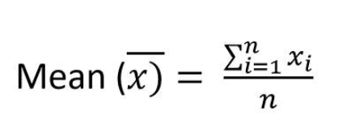
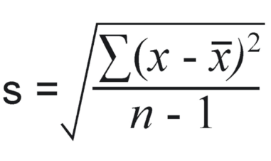
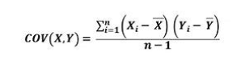
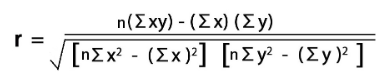

## Descriptive Statistics

In the realm of data science, understanding the characteristics of data is fundamental. Descriptive statistics provides the tools and techniques to succinctly summarize and present the key features of a dataset. It serves as the cornerstone for exploring, visualizing, and ultimately gaining insights from data.

Descriptive statistics encompasses a range of methods designed to describe the central tendency, dispersion, and shape of a dataset. Through measures such as mean, median, mode, standard deviation, and variance, descriptive statistics offer a comprehensive snapshot of the data's distribution and variability.

Data scientists utilize descriptive statistics to uncover patterns, identify outliers, and assess the overall structure of data before delving into more advanced analyses. By summarizing large and complex datasets into manageable and interpretable summaries, descriptive statistics facilitate informed decision-making and actionable insights.


```python
import pandas as pd
import numpy as np
```


```python
df = pd.read_csv("Age-Income-Dataset.csv")
df
```


<div>
<style scoped>
    .dataframe tbody tr th:only-of-type {
        vertical-align: middle;
    }

    .dataframe tbody tr th {
        vertical-align: top;
    }

    .dataframe thead th {
        text-align: right;
    }
</style>
<table border="1" class="dataframe">
  <thead>
    <tr style="text-align: right;">
      <th></th>
      <th>Age</th>
      <th>Income</th>
    </tr>
  </thead>
  <tbody>
    <tr>
      <th>0</th>
      <td>Young</td>
      <td>25000</td>
    </tr>
    <tr>
      <th>1</th>
      <td>Middle Age</td>
      <td>54000</td>
    </tr>
    <tr>
      <th>2</th>
      <td>Old</td>
      <td>60000</td>
    </tr>
    <tr>
      <th>3</th>
      <td>Young</td>
      <td>15000</td>
    </tr>
    <tr>
      <th>4</th>
      <td>Young</td>
      <td>45000</td>
    </tr>
    <tr>
      <th>5</th>
      <td>Young</td>
      <td>65000</td>
    </tr>
    <tr>
      <th>6</th>
      <td>Young</td>
      <td>70000</td>
    </tr>
    <tr>
      <th>7</th>
      <td>Young</td>
      <td>30000</td>
    </tr>
    <tr>
      <th>8</th>
      <td>Middle Age</td>
      <td>27000</td>
    </tr>
    <tr>
      <th>9</th>
      <td>Young</td>
      <td>23000</td>
    </tr>
    <tr>
      <th>10</th>
      <td>Young</td>
      <td>48000</td>
    </tr>
    <tr>
      <th>11</th>
      <td>Old</td>
      <td>52000</td>
    </tr>
    <tr>
      <th>12</th>
      <td>Young</td>
      <td>33000</td>
    </tr>
    <tr>
      <th>13</th>
      <td>Old</td>
      <td>80000</td>
    </tr>
    <tr>
      <th>14</th>
      <td>Old</td>
      <td>75000</td>
    </tr>
    <tr>
      <th>15</th>
      <td>Old</td>
      <td>35000</td>
    </tr>
    <tr>
      <th>16</th>
      <td>Middle Age</td>
      <td>29000</td>
    </tr>
    <tr>
      <th>17</th>
      <td>Middle Age</td>
      <td>57000</td>
    </tr>
    <tr>
      <th>18</th>
      <td>Old</td>
      <td>43000</td>
    </tr>
    <tr>
      <th>19</th>
      <td>Middle Age</td>
      <td>56000</td>
    </tr>
    <tr>
      <th>20</th>
      <td>Old</td>
      <td>63000</td>
    </tr>
    <tr>
      <th>21</th>
      <td>Old</td>
      <td>32000</td>
    </tr>
    <tr>
      <th>22</th>
      <td>Old</td>
      <td>45000</td>
    </tr>
    <tr>
      <th>23</th>
      <td>Old</td>
      <td>89000</td>
    </tr>
    <tr>
      <th>24</th>
      <td>Middle Age</td>
      <td>90000</td>
    </tr>
    <tr>
      <th>25</th>
      <td>Middle Age</td>
      <td>93000</td>
    </tr>
    <tr>
      <th>26</th>
      <td>Young</td>
      <td>80000</td>
    </tr>
    <tr>
      <th>27</th>
      <td>Young</td>
      <td>87000</td>
    </tr>
    <tr>
      <th>28</th>
      <td>Young</td>
      <td>38000</td>
    </tr>
    <tr>
      <th>29</th>
      <td>Young</td>
      <td>23000</td>
    </tr>
    <tr>
      <th>30</th>
      <td>Middle Age</td>
      <td>38900</td>
    </tr>
    <tr>
      <th>31</th>
      <td>Middle Age</td>
      <td>53200</td>
    </tr>
    <tr>
      <th>32</th>
      <td>Old</td>
      <td>43800</td>
    </tr>
    <tr>
      <th>33</th>
      <td>Middle Age</td>
      <td>25600</td>
    </tr>
    <tr>
      <th>34</th>
      <td>Middle Age</td>
      <td>65400</td>
    </tr>
    <tr>
      <th>35</th>
      <td>Old</td>
      <td>76800</td>
    </tr>
    <tr>
      <th>36</th>
      <td>Old</td>
      <td>89700</td>
    </tr>
    <tr>
      <th>37</th>
      <td>Old</td>
      <td>41800</td>
    </tr>
    <tr>
      <th>38</th>
      <td>Young</td>
      <td>31900</td>
    </tr>
    <tr>
      <th>39</th>
      <td>Old</td>
      <td>25600</td>
    </tr>
    <tr>
      <th>40</th>
      <td>Middle Age</td>
      <td>45700</td>
    </tr>
    <tr>
      <th>41</th>
      <td>Old</td>
      <td>35600</td>
    </tr>
    <tr>
      <th>42</th>
      <td>Young</td>
      <td>54300</td>
    </tr>
    <tr>
      <th>43</th>
      <td>Middle Age</td>
      <td>65400</td>
    </tr>
    <tr>
      <th>44</th>
      <td>Old</td>
      <td>67800</td>
    </tr>
    <tr>
      <th>45</th>
      <td>Old</td>
      <td>24500</td>
    </tr>
    <tr>
      <th>46</th>
      <td>Middle Age</td>
      <td>34900</td>
    </tr>
    <tr>
      <th>47</th>
      <td>Old</td>
      <td>45300</td>
    </tr>
    <tr>
      <th>48</th>
      <td>Young</td>
      <td>68400</td>
    </tr>
    <tr>
      <th>49</th>
      <td>Middle Age</td>
      <td>51700</td>
    </tr>
  </tbody>
</table>
</div>


```python
df.describe()
```


<div>
<style scoped>
    .dataframe tbody tr th:only-of-type {
        vertical-align: middle;
    }

    .dataframe tbody tr th {
        vertical-align: top;
    }

    .dataframe thead th {
        text-align: right;
    }
</style>
<table border="1" class="dataframe">
  <thead>
    <tr style="text-align: right;">
      <th></th>
      <th>Income</th>
    </tr>
  </thead>
  <tbody>
    <tr>
      <th>count</th>
      <td>50.000000</td>
    </tr>
    <tr>
      <th>mean</th>
      <td>50966.000000</td>
    </tr>
    <tr>
      <th>std</th>
      <td>21096.683268</td>
    </tr>
    <tr>
      <th>min</th>
      <td>15000.000000</td>
    </tr>
    <tr>
      <th>25%</th>
      <td>33475.000000</td>
    </tr>
    <tr>
      <th>50%</th>
      <td>46850.000000</td>
    </tr>
    <tr>
      <th>75%</th>
      <td>65400.000000</td>
    </tr>
    <tr>
      <th>max</th>
      <td>93000.000000</td>
    </tr>
  </tbody>
</table>
</div>


### Mean 

The mean, also known as the average, is a measure of central tendency in a dataset. It represents the typical value of a set of numbers. The formula to calculate the mean of a dataset is:





xi represents each individual value in the dataset.

n is the total number of values in the dataset


```python
df['Income'].mean()
```


    50966.0


```python
def mean_f(df):
    for col in df.columns:
        if df[col].dtype != 'O':
            temp = 0
            for i in df[col]:
                temp = temp +i
            print("Without pandas Library -> ")
            print("Average of {} is {}".format(col,(temp/len(df[col]))))
            print()
            print("With pandas Libreary -> ")
            print(df[col].mean())

mean_f(df)
```

    Without pandas Library -> 
    Average of Income is 50966.0
    
    With pandas Libreary -> 
    50966.0
    

### Median


The median is another measure of central tendency in a dataset. Unlike the mean, which is the average value of all data points, the median represents the middle value when the dataset is ordered from smallest to largest. If the dataset has an odd number of observations, the median is the middle value. If the dataset has an even number of observations, the median is the average of the two middle values.

The formula to find the median depends on whether the number of observations is odd or even:

* If the number of observations (n) is odd:

    The median (M) is the value at position 

    (n+1)/2 when the dataset is ordered.


* If the number of observations (
n) is even:

    The median (M) is the average of the values at positions 
        n/2 and
    (n/2)+1 when the dataset is ordered.


```python
df['Income'].median()
```


    46850.0


```python
def median_f(df):
    for col in df.columns:
        if df[col].dtype != 'O':
            sorted_data = sorted(df[col])
            n = len(df[col])
            if n%2 == 0:
                x1 =sorted_data[int((n/2))]
                x2 =sorted_data[int((n/2))+1]
                median=(x1+x2)/2
            else:
                median = sorted_data[(n+1)/2]
    print("Median without library ->")
    print("Median of {} is {} ".format(col,median))
    print("Median with library ->")
    print(df[col].median())             
median_f(df)
```

    Median without library ->
    Median of Income is 49850.0 
    Median with library ->
    46850.0
    

### Mode


The mode is a measure of central tendency that represents the value or values that occur most frequently in a dataset. Unlike the mean and median, which focus on the average or middle value, the mode identifies the most common value(s) in the dataset.


```python
def mode_f(df):
    for col in df.columns:
        if df[col].dtype == 'O':
            print("Column:", col)
            arr = df[col].sort_values()
            
            prevcnt = 0
            cnt = 0
            ans = arr[0]
            temp = arr[0]

            for i in arr:
                if(temp == i) :
                    cnt += 1
                else:
                    prevcnt = cnt
                    cnt = 1
                    temp = i
                if(cnt > prevcnt):
                    ans = i
            
            print("Without Library -> ")
            print("Mode of {} is {}".format(col,ans))
            print()
            print("With Library -> ")
            print(df[col].mode())
mode_f(df)
```

    Column: Age
    Without Library -> 
    Mode of Age is Old
    
    With Library -> 
    0    Old
    Name: Age, dtype: object
    


```python

```

### Standard Deviation

Standard deviation is a measure of the dispersion or spread of a dataset. It quantifies the amount of variation or dispersion of a set of values from the mean. In other words, it indicates how much individual values in a dataset deviate from the mean.




```python
df['Income'].std()
```


    21096.683267707253


```python
import math
def std_f(df):
    for col in df.columns:
        if len(df[col]) == 0:
            print("Column is empty")
        if df[col].dtype != 'O':
            sum = 0
            mean = df[col].mean()
            for i in df[col]:
                sum = sum + (i - mean)**2
                
            std = math.sqrt(sum/len(df[col]))
            print("Without pandas library ->")
            print("Std : " , std)
            print("With pandas library: ->")
            print("Std : {}".format(np.std(df[col])))            ##ddof = 1
                
std_f(df)
```

    Without pandas library ->
    Std :  20884.6509187968
    With pandas library: ->
    Std : 20884.6509187968
    


```python
df['Income'].count()
```


    50


### Minimum


```python
df['Income'].min()
```


    15000


```python
def min_f(df):
    for col in df.columns:
        if df[col].dtype != "O":
            sorted_data = sorted(df[col])
            min = sorted_data[0]
            print("Without Library->",min)
            print("With Library->",df[col].min())
    
min_f(df) 
```

    Without Library-> 15000
    With Library-> 15000
    

### Maximum


```python
df['Income'].max()
```


    93000


```python
def max_f(df):
    for col in df.columns:
        if df[col].dtype != "O":
            sorted_data = sorted(df[col])
            max = sorted_data[len(df[col])-1]
            print("Without pandas Library->",max)
            print("With pandas Library->",df[col].max())
    
max_f(df) 
```

    Without pandas Library-> 93000
    With pandas Library-> 93000
    

### Percentile


```python
df['Income'].quantile(0.25)
```


    33475.0


```python
df['Income'].quantile(0.75)
```


    65400.0


```python
def percentile_f(df,percentile):
    for col in df.columns:
        if df[col].dtype != 'O':
            sorted_data = sorted(df[col])
            index = int(percentile*len(df[col]))
            percentile_result = sorted_data[index]
            print(f"{percentile} Percentile is : ",percentile_result)

percentile_f(df,0.25)
```

    0.25 Percentile is :  33000
    

We have used the method of nearest rank to calculate percentile manually.

Pandas uses linear interpolation of data to calculate percentiles.

## Correlation and Covariance


```python
df = pd.read_csv('Iris.csv')
df.head(5)
```


<div>
<style scoped>
    .dataframe tbody tr th:only-of-type {
        vertical-align: middle;
    }

    .dataframe tbody tr th {
        vertical-align: top;
    }

    .dataframe thead th {
        text-align: right;
    }
</style>
<table border="1" class="dataframe">
  <thead>
    <tr style="text-align: right;">
      <th></th>
      <th>Id</th>
      <th>SepalLengthCm</th>
      <th>SepalWidthCm</th>
      <th>PetalLengthCm</th>
      <th>PetalWidthCm</th>
      <th>Species</th>
    </tr>
  </thead>
  <tbody>
    <tr>
      <th>0</th>
      <td>1</td>
      <td>5.1</td>
      <td>3.5</td>
      <td>1.4</td>
      <td>0.2</td>
      <td>Iris-setosa</td>
    </tr>
    <tr>
      <th>1</th>
      <td>2</td>
      <td>4.9</td>
      <td>3.0</td>
      <td>1.4</td>
      <td>0.2</td>
      <td>Iris-setosa</td>
    </tr>
    <tr>
      <th>2</th>
      <td>3</td>
      <td>4.7</td>
      <td>3.2</td>
      <td>1.3</td>
      <td>0.2</td>
      <td>Iris-setosa</td>
    </tr>
    <tr>
      <th>3</th>
      <td>4</td>
      <td>4.6</td>
      <td>3.1</td>
      <td>1.5</td>
      <td>0.2</td>
      <td>Iris-setosa</td>
    </tr>
    <tr>
      <th>4</th>
      <td>5</td>
      <td>5.0</td>
      <td>3.6</td>
      <td>1.4</td>
      <td>0.2</td>
      <td>Iris-setosa</td>
    </tr>
  </tbody>
</table>
</div>


```python
df.drop(['Id','Species'],axis=1,inplace= True)
```

### Covarience

Covariance measures the degree to which two variables change together. If the covariance between two variables is positive, it means that they tend to increase or decrease together. If the covariance is negative, it means that as one variable increases, the other tends to decrease. However, covariance does not provide a standardized measure, making it difficult to interpret the strength of the relationship between variables, especially if the variables are measured in different units.




```python
df.cov()
```


<div>
<style scoped>
    .dataframe tbody tr th:only-of-type {
        vertical-align: middle;
    }

    .dataframe tbody tr th {
        vertical-align: top;
    }

    .dataframe thead th {
        text-align: right;
    }
</style>
<table border="1" class="dataframe">
  <thead>
    <tr style="text-align: right;">
      <th></th>
      <th>SepalLengthCm</th>
      <th>SepalWidthCm</th>
      <th>PetalLengthCm</th>
      <th>PetalWidthCm</th>
    </tr>
  </thead>
  <tbody>
    <tr>
      <th>SepalLengthCm</th>
      <td>0.685694</td>
      <td>-0.039268</td>
      <td>1.273682</td>
      <td>0.516904</td>
    </tr>
    <tr>
      <th>SepalWidthCm</th>
      <td>-0.039268</td>
      <td>0.188004</td>
      <td>-0.321713</td>
      <td>-0.117981</td>
    </tr>
    <tr>
      <th>PetalLengthCm</th>
      <td>1.273682</td>
      <td>-0.321713</td>
      <td>3.113179</td>
      <td>1.296387</td>
    </tr>
    <tr>
      <th>PetalWidthCm</th>
      <td>0.516904</td>
      <td>-0.117981</td>
      <td>1.296387</td>
      <td>0.582414</td>
    </tr>
  </tbody>
</table>
</div>


```python
def cov_f(df):
    for x in df.columns:
        for y in df.columns:
            mean_x = df[x].mean()
            mean_y = df[y].mean()

            sum = 0
            n = len(df[x])

            for val in range(n):
                sum += (df[x].iloc[val] - mean_x)*(df[y].iloc[val] - mean_y)
            print("Covariance of {} and {} is : {}".format(x,y, sum/(n-1)))
        print()
cov_f(df)
```

    Covariance of SepalLengthCm and SepalLengthCm is : 0.6856935123042504
    Covariance of SepalLengthCm and SepalWidthCm is : -0.03926845637583892
    Covariance of SepalLengthCm and PetalLengthCm is : 1.2736823266219246
    Covariance of SepalLengthCm and PetalWidthCm is : 0.5169038031319911
    
    Covariance of SepalWidthCm and SepalLengthCm is : -0.03926845637583892
    Covariance of SepalWidthCm and SepalWidthCm is : 0.1880040268456377
    Covariance of SepalWidthCm and PetalLengthCm is : -0.32171275167785235
    Covariance of SepalWidthCm and PetalWidthCm is : -0.11798120805369115
    
    Covariance of PetalLengthCm and SepalLengthCm is : 1.2736823266219246
    Covariance of PetalLengthCm and SepalWidthCm is : -0.32171275167785235
    Covariance of PetalLengthCm and PetalLengthCm is : 3.113179418344519
    Covariance of PetalLengthCm and PetalWidthCm is : 1.2963874720357946
    
    Covariance of PetalWidthCm and SepalLengthCm is : 0.5169038031319911
    Covariance of PetalWidthCm and SepalWidthCm is : -0.11798120805369115
    Covariance of PetalWidthCm and PetalLengthCm is : 1.2963874720357946
    Covariance of PetalWidthCm and PetalWidthCm is : 0.5824143176733781
    
    

### Correlation

Correlation, on the other hand, standardizes the measure of relationship between two variables, making it easier to interpret. It measures both the strength and direction of the linear relationship between two variables. Correlation values range between -1 and 1, where:




```python
df.corr()
```


<div>
<style scoped>
    .dataframe tbody tr th:only-of-type {
        vertical-align: middle;
    }

    .dataframe tbody tr th {
        vertical-align: top;
    }

    .dataframe thead th {
        text-align: right;
    }
</style>
<table border="1" class="dataframe">
  <thead>
    <tr style="text-align: right;">
      <th></th>
      <th>SepalLengthCm</th>
      <th>SepalWidthCm</th>
      <th>PetalLengthCm</th>
      <th>PetalWidthCm</th>
    </tr>
  </thead>
  <tbody>
    <tr>
      <th>SepalLengthCm</th>
      <td>1.000000</td>
      <td>-0.109369</td>
      <td>0.871754</td>
      <td>0.817954</td>
    </tr>
    <tr>
      <th>SepalWidthCm</th>
      <td>-0.109369</td>
      <td>1.000000</td>
      <td>-0.420516</td>
      <td>-0.356544</td>
    </tr>
    <tr>
      <th>PetalLengthCm</th>
      <td>0.871754</td>
      <td>-0.420516</td>
      <td>1.000000</td>
      <td>0.962757</td>
    </tr>
    <tr>
      <th>PetalWidthCm</th>
      <td>0.817954</td>
      <td>-0.356544</td>
      <td>0.962757</td>
      <td>1.000000</td>
    </tr>
  </tbody>
</table>
</div>


```python
import math
def corr_f(df):
    for i in df.columns:
        for j in df.columns:
            n = len(df[i])
            
            sumX  = 0
            for x in df[i]:
                sumX += x
            sumY = 0
            for y in df[j]:
                sumY += y

            sumXY = 0
            for xy in range(n):
                sumXY += (df[i].iloc[xy] * df[j].iloc[xy])
                
            sumX2  = 0
            for x in df[i]:
                sumX2 += (x**2)
            sumY2 = 0
            for y in df[j]:
                sumY2 += (y**2)

            NR = (n * sumXY) - (sumX*sumY)
            DR = math.sqrt( ( (n * sumX2) - (sumX**2))*( (n * sumY2) - (sumY ** 2) ) )

            print("correaltion of {} and {} :{}".format(i,j,NR/DR))
        print()

corr_f(df)
```

    correaltion of SepalLengthCm and SepalLengthCm :1.0
    correaltion of SepalLengthCm and SepalWidthCm :-0.10936924995067286
    correaltion of SepalLengthCm and PetalLengthCm :0.8717541573048861
    correaltion of SepalLengthCm and PetalWidthCm :0.8179536333691775
    
    correaltion of SepalWidthCm and SepalLengthCm :-0.10936924995067286
    correaltion of SepalWidthCm and SepalWidthCm :1.0
    correaltion of SepalWidthCm and PetalLengthCm :-0.42051609640118826
    correaltion of SepalWidthCm and PetalWidthCm :-0.3565440896138223
    
    correaltion of PetalLengthCm and SepalLengthCm :0.8717541573048861
    correaltion of PetalLengthCm and SepalWidthCm :-0.42051609640118826
    correaltion of PetalLengthCm and PetalLengthCm :1.0
    correaltion of PetalLengthCm and PetalWidthCm :0.9627570970509656
    
    correaltion of PetalWidthCm and SepalLengthCm :0.8179536333691775
    correaltion of PetalWidthCm and SepalWidthCm :-0.3565440896138223
    correaltion of PetalWidthCm and PetalLengthCm :0.9627570970509656
    correaltion of PetalWidthCm and PetalWidthCm :1.0
    
    


```python

```


```python

```
