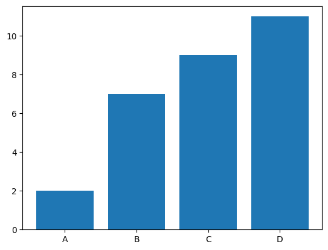
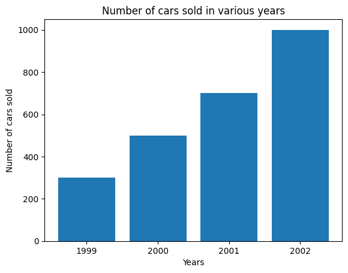
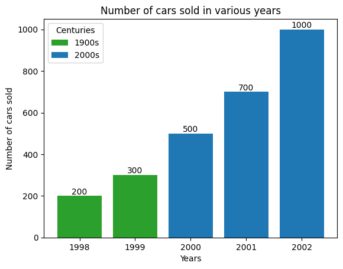
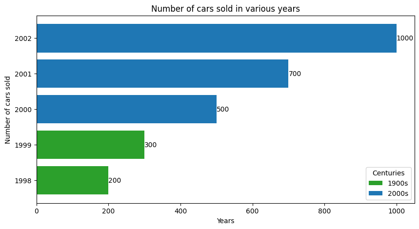
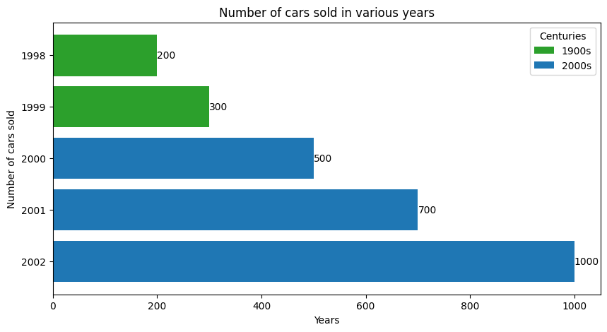

# Bar Plots in Matplotlib
A bar plot or a bar chart is a type of data visualisation that represents data in the form of rectangular bars, with lengths or heights proportional to the values and data which they represent. The bar plots can be plotted both vertically and horizontally.

It is one of the most widely used type of data visualisation as it is easy to interpret and is pleasing to the eyes.

Matplotlib provides a very easy and intuitive method to create highly customized bar plots.

## Prerequisites

Before creating bar plots in matplotlib you must ensure that you have Python as well as Matplotlib installed on your system.

## Creating a simple Bar Plot with `bar()` method

A very basic Bar Plot can be created with `bar()` method in `matplotlib.pyplot`

```Python
import matplotlib.pyplot as plt

# Creating dataset
x = ["A", "B", "C", "D"]
y = [2, 7, 9, 11]

# Creating bar plot
plt.bar(x,y)
plt.show() # Shows the plot
```
When executed, this would show the following bar plot:



The `bar()` function takes arguments that describes the layout of the bars.

Here, `plt.bar(x,y)` is used to specify that the bar chart is to be plotted by taking the `x` array as X-axis and `y` array as Y-axis. You can customize the graph further like adding labels to the axes, color of the bars, etc. These will be explored in the upcoming sections.

Additionally, you can also use `numpy` arrays for faster generation when handling large datasets.

```Python
import matplotlib.pyplot as plt
import numpy as np

# Using numpy array
x = np.array(["A", "B", "C", "D"])
y = np.array([2, 7, 9, 11])

plt.bar(x,y)
plt.show()
```
Its output would be the same as above.

## Customizing Bar Plots

For creating customized bar plots, it is **highly recommended** to create the plots using `matplotlib.pyplot.subplots()`, otherwise it is difficult to apply the customizations in the newer versions of Matplotlib.

### Adding title to the graph and labeling the axes

Let us create an imaginary graph of number of cars sold in a various years.

```Python
import matplotlib.pyplot as plt

fig, ax = plt.subplots()

years = ['1999', '2000', '2001', '2002']
num_of_cars_sold = [300, 500, 700, 1000]

# Creating bar plot
ax.bar(years, num_of_cars_sold)

# Adding axis labels
ax.set_xlabel("Years")
ax.set_ylabel("Number of cars sold")

# Adding plot title
ax.set_title("Number of cars sold in various years")

plt.show()
```



Here, we have created a `matplotlib.pyplot.subplots()` object which returns a `Figure` object `fig` as well as an `Axes` object `ax` both of which are used for customizing the bar plot. `ax.set_xlabel`, `ax.set_ylabel` and `ax.set_title` are respectively used for adding labels of X, Y axis and adding title to the graph.

### Adding bar colors and legends

Let us consider our previous example of number of cars sold in various years and suppose that we want to add different colors to the bars from different centuries and respective legends for better interpretation.

This can be achieved by creating two separate arrays `bar_colors` for bar colors and `bar_labels` for legend labels and passing them as arguments to parameters color and label respectively in `ax.bar` method.

```Python
import matplotlib.pyplot as plt

fig, ax = plt.subplots()

years = ['1998', '1999', '2000', '2001', '2002']
num_of_cars_sold = [200, 300, 500, 700, 1000]
bar_colors = ['tab:green', 'tab:green', 'tab:blue', 'tab:blue', 'tab:blue']
bar_labels = ['1900s', '_1900s', '2000s', '_2000s', '_2000s']

# Creating the customized bar plot
ax.bar(years, num_of_cars_sold, color=bar_colors, label=bar_labels)

# Adding axis labels
ax.set_xlabel("Years")
ax.set_ylabel("Number of cars sold")

# Adding plot title
ax.set_title("Number of cars sold in various years")

# Adding legend title
ax.legend(title='Centuries')

plt.show()
```


Note that the labels with a preceding underscore won't show up in the legend. Legend titles can be added by simply passing `title` argument in `ax.legend()`, as shown. Also, you can have a different color for all the bars by passing the `HEX` value of that color in the `color` parameter.

### Adding labels to bars

We may want to add labels to bars representing their absolute (or truncated) values for instant and accurate reading. This can be achieved by passing the `BarContainer` object (returned by `ax.bar()` method) which is basically a aontainer with all the bars and optionally errorbars to `ax.bar_label` method.

```Python
import matplotlib.pyplot as plt

fig, ax = plt.subplots()

years = ['1998', '1999', '2000', '2001', '2002']
num_of_cars_sold = [200, 300, 500, 700, 1000]
bar_colors = ['tab:green', 'tab:green', 'tab:blue', 'tab:blue', 'tab:blue']
bar_labels = ['1900s', '_1900s', '2000s', '_2000s', '_2000s']

# BarContainer object
bar_container = ax.bar(years, num_of_cars_sold, color=bar_colors, label=bar_labels)

ax.set_xlabel("Years")
ax.set_ylabel("Number of cars sold")
ax.set_title("Number of cars sold in various years")
ax.legend(title='Centuries')

# Adding bar labels
ax.bar_label(bar_container)

plt.show()
```



**Note:** There are various other methods of adding bar labels in matplotlib.

## Horizontal Bar Plot

We can create horizontal bar plots by using the `barh()` method in `matplotlib.pyplot`. All the relevant customizations are applicable here also.

```Python
import matplotlib.pyplot as plt

fig, ax = plt.subplots(figsize=(10,5)) # figsize is used to alter the size of figure

years = ['1998', '1999', '2000', '2001', '2002']
num_of_cars_sold = [200, 300, 500, 700, 1000]
bar_colors = ['tab:green', 'tab:green', 'tab:blue', 'tab:blue', 'tab:blue']
bar_labels = ['1900s', '_1900s', '2000s', '_2000s', '_2000s']

# Creating horizontal bar plot
bar_container = ax.barh(years, num_of_cars_sold, color=bar_colors, label=bar_labels)

# Adding axis labels
ax.set_xlabel("Years")
ax.set_ylabel("Number of cars sold")

# Adding Title
ax.set_title("Number of cars sold in various years")
ax.legend(title='Centuries')

# Adding bar labels
ax.bar_label(bar_container)

plt.show()
```



We can also invert the Y-axis labels here to show the top values first.

```Python
import matplotlib.pyplot as plt

fig, ax = plt.subplots(figsize=(10,5)) # figsize is used to alter the size of figure

years = ['1998', '1999', '2000', '2001', '2002']
num_of_cars_sold = [200, 300, 500, 700, 1000]
bar_colors = ['tab:green', 'tab:green', 'tab:blue', 'tab:blue', 'tab:blue']
bar_labels = ['1900s', '_1900s', '2000s', '_2000s', '_2000s']

# Creating horizontal bar plot
bar_container = ax.barh(years, num_of_cars_sold, color=bar_colors, label=bar_labels)

# Adding axis labels
ax.set_xlabel("Years")
ax.set_ylabel("Number of cars sold")

# Adding Title
ax.set_title("Number of cars sold in various years")
ax.legend(title='Centuries')

# Adding bar labels
ax.bar_label(bar_container)

# Inverting Y-axis
ax.invert_yaxis()

plt.show()
```


