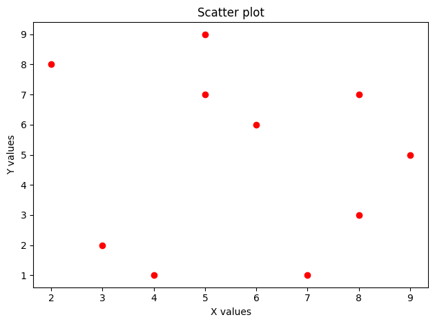

# Introducing MatplotLib

Data visualisation is the analysing and understanding the data via graphical representation of the data by the means of pie charts, histograms, scatterplots and line graphs.

To make this process of data visualization easier and clearer, matplotlib library is used.

## Features of MatplotLib library
- MatplotLib library is one of the most popular python packages for 2D representation of data
- Combination of matplotlib and numpy is used for easier computations and visualization of large arrays and data. Matplotlib along with NumPy can be considered as the open source equivalent of MATLAB.

- Matplotlib has a procedural interface named the Pylab, which is designed to resemble MATLAB. However, it is completely independent of Matlab.

## Starting with Matplotlib

### 1. Install and import the neccasary libraries - mayplotlib.pylplot

```bash
pip install matplotlib
```

```python
import maptplotlib.pyplot as plt
import numpy as np
```

### 2. Scatter plot
Scatter plot is a type of plot that uses the cartesian coordinates between x and y to describe the relation between them. It uses dots to represent relation between the data variables of the data set.

```python
x = [5,4,5,8,9,8,6,7,3,2]
y = [9,1,7,3,5,7,6,1,2,8]

plt.scatter(x,y, color = "red")

plt.title("Scatter plot")
plt.xlabel("X values")
plt.ylabel("Y values")

plt.tight_layout()
plt.show()
```



### 3. Bar plot
Bar plot is a type of plot that plots the frequency distrubution of the categorical variables. Each entity of the categoric variable is represented as a bar. The size of the bar represents its numeric value.

```python
x = np.array(['A','B','C','D'])
y = np.array([42,50,15,35])

plt.bar(x,y,color = "red")

plt.title("Bar plot")
plt.xlabel("X values")
plt.ylabel("Y values")

plt.show()
```


### 4. Histogram
Histogram is the representation of frequency distribution of qualitative data. The height of each rectangle defines the amount, or how often that variable appears.

```python
x = [9,1,7,3,5,7,6,1,2,8]

plt.hist(x, color = "red", edgecolor= "white", bins =5)

plt.title("Histogram")
plt.xlabel("X values")
plt.ylabel("Frequency Distribution")

plt.show()
```


