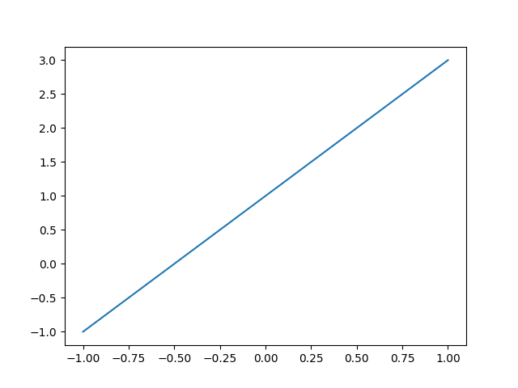
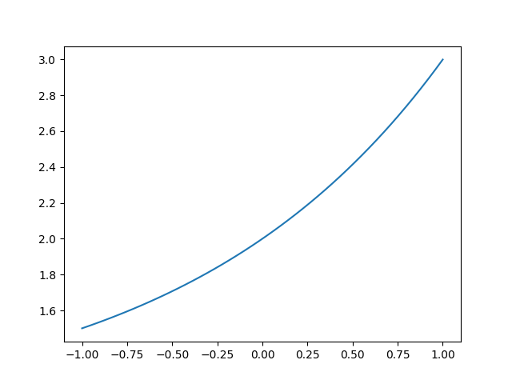
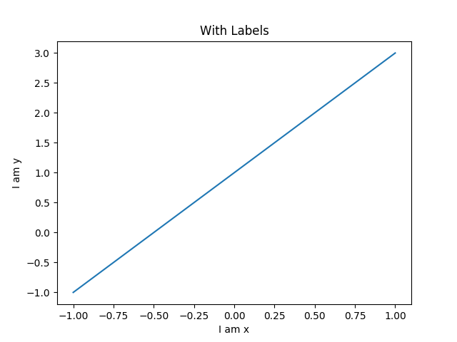
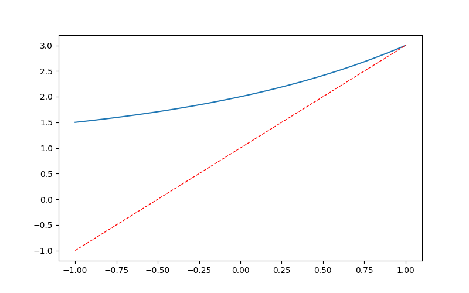
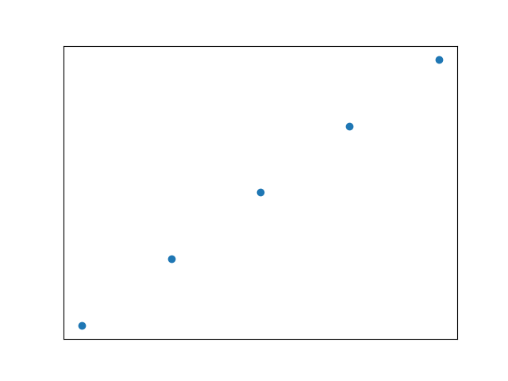
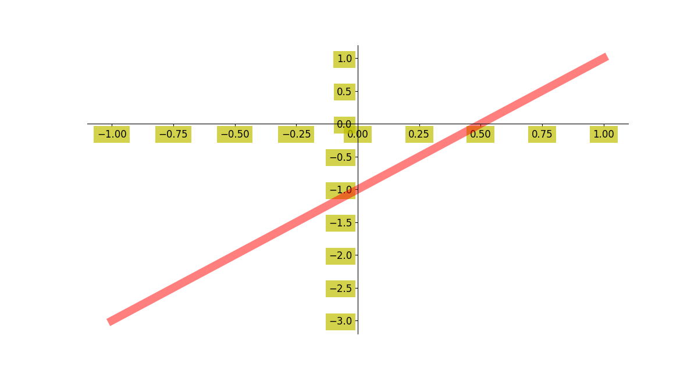

# Line Chart in Matplotlib

A line chart is a simple way to visualize data where we connect individual data points. It helps us to see trends and patterns over time or across categories. 

This type of chart is particularly useful for:
- Comparing Data: Comparing multiple datasets on the same axes.
- Highlighting Changes: Illustrating changes and patterns in data.
- Visualizing Trends: Showing trends over time or other continuous variables.

## Prerequisites

Line plots can be created in Python with Matplotlib's `pyplot` library. To build a line plot, first import `matplotlib`. It is a standard convention to import Matplotlib's pyplot library as `plt`.

```python
import matplotlib.pyplot as plt
```

## Creating a simple Line Plot

First import matplotlib and numpy, these are useful for charting.

You can use the `plot(x,y)` method to create a line chart.

```python
import matplotlib.pyplot as plt
import numpy as np

x = np.linspace(-1, 1, 50)
print(x)
y = 2*x + 1

plt.plot(x, y)
plt.show()
```

When executed, this will show the following line plot:




## Curved line

The `plot()` method also works for other types of line charts. It doesn’t need to be a straight line, y can have any type of values.

```python
import matplotlib.pyplot as plt
import numpy as np

x = np.linspace(-1, 1, 50)
y = 2**x + 1

plt.plot(x, y)  
plt.show()
```

When executed, this will show the following Curved line plot:




## Line with Labels

To know what you are looking at, you need meta data. Labels are a type of meta data. They show what the chart is about. The chart has an `x label`, `y label` and `title`.

```python
import matplotlib.pyplot as plt
import numpy as np

x = np.linspace(-1, 1, 50)
y1 = 2*x + 1
y2 = 2**x + 1

plt.figure()
plt.plot(x, y1)  

plt.xlabel("I am x")
plt.ylabel("I am y")
plt.title("With Labels")

plt.show()
```

When executed, this will show the following line with labels plot:



## Multiple lines

More than one line can be in the plot. To add another line, just call the `plot(x,y)` function again. In the example below we have two different values for `y(y1,y2)` that are plotted onto the chart.

```python
import matplotlib.pyplot as plt
import numpy as np

x = np.linspace(-1, 1, 50)
y1 = 2*x + 1
y2 = 2**x + 1

plt.figure(num = 3, figsize=(8, 5))
plt.plot(x, y2)
plt.plot(x, y1, 
         color='red',   
         linewidth=1.0,  
         linestyle='--' 
        )

plt.show()
```

When executed, this will show the following Multiple lines plot:




## Dotted line

Lines can be in the form of dots like the image below. Instead of calling `plot(x,y)` call the `scatter(x,y)` method. The `scatter(x,y)` method can also be used to (randomly) plot points onto the chart.

```python
import matplotlib.pyplot as plt
import numpy as np

n = 1024
X = np.random.normal(0, 1, n)
Y = np.random.normal(0, 1, n)
T = np.arctan2(X, Y)

plt.scatter(np.arange(5), np.arange(5))

plt.xticks(())
plt.yticks(())

plt.show()
```

When executed, this will show the following Dotted line plot:



## Line ticks

You can change the ticks on the plot. Set them on the `x-axis`, `y-axis` or even change their color. The line can be more thick and have an alpha value.

```python
import matplotlib.pyplot as plt
import numpy as np

x = np.linspace(-1, 1, 50)
y = 2*x - 1

plt.figure(figsize=(12, 8)) 
plt.plot(x, y, color='r', linewidth=10.0, alpha=0.5)

ax = plt.gca()

ax.spines['right'].set_color('none')
ax.spines['top'].set_color('none')

ax.xaxis.set_ticks_position('bottom')
ax.yaxis.set_ticks_position('left')

ax.spines['bottom'].set_position(('data', 0))
ax.spines['left'].set_position(('data', 0))

for label in ax.get_xticklabels() + ax.get_yticklabels():
    label.set_fontsize(12)
    label.set_bbox(dict(facecolor='y', edgecolor='None', alpha=0.7))

plt.show()
```

When executed, this will show the following line ticks plot:



## Line with asymptote

An asymptote can be added to the plot. To do that, use `plt.annotate()`. There’s lso a dotted line in the plot below. You can play around with the code to see how it works.

```python
import matplotlib.pyplot as plt
import numpy as np

x = np.linspace(-1, 1, 50)
y1 = 2*x + 1
y2 = 2**x + 1

plt.figure(figsize=(12, 8))  
plt.plot(x, y2)
plt.plot(x, y1, color='red', linewidth=1.0, linestyle='--')

ax = plt.gca()

ax.spines['right'].set_color('none')
ax.spines['top'].set_color('none')

ax.xaxis.set_ticks_position('bottom')
ax.yaxis.set_ticks_position('left')

ax.spines['bottom'].set_position(('data', 0))
ax.spines['left'].set_position(('data', 0))


x0 = 1
y0 = 2*x0 + 1

plt.scatter(x0, y0, s = 66, color = 'b')
plt.plot([x0, x0], [y0, 0], 'k-.', lw= 2.5)

plt.annotate(r'$2x+1=%s$' % 
             y0, 
             xy=(x0, y0), 
             xycoords='data',
             
             xytext=(+30, -30),
             textcoords='offset points',
             fontsize=16,  
             arrowprops=dict(arrowstyle='->',connectionstyle='arc3,rad=.2')
            )

plt.text(0, 3, 
         r'$This\ is\ a\ good\ idea.\ \mu\ \sigma_i\ \alpha_t$',
         fontdict={'size':16,'color':'r'})

plt.show()
```

When executed, this will show the following Line with asymptote plot:


## Line with text scale

It doesn’t have to be a numeric scale. The scale can also contain textual words like the example below. In `plt.yticks()` we just pass a list with text values. These values are then show against the `y axis`.

```python
import matplotlib.pyplot as plt
import numpy as np

x = np.linspace(-1, 1, 50)
y1 = 2*x + 1
y2 = 2**x + 1

plt.figure(num = 3, figsize=(8, 5))  
plt.plot(x, y2)

plt.plot(x, y1, 
         color='red',  
         linewidth=1.0,  
         linestyle='--'  
        )

plt.xlim((-1, 2))  
plt.ylim((1, 3))  

new_ticks = np.linspace(-1, 2, 5)
plt.xticks(new_ticks)
plt.yticks([-2, -1.8, -1, 1.22, 3],
          [r'$really\ bad$', r'$bad$', r'$normal$', r'$good$', r'$readly\ good$'])

ax = plt.gca()
ax.spines['right'].set_color('none')
ax.spines['top'].set_color('none')

ax.xaxis.set_ticks_position('bottom')
ax.yaxis.set_ticks_position('left')

ax.spines['bottom'].set_position(('data', 0))
ax.spines['left'].set_position(('data', 0))

plt.show()
```

When executed, this will show the following Line with text scale plot:


