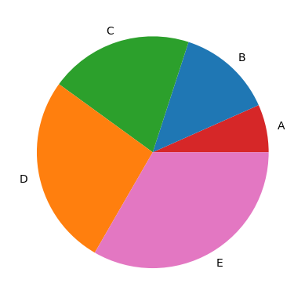
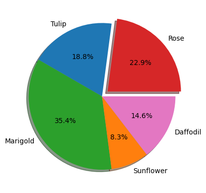
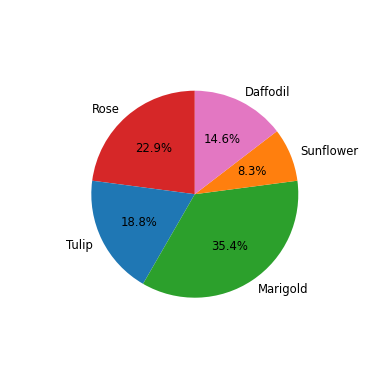

# Pie Charts in Matplotlib

A pie chart is a type of graph that represents the data in the circular graph. The slices of pie show the relative size of the data, and it is a type of pictorial representation of data. A pie chart requires a list of categorical variables and numerical variables. Here, the term "pie" represents the whole, and the "slices" represent the parts of the whole.

Pie charts are commonly used in business presentations like sales, operations, survey results, resources, etc. as they are pleasing to the eye and provide a quick summary.

## Prerequisites

Before creating pie charts in matplotlib you must ensure that you have Python as well as Matplotlib installed on your system.

## Creating a simple pie chart with `pie()` method

A basic pie chart can be created with `pie()` method in `matplotlib.pyplot`.

```Python
import matplotlib.pyplot as plt

# Creating dataset
labels = ['A','B','C','D','E']
data = [10,20,30,40,50]

# Creating Plot
plt.pie(data, labels=labels)

# Show plot
plt.show()
```

When executed, this would show the following pie chart:


Note that the slices of the pie are labelled according to their corresponding proportion in the `data` as a whole.

The `pie()` function takes arguments that describes the layout of the pie chart.

Here, `plt.pie(data, labels=labels)` is used to specify that the pie chart is to be plotted by taking the values from array `data` and the fractional area of each slice is represented by **data/sum(data)**. The array `labels` represents the labels of slices corresponding to each value in `data`.

You can customize the graph further like specifying custom colors for slices, exploding slices, labeling wedges (slices), etc. These will be explored in the upcoming sections.

## Customizing Pie Chart in Matplotlib

For creating customized plots, it is highly recommended to create the plots using `matplotlib.pyplot.subplots()`, otherwise it is difficult to apply the customizations in the newer versions of Matplotlib.

### Coloring Slices

You can add custom set of colors to the slices by passing an array of colors to `colors` parameter in `pie()` method.

```Python
import matplotlib.pyplot as plt

# Creating dataset
labels = ['A','B','C','D','E']
data = [10,20,30,40,50]
colors = ['tab:red', 'tab:blue', 'tab:green', 'tab:orange', 'tab:pink']

# Creating plot using matplotlib.pyplot.subplots()
fig, ax = plt.subplots()
ax.pie(data, labels=labels, colors=colors)

# Show plot
plt.show()
```


Here, we have created a `matplotlib.pyplot.subplots()` object which returns a `Figure` object `fig` as well as an `Axes` object `ax` both of which are used for customizing the pie chart.

**Note:** Each slice of the pie chart is a `patches.Wedge` object; therefore in addition to the customizations shown here, each wedge can be customized using the `wedgeprops` argument which takes Python dictionary as parameter with name values pairs denoting the wedge properties like linewidth, edgecolor, etc.

### Hatching Slices

To make the pie chart more pleasing, you can pass a list of hatch patters to `hatch` parameter to set the pattern of each slice.

```Python
import matplotlib.pyplot as plt

# Creating dataset
labels = ['A','B','C','D','E']
data = [10,20,30,40,50]
colors = ['tab:red', 'tab:blue', 'tab:green', 'tab:orange', 'tab:pink']
hatch = ['*O', 'oO', 'OO', '.||.', '|*|']     # Hatch patterns

# Creating plot
fig, ax = plt.subplots()
ax.pie(data, labels=labels, colors=colors, hatch=hatch)

# Show plot
plt.show()
```


You can try and test your own beautiful hatch patters!

### Labeling Slices

You can pass a function or format string to `autopct` parameter to label slices.

An example in shown here:

```Python
import matplotlib.pyplot as plt

# Creating dataset
labels = ['Rose','Tulip','Marigold','Sunflower','Daffodil']
data = [11,9,17,4,7]
colors=['tab:red', 'tab:blue', 'tab:green', 'tab:orange', 'tab:pink']

# Creating plot
fig, ax = plt.subplots()
ax.pie(data, labels=labels, colors=colors, autopct='%1.1f%%')

# Show plot
plt.show()
```


Here, `autopct='%1.1f%%'` specifies that the wedges (slices) have to be labelled corresponding to the percentage proportion which they occupy out of 100% with precision upto 1 decimal places.

### Exploding Slices

The explode parameter separates a portion of the chart. You can explode slices by passing an array of numbers to `explode` parameter.

```Python
import matplotlib.pyplot as plt

# Creating dataset
labels = ['Rose','Tulip','Marigold','Sunflower','Daffodil']
data = [11,9,17,4,7]
colors=['tab:red', 'tab:blue', 'tab:green', 'tab:orange', 'tab:pink']

# Explode only the first slice, i.e 'Rose'
explode = [0.1, 0, 0, 0, 0]

# Creating plot
fig, ax = plt.subplots()
ax.pie(data, labels=labels, colors=colors, explode=explode, autopct='%1.1f%%')

# Show plot
plt.show()
```


### Shading Slices

You can add shadow to slices by passing `shadow=True` in `pie()` method.

```Python
import matplotlib.pyplot as plt

# Creating dataset
labels = ['Rose','Tulip','Marigold','Sunflower','Daffodil']
data = [11,9,17,4,7]
colors=['tab:red', 'tab:blue', 'tab:green', 'tab:orange', 'tab:pink']

# Explode only the first slice, i.e 'Rose'
explode = [0.1, 0, 0, 0, 0]

# Creating plot
fig, ax = plt.subplots()
ax.pie(data, labels=labels, colors=colors, explode=explode, shadow=True, autopct='%1.1f%%')

# Show plot
plt.show()
```


### Rotating Slices

You can rotate slices by passing a custom start angle value to the `startangle` parameter.

```Python
import matplotlib.pyplot as plt

# Creating dataset
labels = ['Rose','Tulip','Marigold','Sunflower','Daffodil']
data = [11,9,17,4,7]
colors=['tab:red', 'tab:blue', 'tab:green', 'tab:orange', 'tab:pink']

# Creating plot
fig, ax = plt.subplots()
ax.pie(data, labels=labels, colors=colors, startangle=90, autopct='%1.1f%%')

# Show plot
plt.show()
```


The default `startangle` is 0, which would start the first slice ('Rose') on the positive x-axis. This example sets `startangle=90` such that all the slices are rotated counter-clockwise by 90 degrees, and the `'Rose'` slice starts on the positive y-axis.

### Controlling Size of Pie Chart

In addition to the size of figure, you can also control the size of pie chart using the `radius` parameter.

```Python
import matplotlib.pyplot as plt

# Creating dataset
labels = ['Rose','Tulip','Marigold','Sunflower','Daffodil']
data = [11,9,17,4,7]
colors=['tab:red', 'tab:blue', 'tab:green', 'tab:orange', 'tab:pink']

# Creating plot
fig, ax = plt.subplots()
ax.pie(data, labels=labels, colors=colors, startangle=90, autopct='%1.1f%%', textprops={'size': 'smaller'}, radius=0.7)

# Show plot
plt.show()
```


Note that `textprops` is an additional argument which can be used for controlling the propoerties of any text in the pie chart. In this case, we have specified that the size of text should be smaller. There are many more such properties available in `textprops`.

### Adding Legends

You can also use legends to act like a label to slices, like this:

```Python
import matplotlib.pyplot as plt

# Creating dataset
labels = ['Rose','Tulip','Marigold','Sunflower','Daffodil']
data = [11,9,17,4,7]
colors=['tab:red', 'tab:blue', 'tab:green', 'tab:orange', 'tab:pink']

# Creating plot
fig, ax = plt.subplots(figsize=(7,7))
ax.pie(data, colors=colors, startangle=90, autopct='%1.1f%%', radius=0.7)
plt.legend(labels, title="Flowers")

# Show plot
plt.show()
```

