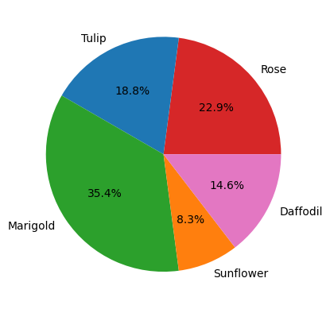
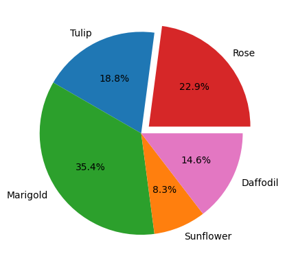
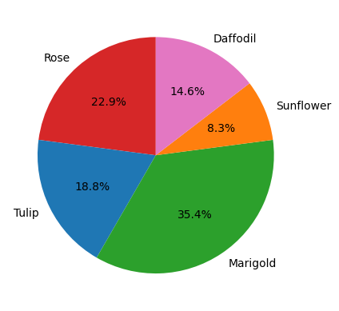
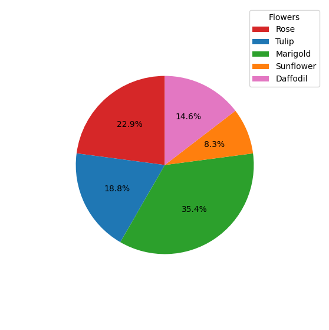

@ -0,0 +1,118 @@
# Pie chart in Matplotlib
A pie chart is a type of graph that represents the data in the `circular graph`. The slices of pie show the relative size of the data, and it is a type of pictorial representation of data. A pie chart requires a list of categorical variables and numerical variables. Here, the term "pie" represents the whole, and the "slices" represent the parts of the whole.

Pie charts are commonly used in business presentations like sales, operations, survey results, resources, etc. as they are pleasing to the eye and provide a quick summary.

## Prerequisites

Before creating pie charts in matplotlib you must ensure that you have Python as well as Matplotlib installed on your system.

* In `matplotlib.pyplot` a simple pie graph can created using `Pie() function`.
* Pie() function can only plot single type of data range only.

`Labels` is used to label Slices of pie

Here is an example for creating a basic pie chart.
```python
import matplotlib.pyplot as plt
# creating dataset
data=[10,20,30,40,50]
labels=["A","B","C","D","E"]

#creating plot
plt.pie(data,labels=labels)
plt.show()
```
This is the output of the above code:


The `pie()` function takes arguments that describes the layout of the pie chart.

Here, `plt.pie(data, labels=labels)` is used to specify that the pie chart is to be plotted by taking the values from array `data` and the fractional area of each slice is represented by **data/sum(data)**. The array `labels` represents the labels of slices corresponding to each value in `data`.

You can customize the graph further like specifying custom colors for slices, exploding slices, labeling wedges (slices), etc. These will be explored in the upcoming sections.

## Customizing Pie Chart in Matplotlib


### Coloring slices
We can add custom set of colors to the slices by passing an array of colors to `colors` parameter int `pir()` function.

```python
import matplotlib.pyplot as plt
# creating dataset
data=[10,20,30,40,50]
labels=["A","B","C","D","E"]
colr = ['red', 'yellow', 'green', 'blue','orange']
#creating plot
plt.pie(data,labels=labels,colors=colr)
plt.show()

```
 

Here, we have created a `matplotlib.pyplot.subplots()` object which returns a `Figure` object `fig` as well as an `Axes` object `ax` both of which are used for customizing the pie chart.

**Note:** Each slice of the pie chart is a `patches.Wedge` object; therefore in addition to the customizations shown here, each wedge can be customized using the `wedgeprops` argument which takes Python dictionary as parameter with name values pairs denoting the wedge properties like linewidth, edgecolor, etc.

### Hatching Slices

To make the pie chart more pleasing, you can pass a list of hatch patters to `hatch` parameter to set the pattern of each slice.

```Python
import matplotlib.pyplot as plt

# Creating dataset
labels = ['A','B','C','D','E']
data = [10,20,30,40,50]
colr = ['red', 'yellow', 'lightgreen', 'blue','orange']
hatch = ['*', 'o', 'oO', '.', '+']     # Hatch patterns

# Creating plot
fig, ax = plt.subplots()
ax.pie(data, labels=labels, colors=colr, hatch=hatch)

# Show plot
plt.show()
```


You can try and test your own beautiful hatch patters!

### Labeling Slices

`autopct` is used to add formatted slice percentages to the pie chart.

`autopct  string format`   
**"%[flags][width][.precision]type"**


  * % symbol signifies that it is special string which will determine the format of the values to be displayed.
  * width determines the total number of characters to be displayed.
  * If the value displayed has lesser number of digits than the width specified then the vlaue is padded as per the fag specified.
  * precision determines the number of decimal places to be displayed.
  * type determines the type of the value to be displayed.
  * %%(two percentage signs) are used to print a % sign.
  * example:

  1.) Format String: "%05i%%"
  
  description:
  
  flag=0
  width =5 , type =integer type
  
  value=123

  printed value=00123 %
  (output is printed as 2 leading zeroes)

  2.) Format String: "%5.2f"
  
  description:
  
  width = 5 , type =float type
  
  value=12.567
  
  printed value=_12.57
  (output is printed as 1 leading blanks)

```Python
import matplotlib.pyplot as plt

# Creating dataset
labels = ['A','B','C','D','E']
data = [10,20,30,40,50]
colr = ['red', 'yellow', 'lightgreen', 'blue','orange']
hatch = ['*', 'o', 'oO', '.', '+']     # Hatch patterns

# Creating plot
fig, ax = plt.subplots()
ax.pie(data, labels=labels, colors=colr, autopct ='%1.1f%%')

# Show plot
plt.show()
```


### Exploding Slices
`explode` is used to change the position of the slices.It is used when we want to emphasize on one or more slices.
It makes slices pulled out by given distance.

```Python
import matplotlib.pyplot as plt

# Creating dataset
labels = ['Rose','Tulip','Marigold','Sunflower','Daffodil']
data = [11,9,17,4,7]
colors=['red', 'lightblue', 'lightgreen', 'orange', 'pink']

# Explode only the first slice, i.e 'Rose' by a distance of 0.1
explode = [0.1, 0, 0, 0, 0]

# Creating plot
fig, ax = plt.subplots()
ax.pie(data, labels=labels, colors=colors, explode=explode, autopct='%1.1f%%')

# Show plot
plt.show()
```



### Shading slices
`shadow` is used to add shadow to the pie chart.It takes boolean argument (i.e True ,False)

```Python
import matplotlib.pyplot as plt

# Creating dataset
labels = ['Rose','Tulip','Marigold','Sunflower','Daffodil']
data = [11,9,17,4,7]
colors=['red', 'lightblue', 'lightgreen', 'orange', 'pink']

# Explode only the first slice, i.e 'Rose'
explode = [0.1, 0, 0, 0, 0]

# Creating plot
fig, ax = plt.subplots()
ax.pie(data, labels=labels, colors=colors, explode=explode, shadow=True, autopct='%1.1f%%')

# Show plot
plt.show()
```


### Rotating Slices
`startangle` is used to rotate slicesby passing a start angle parameter.


```Python
import matplotlib.pyplot as plt

# Creating dataset
labels = ['Rose','Tulip','Marigold','Sunflower','Daffodil']
data = [11,9,17,4,7]
colors=['red', 'lightblue', 'green', 'orange', 'pink']

# Creating plot
fig, ax = plt.subplots()
ax.pie(data, labels=labels, colors=colors, startangle=90, autopct='%1.1f%%')

# Show plot
plt.show()
```


The default `startangle` is 0, which would start the first slice ('Rose') on the positive x-axis. This example sets `startangle=90` such that all the slices are rotated counter-clockwise by 90 degrees, and the `'Rose'` slice starts on the positive y-axis.

### Controlling Size of Pie Chart

In addition to the size of figure, you can also control the size of pie chart using the `radius` parameter.

```Python
import matplotlib.pyplot as plt

# Creating dataset
labels = ['Rose','Tulip','Marigold','Sunflower','Daffodil']
data = [11,9,17,4,7]
colors=['red', 'lightblue', 'lightgreen', 'orange', 'pink']

# Creating plot
fig, ax = plt.subplots()
ax.pie(data, labels=labels, colors=colors, startangle=90, autopct='%1.1f%%', textprops={'size': 'smaller'}, radius=0.7)

# Show plot
plt.show()
```


Note that `textprops` is an additional argument which can be used for controlling the propoerties of any text in the pie chart. In this case, we have specified that the size of text should be smaller. There are many more such properties available in `textprops`.
Like:
  * fontsize: Sets the size of the font.
  * color: Specifies the color of the text. Accepts any valid color value in Matplotlib.
  * fontweight: Sets the weight of the font (e.g., 'normal', 'bold', 'heavy', 'light', etc.).
  * fontstyle: Defines the style of the font (e.g., 'normal', 'italic', 'oblique').
  * family: Sets the font family (e.g., 'serif', 'sans-serif', 'monospace').


###  Customizing Wedges 

`wedgeprops` is used to change the properties of the wedges.

```python

import matplotlib.pyplot as plt

# Creating dataset
labels = ['Rose', 'Tulip', 'Marigold', 'Sunflower', 'Daffodil']
data = [11, 9, 17, 4, 7]
colors = ['red', 'lightblue', 'lightgreen', 'orange', 'pink']
wedge_properties = {'edgecolor': 'black', 'linewidth': 2, 'linestyle': 'dashed', 'alpha': 0.7}

# Creating plot
fig, ax = plt.subplots()
ax.pie(data, labels=labels, colors=colors, startangle=90, autopct='%1.1f%%', wedgeprops=wedge_properties)

# Show plot
plt.show()
```


### Label distance 
* `labeldistance` is used to change the distance of the labels from the pie chart.
example:
  * labeldistance=1.0 places the labels exactly on the boundary of the pie.
  * labeldistance=1.2 places the labels slightly outside the boundary.
  * labeldistance=0.8 places the labels inside the boundary.

```python
import matplotlib.pyplot as plt

# Creating dataset
labels = ['Rose', 'Tulip', 'Marigold', 'Sunflower', 'Daffodil']
data = [11, 9, 17, 8, 7]
colors = ['red', 'lightblue', 'lightgreen', 'orange', 'pink']
wedge_properties = {'edgecolor': 'black', 'linewidth': 2, 'linestyle': 'dashed', 'alpha': 0.7}

# Creating plot
fig, ax = plt.subplots()
ax.pie(data, labels=labels, colors=colors, labeldistance=1,autopct='%1.1f%%')

# Show plot
plt.show()
```


### Adding Legends

You can also use legends to act like a label to slices, like this:

```Python
import matplotlib.pyplot as plt

# Creating dataset
labels = ['Rose','Tulip','Marigold','Sunflower','Daffodil']
data = [11,9,17,4,7]
colors=['red', 'blue', 'green', 'orange', 'pink']

# Creating plot
fig, ax = plt.subplots(figsize=(7,7))
ax.pie(data, colors=colors, startangle=90, autopct='%1.1f%%', radius=0.7)
plt.legend(labels, title="Flowers")

# Show plot
plt.show()
```

