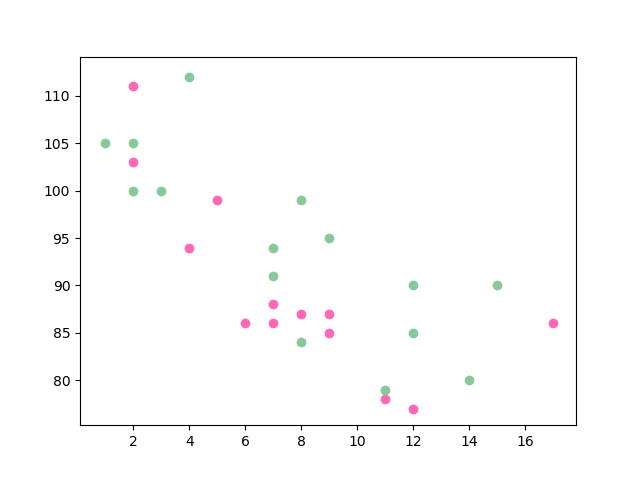
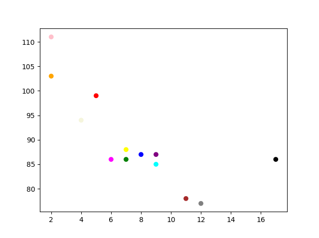

# Scatter() plot in matplotlib
* A scatter plot is a type of data visualization that uses dots to show values for two variables, with one variable on the x-axis and the other on the y-axis. It's useful for identifying relationships, trends, and correlations, as well as spotting clusters and outliers.
* The dots on the plot shows how the variables are related. A scatter plot is made with the matplotlib library's `scatter() method`.
## Syntax
**Here's how to write code for the `scatter() method`:**
```
matplotlib.pyplot.scatter (x_axis_value, y_axis_value, s = None, c = None, vmin = None, vmax = None, marker = None, cmap = None, alpha = None, linewidths = None, edgecolors = None)

```
## Prerequisites
Scatter plots can be created in Python with Matplotlib's pyplot library. To build a Scatter plot, first import matplotlib. It is a standard convention to import Matplotlib's pyplot library as plt.
```
import matplotlib.pyplot as plt

```
## Creating a simple Scatter Plot
With Pyplot, you can use the `scatter()` function to draw a scatter plot.

The `scatter()` function plots one dot for each observation. It needs two arrays of the same length, one for the values of the x-axis, and one for values on the y-axis:
```
import matplotlib.pyplot as plt
import numpy as np

x = np.array([5,7,8,7,2,17,2,9,4,11,12,9,6])
y = np.array([99,86,87,88,111,86,103,87,94,78,77,85,86])

plt.scatter(x, y)
plt.show()
```

When executed, this will show the following Scatter plot:


## Compare Plots

In a scatter plot, comparing plots involves examining multiple sets of points to identify differences or similarities in patterns, trends, or correlations between the data sets.

```
import matplotlib.pyplot as plt
import numpy as np

#day one, the age and speed of 13 cars:
x = np.array([5,7,8,7,2,17,2,9,4,11,12,9,6])
y = np.array([99,86,87,88,111,86,103,87,94,78,77,85,86])
plt.scatter(x, y)

#day two, the age and speed of 15 cars:
x = np.array([2,2,8,1,15,8,12,9,7,3,11,4,7,14,12])
y = np.array([100,105,84,105,90,99,90,95,94,100,79,112,91,80,85])
plt.scatter(x, y)

plt.show()
```

When executed, this will show the following Compare Scatter plot:


## Colors in Scatter plot
You can set your own color for each scatter plot with the `color` or the `c` argument:

```
import matplotlib.pyplot as plt
import numpy as np

x = np.array([5,7,8,7,2,17,2,9,4,11,12,9,6])
y = np.array([99,86,87,88,111,86,103,87,94,78,77,85,86])
plt.scatter(x, y, color = 'hotpink')

x = np.array([2,2,8,1,15,8,12,9,7,3,11,4,7,14,12])
y = np.array([100,105,84,105,90,99,90,95,94,100,79,112,91,80,85])
plt.scatter(x, y, color = '#88c999')

plt.show()
```

When executed, this will show the following Colors Scatter plot:



## Color Each Dot
You can even set a specific color for each dot by using an array of colors as value for the `c` argument:

``Note: You cannot use the `color` argument for this, only the `c` argument.``

```
import matplotlib.pyplot as plt
import numpy as np

x = np.array([5,7,8,7,2,17,2,9,4,11,12,9,6])
y = np.array([99,86,87,88,111,86,103,87,94,78,77,85,86])
colors = np.array(["red","green","blue","yellow","pink","black","orange","purple","beige","brown","gray","cyan","magenta"])

plt.scatter(x, y, c=colors)

plt.show()
```

When executed, this will show the following Color Each Dot:



## ColorMap
The Matplotlib module has a number of available colormaps.

A colormap is like a list of colors, where each color has a value that ranges from 0 to 100.

Here is an example of a colormap:


This colormap is called 'viridis' and as you can see it ranges from 0, which is a purple color, up to 100, which is a yellow color.

## How to Use the ColorMap
You can specify the colormap with the keyword argument `cmap` with the value of the colormap, in this case `'viridis'` which is one of the built-in colormaps available in Matplotlib.

In addition you have to create an array with values (from 0 to 100), one value for each point in the scatter plot:

```
import matplotlib.pyplot as plt
import numpy as np

x = np.array([5,7,8,7,2,17,2,9,4,11,12,9,6])
y = np.array([99,86,87,88,111,86,103,87,94,78,77,85,86])
colors = np.array([0, 10, 20, 30, 40, 45, 50, 55, 60, 70, 80, 90, 100])

plt.scatter(x, y, c=colors, cmap='viridis')

plt.show()
```

When executed, this will show the following Scatter ColorMap:


You can include the colormap in the drawing by including the `plt.colorbar()` statement:

```
import matplotlib.pyplot as plt
import numpy as np

x = np.array([5,7,8,7,2,17,2,9,4,11,12,9,6])
y = np.array([99,86,87,88,111,86,103,87,94,78,77,85,86])
colors = np.array([0, 10, 20, 30, 40, 45, 50, 55, 60, 70, 80, 90, 100])

plt.scatter(x, y, c=colors, cmap='viridis')

plt.colorbar()

plt.show()
```

When executed, this will show the following Scatter ColorMap using `plt.colorbar()`:


