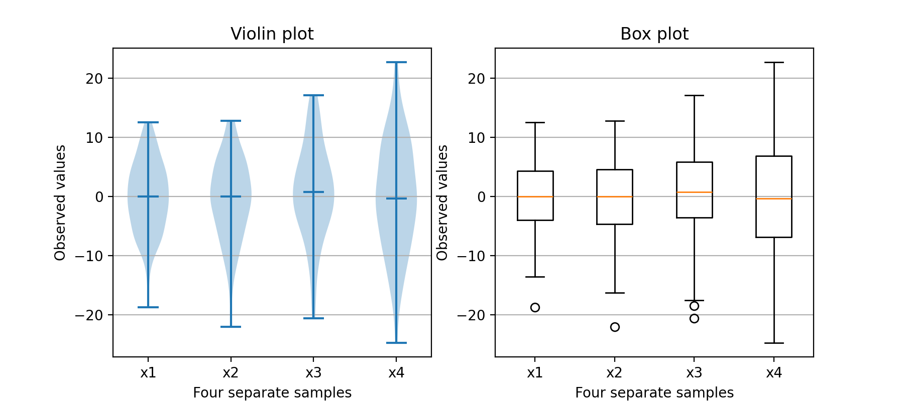
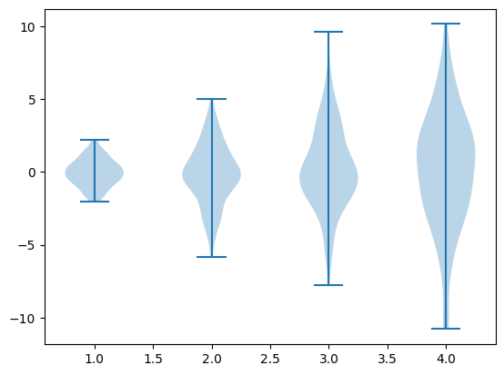
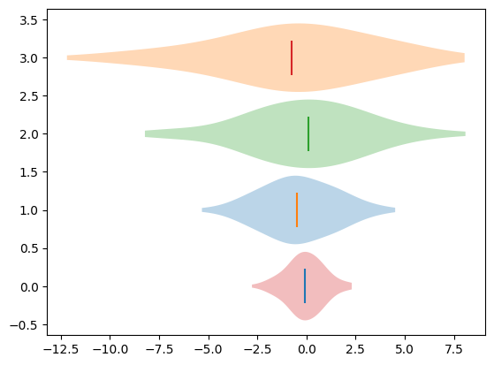
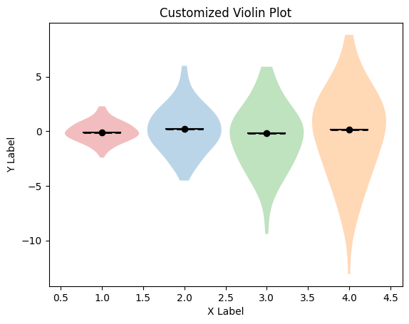
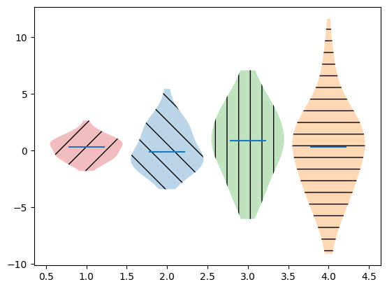
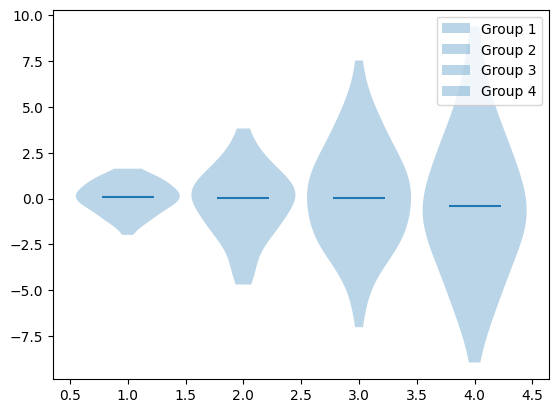
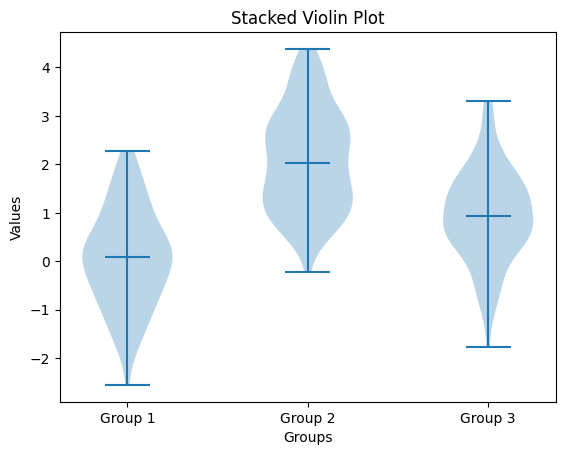

# Violin Plots in Matplotlib

A violin plot is a method of plotting numeric data and a probability density function. It is a combination of a box plot and a kernel density plot, providing a richer visualization of the distribution of the data. In a violin plot, each data point is represented by a kernel density plot, mirrored and joined together to form a symmetrical shape resembling a violin, hence the name.

Violin plots are particularly useful when comparing distributions across different categories or groups. They provide insights into the shape, spread, and central tendency of the data, allowing for a more comprehensive understanding than traditional box plots.

Violin plots offer a more detailed distribution representation, combining summary statistics and kernel density plots, handle unequal sample sizes effectively, allow easy comparison across groups, and facilitate identification of multiple modes compared to box plots.



## Prerequisites

Before creating violin charts in matplotlib you must ensure that you have Python as well as Matplotlib installed on your system.

## Creating a simple Violin Plot with `violinplot()` method

A basic violin plot can be created with `violinplot()` method in `matplotlib.pyplot`.

```Python
import matplotlib.pyplot as plt
import numpy as np

# Creating dataset
data = [np.random.normal(0, std, 100) for std in range(1, 5)]

# Creating Plot
plt.violinplot(data)

# Show plot
plt.show()

```

When executed, this would show the following pie chart:





The `Violinplot` function in matplotlib.pyplot creates a violin plot, which is a graphical representation of the distribution of data across different levels of a categorical variable. Here's a breakdown of its usage:

```Python
plt.violinplot(data, showmeans=False, showextrema=False)
```

- `data`: This parameter represents the dataset used to create the violin plot. It can be a single array or a sequence of arrays.

- `showmeans`: This optional parameter, if set to True, displays the mean value as a point on the violin plot. Default is False.

- `showextrema`: This optional parameter, if set to True, displays the minimum and maximum values as points on the violin plot. Default is False.

Additional parameters can be used to further customize the appearance of the violin plot, such as setting custom colors, adding labels, and adjusting the orientation. For instance:

```Python
plt.violinplot(data, showmedians=True, showmeans=True, showextrema=True, vert=False, widths=0.9, bw_method=0.5)
```
- showmedians: Setting this parameter to True displays the median value as a line on the violin plot.

- `vert`: This parameter determines the orientation of the violin plot. Setting it to False creates a horizontal violin plot. Default is True.

- `widths`: This parameter sets the width of the violins. Default is 0.5.

- `bw_method`: This parameter determines the method used to calculate the kernel bandwidth for the kernel density estimation. Default is 0.5.

Using these parameters, you can customize the violin plot according to your requirements, enhancing its readability and visual appeal.


## Customizing Violin Plots in Matplotlib

When customizing violin plots in Matplotlib, using `matplotlib.pyplot.subplots()` provides greater flexibility for applying customizations.

### Coloring Violin Plots

You can assign custom colors to the `violins` by passing an array of colors to the color parameter in `violinplot()` method.

```Python
import matplotlib.pyplot as plt
import numpy as np

# Creating dataset
data = [np.random.normal(0, std, 100) for std in range(1, 5)]
colors = ['tab:red', 'tab:blue', 'tab:green', 'tab:orange']

# Creating plot using matplotlib.pyplot.subplots()
fig, ax = plt.subplots()

# Customizing colors of violins
for i in range(len(data)):
    parts = ax.violinplot(data[i], positions=[i], vert=False, showmeans=False, showextrema=False, showmedians=True, widths=0.9, bw_method=0.5)
    for pc in parts['bodies']:
        pc.set_facecolor(colors[i])

# Show plot
plt.show()
```
This code snippet creates a violin plot with custom colors assigned to each violin, enhancing the visual appeal and clarity of the plot.





When customizing violin plots using `matplotlib.pyplot.subplots()`, you obtain a `Figure` object `fig` and an `Axes` object `ax`, allowing for extensive customization. Each `violin plot` consists of various components, including the `violin body`, `lines representing median and quartiles`, and `potential markers for mean and outliers`. You can customize these components using the appropriate methods and attributes of the Axes object.

- Here's an example of how to customize violin plots:

```Python
import matplotlib.pyplot as plt
import numpy as np

# Creating dataset
data = [np.random.normal(0, std, 100) for std in range(1, 5)]
colors = ['tab:red', 'tab:blue', 'tab:green', 'tab:orange']

# Creating plot using matplotlib.pyplot.subplots()
fig, ax = plt.subplots()

# Creating violin plots
parts = ax.violinplot(data, showmeans=False, showextrema=False, showmedians=True, widths=0.9, bw_method=0.5)

# Customizing colors of violins
for i, pc in enumerate(parts['bodies']):
    pc.set_facecolor(colors[i])

# Customizing median lines
for line in parts['cmedians'].get_segments():
    ax.plot(line[:, 0], line[:, 1], color='black')

# Customizing quartile lines
for line in parts['cmedians'].get_segments():
    ax.plot(line[:, 0], line[:, 1], linestyle='--', color='black', linewidth=2)

# Adding mean markers
for line in parts['cmedians'].get_segments():
    ax.scatter(np.mean(line[:, 0]), np.mean(line[:, 1]), marker='o', color='black')

# Customizing axes labels
ax.set_xlabel('X Label')
ax.set_ylabel('Y Label')

# Adding title
ax.set_title('Customized Violin Plot')

# Show plot
plt.show()
```



In this example, we customize various components of the violin plot, such as colors, line styles, and markers, to enhance its visual appeal and clarity. Additionally, we modify the axes labels and add a title to provide context to the plot.

### Adding Hatching to Violin Plots

You can add hatching patterns to the violin plots to enhance their visual distinction. This can be achieved by setting the `hatch` parameter in the `violinplot()` function.

```Python
import matplotlib.pyplot as plt
import numpy as np

# Creating dataset
data = [np.random.normal(0, std, 100) for std in range(1, 5)]
colors = ['tab:red', 'tab:blue', 'tab:green', 'tab:orange']
hatches = ['/', '\\', '|', '-']

# Creating plot using matplotlib.pyplot.subplots()
fig, ax = plt.subplots()

# Creating violin plots with hatching
parts = ax.violinplot(data, showmeans=False, showextrema=False, showmedians=True, widths=0.9, bw_method=0.5)

for i, pc in enumerate(parts['bodies']):
    pc.set_facecolor(colors[i])
    pc.set_hatch(hatches[i])

# Show plot
plt.show()
```




### Labeling Violin Plots

You can add `labels` to violin plots to provide additional information about the data. This can be achieved by setting the label parameter in the `violinplot()` function.

An example in shown here:

```Python
import matplotlib.pyplot as plt
import numpy as np

# Creating dataset
data = [np.random.normal(0, std, 100) for std in range(1, 5)]
labels = ['Group {}'.format(i) for i in range(1, 5)]

# Creating plot using matplotlib.pyplot.subplots()
fig, ax = plt.subplots()

# Creating violin plots
parts = ax.violinplot(data, showmeans=False, showextrema=False, showmedians=True, widths=0.9, bw_method=0.5)

# Adding labels to violin plots
for i, label in enumerate(labels):
    parts['bodies'][i].set_label(label)

# Show plot
plt.legend()
plt.show()
```


In this example, each violin plot is labeled according to its group, providing context to the viewer.
These customizations can be combined and further refined to create violin plots that effectively convey the underlying data distributions.

### Stacked Violin Plots

`Stacked violin plots` are useful when you want to compare the distribution of a `single` variable across different categories or groups. In a stacked violin plot, violins for each category or group are `stacked` on top of each other, allowing for easy visual comparison.

```Python
import matplotlib.pyplot as plt
import numpy as np

# Generating sample data
np.random.seed(0)
data1 = np.random.normal(0, 1, 100)
data2 = np.random.normal(2, 1, 100)
data3 = np.random.normal(1, 1, 100)

# Creating a stacked violin plot
plt.violinplot([data1, data2, data3], showmedians=True)

# Adding labels to x-axis ticks
plt.xticks([1, 2, 3], ['Group 1', 'Group 2', 'Group 3'])

# Adding title and labels
plt.title('Stacked Violin Plot')
plt.xlabel('Groups')
plt.ylabel('Values')

# Displaying the plot
plt.show()
```



### Split Violin Plots

`Split violin plots` are effective for comparing the distribution of a `single variable` across `two` different categories or groups. In a split violin plot, each violin is split into two parts representing the distributions of the variable for each category.

```Python
import matplotlib.pyplot as plt
import numpy as np

# Generating sample data
np.random.seed(0)
data_male = np.random.normal(0, 1, 100)
data_female = np.random.normal(2, 1, 100)

# Creating a split violin plot
plt.violinplot([data_male, data_female], showmedians=True)

# Adding labels to x-axis ticks
plt.xticks([1, 2], ['Male', 'Female'])

# Adding title and labels
plt.title('Split Violin Plot')
plt.xlabel('Gender')
plt.ylabel('Values')

# Displaying the plot
plt.show()
```


In both examples, we use Matplotlib's `violinplot()` function to create the violin plots. These unique features provide additional flexibility and insights when analyzing data distributions across different groups or categories.

