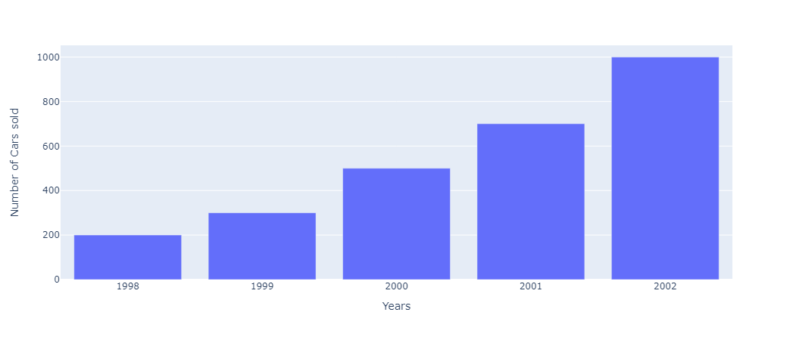
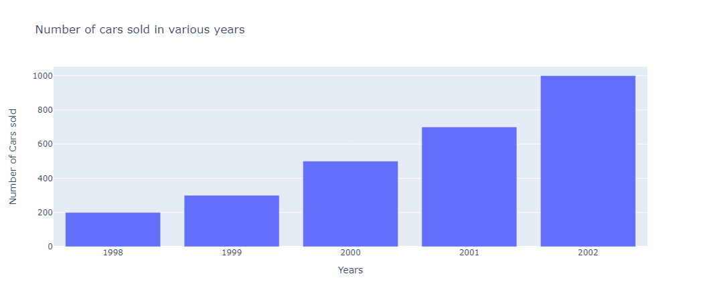
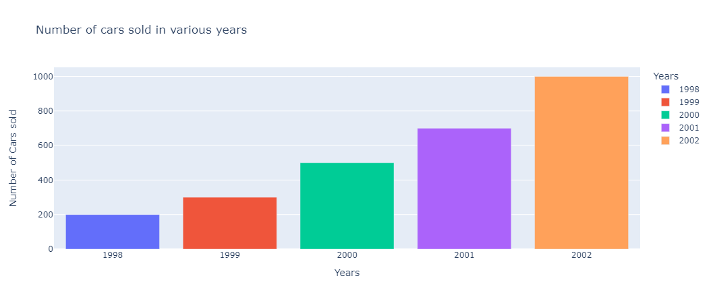
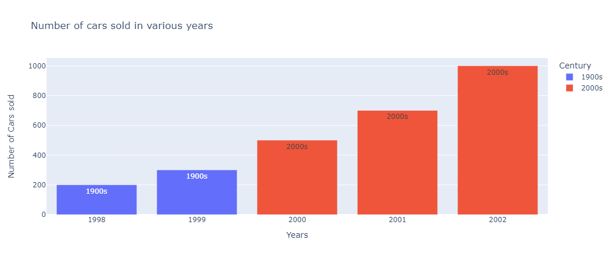
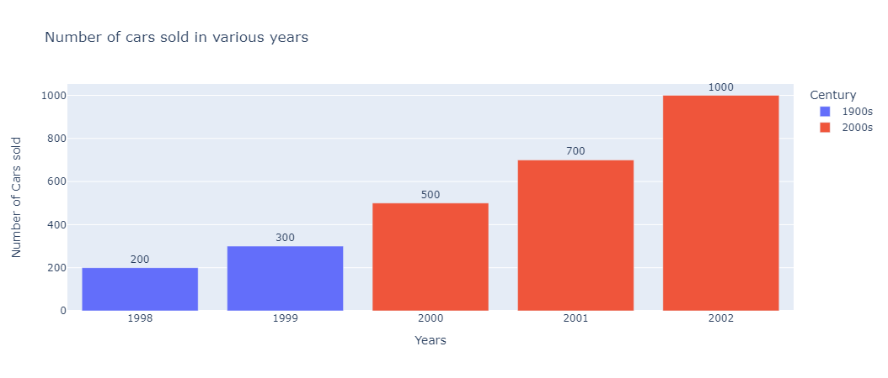
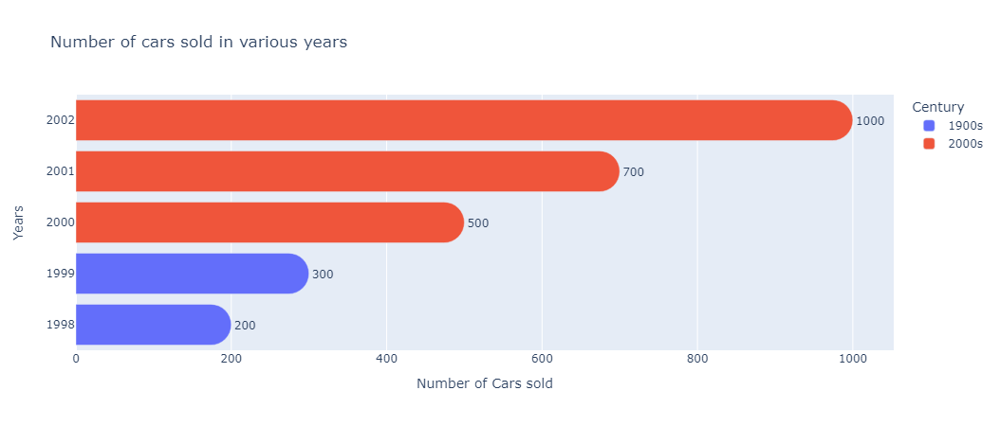
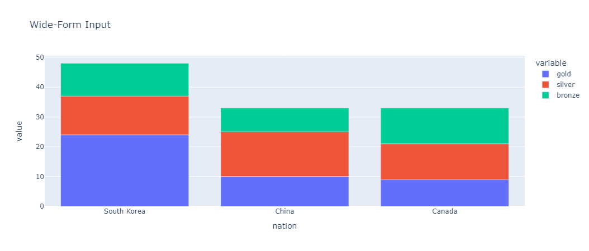

# Bar Plots in Plotly

A bar plot or a bar chart is a type of data visualisation that represents data in the form of rectangular bars, with lengths or heights proportional to the values and data which they represent. The bar plots can be plotted both vertically and horizontally.

It is one of the most widely used type of data visualisation as it is easy to interpret and is pleasing to the eyes.

Plotly is a very powerful library for creating modern visualizations and it provides a very easy and intuitive method to create highly customized bar plots.

## Prerequisites

Before creating bar plots in Plotly you must ensure that you have Python, Plotly and Pandas installed on your system.

## Introduction

There are various ways to create bar plots in `plotly`. One of the prominent and easiest one is using `plotly.express`. Plotly Express is the easy-to-use, high-level interface to Plotly, which operates on a variety of types of data and produces easy-to-style figures. On the other hand you can also use `plotly.graph_objects` to create various plots.

Here, we'll be using `plotly.express` to create the bar plots. Also we'll be converting our datasets into pandas DataFrames which makes it extremely convenient to create plots.

Also, note that when you execute the codes in a simple python file, the output plot will be shown in your **browser**, rather than a pop-up window like in matplotlib. If you do not want that, it is **recommended to create the plots in a notebook (like jupyter)**. For this, install an additional library `nbformat`. This way you can see the output on the notebook itself, and can also render its format to png, jpg, etc.

## Creating a simple bar plot using `plotly.express.bar`

With `plotly.express.bar`, each row of the DataFrame is represented as a rectangular mark.

```Python
import plotly.express as px
import pandas as pd

# Creating dataset
years = ['1998', '1999', '2000', '2001', '2002']
num_of_cars_sold = [200, 300, 500, 700, 1000]

# Converting dataset to pandas DataFrame
dataset = {"Years":years, "Number of Cars sold":num_of_cars_sold}
df = pd.DataFrame(dataset)

# Creating bar plot
fig = px.bar(df, x='Years', y='Number of Cars sold')

# Showing plot
fig.show()
```


Here, we are first creating the dataset and converting it into Pandas DataFrames using dictionaries, with its keys being DataFrame columns. Next, we are plotting the bar chart by using `px.bar`. In the `x` and `y` parameters, we have to specify a column name in the DataFrame.

**Note:** When you generate the image using above code, it will show you an **interactive plot**, if you want image, you can download it from their itself.

## Customizing Bar Plots

### Adding title to the graph

Let us create an imaginary graph of number of cars sold in a various years. Simply pass the title of your graph as a parameter in `px.bar`.

```Python
import plotly.express as px
import pandas as pd

# Creating dataset
years = ['1998', '1999', '2000', '2001', '2002']
num_of_cars_sold = [200, 300, 500, 700, 1000]

# Converting dataset to pandas DataFrame
dataset = {"Years":years, "Number of Cars sold":num_of_cars_sold}
df = pd.DataFrame(dataset)

# Creating bar plot
fig = px.bar(df, x='Years', y='Number of Cars sold', 
            title='Number of cars sold in various years')

# Showing plot
fig.show()
```


### Adding bar colors and legends

To add different colors to different bars, simply pass the column name of the x-axis or a custom column which groups different bars in `color` parameter.

```Python
import plotly.express as px
import pandas as pd

# Creating dataset
years = ['1998', '1999', '2000', '2001', '2002']
num_of_cars_sold = [200, 300, 500, 700, 1000]

# Converting dataset to pandas DataFrame
dataset = {"Years":years, "Number of Cars sold":num_of_cars_sold}
df = pd.DataFrame(dataset)

# Creating bar plot
fig = px.bar(df, x='Years', y='Number of Cars sold', 
            title='Number of cars sold in various years',
            color='Years')

# Showing plot
fig.show()
```


Now, let us consider our previous example of number of cars sold in various years and suppose that we want to add different colors to the bars from different centuries and respective legends for better interpretation.

The easiest way to achieve this is to add a new column to the dataframe and then pass it to the `color` parameter.

```Python
import plotly.express as px
import pandas as pd

# Creating dataset
years = ['1998', '1999', '2000', '2001', '2002']
num_of_cars_sold = [200, 300, 500, 700, 1000]
# Creating the relevant colors dataset
colors = ['1900s','1900s','2000s','2000s','2000s']

# Converting dataset to pandas DataFrame
dataset = {"Years":years, "Number of Cars sold":num_of_cars_sold, "Century":colors}
df = pd.DataFrame(dataset)

# Creating bar plot
fig = px.bar(df, x='Years', y='Number of Cars sold', 
            title='Number of cars sold in various years',
            color='Century')

# Showing plot
fig.show()
```


### Adding labels to bars

We may want to add labels to bars representing their absolute (or truncated) values for instant and accurate reading. This can be achieved by setting `text_auto` parameter to `True`. If you want custom text then you can pass a column name to the `text` parameter.

```Python
import plotly.express as px
import pandas as pd

# Creating dataset
years = ['1998', '1999', '2000', '2001', '2002']
num_of_cars_sold = [200, 300, 500, 700, 1000]
colors = ['1900s','1900s','2000s','2000s','2000s']

# Converting dataset to pandas DataFrame
dataset = {"Years":years, "Number of Cars sold":num_of_cars_sold, "Century":colors}
df = pd.DataFrame(dataset)

# Creating bar plot
fig = px.bar(df, x='Years', y='Number of Cars sold', 
            title='Number of cars sold in various years',
            color='Century',
            text_auto=True)

# Showing plot
fig.show()
```


```Python
import plotly.express as px
import pandas as pd

# Creating dataset
years = ['1998', '1999', '2000', '2001', '2002']
num_of_cars_sold = [200, 300, 500, 700, 1000]
colors = ['1900s','1900s','2000s','2000s','2000s']

# Converting dataset to pandas DataFrame
dataset = {"Years":years, "Number of Cars sold":num_of_cars_sold, "Century":colors}
df = pd.DataFrame(dataset)

# Creating bar plot
fig = px.bar(df, x='Years', y='Number of Cars sold', 
            title='Number of cars sold in various years',
            color='Century',
            text='Century')

# Showing plot
fig.show()
```


You can also change the features of text (or any other element of your plot) using `fig.update_traces`.

Here, we are changing the position of text to position it outside the bars.

```Python
import plotly.express as px
import pandas as pd

# Creating dataset
years = ['1998', '1999', '2000', '2001', '2002']
num_of_cars_sold = [200, 300, 500, 700, 1000]
colors = ['1900s','1900s','2000s','2000s','2000s']

# Converting dataset to pandas DataFrame
dataset = {"Years":years, "Number of Cars sold":num_of_cars_sold, "Century":colors}
df = pd.DataFrame(dataset)

# Creating bar plot
fig = px.bar(df, x='Years', y='Number of Cars sold', 
            title='Number of cars sold in various years',
            color='Century',
            text_auto=True)

# Updating bar text properties
fig.update_traces(textposition="outside", cliponaxis=False)

# Showing plot
fig.show()
```


### Rounded Bars

You can create rounded by specifying the radius value to `barcornerradius` in `fig.update_layout`.

```Python
import plotly.express as px
import pandas as pd

# Creating dataset
years = ['1998', '1999', '2000', '2001', '2002']
num_of_cars_sold = [200, 300, 500, 700, 1000]
colors = ['1900s','1900s','2000s','2000s','2000s']

# Converting dataset to pandas DataFrame
dataset = {"Years":years, "Number of Cars sold":num_of_cars_sold, "Century":colors}
df = pd.DataFrame(dataset)

# Creating bar plot
fig = px.bar(df, x='Years', y='Number of Cars sold', 
            title='Number of cars sold in various years',
            color='Century',
            text_auto=True)

# Updating bar text properties
fig.update_traces(textposition="outside", cliponaxis=False)

# Updating figure layout
fig.update_layout({
'plot_bgcolor': 'rgba(255, 255, 255, 1)',
'paper_bgcolor': 'rgba(255, 255, 255, 1)',
'barcornerradius': 15
})

# Showing plot
fig.show()
```


## Horizontal Bar Plot

To create a horizontal bar plot, you just have to interchange your `x` and `y` DataFrame columns. Plotly takes care of the rest!

```Python
import plotly.express as px
import pandas as pd

# Creating dataset
years = ['1998', '1999', '2000', '2001', '2002']
num_of_cars_sold = [200, 300, 500, 700, 1000]
colors = ['1900s','1900s','2000s','2000s','2000s']

# Converting dataset to pandas DataFrame
dataset = {"Years":years, "Number of Cars sold":num_of_cars_sold, "Century":colors}
df = pd.DataFrame(dataset)

# Creating bar plot
fig = px.bar(df, x='Number of Cars sold', y='Years', 
            title='Number of cars sold in various years',
            color='Century',
            text_auto=True)

# Updating bar text properties
fig.update_traces(textposition="outside", cliponaxis=False)

# Updating figure layout
fig.update_layout({
'barcornerradius': 30
})

# Showing plot
fig.show()
```


## Plotting Long Format and Wide Format Data

Long-form data has one row per observation, and one column per variable. This is suitable for storing and displaying multivariate data i.e. with dimension greater than 2.

```Python
# Plotting long format data

import plotly.express as px

# Long format dataset
long_df = px.data.medals_long()

# Creating Bar Plot
fig = px.bar(long_df, x="nation", y="count", color="medal", title="Long-Form Input")

# Showing Plot
fig.show()
```


```Python
print(long_df)

# Output
        nation   medal  count
0  South Korea    gold     24
1        China    gold     10
2       Canada    gold      9
3  South Korea  silver     13
4        China  silver     15
5       Canada  silver     12
6  South Korea  bronze     11
7        China  bronze      8
8       Canada  bronze     12
```

Wide-form data has one row per value of one of the first variable, and one column per value of the second variable. This is suitable for storing and displaying 2-dimensional data.

```Python
# Plotting wide format data
import plotly.express as px

# Wide format dataset
wide_df = px.data.medals_wide()

# Creating Bar Plot
fig = px.bar(wide_df, x="nation", y=["gold", "silver", "bronze"], title="Wide-Form Input")

# Showing Plot
fig.show()
```


```Python
print(wide_df)

# Output
        nation  gold  silver  bronze
0  South Korea    24      13      11
1        China    10      15       8
2       Canada     9      12      12