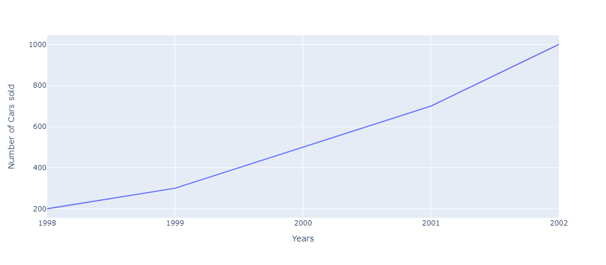
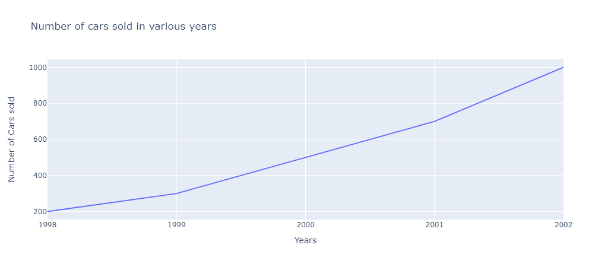
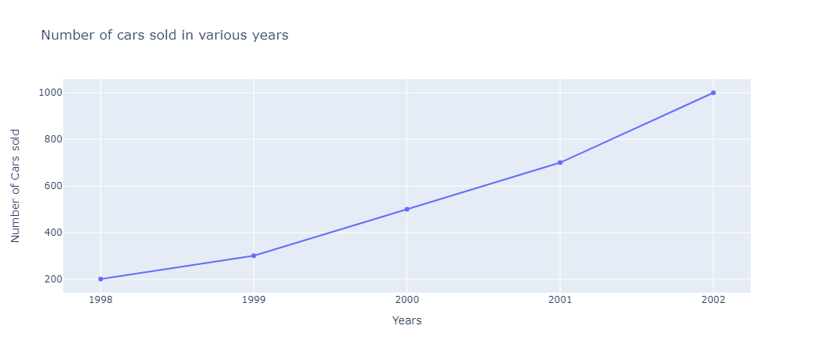
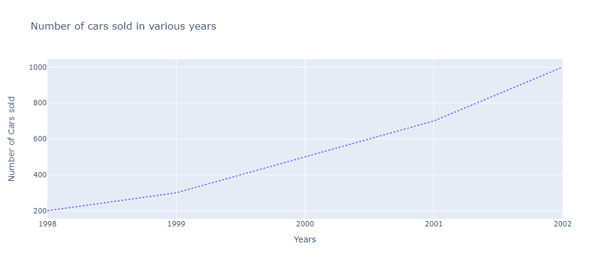
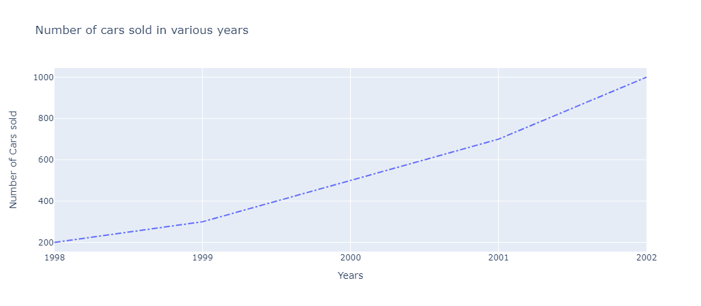
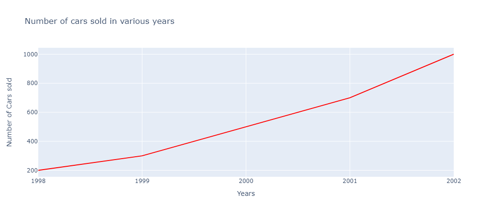
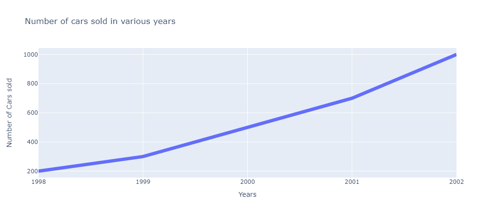
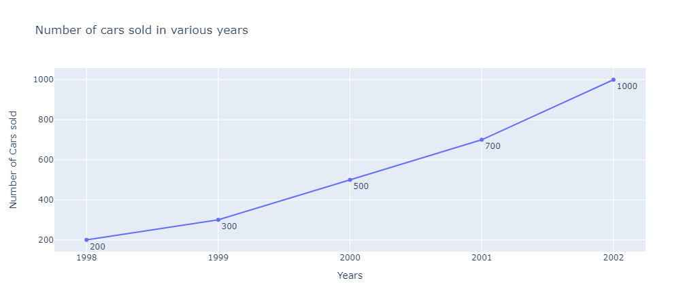
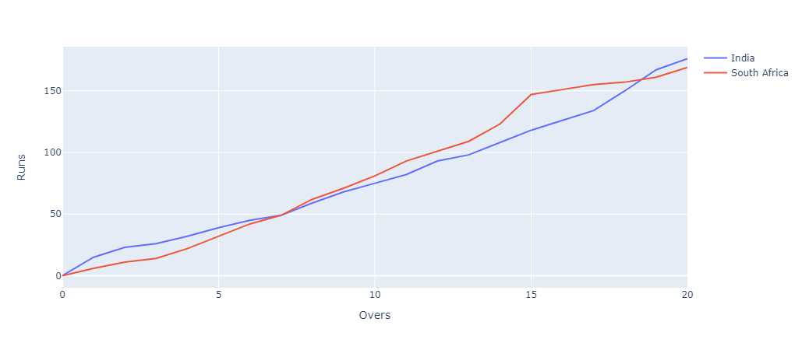

# Line Charts in Plotly

A line chart displays information as a series of data points connected by straight line segments. It represents the change in a quantity with respect to another quantity and helps us to see trends and patterns over time or across categories. It is a basic type of chart common in many fields. For example, it is used to represent the price of stocks with respect to time, among many others.

It is one of the most widely used type of data visualisation as it is easy to interpret and is pleasing to the eyes.

Plotly is a very powerful library for creating modern visualizations and it provides a very easy and intuitive method to create highly customized line charts.

## Prerequisites

Before creating line charts in Plotly you must ensure that you have Python, Plotly and Pandas installed on your system.

## Introduction

There are various ways to create line charts in `plotly`. One of the prominent and easiest one is using `plotly.express`. Plotly Express is the easy-to-use, high-level interface to Plotly, which operates on a variety of types of data and produces easy-to-style figures. On the other hand you can also use `plotly.graph_objects` to create various plots.

Here, we'll be using `plotly.express` to create the line charts. Also we'll be converting our datasets into pandas DataFrames which makes it extremely convenient to create plots.

Also, note that when you execute the codes in a simple python file, the output plot will be shown in your **browser**, rather than a pop-up window like in matplotlib. If you do not want that, it is **recommended to create the plots in a notebook (like jupyter)**. For this, install an additional library `nbformat`. This way you can see the output on the notebook itself, and can also render its format to png, jpg, etc.

## Creating a simple line chart using `plotly.express.line`

With `plotly.express.line`, each data point is represented as a vertex (which location is given by the x and y columns) of a polyline mark in 2D space.

```Python
import plotly.express as px
import pandas as pd

# Creating dataset
years = ['1998', '1999', '2000', '2001', '2002']
num_of_cars_sold = [200, 300, 500, 700, 1000]

# Converting dataset to pandas DataFrame
dataset = {"Years":years, "Number of Cars sold":num_of_cars_sold}
df = pd.DataFrame(dataset)

# Creating line chart
fig = px.line(df, x='Years', y='Number of Cars sold')

# Showing plot
fig.show()
```



Here, we are first creating the dataset and converting it into Pandas DataFrames using dictionaries, with its keys being DataFrame columns. Next, we are plotting the line chart by using `px.line`. In the `x` and `y` parameters, we have to specify a column name in the DataFrame.

**Note:** When you generate the image using above code, it will show you an **interactive plot**, if you want image, you can download it from their itself.

## Customizing Line Charts

### Adding title to the chart

Simply pass the title of your graph as a parameter in `px.line`.

```Python
import plotly.express as px
import pandas as pd

# Creating dataset
years = ['1998', '1999', '2000', '2001', '2002']
num_of_cars_sold = [200, 300, 500, 700, 1000]

# Converting dataset to pandas DataFrame
dataset = {"Years":years, "Number of Cars sold":num_of_cars_sold}
df = pd.DataFrame(dataset)

# Creating line chart
fig = px.line(df, x='Years', y='Number of Cars sold', 
              title='Number of cars sold in various years')

# Showing plot
fig.show()
```



### Adding Markers to the lines

The `markers` argument can be set to `True` to show markers on lines.

```Python
import plotly.express as px
import pandas as pd

# Creating dataset
years = ['1998', '1999', '2000', '2001', '2002']
num_of_cars_sold = [200, 300, 500, 700, 1000]

# Converting dataset to pandas DataFrame
dataset = {"Years":years, "Number of Cars sold":num_of_cars_sold}
df = pd.DataFrame(dataset)

# Creating line chart
fig = px.line(df, x='Years', y='Number of Cars sold', 
              title='Number of cars sold in various years',
              markers=True)

# Showing plot
fig.show()
```



### Dashed Lines

You can plot dashed lines by changing the `dash` property of `line` to `dash` or `longdash` and passing it as a dictionary to `patch` parameter in `fig.update_traces`.

```Python
import plotly.express as px
import pandas as pd

# Creating dataset
years = ['1998', '1999', '2000', '2001', '2002']
num_of_cars_sold = [200, 300, 500, 700, 1000]

# Converting dataset to pandas DataFrame
dataset = {"Years":years, "Number of Cars sold":num_of_cars_sold}
df = pd.DataFrame(dataset)

# Creating line chart
fig = px.line(df, x='Years', y='Number of Cars sold', 
              title='Number of cars sold in various years')

fig.update_traces(patch={"line": {"dash": 'dash'}}) 

# Showing plot
fig.show()
```


### Dotted Lines

You can plot dotted lines by changing the `dash` property of `line` to `dot` and passing it as a dictionary to `patch` parameter in `fig.update_traces`.

```Python
import plotly.express as px
import pandas as pd

# Creating dataset
years = ['1998', '1999', '2000', '2001', '2002']
num_of_cars_sold = [200, 300, 500, 700, 1000]

# Converting dataset to pandas DataFrame
dataset = {"Years":years, "Number of Cars sold":num_of_cars_sold}
df = pd.DataFrame(dataset)

# Creating line chart
fig = px.line(df, x='Years', y='Number of Cars sold', 
              title='Number of cars sold in various years')

fig.update_traces(patch={"line": {"dash": 'dot'}}) 

# Showing plot
fig.show()
```



### Dashed and Dotted Lines

You can plot dotted lines by changing the `dash` property of `line` to `dashdot` and passing it as a dictionary to `patch` parameter in `fig.update_traces`.

```Python
import plotly.express as px
import pandas as pd

# Creating dataset
years = ['1998', '1999', '2000', '2001', '2002']
num_of_cars_sold = [200, 300, 500, 700, 1000]

# Converting dataset to pandas DataFrame
dataset = {"Years":years, "Number of Cars sold":num_of_cars_sold}
df = pd.DataFrame(dataset)

# Creating line chart
fig = px.line(df, x='Years', y='Number of Cars sold', 
              title='Number of cars sold in various years')

fig.update_traces(patch={"line": {"dash": 'dashdot'}}) 

# Showing plot
fig.show()
```



### Changing line colors

You can set custom colors to lines by changing the `color` property of `line` to `your_color` and passing it as a dictionary to `patch` parameter in `fig.update_traces`.

```Python
import plotly.express as px
import pandas as pd

# Creating dataset
years = ['1998', '1999', '2000', '2001', '2002']
num_of_cars_sold = [200, 300, 500, 700, 1000]

# Converting dataset to pandas DataFrame
dataset = {"Years":years, "Number of Cars sold":num_of_cars_sold}
df = pd.DataFrame(dataset)

# Creating line chart
fig = px.line(df, x='Years', y='Number of Cars sold', 
              title='Number of cars sold in various years')

fig.update_traces(patch={"line": {"color": 'red'}}) 

# Showing plot
fig.show()
```



### Changing line width

You can set custom width to lines by changing the `width` property of `line` to `your_width` and passing it as a dictionary to `patch` parameter in `fig.update_traces`.

```Python
import plotly.express as px
import pandas as pd

# Creating dataset
years = ['1998', '1999', '2000', '2001', '2002']
num_of_cars_sold = [200, 300, 500, 700, 1000]

# Converting dataset to pandas DataFrame
dataset = {"Years":years, "Number of Cars sold":num_of_cars_sold}
df = pd.DataFrame(dataset)

# Creating line chart
fig = px.line(df, x='Years', y='Number of Cars sold', 
              title='Number of cars sold in various years')

fig.update_traces(patch={"line": {"width": 7}}) 

# Showing plot
fig.show()
```



### Labeling Data Points

You can label your data points by passing the relevant column name of your DataFrame to `text` parameter in `px.line`.

```Python
# Creating dataset
years = ['1998', '1999', '2000', '2001', '2002']
num_of_cars_sold = [200, 300, 500, 700, 1000]

# Converting dataset to pandas DataFrame
dataset = {"Years":years, "Number of Cars sold":num_of_cars_sold}
df = pd.DataFrame(dataset)

# Creating line chart
fig = px.line(df, x='Years', y='Number of Cars sold', 
              title='Number of cars sold in various years',
              text='Number of Cars sold')

fig.update_traces(textposition="bottom right")

# Showing plot
fig.show()
```



## Plotting multiple lines

There are several ways to plot multiple lines in plotly, like using `plotly.graph_objects`, using `fig.add_scatter`, having multiple columns in the DataFrame, etc.

Here, we'll be creating a simple dataset of the runs scored by the end of each over by India and South Africa in recent T20 World Cup Final and plot it using plotly.

```Python
import plotly.express as px
import pandas as pd

# Creating dataset
overs = list(range(0,21))
runs_india = [0,15,23,26,32,39,45,49,59,68,75,82,93,98,108,118,126,134,150,167,176]
runs_rsa = [0,6,11,14,22,32,42,49,62,71,81,93,101,109,123,147,151,155,157,161,169]

# Converting dataset to pandas DataFrame
dataset = {"overs":overs, "India":runs_india, "South Africa":runs_rsa}
df = pd.DataFrame(dataset)

# Creating line chart
fig = px.line(df, x="overs", y=["India", "South Africa"])
fig.update_layout(xaxis_title="Overs", yaxis_title="Runs", legend_title=None)

# Showing plot
fig.show()
```



To plot multiple lines, we have passed multiple columns of the DataFrame in the `y` parameter.
