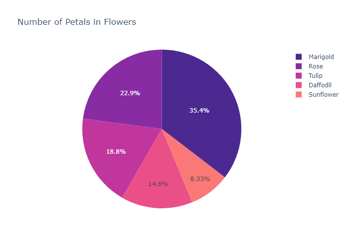
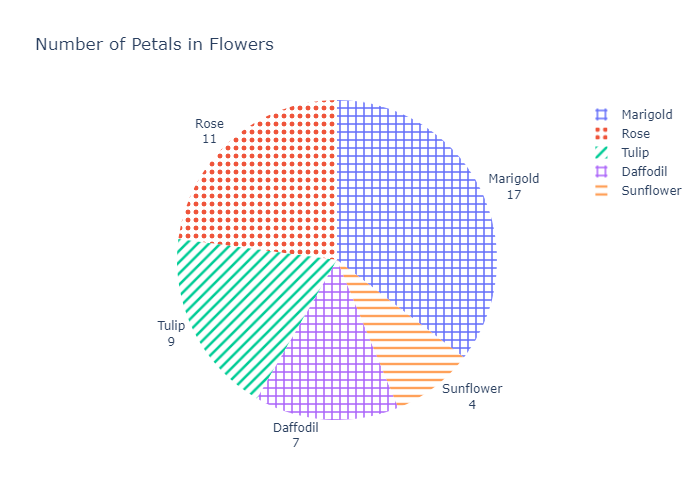

# Pie Charts in Plotly

A pie chart is a type of graph that represents the data in the circular graph. The slices of pie show the relative size of the data, and it is a type of pictorial representation of data. A pie chart requires a list of categorical variables and numerical variables. Here, the term "pie" represents the whole, and the "slices" represent the parts of the whole.

Pie charts are commonly used in business presentations like sales, operations, survey results, resources, etc. as they are pleasing to the eye and provide a quick summary.

Plotly is a very powerful library for creating modern visualizations and it provides a very easy and intuitive method to create highly customized pie charts.

## Prerequisites

Before creating bar plots in Plotly you must ensure that you have Python, Plotly and Pandas installed on your system.

## Introduction

There are various ways to create pie charts in `plotly`. One of the prominent and easiest one is using `plotly.express`. Plotly Express is the easy-to-use, high-level interface to Plotly, which operates on a variety of types of data and produces easy-to-style figures. On the other hand you can also use `plotly.graph_objects` to create various plots.

Here, we'll be using `plotly.express` to create the pie charts. Also we'll be converting our datasets into pandas DataFrames which makes it extremely convenient and easy to create charts.

Also, note that when you execute the codes in a simple python file, the output plot will be shown in your **browser**, rather than a pop-up window like in matplotlib. If you do not want that, it is **recommended to create the plots in a notebook (like jupyter)**. For this, install an additional library `nbformat`. This way you can see the output on the notebook itself, and can also render its format to png, jpg, etc.

## Creating a simple pie chart using `plotly.express.pie`

In `plotly.express.pie`, data visualized by the sectors of the pie is set in values. The sector labels are set in names.

```Python
import plotly.express as px
import pandas as pd

# Creating dataset
flowers = ['Rose','Tulip','Marigold','Sunflower','Daffodil']
petals = [11,9,17,4,7]

# Converting dataset to pandas DataFrame
dataset = {'flowers':flowers, 'petals':petals}
df = pd.DataFrame(dataset)

# Creating pie chart
fig = px.pie(df, values='petals', names='flowers')

# Showing plot
fig.show()
```


Here, we are first creating the dataset and converting it into Pandas DataFrames using dictionaries, with its keys being DataFrame columns. Next, we are plotting the pie chart by using `px.pie`. In the `values` and `names` parameters, we have to specify a column name in the DataFrame.

`px.pie(df, values='Petals', names='Flowers')` is used to specify that the pie chart is to be plotted by taking the values from column `Petals` and the fractional area of each slice is represented by **petal/sum(petals)**. The column `flowers` represents the labels of slices corresponding to each value in `petals`.

**Note:** When you generate the image using above code, it will show you an **interactive plot**, if you want image, you can download it from their itself.

## Customizing Pie Charts

### Adding title to the chart

Simply pass the title of your chart as a parameter in `px.pie`.

```Python
import plotly.express as px
import pandas as pd

# Creating dataset
flowers = ['Rose','Tulip','Marigold','Sunflower','Daffodil']
petals = [11,9,17,4,7]

# Converting dataset to pandas DataFrame
dataset = {'flowers':flowers, 'petals':petals}
df = pd.DataFrame(dataset)

# Creating pie chart
fig = px.pie(df, values='petals', names='flowers',
             title='Number of Petals in Flowers')

# Showing plot
fig.show()
```


### Coloring Slices

There are a lot of beautiful color scales available in plotly and can be found here [plotly color scales](https://plotly.com/python/builtin-colorscales/). Choose your favourite colorscale apply it like this:

```Python
import plotly.express as px
import pandas as pd

# Creating dataset
flowers = ['Rose','Tulip','Marigold','Sunflower','Daffodil']
petals = [11,9,17,4,7]

# Converting dataset to pandas DataFrame
dataset = {'flowers':flowers, 'petals':petals}
df = pd.DataFrame(dataset)

# Creating pie chart
fig = px.pie(df, values='petals', names='flowers',
             title='Number of Petals in Flowers',
             color_discrete_sequence=px.colors.sequential.Agsunset)

# Showing plot
fig.show()
```


You can also set custom colors for each label by passing it as a dictionary(map) in `color_discrete_map`, like this:

```Python
import plotly.express as px
import pandas as pd

# Creating dataset
flowers = ['Rose','Tulip','Marigold','Sunflower','Daffodil']
petals = [11,9,17,4,7]

# Converting dataset to pandas DataFrame
dataset = {'flowers':flowers, 'petals':petals}
df = pd.DataFrame(dataset)

# Creating pie chart
fig = px.pie(df, values='petals', names='flowers',
             title='Number of Petals in Flowers',
             color='flowers',
             color_discrete_map={'Rose':'red',
                                 'Tulip':'magenta',
                                 'Marigold':'green',
                                 'Sunflower':'yellow',
                                 'Daffodil':'royalblue'})

# Showing plot
fig.show()
```


### Labeling Slices

You can use `fig.update_traces` to effectively control the properties of text being displayed on your figure, for example if we want both flower name , petal count and percentage in our slices, we can do it like this:

```Python
import plotly.express as px
import pandas as pd

# Creating dataset
flowers = ['Rose','Tulip','Marigold','Sunflower','Daffodil']
petals = [11,9,17,4,7]

# Converting dataset to pandas DataFrame
dataset = {'flowers':flowers, 'petals':petals}
df = pd.DataFrame(dataset)

# Creating pie chart
fig = px.pie(df, values='petals', names='flowers',
             title='Number of Petals in Flowers')

# Updating text properties
fig.update_traces(textposition='inside', textinfo='label+value+percent')

# Showing plot
fig.show()
```


### Pulling out a slice

To pull out a slice pass an array to parameter `pull` in `fig.update_traces` corresponding to the slices and amount to be pulled.

```Python
import plotly.express as px
import pandas as pd

# Creating dataset
flowers = ['Rose','Tulip','Marigold','Sunflower','Daffodil']
petals = [11,9,17,4,7]

# Converting dataset to pandas DataFrame
dataset = {'flowers':flowers, 'petals':petals}
df = pd.DataFrame(dataset)

# Creating pie chart
fig = px.pie(df, values='petals', names='flowers',
             title='Number of Petals in Flowers')

# Updating text properties
fig.update_traces(textposition='inside', textinfo='label+value')

# Pulling out slice
fig.update_traces(pull=[0,0,0,0.2,0])

# Showing plot
fig.show()
```


### Pattern Fills

You can also add patterns (hatches), in addition to colors in pie charts.

```Python
import plotly.express as px
import pandas as pd

# Creating dataset
flowers = ['Rose','Tulip','Marigold','Sunflower','Daffodil']
petals = [11,9,17,4,7]

# Converting dataset to pandas DataFrame
dataset = {'flowers':flowers, 'petals':petals}
df = pd.DataFrame(dataset)

# Creating pie chart
fig = px.pie(df, values='petals', names='flowers',
             title='Number of Petals in Flowers')

# Updating text properties
fig.update_traces(textposition='outside', textinfo='label+value')

# Adding pattern fills
fig.update_traces(marker=dict(pattern=dict(shape=[".", "/", "+", "-","+"])))

# Showing plot
fig.show()
```
