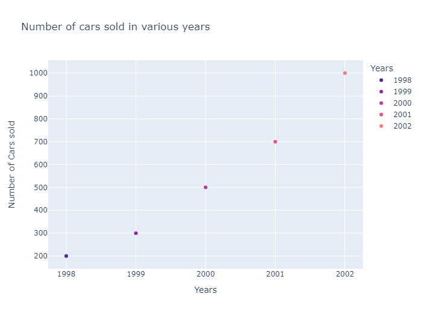
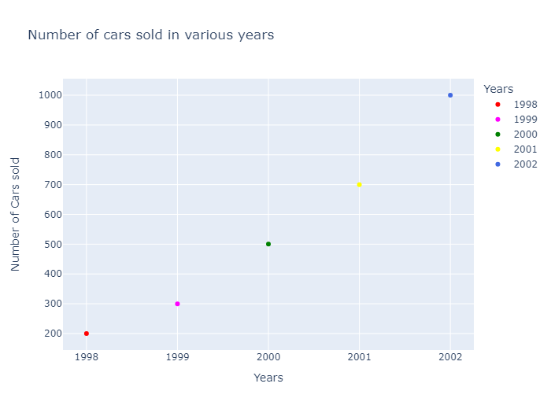
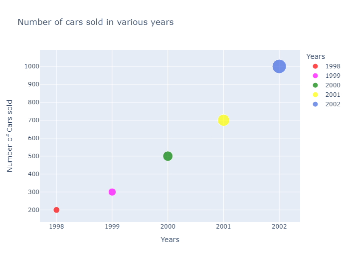
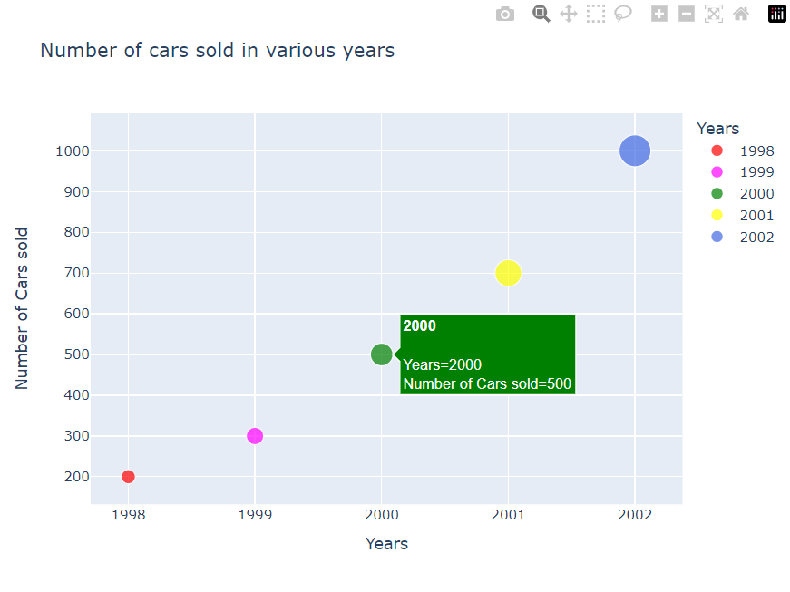

# Scatter Plots in Plotly

* A scatter plot is a type of data visualization that uses dots to show values for two variables, with one variable on the x-axis and the other on the y-axis. It's useful for identifying relationships, trends, and correlations, as well as spotting clusters and outliers.
* The dots on the plot shows how the variables are related. A scatter plot is made with the plotly library's `px.scatter()`.

## Prerequisites

Before creating Scatter plots in Plotly you must ensure that you have Python, Plotly and Pandas installed on your system.

## Introduction

There are various ways to create Scatter plots in `plotly`. One of the prominent and easiest one is using `plotly.express`. Plotly Express is the easy-to-use, high-level interface to Plotly, which operates on a variety of types of data and produces easy-to-style figures. On the other hand you can also use `plotly.graph_objects` to create various plots.

Here, we'll be using `plotly.express` to create the Scatter Plots. Also we'll be converting our datasets into pandas DataFrames which makes it extremely convenient and easy to create charts.

Also, note that when you execute the codes in a simple python file, the output plot will be shown in your **browser**, rather than a pop-up window like in matplotlib. If you do not want that, it is **recommended to create the plots in a notebook (like jupyter)**. For this, install an additional library `nbformat`. This way you can see the output on the notebook itself, and can also render its format to png, jpg, etc.

## Creating a simple Scatter Plot using `plotly.express.scatter`

In `plotly.express.scatter`, each data point is represented as a marker point, whose location is given by the x and y columns.

```Python
import plotly.express as px
import pandas as pd

# Creating dataset
years = ['1998', '1999', '2000', '2001', '2002']
num_of_cars_sold = [200, 300, 500, 700, 1000]

# Converting dataset to pandas DataFrame
dataset = {"Years": years, "Number of Cars sold": num_of_cars_sold}
df = pd.DataFrame(dataset)

# Creating scatter plot
fig = px.scatter(df, x='Years', y='Number of Cars sold')

# Showing plot
fig.show()
```


Here, we are first creating the dataset and converting it into a pandas DataFrame using a dictionary, with its keys being DataFrame columns. Next, we are plotting the scatter plot by using `px.scatter`. In the `x` and `y` parameters, we have to specify a column name in the DataFrame.

`px.scatter(df, x='Years', y='Number of Cars sold')` is used to specify that the scatter plot is to be plotted by taking the values from column `Years` for the x-axis and the values from column `Number of Cars sold` for the y-axis.

Note: When you generate the image using the above code, it will show you an interactive plot. If you want an image, you can download it from the interactive plot itself.

## Customizing Scatter Plots

### Adding title to the plot

Simply pass the title of your plot as a parameter in `px.scatter`.

```Python
import plotly.express as px
import pandas as pd

# Creating dataset
years = ['1998', '1999', '2000', '2001', '2002']
num_of_cars_sold = [200, 300, 500, 700, 1000]

# Converting dataset to pandas DataFrame
dataset = {"Years": years, "Number of Cars sold": num_of_cars_sold}
df = pd.DataFrame(dataset)

# Creating scatter plot
fig = px.scatter(df, x='Years', y='Number of Cars sold' ,title='Number of cars sold in various years')

# Showing plot
fig.show()
```


### Adding bar colors and legends

* To add different colors to different bars, simply pass the column name of the x-axis or a custom column which groups different bars in `color` parameter.
* There are a lot of beautiful color scales available in plotly and can be found here [plotly color scales](https://plotly.com/python/builtin-colorscales/). Choose your favourite colorscale apply it like this:

```Python
import plotly.express as px
import pandas as pd

# Creating dataset
flowers = ['Rose','Tulip','Marigold','Sunflower','Daffodil']
petals = [11,9,17,4,7]

# Converting dataset to pandas DataFrame
dataset = {'flowers':flowers, 'petals':petals}
df = pd.DataFrame(dataset)

# Creating pie chart
fig = px.pie(df, values='petals', names='flowers',
             title='Number of Petals in Flowers',
             color_discrete_sequence=px.colors.sequential.Agsunset)

# Showing plot
fig.show()
```


You can also set custom colors for each label by passing it as a dictionary(map) in `color_discrete_map`, like this:

```Python
import plotly.express as px
import pandas as pd

# Creating dataset
years = ['1998', '1999', '2000', '2001', '2002']
num_of_cars_sold = [200, 300, 500, 700, 1000]

# Converting dataset to pandas DataFrame
dataset = {"Years": years, "Number of Cars sold": num_of_cars_sold}
df = pd.DataFrame(dataset)

# Creating scatter plot
fig = px.scatter(df, x='Years', 
                 y='Number of Cars sold' ,
                 title='Number of cars sold in various years',
                 color='Years',
                 color_discrete_map={'1998':'red',
                                 '1999':'magenta',
                                 '2000':'green',
                                 '2001':'yellow',
                                 '2002':'royalblue'})

# Showing plot
fig.show()
```


### Setting Size of Scatter

We may want to set the size of different scatters for visibility differences between categories. This can be done by using the `size` parameter in `px.scatter`, where we specify a column in the DataFrame that determines the size of each scatter point.

```Python
import plotly.express as px
import pandas as pd

# Creating dataset
years = ['1998', '1999', '2000', '2001', '2002']
num_of_cars_sold = [200, 300, 500, 700, 1000]

# Converting dataset to pandas DataFrame
dataset = {"Years": years, "Number of Cars sold": num_of_cars_sold}
df = pd.DataFrame(dataset)

# Creating scatter plot
fig = px.scatter(df, x='Years', 
                 y='Number of Cars sold' ,
                 title='Number of cars sold in various years',
                 color='Years',
                 color_discrete_map={'1998':'red',
                                 '1999':'magenta',
                                 '2000':'green',
                                 '2001':'yellow',
                                 '2002':'royalblue'},
                 size='Number of Cars sold')

# Showing plot
fig.show()
```


### Giving a hover effect 

you can use the `hover_name` and `hover_data` parameters in `px.scatter`. The `hover_name` parameter specifies the column to use for the `hover text`, and the `hover_data` parameter allows you to specify additional data to display when hovering over a point

```Python
import plotly.express as px
import pandas as pd

# Creating dataset
years = ['1998', '1999', '2000', '2001', '2002']
num_of_cars_sold = [200, 300, 500, 700, 1000]

# Converting dataset to pandas DataFrame
dataset = {"Years": years, "Number of Cars sold": num_of_cars_sold}
df = pd.DataFrame(dataset)

# Creating scatter plot
fig = px.scatter(df, x='Years', 
                 y='Number of Cars sold' ,
                 title='Number of cars sold in various years',
                 color='Years',
                 color_discrete_map={'1998':'red',
                                 '1999':'magenta',
                                 '2000':'green',
                                 '2001':'yellow',
                                 '2002':'royalblue'},
                 size='Number of Cars sold',
                 hover_name='Years', 
                 hover_data={'Number of Cars sold': True})

# Showing plot
fig.show()
```


