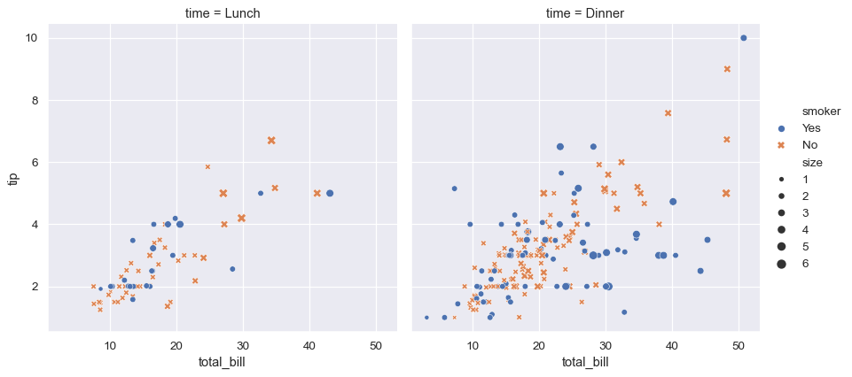

Seaborn helps you explore and understand your data. Its plotting functions operate on dataframes and arrays containing whole datasets and internally perform the necessary semantic mapping and statistical aggregation to produce informative plots. Its dataset-oriented, declarative API lets you focus on what the different elements of your plots mean, rather than on the details of how to draw them.

Here’s an example of what seaborn can do:
```Python
# Import seaborn
import seaborn as sns

# Apply the default theme
sns.set_theme()

# Load an example dataset
tips = sns.load_dataset("tips")

# Create a visualization
sns.relplot(
    data=tips,
    x="total_bill", y="tip", col="time",
    hue="smoker", style="smoker", size="size",
)
```
Below is the output for the above code snippet:



```Python
# Load an example dataset
tips = sns.load_dataset("tips")
```
Most code in the docs will use the `load_dataset()` function to get quick access to an example dataset. There’s nothing special about these datasets: they are just pandas data frames, and we could have loaded them with `pandas.read_csv()` or build them by hand. Most of the examples in the documentation will specify data using pandas data frames, but Seaborn is very flexible about the data structures that it accepts.

```Python
# Create a visualization
sns.relplot(
    data=tips,
    x="total_bill", y="tip", col="time",
    hue="smoker", style="smoker", size="size",
)
```
This plot shows the relationship between five variables in the tips dataset using a single call to the seaborn function `relplot()`. Notice how we provided only the names of the variables and their roles in the plot. Unlike when using matplotlib directly, it wasn’t necessary to specify attributes of the plot elements in terms of the color values or marker codes. Behind the scenes, seaborn handled the translation from values in the dataframe to arguments that Matplotlib understands. This declarative approach lets you stay focused on the questions that you want to answer, rather than on the details of how to control matplotlib.
