# Seaborn

Seaborn is a powerful and easy-to-use data visualization library in Python built on top of Matplotlib.It provides a high-level interface for drawing attractive and informative statistical graphics.Now we will cover various functions covered by Seaborn, along with examples to illustrate their usage.
Seaborn simplifies the process of creating complex visualizations with a few lines of code and it integrates closely with pandas data structure , making it an excellent choice for data analysis and exploration.

## Setting up Seaborn

Make sure seaborn library is installed in your system. If not use command 
`pip install seaborn` 

After installing you are all set to experiment with plotting functions.

```python
#import necessary libraries

import seaborn as sns
import matplotlib.pyplot as plt 
import pandas as pd 
```

Seaborn includes several built-in datasets that you can use for practice  
You can list all available datasets using below command
```python
sns.get_dataset_names()
```

Here we are using 'tips' dataset

```python
# loading an example dataset
tips=sns.load_dataset('tips')
```

Before delving into plotting, make yourself comfortable with the dataset. To do that, use the pandas library to understand what information the dataset contains and preprocess the data. If you get stuck, feel free to refer to the pandas documentation.

## Relational Plots

Relational plots are used to visualize the relationship between two or more variables

### Scatter Plot
A scatter plot displays data points based on two numerical variables.Seaborn `scatterplot` function allows you to create scatter plots with ease

```python
# scatter plot using Seaborn

plt.figure(figsize=(5,5))
sns.scatterplot(data=tips,x='total_bill',y='tip',hue='day',style='time')
plt.title('Scatter Plot of Total Bill vs Tip')
plt.show()
```
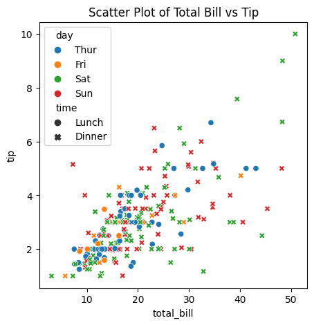

### Line Plot
A line plot connects data points in the order they appear in the dataset.This is useful for time series data.`lineplot` function allows you to create lineplots.

```python
# lineplot using seaborn 

plt.figure(figsize=(5,5))
sns.lineplot(data=tips,x='size',y='total_bill',hue='day')
plt.title('Line Plot of Total Bill by Size and Day')
plt.show()
```

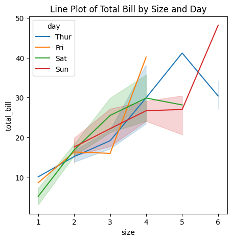

## Distribution Plots

Distribution Plots visualize the distribution of a single numerical variable

### HistPlot
A histplot displays the distribution of a numerical variable by dividing the data into bins.

```python
# Histplot using Seaborn

plt.figure(figsize=(5,5))
sns.histplot(data=tips, x='total_bill', kde=True)
plt.title('Histplot of Total Bill')
plt.show()
```
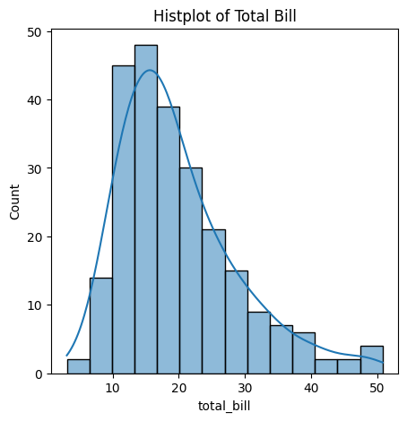

### KDE Plot
A Kernel Density Estimate (KDE) plot represents the distribution of a variable as a smooth curve.

```python
# KDE Plot using Seaborn

plt.figure(figsize=(5,5))
sns.kdeplot(data=tips, x='total_bill', hue='sex', fill=True)
plt.title('KDE Plot of Total Bill by Sex')
plt.show()
```
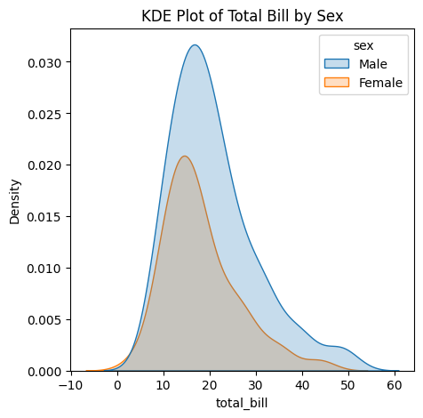

### ECDF Plot
An Empirical Cumulative Distribution Function (ECDF) plot shows the proportion of data points below each value.

```python
# ECDF Plot using Seaborn

plt.figure(figsize=(5,5))
sns.ecdfplot(data=tips, x='total_bill', hue='sex')
plt.title('ECDF Plot of Total Bill by Sex')
plt.show()
```
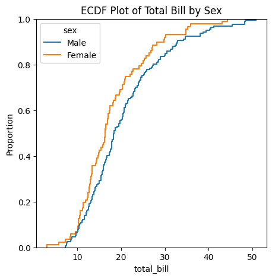

### Rug Plot
A rug plot in Seaborn is a simple way to show the distribution of a variable by drawing small vertical lines (or "rugs") at each data point along the x-axis.

```python
# Rug Plot using Seaborn

plt.figure(figsize=(3,3))
sns.rugplot(x='total_bill', data=tips)
plt.title('Rug Plot of Total Bill Amounts')
plt.show()
```
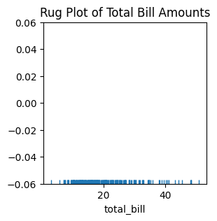

## Categorical Plots
Categorical plots are used to visualize data where one or more variables are categorical.

### Bar Plot

A bar plot shows the relationship between a categorical variable and a numerical variable.
```python
# Bar Plot using Seaborn

plt.figure(figsize=(5,5))
sns.barplot(data=tips,x='day',y='total_bill',hue='sex')
plt.title('Bar Plot of Total Bill by Day and Sex')
plt.show()
 ```
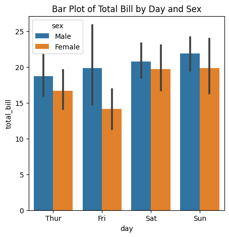

### Point Plot
A point plot in Seaborn is used to show the relationship between two categorical variables, with the size of the points representing the values of third variable.

```python
# Point Plot using Seaborn

plt.figure(figsize=(5,5))
sns.pointplot(x='day',y='total_bill',hue='sex',data=tips)
plt.title('Average Total Bill by Day and Sex')
plt.show()
```
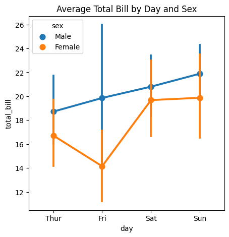

### Box Plot
A box plot displays the distribution of a numerical variable across different categories.

```python
# Box Plot using Seaborn

plt.figure(figsize=(5,5))
sns.boxplot(data=tips, x='day', y='total_bill', hue='sex')
plt.title('Box Plot of Total Bill by Day and Sex')
plt.show()
```
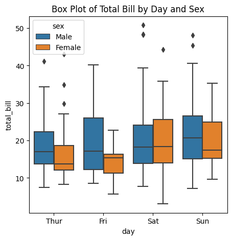

### Violin Plot
A violin plot combines aspects of a box plot and a KDE plot to show the distribution of data

```python
# Violin Plot using Seaborn

plt.figure(figsize=(5,5))
sns.violinplot(data=tips,x='day',y='total_bill',hue='sex',split=True)
plt.title('Violin Plot of Total Bill by Day and Sex')
plt.show()
```
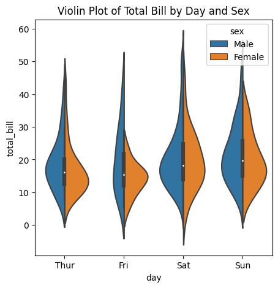

## Matrix Plots
Matrix plots are useful for visualizing data in a matrix format.

### Heatmap
A heatmap displays data in a matrix where values are represented by color.

```python
# Heatmap using Seaborn

plt.figure(figsize=(10,8))
flights = sns.load_dataset('flights')
flights_pivot = flights.pivot(index='month', columns='year', values='passengers')
sns.heatmap(flights_pivot, annot=True, fmt='d', cmap='YlGnBu')
plt.title('Heatmap of Flight Passengers')
plt.show()
```
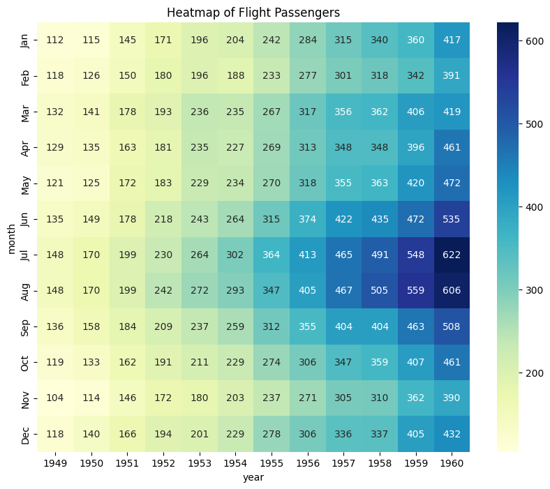

## Pair Plot
A pair plot shows the pairwise relationships between multiple variables in a dataset.

```python
#Pairplot using Seaborn

plt.figure(figsize=(5,5))
sns.pairplot(tips, hue='sex')
plt.title('Pair Plot of Tips Dataset')
plt.show()
```
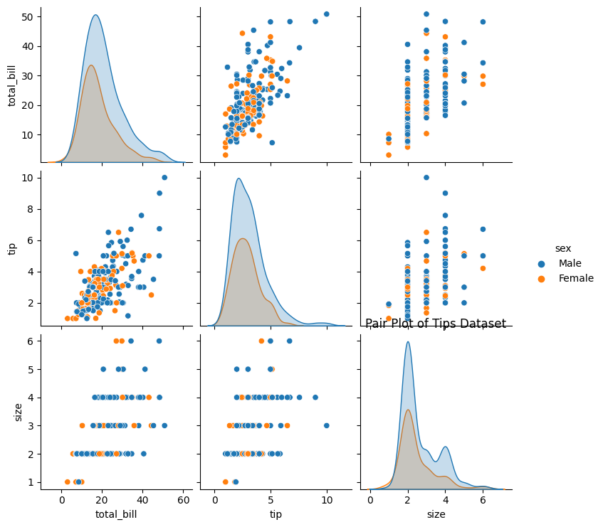

## FacetGrid
FacetGrid allows you to create a grid of plots based on the values of one or more categorical variables.

```python
#Facetgrid using Seaborn

plt.figure(figsize=(5,5))
g = sns.FacetGrid(tips, col='sex', row='time', margin_titles=True)
g.map(sns.scatterplot, 'total_bill', 'tip')
plt.show()
```
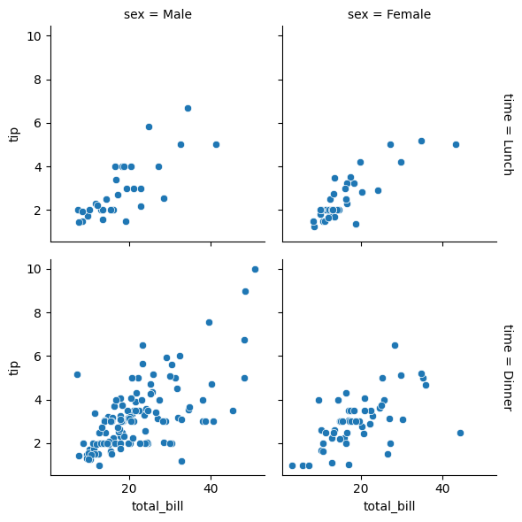

## Customizing Seaborn Plots
Seaborn plots can be customized to improve their appearance and convey more information.

### Changing the Aesthetic Style
Seaborn comes with several built-in themes.

```python
sns.set_style('whitegrid')
sns.scatterplot(data=tips, x='total_bill', y='tip')
plt.title('Scatter Plot with Whitegrid Style')
plt.show()
```
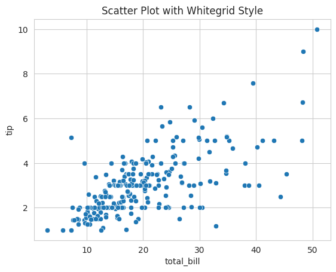

### Customizing Colors
You can use color palettes to customize the colors in your plots.

```python
sns.set_palette('pastel')
sns.barplot(data=tips, x='day', y='total_bill', hue='sex')
plt.title('Bar Plot with Pastel Palette')
plt.show()
```
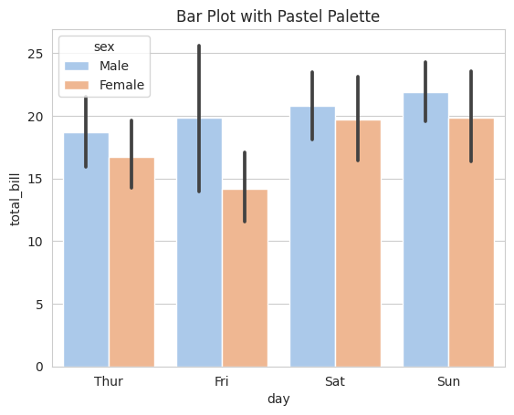

### Adding Titles and Labels
Titles and labels can be added to make plots more informative.

```python
plot = sns.scatterplot(data=tips, x='total_bill', y='tip')
plot.set_title('Scatter Plot of Total Bill vs Tip')
plot.set_xlabel('Total Bill ($)')
plot.set_ylabel('Tip ($)')
plt.show()
```
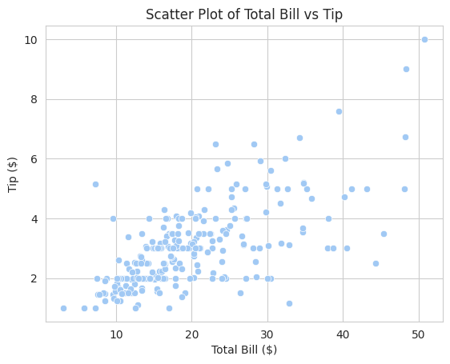

Seaborn is a versatile library that simplifies the creation of complex visualizations. By using Seaborn's plotting functions, you can create a wide range of statistical graphics with minimal effort. Whether you're working with relational data, categorical data, or distributions, Seaborn provides the tools you need to visualize your data effectively.
